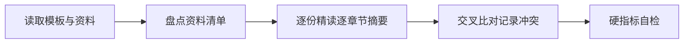

# AICoding 架构设计 · 资料摘要

> 本文档做一件事：**精读主理人转交的全部原始资料，逐份、逐章节做出摘要**——后面任何人拿到这份摘要，都能通过章节号快速定位回原始文件的对应位置。

> 上游输入：主理人转交的全部原始资料（本批均为 Markdown 文本）；
> 产出者：`knowledge-ingest-engineer`（知识摄入工程师 - 闻资料），经 G1 校验与人工审核通过后交付。

---

## 0. 元信息

```yaml
标题: 通用 Agent Sandbox（Kubernetes） - 资料摘要 v1.0
版本: v1.0
状态: Draft
创建日期: 2026-08-18
整理人: knowledge-ingest-engineer（闻资料）
审核人:
  - team-lead（主理人）

原始资料清单:
  - /Users/owenkai/WorkBuddy/2026-08-14-08-26-38/agent-runtime-sandbox-design.md: Agent 运行时沙箱产品设计主文档（七接口、生命周期、Snapshot/Volume、安全策略、落地路线图）
  - /Users/owenkai/WorkBuddy/2026-08-14-08-26-38/cloud-native-sandbox-platform-design.md: 底层隔离技术选型（Kata/gVisor/Firecracker 原理与指标对比）
  - /Users/owenkai/WorkBuddy/2026-08-14-08-26-38/dsh-k8s-sandbox-design.md: dsh（agent harness）接入 K8s Pod 沙箱的 consumer 案例
  - /Users/owenkai/WorkBuddy/2026-08-14-08-26-38/sandbox-user-stories.md: 34 条功能需求（本产品验收基线，5 类角色 + P0/P1/P2 优先级）
  - /Users/owenkai/WorkBuddy/2026-08-14-08-26-38/dsh-deep-review.md: dsh 源码解析（含 sandbox 隔离 provider：native/landlock-run + e2b 远程沙箱）
```

| 版本 | 日期 | 作者 | 变更内容 |
| --- | --- | --- | --- |
| v1.0 | 2026-08-18 | knowledge-ingest-engineer（闻资料） | 初稿：逐份精读 5 份 Markdown 资料，按章节摘要并记录冲突 |

---

## 1. 资料清单

> 列出全部原始资料，每份标注解析状态。解析失败或跳过的必须注明原因。

| 编号 | 文件名 | 类型 | 来源 | 解析状态 | 说明 |
| --- | --- | --- | --- | --- | --- |
| D1 | agent-runtime-sandbox-design.md | markdown | 主理人转交（产品设计文档） | 已解析 | — |
| D2 | cloud-native-sandbox-platform-design.md | markdown | 主理人转交（底层隔离技术文档） | 已解析 | — |
| D3 | dsh-k8s-sandbox-design.md | markdown | 主理人转交（consumer 接入案例） | 已解析 | — |
| D4 | sandbox-user-stories.md | markdown | 主理人转交（功能需求验收基线） | 已解析 | — |
| D5 | dsh-deep-review.md | markdown | 主理人转交（第三方源码解析） | 已解析 | — |

**类型说明**：本批 5 份资料均为 Markdown（md）文本，非模板默认枚举的 docx / pdf / pptx / xlsx；解析方式为直接文本读取，全部成功，无失败或跳过项。

---

## 2. 资料内容摘要

> 逐份文档按自身章节结构做摘要。每条摘要标注章节号（`D编号，§章节`），后面任何人想核实某个点，直接定位回原文对应位置即可。

### D1：agent-runtime-sandbox-design.md

> Agent 运行时沙箱产品设计主文档：定义 Sandbox/Template/七接口/Snapshot/Volume/安全策略与落地路线图，明确底层隔离为可替换实现细节。 — 来源：主理人转交（产品设计文档）

| 章节 | 内容摘要 |
| --- | --- |
| §0 先厘清概念 | 区分「Agent 运行时沙箱」（给 agent 的执行环境产品：跑命令/读写文件/执行代码/开终端/装包）与「容器沙箱（Kata/gVisor/Firecracker）」（底层隔离实现技术）。结论：agent 沙箱是产品，容器/microVM 是实现细节，产品重心在接口/生命周期/快照/多语言。 |
| §1.1 玩家对比 | 对标 5 类产品：e2b（Firecracker microVM，~125ms 启动，七接口+Snapshot/Volume+MCP Gateway，事实标准，开源可自托管）；Modal Sandboxes（gVisor 用户态内核，毫秒级，自研 Rust runtime+FUSE 懒加载+egress 白名单，GPU+大规模并发 1000 sandbox/s）；Daytona（容器，低于 90ms，五语言 SDK+GPU VFIO）；Google Agent Sandbox on K8s（gVisor+Kata 混合，亚秒预热池，Sandbox CRD+每 session 一个 microVM，K8s 官方参考实现）；Cloudflare/Vercel Sandbox（托管容器，Serverless）。 |
| §1.2 关键洞察 | 4 条：(1) e2b 定义事实标准接口（Sandbox+Template+七接口命名空间+Snapshot/Volume+MCP）；(2) 底层隔离是选项不是核心（Firecracker/gVisor/gVisor+Kata 三条路线都成立）；(3) Google Agent Sandbox 印证「基于 K8s 做 agent 沙箱」正确性；(4) 核心能力四件套=安全隔离+快速启动+有状态+弹性扩缩（agent 多步任务需第 3 步看到第 1 步装的依赖）。 |
| §2.1 Sandbox 实例 | 每 agent 任务一个隔离执行实例，独立文件系统/进程空间/环境变量/网络规则/日志/状态。生命周期：create → 运行 → setTimeout/refresh → pause → resume \| snapshot \| kill。 |
| §2.2 Template + Tags | Template=预构建环境（Docker Image : Container 的关系），固化依赖（Python/Git/编译器/Node/浏览器/GPU 栈），避免每次启动现装（10-60s 延迟）；Tags=模板版本治理（data-analysis:v1），保证可复现/可回滚。 |
| §2.3 七接口命名空间 | lifecycle（create/connect/list/kill/setTimeout/isRunning/getInfo/getMetrics/pause/resume）；files（read/write 批量/list/exists/remove/rename/makeDir/getInfo/watchDir/uploadUrl/downloadUrl）；commands（run 前台后台+stdout/stderr 回调+cwd/user/envs/list/connect/sendStdin/kill）；process（start/list/connect/sendInput/closeStdin/signal）；pty（create/sendInput/resize/kill）；network（getHost/出站管控/public URL/proxy）；code-interpreter（runCode/createCodeContext，多语言有状态 REPL 跨调用共享变量）。 |
| §2.4 状态保存 | 两种粒度：Snapshot（文件快照/microVM 内存快照，运行现场含文件+可选内存/CPU）用于环境复用/任务恢复/状态复制；Volume（持久卷）用于跨沙箱/跨任务数据共享。 |
| §2.5 MCP 接入 | 沙箱内挂载 MCP server（文件系统/GitHub/数据库），工具以标准协议暴露给 agent，使「agent 在隔离环境调工具」标准化。 |
| §3.1 关键组件职责 | 五层架构：① Agent Runtime（LLM 规划/工具选择）② 接入+控制层（SDK/REST/CLI+认证/配额/调度/审计）③ Sandbox 实例（七接口+envd agent+多语言运行时）④ 状态层（Snapshot/Volume/日志/元数据）⑤ 隔离实现（可替换）+模板+预热池。组件：Sandbox API/SDK（唯一入口）、控制面 Operator（认证/配额/模板/调度路由/生命周期/审计）、Sandbox Runtime 集群、envd agent（沙箱内代理，health check/状态指标）、Template Builder（分层缓存）、Snapshot/Volume 服务、预热池。 |
| §3.2 核心数据流 | 6 步：Agent 选 Template→SDK create() → 控制面认证+配额检查→调度（预热池领用或新建）→隔离层启动沙箱→envd 就绪+health check→返回 sandboxId→files 写输入→commands/process 执行→流式 stdout/stderr→files 读产物→snapshot/volume 保存→kill 销毁/pause 挂起/归还池。 |
| §4 底层隔离选型 | 默认 gVisor(systrap)：毫秒启动/无需 KVM/内存 ~15MB，高频短命沙箱（Modal 路线）；敏感强隔离 Kata(Dragonball)：独立内核 microVM，~150ms/40MB，近 100% 兼容；极简 serverless Firecracker：~125ms/5MB，snapshot ~28ms 恢复。三者经 RuntimeClass/统一 shim 切换，上层七接口不变。 |
| §5.1 SDK | Python SDK 示例（对齐 e2b 事实标准）：Sandbox.create(template, timeout) 上下文管理器；files.write/list；commands.run 流式 on_stdout/on_stderr；run_code 有状态 REPL（跨调用共享变量 x=1→x+1=2）；pty.create+send_input；set_timeout/snapshot/pause/resume。 |
| §5.2 K8s CRD | Sandbox CRD（apiVersion sandbox.platform.io/v1alpha1）：spec.template/runtimeClass(gvisor\|kata\|firecracker)/resources(cpu 2+memory 4Gi)/workspace(storageClass+5Gi)/network.egress(Restricted)+allowedEgress(pypi.org:443)/ttlSeconds 1800/snapshot.from；status.phase(Ready)/podName/grpcPort 50051/ready。 |
| §5.3 数据面协议 | SDK→控制面 REST/OpenAPI（创建/查询/销毁）；SDK→沙箱实例 gRPC 双向流（stdio/pty 流式，fs/command/process 调用）；大文件 uploadUrl/downloadUrl 直传不经 SDK 中转。 |
| §6 安全策略 | 7 层：隔离（gVisor/Kata/Firecracker 按敏感度选）；文件（每沙箱独立 fs，rootfs 只读+workspace 可写）；网络（默认拒绝出站，白名单允许 pip/registry，入站仅控制面）；权限（非 root+drop caps+seccomp，admission webhook 禁 hostPath/privileged）；凭据（平台密钥不进沙箱，per-sandbox secret 注入非环境级）；审计（谁/何时/建销毁/跑什么，append-only 按租户检索）；加固（镜像签名+漏洞扫描+Falco 逃逸检测+mTLS+Kata CoCo SEV/TDX）。关键原则：capability-based isolation（每沙箱只给所需权限）优于 broad denial（全锁再打洞）。 |
| §7 可观测性 | 监控（沙箱数按 phase/class、创建时延 Pending→Ready、预热池命中率、CPU/内存/磁盘用量 getMetrics、失败率）；日志（沙箱 stdout/stderr+平台组件日志，按 sandboxId/租户索引）；链路追踪（OpenTelemetry 贯穿 create→执行→destroy，traceId 关联控制面与数据面）；告警（池耗尽、Pending 堆积、逃逸检测事件、资源突增）。 |
| §8 落地路线图 | 4 阶段：MVP（1-2 周：gVisor+Sandbox CRD+最小 controller+lifecycle/files/commands 三接口+预热池，跑通声明式创建/写文件/跑命令/流式输出）；完整能力（+1 周：process/pty/network/code-interpreter 四接口+Snapshot/Volume+模板构建分层缓存）；生产（+1 周：Kata 强隔离+多租户+审计+mTLS+逃逸检测+OpenTelemetry+压测）；增强（microVM 内存快照 Firecracker/Kata、GPU 沙箱 VFIO、MCP Gateway、多云/混合调度）。 |
| §附 一句话对照 | 与 cloud-native-sandbox-platform-design.md（底层隔离选型）、dsh-k8s-sandbox-design.md（consumer 案例）、sandbox-user-stories.md（34 条需求验收基线）的文档间关系说明。 |

### D2：cloud-native-sandbox-platform-design.md

> 云原生沙箱平台架构设计：RuntimeClass 三档分层（runc/gVisor/Kata）+ CRD + Operator + K8s 原生机制的通用沙箱平台，覆盖 Kata/gVisor/Firecracker 原理与指标对比。 — 来源：主理人转交（底层隔离技术文档）

| 章节 | 内容摘要 |
| --- | --- |
| §执行摘要 | 核心设计一句话：RuntimeClass 做运行时分层（runc 信任级/gVisor 不可信级/Kata 强隔离级三档）+CRD+Operator 声明式生命周期+K8s 原生机制（NetworkPolicy/CSI/RBAC/Pod Overhead）+Prometheus/日志/OpenTelemetry 可观测，消费者按敏感度选隔离级别零代码改动。关键结论：(1) 隔离强度 Kata(microVM) 强于 gVisor(Sentry) 强于 runc，兼容性/开销相反；(2) Kata 3.x（Rust 重写+Dragonball）~150ms/~40MB 让每 Pod 一个 VM 从昂贵变可负担；(3) 阿里云 ACK v2/腾讯云 TKE/华为云 CCE 都以 Kata 为核心增强，Kata 是当前事实标准。 |
| §1.1 隔离技术原理 | 5 方案对比：runc（namespace+cgroup，共享宿主内核，Go，无需硬件虚拟化）；gVisor（Sentry 用户态内核拦截 syscall+Gofer 文件代理，宿主内核但应用不直接碰，Go，systrap 无需 KVM）；Kata Containers（每 Pod 一个轻量 VM+独立 guest 内核，Rust 3.x/Go 2.x，需 KVM）；Firecracker（microVM 极简 VMM，独立内核，Rust，需 KVM）；Cloud Hypervisor（microVM 功能更全，独立内核，Rust，需 KVM）。 |
| §1.2 关键指标对比 | 启动：runc/gVisor 毫秒级，Kata 3.x ~150ms（Pod 亚秒级），Firecracker ~125ms，Cloud Hypervisor ~200ms；内存开销：runc ~0，gVisor ~15MB，Kata ~40MB/Pod（QEMU ~200MB），Firecracker ~5MB/VMM，CH ~10-20MB；CPU：gVisor 密集低个位数/syscall 密集 50-125%，Kata 2-5%，Firecracker ~3%；兼容：runc 100%，gVisor 有缺口，Kata/Firecracker/CH ~100%；隔离强度：runc 弱→gVisor 中→Kata/Firecracker/CH 强；代码规模 Firecracker ~83K 行、CH ~106K 行 Rust。数据来源注明 Kata 官方/gVisor 官方/Firecracker NSDI'20 论文/Cloud Hypervisor 官方等。 |
| §1.3 选型结论（三档分层） | 信任级 runc（内部可信代码/高频低延迟/全兼容）；不可信级 gVisor(systrap)（用户上传代码/无 KVM/快启动/容忍 syscall 缺口）；强隔离级 Kata(Dragonball)（多租户/敏感数据/agent 执行/金融政务合规/机密计算）。决策规则：需 hostNetwork/特权/嵌套虚拟化→runc（或 CH VFIO）；无 KVM→gVisor；不可信+强隔离+高兼容→Kata+Dragonball（默认强隔离档）；需 GPU→Cloud Hypervisor VFIO；需秒级大规模弹性→Firecracker（Lambda 模式+snapshot）。默认强隔离档=Kata（近 100% 兼容+国内三家背书+CoCo 护城河）。 |
| §2.1 分层架构 | 六层：消费者→控制面(Operator+CRD)→调度层(RuntimeClass/预热池/节点池)→运行时隔离(三档)→数据面隔离(网络/存储/安全)→可观测。 |
| §2.2 关键组件职责 | SandboxClass（CRD，隔离等级模板：runtimeClassName+安全策略+资源默认值+预热池配置）；Sandbox（CRD，实例，引用 class/资源/存储/网络/TTL/快照）；sandbox-controller（Operator，reconcile 建 Pod/绑状态/TTL 回收/快照恢复）；sandbox-webhook（Admission，禁 hostPath/privileged、校验 runtimeClassName、注入 seccomp）；sandbox-scheduler（可选调度扩展）；RuntimeClass（runc/gvisor/kata 三档）；Kata Operator（社区组件，部署 Kata+暴露 kata RuntimeClass）。 |
| §2.3 核心数据流 | 6 步：apply Sandbox(spec.class=strong)→webhook 校验→controller reconcile→选 SandboxClass→runtimeClassName=kata→预热池领用或建 Pod（带 seccomp/caps/readOnlyRootfs/NetworkPolicy/CSI）→kubelet→containerd→kata-shim-v2→Dragonball microVM 独立 guest 内核→Pod Ready+agent health→status.ready=true→消费者经 Service/port-forward 直连沙箱 agent→TTL 到期/删除/快照恢复。控制面与数据面分离：operator 不代理数据流量，operator 故障不影响在跑沙箱。 |
| §2.4 Pod 调度 | RuntimeClass 分层（同一集群 runc/gVisor/Kata 混布，阿里云/华为云验证）；节点池/污点（Kata 节点 sandbox=vm 专用节点池，裸金属最佳；gVisor 节点 sandbox=gvisor）；预热池（按 class 维护 min/max Ready Pod）；Pod Overhead（Kata 内存 50-100MiB+CPU 0.1 core，调度器按 overhead 预留避免超卖）。 |
| §2.5 网络隔离 | 每沙箱独立网络身份（CNI 独立 Pod IP，Kata microVM 内独立 netns）；NetworkPolicy 默认拒绝（出站白名单仅镜像源/依赖源，入站仅控制面/指定服务）；多租户 namespace+NetworkPolicy；出站代理/限速（可选 egress gateway+带宽限制）。 |
| §2.6 存储隔离 | 每沙箱独立工作区卷（CSI emptyDir/PVC，强隔离档 virtio-fs 挂载，阿里云验证优于 9pfs）；快照恢复（CSI VolumeSnapshot+Firecracker/Kata microVM snapshot 含内存/CPU 状态秒级恢复）；只读 rootfs+可写 workspace；存储配额（PVC 大小+存储类限额）。 |
| §2.7 资源配额管理 | ResourceQuota（按 namespace 租户限总量）；LimitRange（单沙箱 CPU/内存默认+上限）；Pod Overhead 计入配额（Kata 50-100MiB+0.1 core）；TTL+空闲回收。 |
| §2.8 生命周期控制 | 状态机 Pending→Provisioning→Ready→Draining→Deleted（异常 Failed）。Pending 排队/领池；Provisioning Pod 创建+microVM 启动+agent health；Ready 返回连接信息；Draining 先停进程（SIGTERM→grace→SIGKILL）再删 Pod；Failed 连续 health 失败 N 次/启动超时→通知+重试。 |
| §3.1 多租户隔离方案 | 运行时（Kata 强隔离/gVisor 普通/runc 内部）；网络（每租户 namespace+NetworkPolicy 默认拒绝+独立 Pod IP）；存储（独立 PVC/StorageClass，快照隔离）；节点（敏感租户专用节点池裸金属+污点）；机密（Kata CoCo AMD SEV-SNP/Intel TDX，连平台运维都读不到内存）。 |
| §3.2 权限控制 | RBAC namespace 级授权（租户只操作自己的 Sandbox）；AdmissionWebhook 强制约束（P0 防逃逸：禁 hostPath/privileged/hostNetwork/hostPID/hostIPC，强制 runAsNonRoot/readOnlyRootFilesystem/drop ALL，校验 runtimeClassName ∈ 允许集合，注入 seccomp/AppArmor）；凭据隔离（平台密钥不进沙箱，剥 KEY/PASSWORD/SECRET/TOKEN）。 |
| §3.3 审计日志 | 记录谁/何时/申请销毁哪个 Sandbox/class/跑什么（可选子进程 spawn/fs 写）；K8s audit log+平台审计日志，append-only 按租户/时间检索；告警（批量创建/逃逸尝试/资源突增）。 |
| §3.4 安全加固措施 | 默认 seccomp（Kata 内 guest 内核+宿主 RuntimeDefault 双层）；非 root UID+readOnlyRootfs+drop ALL caps；镜像签名+漏洞扫描；沙箱间/沙箱与控制面 mTLS；逃逸检测（Falco）；定期内核/运行时 CVE 补丁。 |
| §4.1 SandboxClass | 隔离等级模板 CRD 配置项：runtimeClassName(kata)/hypervisor(dragonball\|firecracker\|cloud-hypervisor)/nodeSelector(sandbox=vm)/tolerations/podOverhead(cpu 100m+memory 100Mi)/security(runAsNonRoot/runAsUser 10001/readOnlyRootFilesystem/seccomp RuntimeDefault)/defaultResources(cpu 1+memory 2Gi)/warmPool(min 5 max 50)。 |
| §4.2 Sandbox | 声明式实例 CRD 配置项：class(strong)/ownerRef(kind Session,id)/resources(cpu 2+memory 4Gi)/workspace(storageClass fast-ssd+5Gi)/network.egress(Restricted\|Full)+allowedEgress(pypi.org:443,registry-1.docker.io:443)/ttlSeconds 1800/snapshot.from；status.phase(Ready)/podName/podIP/grpcPort 50051/ready/expiresAt。 |
| §4.3 Operator 核心 | Go controller-runtime reconcile：Pending→provision（领池/建 Pod+绑状态）、Provisioning→waitReady、Ready→scheduleGC（TTL 重入队）、Draining→drain（停进程→删 Pod）；restoreFromSnapshot（VolumeSnapshot 恢复 PVC→microVM snapshot 恢复内存/CPU→重建 Pod 绑定卷）。 |
| §4.4 快照恢复两种粒度 | 存储快照（CSI VolumeSnapshot，工作区文件，秒级，文件现场）；microVM 快照（Firecracker/Kata snapshot-restore，文件+内存+CPU+网络连接，~5-28ms，完整进程现场「合上笔记本」体验）。 |
| §5.1 监控 | 平台指标（Sandbox 数按 phase/class、创建时延 Pending→Ready、池命中率、TTL 回收、失败率）；资源指标（每沙箱 CPU/内存/网络/存储 IO）；运行时指标（microVM 启动时延、agent health、hypervisor 开销）；告警（池耗尽/Pending 堆积/Failed 飙升/逃逸检测）。 |
| §5.2 日志收集 | DaemonSet agent（Filebeat/Fluent Bit）采 Pod stdout+平台组件日志；集中式存储（CLS/Loki/ES）按租户/沙箱 ID 索引；审计（生命周期事件+逃逸检测）单独保留。 |
| §5.3 链路追踪 | OpenTelemetry 埋点 Sandbox 创建/执行/销毁全链路（controller→containerd→kata-shim→microVM agent）；traceId 贯穿控制面（CRD 事件）与数据面（沙箱内执行）；OTLP→Jaeger/Tempo 定位冷启动瓶颈（拉镜像 vs microVM 启动 vs agent health）。 |
| §6 落地路线图 | 4 阶段：MVP（1-2 周 runc+gVisor 两档+Sandbox/SandboxClass CRD+最小 controller+webhook+Prometheus，跑通声明式 gVisor 沙箱执行代码）；强隔离（+1 周 Kata Dragonball+strong class+预热池+存储快照+egress 白名单）；生产（+1 周多租户 namespace+RBAC+ResourceQuota+审计+mTLS+Falco+OpenTelemetry+压测）；增强（microVM 快照/机密容器 SEV-TDX/GPU VFIO/多云混合调度）。 |
| §附 厂商产品对照速查 | 阿里云 ACK 安全沙箱 v2（自研轻量 VM 源自 Kata+贡献 Dragonball，~150ms 启动、性能达 runC 90%、virtio-fs、Terway 网络）；腾讯云 TKE 安全容器（Kata kata-clh/kata-qemu，超级节点 Serverless、秒级上万 Pod、Agent Sandbox 场景）；华为云 CCE 安全容器（Kata 跑裸金属降二次虚拟化、Pod overhead 50-100MiB、DeviceMapper）；百度云 CCE 安全容器（兼容社区 Kata、Terway NetworkPolicy）。 |

### D3：dsh-k8s-sandbox-design.md

> dsh（DeepSeek Harness）接入 K8s Pod 沙箱的 consumer 场景：Operator 管理基于 Pod 的 sandbox，供 dsh 作为远程执行世界，完整复刻 e2b 的「E2BRuntime + fs + subprocess」三件套。 — 来源：主理人转交（consumer 接入案例）

| 章节 | 内容摘要 |
| --- | --- |
| §1 设计目标与约束 | 目标：K8s 中用 Operator 管理基于 Pod 的 sandbox，供 dsh 作远程执行世界。约束：每 dsh 会话/agent 命令跑独立 Pod（容器隔离为边界）；语义对齐 ctx.fs+ctx.subprocess（含 terminal），bash/grep/edit/PTY/LSP 全落 Pod；声明式 CRD+Operator（dsh 不直接调 K8s API）；可池化（预热池+TTL+GC）；生产可用（mTLS/NetworkPolicy/ResourceQuota/seccomp/非 root/readOnlyRootfs）；不改 dsh loop（纯插件 cordis.yml 挂载零侵入）。硬约束（源码）：ctx.sandbox 文档明说容器/microVM/远程执行是「replace capability seam」，故 K8s Pod 不实现 ctx.sandbox 而是替换 fs+subprocess+shell；FileSystem.processPath 是 fs↔subprocess 接合点（共享同一执行世界）；spawn 立即返回 handle、done 退出 resolve、spawnTerminal 有 PTY 字节流→通信需双向流（stdio+pty）。 |
| §2 整体架构 | 三条路径：① 控制面 dsh provider 向 K8s API apply SandboxClaim CR→Operator reconcile 创建/复用 Pod；② 控制面 Operator watch SandboxClaim 建 Pod/维护预热池/TTL 回收；③ 数据面 dsh provider 直连 Pod 内 agent gRPC（不经 Operator）跑 fs/subprocess/terminal，通信 port-forward（集群外）或 Service+mTLS（集群内/生产）。控制面与数据面分离是核心设计（Operator 不管数据流量，避免吞吐瓶颈和单点）。 |
| §3 为什么替换 fs/subprocess | dsh 沙箱两层语义：进程级 confinement（ctx.sandbox Landlock/bwrap/seatbelt/Win ACL wrap argv，同主机共享内核）；执行世界替换（替换 fs+subprocess+shell provider，容器/microVM/远程）。K8s Pod 属第二类，e2b 即此模式（E2BRuntime 共享 owner+fs-e2b+subprocess-e2b）。Pod 容器隔离本身即安全边界，无需再套 Landlock。 |
| §4.1 SandboxClaim | 声明式申请 Pod sandbox：ownerRef(kind Session,id 用于配额隔离)/templateRef(或内联)/desiredState(Ready\|Draining\|Deleted)/ttlSeconds 1800（对应 E2BRuntime.timeoutMs）/resources(cpu 2+memory 4Gi)/workspace(mode Ephemeral emptyDir\|Persistent PVC, size 5Gi, storageClass)/network.egress(Restricted\|Full)+allowedEgress(registry-1.docker.io:443,pypi.org:443)；status.phase(Pending\|Provisioning\|Ready\|Draining\|Failed\|Deleted)/podName/podIP/grpcPort 50051/ready/conditions(PodReady,AgentHealthy)/expiresAt。 |
| §4.2 SandboxTemplate | 可复用 Pod 模板：agentImage/toolchainImage(bash/rg/node/git/LSP)/agentPort 50051/security(runAsNonRoot/runAsUser 10001/readOnlyRootFilesystem/seccomp RuntimeDefault/dropCapabilities ALL)/defaultResources(cpu 1+memory 2Gi)/initWorkspace(/workspace 与 /workspace/.dsh-k8s runtimeRoot 仿 e2b)/warmPool(min 3 max 20)。 |
| §5.1 reconcile 逻辑 | Go controller-runtime：switch phase——Pending→provision（配额检查/领池或建 Pod/绑状态）；Provisioning→checkReady（Pod Ready+agent /healthz）；Ready→scheduleGC（TTL 重入队）；Draining→drain。provision 细节：Pool.CanAllocate 配额检查（超限 RequeueAfter 2s 排队）、Pool.Acquire（ErrEmpty 则 buildPod 建新）、绑定 claim→pod 更新 status、RequeueAfter 500ms。checkReady：podReady+agentHealthCheck(gRPC)→Ready+ExpiresAt=now+ttl。 |
| §5.2 预热池 | Manager 维护一批未绑定 claim 的 Ready Pod，claim 到来直接领用省拉镜像+起 agent。Reconcile：idle 低于 min 则补足至 min；idle 高于 max 则裁剪至 max。 |
| §5.3 GC/TTL/孤儿回收 | TTL：claim Ready 后 RequeueAfter ttl 到期转 Draining；孤儿 Pod：owner session 消失（claim 删）但 Pod 残留→reconciler 按 label 兜底删除；异常 Pod：agent health 连续失败 N 次→标 Failed→通知 dsh（claim status）重试。 |
| §6.1 gRPC 协议 | SandboxService（package dsh.sandbox.v1）：Health；fs（Stat/Lstat/ReadText/StreamText/ReadBytes/ListDir/WriteText 原子写+version guard/EditText 原子编辑+版本校验）；subprocess（ResolveExecutable/Spawn 双向流 stdin-stdout-stderr-signal/Terminate）；terminal（AllocTerminal 服务端流 pty 输出/TerminalIO 双向 resize/write/read）。SpawnFrame(oneof start/stdin/stdin_eof/signal/resize)↔ProcessFrame(oneof started/stdout/stderr/exited)。关键映射表：dsh seam 方法↔proto RPC 逐个对照。 |
| §6.2 agent 实现要点 | 进程树终止（cgroup/process group 杀整树对应 tree-scoped 语义）；grace ladder（SIGTERM→graceMs→SIGKILL）；collect-mode readers（offset 非消费读，stdout/stderr 落 spill 文件+ring buffer 支持多 reader 按 offset 读）；原子写（tempfile+fsync+rename，version guard mtime/ns 计数，失败返 FS_STALE_VERSION）；PTY（creack/pty，resize 帧转 TIOCSWINSZ）。 |
| §7.1 k8s-runtime | 共享 Pod owner（仿 E2BRuntime）：Config(kubeconfig/namespace/templateRef/image/ttlSeconds/transport port-forward\|mtls/caCert+clientCert+clientKey)。K8sRuntime Service：cwd=/workspace，runtimeRoot=/workspace/.dsh-k8s，claim（apply SandboxClaim→watch status Ready→按 transport 建 gRPC channel→health check），getSandbox 返回共享 client，dispose 删 claim。 |
| §7.2 fs-k8s | K8sFileSystem 替换 ctx.fs（仿 fs-e2b）：resolve→Stat、processPath 返回 Pod 内绝对路径、fileUrl/contains、readText/streamText/readBytes/listDir→gRPC、writeText/editText→gRPC 原子 temp+rename+version guard、sandboxMode='workspace-write'（PVC 挂载保证）。 |
| §7.3 subprocess-k8s | K8sSubprocessRuntime 替换 ctx.subprocess：resolveExecutable→ResolveExecutable（agent 内 command -v）；spawn 立即返回 handle，内部开 gRPC 双向流 Spawn（stdin→SpawnFrame/stdout-stderr←ProcessFrame/signal）；spawnTerminal→AllocTerminal+TerminalIO；dispose 终止所有 live handle/terminal。 |
| §7.4 shell-k8s | 复用 bash-local 逻辑，执行委托 subprocess-k8s（如 bash-sandbox 基于 local subprocess），ctx.shell 的 ShellExecutor 注册即可。 |
| §7.5 cordis.yml 组合 | k8s-runtime/fs-k8s/subprocess-k8s/shell-k8s 四个包替换 dsh-base 对应项，sandbox disabled（容器隔离替代 ctx.sandbox）。dsh --profile k8s web 让所有 bash/grep/edit/PTY 落到 K8s Pod。 |
| §8 通信 port-forward vs mTLS | port-forward（开发/集群外，dsh 调 K8s API 建 PodPortForward 本地→Pod:50051 隧道，简单零配置但吞吐受 API server 限制）；Service+mTLS（生产/集群内，直连 podIP 或 ClusterIP 双向证书，高吞吐需 cert-manager）。生产推荐：dsh 跑集群内 Pod，经 Service ClusterIP+mTLS，NetworkPolicy 限定只有 dsh namespace 能连 sandbox Pod gRPC 端口。 |
| §9 生命周期与并发 | dsh session 创建→apply SandboxClaim→Operator 领池/建 Pod→Ready+agent health→gRPC channel→fs/subprocess/shell adapter 共享同一 channel（一个远程世界）→跑工具→dispose/cancel→删 claim→Pod Draining→删 Pod/回收池。一个 agent=一个 Pod（复刻 e2b one sandbox per E2BRuntime），多 agent/subagent→多 Pod；subagent 可委托另一 dsh 实例+另一 Pod（推荐独立 Pod）；取消传播 AbortController→gRPC Signal 帧→agent 杀进程树；热重载 dispose 释放 claim 重新 mount（复刻 reversible effects）。 |
| §10 安全模型 | Pod 隔离（非 root UID 10001/readOnlyRootFilesystem/seccomp RuntimeDefault/drop ALL caps）；文件（只 workspace volume 可写 PVC/emptyDir，rootfs 只读）；网络（NetworkPolicy 出站白名单镜像源/pypi，禁横向，dsh namespace 才能入站 sandbox gRPC）；通信（mTLS，证书不进 session log）；资源（ResourceQuota+每 owner 并发上限防滥用）；凭据（DEEPSEEK_API_KEY 等不进 Pod，scrubbedParentEnv 剥 KEY/PASSWORD/SECRET/TOKEN 及 DSH_*）；审计（gRPC 调用记 audit log：fs write/edit、subprocess spawn）。核心价值：把「shell 访问」关进容器，比本机直接 spawn 安全得多。 |
| §11 生产部署清单 | 部署 Operator；建 namespace+NetworkPolicy+ResourceQuota；签发 mTLS（cert-manager Issuer dsh 与 agent 各一份）；构建 agent+toolchain 镜像；创建 SandboxTemplate+预热池；dsh 侧打 4 个包发布私有 npm；配 cordis.patch.yml；监控（Pod 数/池命中率/claim Pending 时延/gRPC 错误率/agent health）；压测（单 Pod 并发 spawn/stdio 吞吐/PTY 延迟）；灰度（headless 单任务→web 多会话）。 |
| §12 与 e2b 对比 | 隔离：e2b 云 microVM vs K8s Pod 容器；通信：e2b SDK(HTTP/WS 同步轮询 pollMs=20) vs gRPC 双向流（真流式 stdio/pty）；生命周期：Sandbox.create(timeoutMs)+kill vs SandboxClaim CRD+Operator reconcile；池化：无（按需建）vs 预热池；可控性：黑盒 vs 自建全可控；流式：轮询非真流 vs gRPC bidi 真流式（更贴 subprocess seam 语义）。K8s 方案优势（自建可控/真流式/预热池/配额网络策略），代价（自建 agent+operator，运维 K8s 集群），适合内部平台团队。 |
| §13 落地路线图 | MVP（1-2 周 CRD+最小 reconciler 无池化+agent fs+spawn 无 terminal+k8s-runtime/fs-k8s/subprocess-k8s 三插件 port-forward headless 跑通 bash）；可用（+1 周 terminal/PTY+预热池+TTL/GC+mTLS）；生产（+1 周 NetworkPolicy+ResourceQuota+监控+压测+shell-k8s+web 多会话）；增强（subagent 多 Pod 编排/workspace PVC 持久化跨会话/镜像预热/按 toolchain 分模板）。 |
| §附 关键 dsh seam 方法速查 | FileSystem(resolve/processPath/fileUrl/contains/stat/lstat/readText/streamText/readBytes/listDir/writeText/editText+sandboxMode)；SubprocessRuntime(resolveExecutable/spawn→handle/spawnTerminal→handle)；SubprocessHandle(stdin/stdout/stderr 流 collect offset 非消费/terminate SIGTERM→grace→SIGKILL tree-scoped/waitForExit/done)；SandboxProvider(ctx.sandbox) 不实现（容器隔离替代）。 |

### D4：sandbox-user-stories.md

> 通用 Agent Sandbox 用户故事集：34 条可沟通可验收的功能需求，含 5 类角色（SU/RT/PE/SEC/OPS）与 P0/P1/P2 优先级，是本产品的验收基线。 — 来源：主理人转交（功能需求验收基线）

| 章节 | 内容摘要 |
| --- | --- |
| §角色定义 | 5 角色：SU Session User（发起任务/看结果/中断/历史不丢）；RT Agent Runtime（调执行原语 fs/subprocess/terminal/流式输出/取消）；PE Platform Engineer（部署/扩容/换后端/配策略/不宕机）；SEC Security/Compliance（隔离强/密钥不漏/可审计/可审批）；OPS Operator（声明式建回收/预热池/GC/自愈）。 |
| §一、隔离层 US-1~4 | US-1 选择隔离强度 P0（配置层声明隔离后端不改 agent 代码，进程级 Landlock/bwrap 与容器二选一不叠加，切换时 fs/subprocess/terminal 一起迁移）；US-2 文件效应策略 P0（策略按调用携带，只读模式写 workspace 外拒绝且错误可识别为「策略拦截」而非「命令失败」，无法 enforce 时 fail-closed 绝不静默放行）；US-3 容器边界硬化 P0（默认 runAsNonRoot/readOnlyRootFilesystem/seccomp RuntimeDefault 或自定义/drop ALL caps 按需 add/workspace 唯一可写卷）；US-4 危险 syscall 阻断 P1（seccomp 显式 deny ptrace/mount/keyring，触发 SIGSYS 终止+日志）。 |
| §二、能力层 US-5~14 | US-5 读文件 P0（路径 resolve 成稳定身份/别名同 targetKey/UTF-8 边界/二进制拒绝/超 maxBytes 返 FS_TOO_LARGE）；US-6 写文件原子+防覆盖 P0（temp+fsync+rename/version guard 返 FS_STALE_VERSION/返新版本号）；US-7 编辑文件字面替换 P0（字面非正则/多处匹配报错/version guard/原子提交）；US-8 列目录 P0（稳定 name 序/只元数据/lstat 不跟随）；US-9 跑命令流式输出 P0（spawn 立即返回 handle/stdout-stderr 独立流可并发读/done 带 exit code+signal+duration/stdin 可写）；US-10 多 reader 不互相消费 P1（offset 非消费读/spill 文件/截断给定位）；US-11 终止进程树 P0（SIGTERM→grace→SIGKILL/树作用域 cgroup 或 process group/waitForExit 等整树静止）；US-12 取消信号传播 P0（AbortController 传到 step→工具→子进程/已启动正常结算未启动合成错误/历史可重放）；US-13 分配 PTY P0（字节流双向/resize TIOCSWINSZ/前台进程组信号/终止等整会话静止）；US-14 fs 与 subprocess 共享执行世界 P0（processPath 返回 subprocess 可开绝对路径/同后端路径一致/换后端一起迁移）。 |
| §三、治理层 US-15~23 | US-15 出站网络白名单 P0（默认拒绝仅白名单/DNS 受控/违规 drop+记录）；US-16 入站隔离 P0（NetworkPolicy 限定入站源 namespace/label/gRPC 端口仅对 runtime 开放）；US-17 资源配额 P0（CPU/Memory 硬上限 OOM/临时存储上限/fd 进程数上限/模板可配）；US-18 TTL P0（到期 drain 先停进程再删/续期接口/剩余可查）；US-19 单次调用超时 P0（超时 terminate 阶梯/结果写历史不丢）；US-20 凭据不泄漏 P0（剥 KEY/PASSWORD/SECRET/TOKEN+平台前缀 DSH_*/显式转发 spec.env 层合并可审计）；US-21 人在环审批 P1（pre-execute 返回 ask 暂停/allow-deny/无审批支持 ask 降级 deny fail-closed）；US-22 多租户配额 P1（每 owner 并发上限超限排队/总资源/耗尽明确错误可重试）；US-23 审计日志 P1（记录 owner/session/操作/参数/结果/时间/append-only 不可篡改/按 owner 时间检索）。 |
| §四、运营层 US-24~34 | US-24 声明式申请 P0（申请含 owner/template/resources/ttl/状态机 Pending→Provisioning→Ready→Draining→Deleted/Ready 返连接信息 IP/port/凭证）；US-25 就绪探活 P0（Pod Ready+agent /healthz 才 Ready/连续失败 N 次 Failed+通知）；US-26 回收 GC P0（TTL 到期 drain/owner 消失孤儿 GC/幂等）；US-27 预热池 P1（维持 minSize 空闲 Ready/优先领池池空再建/超 maxSize 裁剪）；US-28 控制面数据面分离 P0（runtime 直连 agent gRPC/WS 不经 operator/operator 挂不影响在跑会话/数据面双向流 stdio-pty）；US-29 mTLS P1（双向证书/自动轮转 cert-manager/证书不进 session log）；US-30 可观测指标 P1（Prometheus/告警池耗尽错误率飙升 Failed 堆积）；US-31 会话 fork/恢复 P2（fork 传源 session+边界点/新 sandbox 拿边界前快照/原 session 不受影响）；US-32 暂停/恢复 P2（暂停不占 CPU 内存/恢复现场 cwd 环境打开文件一致/恢复有时限）；US-33 provider 可替换 P0（统一 seam 三角色 fs/subprocess/terminal/配置层一行替换/agent loop 无感知）；US-34 热重载可逆注册 P1（注册返 disposer 按序回滚/无悬挂引用监听器）。 |
| §优先级汇总 | P0 必备 23 条（US-1,2,3,5,6,7,8,9,11,12,13,14,15,16,17,18,19,20,24,25,26,28,33）覆盖隔离+能力+核心治理+声明式生命周期+可替换；P1 应该 9 条（US-4,10,21,22,23,27,29,30,34）覆盖危险 syscall/多 reader/审批/配额/审计/预热池/mTLS/可观测/热重载；P2 可选 2 条（US-31,32）fork/暂停恢复。最小可用 MVP=全部 P0，P1 是生产化门槛，P2 是体验增强。 |

### D5：dsh-deep-review.md

> DeepSeek Harness（dsh）源码深度解析：agent harness「一切皆插件」架构，含 Cordis 框架、agent-loop、工具调度器、session log、capability seam 三角色及 sandbox 隔离 provider（native/landlock-run + e2b）。 — 来源：主理人转交（第三方源码解析）

| 章节 | 内容摘要 |
| --- | --- |
| §0 一句话定位 | dsh=DeepSeek AI 开源 agent harness（对标 Claude Code/Codex 这类会调工具的编码 agent），核心卖点「一切皆插件」——模型适配器/工具注册表/会话日志/agent 循环本身都无特权内核，全部行为可配置层替换。解决组装问题（大模型+工具+持久化+审批+沙箱→可替换可重放可 fork 的可靠运行时）。开发者预览，SESSION_FORMAT_VERSION=0 无兼容承诺，适合学架构/内部预研，不建议直接上生产。 |
| §1 解决的真问题 | 7 痛点→方案：换模型（ctx.llm adapter registry）；工具并发/限流/审批/重试（pre-execute→execute→post-execute 三段 waterfall）；崩溃/取消历史续（append-only event log deriveMessages 投影，fork/resume 纯投影）；模型可见与日志对不上（Model-visible means logged 不变量）；多 agent/subagent（ctx.agents+agent-scoped context）；人在环审批（pre-execute ask+interaction）；沙箱隔离（native/landlock-run Linux Landlock+e2b 远程沙箱 provider）。 |
| §2 分层架构 | 四层：接入层（CLI/Web UI :3080/ACP/JSON-RPC）；组合层（Profile=Bundle 叠加+cordis.patch.yml）；Cordis Context（一切皆插件，ctx.tools/llm/sessions/agents/agentLoop/systemPrompt+capability seams fs·shell·subprocess·web·lsp·skill·subagent 三角色 Def/Provider/Consumer）；Cordis 框架（vendored 内嵌，Service 生命周期+typed events+可逆 effects）。无传统 main，实例=Profile，上层 patch 整行覆盖下层配置。dsh-base 第一层，dsh-web-app/headless 加能力，--dump-config 查看装配树。 |
| §3 Cordis 框架 | 5 要素：插件=Service 对象（inject/apply）；Context=services 仓库（key 认领不 import 具体实现）；inject 声明依赖（加载顺序靠服务需求表达）；Typed Events 通信（TS declaration merging 按语义选 dispatch）；Registrations 可逆 effects（ctx.effect/ctx.on 返 disposer 按序回滚）。4 种 dispatch：emit（不 await 无返回通知）、waterfall（around 中间件有 next 可短路）、parallel（全并行无返回）、serial（顺序有返回无 next 直接表态）。 |
| §4 agent-loop | ReactLoopAgent（496 行）默认驱动器。三层嵌套循环 kick→turn→step。Step=一次模型请求+工具调用；Turn=0..N step。Phase 状态机 idle/maintenance/running（只 running 跑模型，单 agent 同一时刻只有一个活动）。一个 step 生命周期 8 步（turn/start→agent/pre-step waterfall→step/start→buildRequest→llm/stream→executeToolCalls→step/end→agent/turn-stopping serial→turn/end）。AbortController 贯穿+取消收敛（wakingAfterAbort 重定向 next-turn 并 latch wakeRequested）。Agent 接口四类输入路由 followup/steer/inject/send，inject 语义（动态运行时上下文模型可见非用户消息，差分写 log）。 |
| §5 工具调度器 | tool-calls.ts（289 行）调度可重叠、结果按模型顺序提交。分组+滚动并行池（parallel 抓全部 bounded 池 maxParallelToolCalls；exclusive 取第一当屏障）。五步管道 tool/call→pre-execute→execute→post-execute→tool/result。模型顺序提交 commitReady（committed 只跨连续 slot 前进保证重放顺序一致）。abort 正确性（未启动合成 synthetic error result 保证 log 自洽可重放，scheduler 自身失败不伪造结果只 drain 已启动）。 |
| §6 Session log | session/index.ts（1157 行）event-sourced append-only+内存 store。deriveMessages 投影 LLM history。fork/resume/transcripts/telemetry/persistence 全从流派生（唯一真相源）。事件类型 durable（turn/step/user/assistant/tool/request）vs live 不进 log（agent/tools/session）。不可变 deepFreeze+freezeRestoredObject（防爆栈）+Branded 类型。SESSION_FORMAT_VERSION=0 无兼容承诺，SQLite SCHEMA_VERSION 单调，结构变更才 bump。 |
| §7 LLM adapter seam | ctx.llm=LlmRuntime（adapter registry）。llm/stream waterfall around 每次流式调用（可 retry/replay/routing）。LlmAdapter 抽象（llm-deepseek/llm-pi-ai）。prepareCall 绑 adapter+adapterDefaults。LlmError 结构化（code provider-neutral AUTH/RATE_LIMIT/NO_ADAPTER，带 status/providerRetryAfterMs/requestId，密钥不进 error）。换 provider=注册 adapter 不动 loop/工具/UI。 |
| §8 Capability seam 三角色 | seam=Service Definition+Provider+Consumer 三角色，一个角色不构成 seam，加能力要设计三个。一次 provider swap 改变整个产品（fs+subprocess 共享执行世界，指到远程沙箱 Bash/PTY/LSP 全跟着走，无 provider 分叉）。 |
| §9 生产场景 | 上手（npx @deepseek-ai/dsh web :3080 需 DEEPSEEK_API_KEY）；源码跑（pnpm install/build，node ^22.19 或 ≥24）；接入（ACP/JSON-RPC SDK/Python SDK）；扩展模型 provider（注册 adapter）；扩展工具（注册 ToolDefinition schema 进 prompt+UI 渲染意图 generic/terminal/diff+locations）；拦截审批策略（挂 waterfall/serial listener 表）；安全沙箱（native/landlock-run Linux Landlock 限制子进程文件/IPC、e2b 远程 POC、ctx.sandbox consumer spawn 前包 argv，README 明确临时插件代码当 shell 访问非安全边界）；配置生效层序（Profile bundles→cordis.patch.yml→home→--patch，patch 按 id 整行替换）。 |
| §10 已知限制与风险 | P0（开发者预览破坏性变更预期，AGENTS.md 明写 Remove at first tagged release 未达正式 release）；P1（56+ packages 7400+ 文件治理成本高，100% per-file coverage gate 贡献门槛高，Cordis vendored 学习曲线，真实 API e2e 需 DEEPSEEK_API_KEY 无 key 自跳过）；P2（单 agent 同时只一个活动 runMaintenance 抛错并发靠多 agent，同进程代码无法 hard-kill 长任务取消靠协作式 signal，全 ESM tsx ESM-only hook Node 原生 TS 不可用）。亮点（event-sourced log 单一真相源/waterfall 扩展点/capability seam 三角色/abort 合成结果/Branded+deepFreeze+严格 TS）。 |
| §11 深入读源码顺序 | docs/architecture.md+cordis-primer.md→agent.ts(496 行)→tool-calls.ts(289 行)→tools/index.ts→session/index.ts(1157 行)→llm/llm/index.ts→examples/cordis.yml→bundle/base。三个不变量：Model-visible ⟺ logged、Registrations are reversible effects、Capability seam=三角色。 |

---

## 3. 冲突记录

> 不同资料对同一事实描述矛盾时，**并列保留两个版本**，不做裁决。

| 编号 | 冲突主题 | 版本 A | 出处 A | 版本 B | 出处 B | 差异说明 |
| --- | --- | --- | --- | --- | --- | --- |
| X1 | 隔离实现默认选型 | 默认 gVisor(systrap)，高频短命沙箱 | D1，§4 | 默认强隔离档 = Kata(Dragonball)，三档分层 runc/gVisor/Kata | D2，§执行摘要；D2，§1.3 | D1 讲「总体默认 gVisor」，D2 讲「强隔离档默认 Kata」，默认档位口径层级不同，需下游统一 |
| X2 | Firecracker 内存快照恢复时间 | ~28ms | D1，§4 | ~5-10ms（表格特色列）/ ~28ms（数据来源 AWS SnapStart）/ ~5-28ms（§4.4） | D2，§1.2；D2，§4.4 | 同一指标多口径并存，且 D2 内部表格（5-10ms）与数据来源（28ms）亦不一致 |
| X3 | Cloud Hypervisor 代码规模 | ~106K 行 Rust | D2，§1.2 表格 | ~50K 行（部分口径 ~106K）Rust | D2，§1.2 数据来源 | D2 内部表格与数据来源口径不一 |
| X4 | Kata 启动时间口径 | ~150ms（Pod 整体亚秒级） | D2，§1.2 表格 | 启动低于 3s（多数低于 1s）；Dragonball sub-100ms VM boot | D2，§1.2 数据来源 | ~150ms 为 Dragonball VM boot 口径，低于 3s 为 Kata agent 全启动口径，粒度不同 |
| X5 | CRD 资源模型命名 | Sandbox + SandboxClass（平台通用级） | D1，§5.2；D2，§4.1/§4.2 | SandboxClaim + SandboxTemplate（dsh consumer 级） | D3，§4.1/§4.2 | 平台通用模型与 consumer 案例采用不同 CRD 命名（且 D3 用 desiredState 而非复用 phase 语义），需下游决定是否统一 |
| X6 | 并发目标口径 | 目标「支撑 1000 个并发沙箱实例」（用户原始诉求，非任一资料内容） | 主理人转交任务说明 | Modal「大规模并发 1000 sandbox/s」（创建速率口径） | D1，§1.1 | 目标口径为「并发实例数」，资料仅有「创建速率 1000 sandbox/s」，无 1000 并发实例的明确支撑数据，容量规划需外部验证 |

**说明**：以下为非实质冲突、仅示例值差异，不列入冲突表但供下游注意——预热池 min/max 示例值：D2 §4.1 为 min 5/max 50，D3 §4.2 为 min 3/max 20（各自文档的示例配置，非同一事实矛盾）。

---

## 4. 硬指标清单

| 章节 | 硬指标 | 状态 |
| --- | --- | --- |
| §1 | 每份资料有解析状态，失败/跳过注明原因 | ✅ 5 份全部已解析，无失败/跳过 |
| §2 | 每份文档按章节逐条摘要，每条标注了 `D编号，§章节` | ✅ 5 份文档逐章节摘要，章节列以 `§` 标注、文档编号以 `### Dn` 标注 |
| §3 | 冲突信息并列保留，不做裁决 | ✅ 6 条冲突（X1~X6）并列保留，未做裁决 |
| 附 | 保留附录 A（生成流程）与附录 B（解析 Skill） | ✅ 已保留 |
| 附 | 全文无模板占位符（尖括号占位、示例前缀、日期占位、待补充标记） | ✅ 已清除 |

---

## 附录 A：生成流程

### 流程总览

| 步骤 | 动作 | 落入章节 |
| --- | --- | --- |
| Step0 | 读取模板 + 全部原始资料 | — |
| Step1 | 盘点资料清单，标注解析状态 | §1 |
| Step2 | 逐份打开资料，按自身章节结构逐条摘要 | §2 |
| Step3 | 交叉比对不同资料，发现并记录矛盾 | §3 |
| Step4 | 逐项核验硬指标 | §4 |



### 整理原则

1. **逐份精读，不跨文档归并**：摘要按文档自身章节结构组织，不做跨文档的主题重组（那是下游的事）
2. **出处即章节号**：每条摘要标注 `D编号，§章节`，直接映射回原文位置
3. **冲突保留**：矛盾信息并列保留两个版本，不擅自裁决
4. **事实驱动**：以原始资料中的事实为准，不添加主观推断

---

## 附录 B：解析 Skill

- `markdown`：本批 5 份资料均为 Markdown 文本，采用直接文本读取解析（非模板默认的 docx/pdf/pptx/xlsx 二进制解析）
- `docx`：Word 类产品/业务文档（本批未涉及）
- `pdf`：PDF 类规范、手册、报告（本批未涉及）
- `pptx`：PPT 类方案/汇报（本批未涉及）
- `xlsx`：Excel 类数据清单、指标表（本批未涉及）
