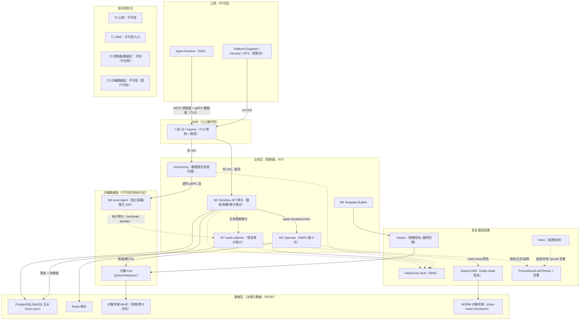

# AICoding 架构设计 · 安全设计

> 本文档为《AICoding 架构设计》核心产物之一，对应《安全架构设计模板》。
> 上游输入：《系统设计》（G4 冻结，v1.10）、《资料摘要》（G1 冻结，material_digest.md）。
> 下游输出：驱动《部署设计》（platform-architect）中 KMS/Vault 配置、NetworkPolicy/安全组规则、审计字段与保留期、WAF 策略的落地。

> **文档约定**：本系统为「自建 Kubernetes + 三档隔离（runc/gVisor/Kata）」的通用 Agent Sandbox，不绑定云厂商。因此模板中依赖公有云能力的组件（DDoS 高防、云 WAF、云防火墙、CAM、云 KMS 白盒密钥、云 DBAudit）在本方案中映射为自建等价机制（LB 限流、Ingress/网关访问控制、Calico NetworkPolicy、HashiCorp Vault、Harbor 漏洞扫描、Falco 逃逸检测、数据库审计日志）。全文安全措施均映射回《系统设计》的实际模块（M1~M7）、接口契约（§3.5）、数据对象（§3.3/§4.2）与冻结安全决策（§7）。

---

## 0. 元信息：修订记录

| 文档版本 | 发布日期 | 修订人 | 修订说明 |
| --- | --- | --- | --- |
| v1.0 | 2026-08-18 | security-architect（严守正） | 初稿：基于《系统设计》v1.10 完成 §1~§7 全章节威胁建模 + IAM + 数据安全 + 应用安全 + 网络安全 + 密钥管理 + 运行时安全 |

---

## 1. 安全总体架构

### 1.1 安全总体架构图

> 下图叠加展示：网络分区与信任域、流量入口安全（LB 限流 / Ingress 访问控制）、主机/容器安全（Admission Webhook / seccomp / Falco）、密钥管理（Vault）、审计中心（audit-collector M7 + Notary/HSM + WORM）、镜像安全（Harbor 签名+扫描）、可观测与 SOC 联动。信任边界以虚线标注。

**安全组件清单（自建等价映射）**：

| 组件（模板参考） | 本方案实现 | 作用 | 对应系统设计 |
| --- | --- | --- | --- |
| DDoS 高防 | 7 层 LB 限流 + 网关三维限流（全局/租户/IP） | 抵御流量攻击、CC | §3.5.3、§6.2.1 |
| WAF | Ingress 访问控制 + 网关输入校验 + 统一异常处理 | Web 应用层攻击防护 | §4.1、§4.2 |
| 云防火墙 | Calico NetworkPolicy（东西向）+ 安全组（南北向） | 流量管控 | §5.1、§5.2 |
| 主机安全 | 最小化安装 + SSH 密钥登录 + 主机安全组件（漏洞扫描/补丁） | 节点资产防护 | §5.3 |
| 数据安全审计 | PostgreSQL/MySQL 审计日志 + 哈希链防篡改 + 脱敏 | 数据审计、防篡改 | §7.2、§4.2.1.6 |
| KMS | HashiCorp Vault（自建） | 密钥托管、mTLS 证书、per-sandbox secret | §6.1、C-08 |
| 堡垒机 | 运维通道 + 运维日志审计 | 运维通道管控 | §5.2.4、§7.2 |
| SOC | 安全合规团队统一保障（Falco + 告警接入） | 安全事件监控 | §7.1 |

### 1.2 威胁模型

采用 **STRIDE** 方法，以《系统设计》的模块边界（M1~M7）、接口契约（§3.5）、身份边界（ownerId/tenantId/per-sandbox token/workload identity）、数据流（控制面 REST + 数据面 gRPC + 审计异步）与运行形态（自建 K8s + 三档隔离）为基线建模。每条威胁映射到后续章节缓解措施。

| 威胁类别（STRIDE） | 编号 | 威胁描述（映射系统设计实际边界） | 缓解措施（映射章节） |
| --- | --- | --- | --- |
| 仿冒（Spoofing） | S-1 | 恶意调用方伪造/冒用他人身份创建沙箱、冒用 ownerId 绕过配额 | §2.1（SSO/OAuth2/Token + MFA）、§2.2.4（ownerId 从认证身份派生，仅委托角色可覆盖，§3.2.M1.5 Step1） |
| 仿冒 | S-2 | per-sandbox token 被截获重放，冒用连接信息调 envd 执行方法 | §3.2.3（CredentialEnvelope 约 120s 短有效期 + scope 签名 JWT）、§6.1（API Key 分级） |
| 仿冒 | S-3 | 不可信沙箱代码伪造审计事件 / 窃取上报身份 | §2.3（envd workload identity：独立 mTLS 证书/限定 audience 短期凭证 + automountServiceAccountToken:false）、§7.2（M7 校验失败进隔离队列 AL-14） |
| 仿冒 | S-4 | 攻击者伪造/截尾审计链，冒充足量审计记录 | §3.3.3（逐事件 HMAC-SHA256 哈希链 + Notary/HSM 签名 WORM checkpoint） |
| 篡改（Tampering） | T-1 | 请求参数被篡改：同幂等键换 template/class/owner 复用，静默返回旧资源 | §3.2.2/§3.3.3（request_hash 规范化指纹 + 唯一索引 + 换参返冲突） |
| 篡改 | T-2 | 审计日志被越权修改/删除/截尾 | §3.3.3（append-only + hash_chain NOT NULL + 每事件 HMAC + 外部 checkpoint + 校验 Job AL-09） |
| 篡改 | T-3 | 模板/agent 镜像被投毒或篡改 | §5.3（Harbor 镜像签名 + 漏洞扫描 + 内网镜像白名单） |
| 篡改 | T-4 | 沙箱工作区文件被并发写破坏 / 静默覆盖 | §4.3.4（原子写 tempfile+fsync+rename + version guard，§3.2.M3.5 Step3） |
| 否认（Repudiation） | R-1 | 缺操作留痕，无法追溯"谁/何时/对什么/做了什么/结果" | §7.2（全链路审计 CREATE/KILL/EXEC/FS_WRITE/SPAWN/APPROVAL + append-only + durable ACK 不丢） |
| 信息泄露（Information Disclosure） | I-1 | 环境变量凭据（KEY/PASSWORD/SECRET/TOKEN）泄漏进沙箱/日志 | §3.1（L4 分级）、§3.3.1（凭据剥离 scrubbedParentEnv + 显式转发可审计） |
| 信息泄露 | I-2 | 水平越权（IDOR）跨租户读他人沙箱/审计/配额数据 | §2.2.4（每接口校验 tenant_id + owner_id 归属）、§2.2.3（租户 namespace 隔离） |
| 信息泄露 | I-3 | 容器逃逸后读取宿主/邻容器数据 | §5.3（三档隔离 + seccomp + drop ALL + 非 root + Falco）、§1.2 E-1 |
| 信息泄露 | I-4 | 日志/错误响应泄露堆栈、SQL、路径、凭据 | §4.2（统一异常处理 + 结构化日志禁止敏感字段） |
| 拒绝服务（DoS） | D-1 | DDoS/CC 打满入口带宽 | §5.2（LB 限流 + 网关三维限流 §3.5.3） |
| 拒绝服务 | D-2 | 单 owner 资源滥用耗尽配额，挤占他人 | §2.2.2（owner 并发配额 + DB 原子条件更新权威 + 对账）、§4.3.4（幂等防重放） |
| 拒绝服务 | D-3 | audit-collector 故障导致 Draining Pod 无限堆积 | §7.1（audit-pending Pod 熔断，owner 并发 10% 上限，§3.2.M2.5） |
| 权限提升（Elevation of Privilege） | E-1 | 容器逃逸到宿主内核/提权 | §5.3（gVisor/Kata 隔离 + Admission Webhook 禁 hostPath/privileged/hostNetwork/hostPID/hostIPC + seccomp + drop ALL + Falco） |
| 权限提升 | E-2 | runtimeClassName 越权（敏感代码落到低隔离档 runc） | §2.2.2（SandboxClass 显式声明 + webhook 校验 runtimeClassName ∈ 允许集合，AG-12） |
| 权限提升 | E-3 | 垂直越权（低权限角色调高敏接口） | §2.2.4（RBAC 角色标签 + 接口拦截器双层校验） |
| 权限提升 | E-4 | 沙箱 Pod 携带 SA Token 访问 K8s API 提权 | §5.3（automountServiceAccountToken:false + RBAC 最小化） |

**威胁—缓解措施映射表**（STRIDE 六类 → 章节矩阵）：

| 缓解章节 | 仿冒 S | 篡改 T | 否认 R | 信息泄露 I | DoS D | 权限提升 E |
| --- | --- | --- | --- | --- | --- | --- |
| §2 IAM | S-1/S-2/S-3 | — | — | I-2 | D-2 | E-2/E-3 |
| §3 数据安全 | S-2/S-4 | T-1/T-2 | — | I-1/I-4 | — | — |
| §4 应用安全 | — | T-4 | — | I-4 | D-2 | E-3 |
| §5 网络与基础设施 | — | T-3 | — | I-3 | D-1 | E-1/E-4 |
| §6 密钥与凭证 | S-2/S-4 | T-2 | — | I-1 | — | — |
| §7 运行时安全 | S-3 | T-2 | R-1 | — | D-3 | E-1 |

**STRIDE 六类覆盖自检**：仿冒（S-1~S-4）、篡改（T-1~T-4）、否认（R-1）、信息泄露（I-1~I-4）、DoS（D-1~D-3）、权限提升（E-1~E-4）——六类全覆盖，每条均映射到具体章节缓解措施，无空行。

---

## 2. 身份与访问管理（IAM）

### 2.1 身份认证（Authentication）

#### 2.1.1 用户登录

- **登录方式（≥2 种，满足硬指标）**：
  1. **SSO / OIDC**（默认，对接企业身份源 IDP，不自建密码库）；
  2. **OAuth2 授权码模式**（SDK/第三方集成）；
  3. **API Token / API Key**（程序化调用七接口，分级授权、可撤销、有限期）；
  4. **MFA/2FA**（管理端、敏感操作强制，密码 + OTP/硬件令牌）。
- **图形/风控验证强制场景**：登录失败高频、异地登录、管理端敏感操作二次验证。
- **MFA/2FA**：管理端（Platform Engineer / Security / OPS）与审批决策、密钥变更、批量导出等敏感操作必须开启 MFA。

> 账号体系对齐《系统设计》§7.2.1：SSO/IDP + OAuth2 + Token，MFA 管理端启用，访问 Token 2h / 刷新 Token 7d。

#### 2.1.2 密码策略（量化阈值）

> 本系统默认对接企业 IDP（SSO），不自建密码库。以下阈值适用于**自建本地账号兜底场景**（私有化部署无 IDP 时）与运维账号（CVM/数据库/中间件/堡垒机）。

| 项 | 基线值 |
| --- | --- |
| 最小长度 | ≥ 12 位（控制台/运维账号/数据库） |
| 复杂度 | 同时包含数字、大写字母、小写字母、特殊字符 |
| 加密传输 | 前端 RSA/TLS 加密提交，禁明文传输 |
| 加密存储 | argon2id / bcrypt 加盐哈希；**禁止 MD5/SHA1 明文** |
| 更换周期 | 90 天提醒（运维账号），本地账号 180 天 |
| 重复限制 | 不允许使用最近 5 次密码 |
| 失败锁定 | 连续失败 5 次锁定 1 小时 |
| 自动登出 | 30 分钟无操作自动登出 |
| 注册策略 | 不允许用户自行注册，仅管理员创建；改密需原密码验证 |

#### 2.1.3 会话管理

- **Token 类型**：JWT（网关校验，注销即失效）+ 刷新 Token；**禁止 URL 携带 token**（§3.2.3 传参禁忌）。
- **有效期**：访问 Token 2h、刷新 Token 7d（对齐 §7.2.1）；提供续期与主动注销接口。
- **JWKS 轮换处理**：网关定期拉取 IDP JWKS；轮换期旧 kid 验签失败返回 `C401002`（引导 SDK 刷新凭证）；网关保留新旧 kid 重叠窗口 60s，避免轮换瞬间大面积 401（§3.5.1、§7.2.1）。
- **互踢机制**：管理端同账号单设备登录，新登录踢旧会话，异地登录提示。
- **风险登录**：异地/异常登录二次验证（MFA）。

### 2.2 授权与权限控制（Authorization）

#### 2.2.1 权限模型

默认采用 **RBAC0**（用户—角色—权限），高敏数据（审计原文/审批/配额管理）叠加 **ABAC**（属性条件：tenant_id、owner_id、来源 IP、时间窗）。三层 RBAC 落地：

1. **K8s RBAC**（namespace 级 + Operator ClusterRole 最小权限，§7.2.5）；
2. **网关角色标签**（每接口 `meta.roles`，前端路由 + 网关中间件双层，§3.5.5）；
3. **数据面 envd gRPC 鉴权拦截器**（per-sandbox 凭证 scope 校验，§3.2.M3.1）。

> 权限模型已由《系统设计》§7.2.5 冻结为 RBAC（K8s namespace 级 + 网关角色标签），本节展开为三层落地细节，不改变已冻结选择。

#### 2.2.2 权限维度

- **接口级**：API 网关统一鉴权（JWT 校验 + 角色标签）+ 接口签名（HMAC-SHA256）；数据面 envd 拦截器做 scope 校验（§3.2.3）。
- **数据级**：行级（tenant_id + owner_id 强制带入查询，全表隔离字段 §4.1）；列级（L3/L4 字段脱敏展示，§3.1）。
- **功能级**：菜单、按钮、操作细粒度控制（控制台路由 `meta.roles`，§3.5.5）。

#### 2.2.3 多租户隔离

- **隔离方式**：**逻辑隔离**（已冻结，§7.2.5）——租户级 namespace + 全表 `tenant_id` 字段 + NetworkPolicy 隔离 + 预热池跨 namespace 领用强制拒绝（AG-03）。
- **隔离强度分级**：普通租户 gVisor；敏感/多租户/合规场景 Kata 强隔离（独立 guest 内核 microVM，§3.1.5）。
- **不提供物理隔离默认**：自建内部执行底座，物理隔离（专用节点池）作为敏感租户可选增强，非默认。

#### 2.2.4 越权防护

- **水平越权（IDOR）**：列表/详情/销毁/续期接口必须校验资源归属（tenant_id + owner_id 与认证身份一致）；`ownerId` 从认证身份派生，仅「委托权限」角色可覆盖，否则忽略请求值防配额绕过与审计污染（§3.2.M1.3/M1.5）。
- **垂直越权**：RBAC 角色标签 + 接口拦截器双层校验；高敏接口（审批决策/密钥变更/批量导出）二次验证。

### 2.3 云账号与云资源访问（自建集群映射）

> 本系统自建 K8s，不依赖云 CAM 主/子账号。本节映射为 **K8s RBAC 账号** 与 **Vault 访问** 的等价管控。

#### 2.3.1 账号策略

- K8s 集群**禁止使用 cluster-admin 之外的宽泛账号**；应用侧使用限定 namespace/资源的 ServiceAccount + ClusterRole 最小权限（Operator RBAC 清单见 §7.2.5）。
- 沙箱 Pod `automountServiceAccountToken: false`，禁止携带 SA Token 访问 K8s API（§3.2.M3.1）。

#### 2.3.2 权限分离

- **人员权限**（密码/SSO + MFA，控制台/堡垒机使用）与 **服务权限**（ServiceAccount / mTLS 证书 / API Token，应用调用使用）分离。
- **审计上报身份分离**：envd 上报审计用独立 workload identity（独立 mTLS 证书/限定 audience 短期凭证），与 per-sandbox token 严格区分（§3.2.M3.1）。

#### 2.3.3 高敏权限分离

- 高敏操作（审批决策、密钥变更、审计导出、配额调整、SandboxClass 配置）账号与低敏操作（查询、普通创建）隔离，独立角色 + 独立 MFA。
- Vault 高敏路径（server_secret、证书私钥）单独 policy，仅 audit-collector/网关/Operator 最小集合可读，禁止运维账号直接读明文。

---

## 3. 数据安全

### 3.1 数据分级

| 等级 | 类别 | 示例（映射系统设计） | 处理策略 |
| --- | --- | --- | --- |
| L1 | 公开 | 公开 API 文档、模板元数据（镜像名/tag）、隔离档说明 | 无特殊管控 |
| L2 | 内部 | 沙箱连接信息（`ConnectionInfo`：代理入口+sandboxId，**无凭证**）、业务配置（ConfigMap）、监控指标、SandboxClass/Template 定义 | 需内部鉴权访问 |
| L3 | 敏感 | 审计参数（脱敏后 `params`）、owner 配额数据、审批记录、沙箱 stdout/stderr（可能含敏感输出）、快照元数据 | 加密传输、脱敏展示、必要时审计 |
| L4 | 高敏 | 环境变量凭据（KEY/PASSWORD/SECRET/TOKEN）、证书私钥、数据面一次性凭证（`CredentialEnvelope` JWT）、`server_secret`（HMAC 密钥）、数据库/Redis/对象存储凭据、mTLS 私钥 | Vault/KMS 托管、强脱敏、严格审计、禁止导出 |

> 分级对齐《系统设计》§7.2.2 敏感字段处理策略表；L4 最高（密钥/审计原文），已冻结。

### 3.2 数据传输安全

#### 3.2.1 公网访问

- 全链路 TLS 1.2+（TLS 1.3 优先），禁用 SSLv3、TLS 1.0/1.1；80 强制跳 443（§6.2.1）。
- 数据面 gRPC 强制 per-sandbox 短期凭证鉴权（MVP 起生效，§6.2.1）。

#### 3.2.2 服务内部访问

- 控制面服务间（网关↔Operator↔audit-collector↔DB/Redis）低敏走集群内 Service + 网络隔离；高敏（跨租户审计、mTLS 证书下发）走 **mTLS 双向证书**（完整版启用，cert-manager 自动轮转，§6.3）。

#### 3.2.3 数据库连接

- PostgreSQL/MySQL、Redis 启用 **SSL 连接**；审计表（t_audit_event/t_audit_partition_anchor）强制 **semi-sync 复制**（至少一从确认，零丢失，§4.3.1）。
- 数据库账号最小权限，禁止业务直连 root。

#### 3.2.4 接口签名

- **控制面**：HMAC-SHA256 防篡改 + nonce + timestamp 防重放（§2.2.2 接口级权限）。
- **数据面**：per-sandbox 凭证为约 120s 短有效期、含 scope 的签名 JWT（scope=commands/process/pty/files，**不含 SetEgress**），envd 拦截器验签（§3.2.M3.1、§7.2.2）。
- **幂等指纹**：`request_hash = SHA-256(规范化 template/class/owner/ttl)`，同 key 换参返冲突（§4.2.4.2）。

#### 3.2.5 传参禁忌

- **禁止 URL 携带** token、AKSK、手机号、凭据等敏感信息；GET 不传敏感参数。
- 敏感参数放 Header（Authorization/X-Idempotency-Key）或 Body；日志/错误响应不打印。

### 3.3 数据存储安全

#### 3.3.1 加密存储（敏感数据）

- **对称加密**：AES-256-GCM（治理域敏感字段、快照元数据）。
- **非对称加密**：RSA/ECDSA（mTLS 证书、Notary/HSM 签名、CredentialEnvelope JWT 签名）。
- **落盘加密**：对象存储（MinIO）启用服务端加密（SSE）；高敏数据（L4）使用客户端加密（CSE，经 Vault 主密钥派生）。
- **密钥管理**：Vault 托管，**禁止硬编码到代码或配置文件**（§6.1）。

#### 3.3.2 敏感字段单向哈希加盐

- 密码、token 摘要、`request_hash`（幂等指纹）、`hash_chain`（审计链，HMAC-SHA256）等不可逆字段。密码用 argon2id/bcrypt 加盐；审计链用 `server_secret`（Vault/HSM 托管）做 HMAC。

#### 3.3.3 数据库安全

- **账号最小权限**：禁止业务直连 root；运维独立账号；审计表仅 M7 写、审计系统只读。
- **审计防篡改（已冻结，展开）**：`t_audit_event` append-only（无 `updated_by/updated_time` 豁免）；逐事件 `hash_chain = HMAC-SHA256(server_secret, previous_chain ‖ canonicalFields)`；chain-head 由独立 Notary/HSM 签名写入 WORM 对象存储（外部 checkpoint 防截尾）；`server_secret` 由 Vault/HSM 托管不入库（§4.2.1.6）。离线校验 Job（6h，单实例）重算全链 + 校验 Notary 签名 + 比对 WORM，失败告警 AL-09。
- **审计日志**：慢查询日志、数据库审计日志开启，独立存储（Loki + 对象存储冷存）。
- **备份加密**：备份落隔离对象存储，加密存储（§4.3.2）。

#### 3.3.4 文件存储安全

- 对象存储（MinIO）启用 SSE；私有桶 + 预签名 URL（大文件 uploadUrl/downloadUrl 直传，**短有效期**，§3.2.M1.2）。
- 上传文件类型校验（魔数 + 扩展名 + 大小）；下载防盗链（签名校验）。
- 审计冷存走 WORM（版本锁定，防篡改）。

#### 3.3.5 数据使用安全

- **展示脱敏**：审计参数敏感部分 `***` 屏蔽；凭据不展示；手机号 `138****8888`（若未来涉及）。
- **数据导出管控**：审计导出需审批 + 脱敏 + 水印（操作人 + 时间）+ 行数限制 + 操作审计（§7.2.2）。
- **数据销毁**：审计热数据保留 90 天，超期归档对象存储后物理删除；归档冷存保留 ≥ 1 年；沙箱 workspace 随 Pod 销毁回收；幂等键保留永久精简墓碑（防串线，§4.2.4.5）。

#### 3.3.6 数据备份与异地容灾

| 存储类型 | 备份策略 |
| --- | --- |
| PostgreSQL/MySQL | 全量每日 + 增量 binlog 实时；审计表 semi-sync 零丢失；备份至隔离对象存储，保留 30 天 |
| Redis | 哨兵 1 主 2 从；RDB+AOF；可重建，无需持久备份 |
| etcd（K8s） | 全量快照每 6h + WAL，跨 AZ 3 副本 |
| 对象存储（MinIO） | 多 AZ 内置冗余 + 跨区域复制；审计冷存 WORM 版本锁定 |

**RPO / RTO**：RPO ≤ 5 分钟；RTO ≤ 30 分钟（对齐 §4.3.2）；灾备演练季度 1 次。

#### 3.3.7 隐私合规

> ✅ **本节「合规框架适用范围」为「经中间确认」决策**：用户裁决采纳**方案 A**（等保 2.0 三级 + 数据安全法分级 + 个保法按需，国内自建内部执行底座，不含 GDPR/数据出境评估）。裁决原文见附录 A.3。

- **合规基线（经中间确认）**：《网络安全等级保护》**等保 2.0 三级** + 《数据安全法》数据分级（L1~L4）+ 《个人信息保护法》按需适用（本系统为国内自建内部执行底座，默认不直接采集个人信息；若沙箱处理含个人信息的业务数据，则触发个保法义务，由上层业务承担）。
- **不覆盖 GDPR / 数据出境评估**（经中间确认）：本系统定位国内自建内部执行底座，不面向欧盟数据主体，不做 GDPR 合规承诺、不做数据出境评估。
- **用户同意机制**：本系统不自建密码库、不直接面向 C 端采集个人信息；如上层业务在沙箱内处理个人信息，由上层业务承担同意/授权义务，本平台提供审计与隔离能力作为合规底座。
- **数据出境**：本系统**单 Region 自建部署，无跨境数据流**；未来若国际化部署（面向欧盟/跨境），需**另行发起中间确认**重新评估 GDPR 与数据出境合规，不得沿用本节基线。

---

## 4. 应用安全

> 本系统应用形态：REST 控制面（M1）+ gRPC 数据面（M3）+ 管理控制台（React SPA）+ SDK（Python/Go）。以下按 OWASP Top 10（2021）逐项给出本系统的**具体**防护措施（非泛化），并补充模板要求的输入/输出/业务逻辑/供应链防护。

### 4.1 输入安全（OWASP Top 10 + 注入类专项）

| 风险 | 本系统具体防护措施 |
| --- | --- |
| A01 Broken Access Control（越权/失效访问控制） | 每接口校验 tenant_id+owner_id 归属（§2.2.4）；ownerId 从认证身份派生、仅委托角色可覆盖；数据面 envd gRPC 拦截器校验 per-sandbox 凭证 scope（commands/process/pty/files，不含 SetEgress）；预热池跨 namespace 领用强制拒绝（AG-03）；幂等键 request_hash 防换参复用（§4.2.4.2） |
| A02 Cryptographic Failures（加密失效） | 全链路 TLS 1.2+/1.3，禁用 SSLv3/TLS1.0/1.1；内部 mTLS（完整版）；AES-256-GCM 落盘加密 + CSE；argon2id/bcrypt 密码哈希；审计链 HMAC-SHA256（server_secret Vault 托管）；禁用 MD5/SHA1 |
| A03 Injection（注入：SQL/命令/XSS/反序列化/XXE 等） | 见下表「注入类专项」逐项 |
| A04 Insecure Design（不安全设计） | 配额 DB 原子条件更新权威（`UPDATE ... WHERE current_count 低于 concurrent_limit`）+ allocation ledger 幂等释放（§4.2.2.6）；审批 fail-closed（DB 不可用返 B999001，不 fail-open）；Admission Webhook `failurePolicy: Fail`（fail-closed）；NetworkPolicy deny-all 先于首个 Pod 创建（无全放行窗口） |
| A05 Security Misconfiguration（安全配置错误） | Webhook failurePolicy: Fail + 2 副本 + /readyz（R8）；deny-all NetworkPolicy 随 namespace 创建一并 apply（R7）；最小化安装、关闭非必要服务；gVisor/Kata 版本锁定 release tag |
| A06 Vulnerable & Outdated Components（脆弱/过时组件） | Harbor 镜像签名 + 漏洞扫描（未通过拒绝构建）；CICD 组件漏洞扫描门禁；内网镜像 + 依赖源白名单防投毒；gVisor/Kata 安全补丁跟随上游 release 公告，升级前过 CI 回归 |
| A07 Identification & Auth Failures（身份/认证失败） | SSO/OIDC + OAuth2 + API Token + MFA（≥2 种）；JWT 2h/刷新 7d；JWKS 轮换重叠窗口 60s + C401002 引导刷新；失败锁定 5 次/1h；异地登录二次验证 |
| A08 Software & Data Integrity Failures（软件/数据完整性失败） | Harbor 镜像签名（构建→拉取全链校验）；审计链逐事件 HMAC + Notary/HSM 签名 WORM checkpoint；幂等 request_hash 指纹 + 唯一索引；原子写 tempfile+fsync+rename + version guard |
| A09 Logging & Monitoring Failures（日志/监控失败） | 结构化日志必含 traceId+tenantId、禁敏感字段明文；审计 5 维度（§7.2）；Falco 逃逸检测 + AL-01/AL-09/AL-14；对账偏差 AL-10；审计 flush 失败 AL-11 |
| A10 SSRF（服务端请求伪造） | 沙箱出站默认拒绝，仅白名单镜像源/依赖源（pypi/registry）+ audit-collector（§6.2.2）；大文件走预签名 URL 直传，控制面不代拉任意 URL；envd 不提供任意 URL 拉取接口；内网 IP/元数据端点（169.254.169.254）显式阻断 |

**注入类专项（映射模板 §4.1 列出的具体项）**：

| 风险 | 本系统具体防护措施 |
| --- | --- |
| SQL 注入 | 治理域（审计/配额/审批/幂等）全部参数化查询（ORM 参数绑定 + PreparedStatement）；动态字段（审计列表 order by）用白名单枚举映射，禁止拼接 SQL；PG/MySQL 方言抽象层禁裸 SQL 拼接 |
| XSS | 控制台 React 默认转义 + 输出编码；CSP 策略；Cookie HttpOnly + Secure；沙箱 stdout/stderr 经 API 返回时按文本处理，不解析为 HTML |
| CSRF | 控制台关键写操作 CSRF Token + SameSite Cookie；管理端关键操作二次验证（MFA） |
| 命令注入 | 沙箱命令执行为产品核心能力（刻意允许执行代码），但由 gVisor/Kata 隔离边界承载；**控制面**禁用动态命令执行，envd ResolveExecutable 用 `command -v` + 参数数组形式，禁止 shell 字符串拼接 |
| 反序列化 | gRPC/Protobuf 强类型，禁用危险反序列化（Java fastjson autoType、Jackson @class）；JSON 解析限定已知 DTO |
| SSRF | 见 A10（egress 白名单 + 预签名 URL + 内网阻断） |
| 文件上传 | 大文件走预签名 URL 直传对象存储；类型校验（魔数+扩展名+大小）；随机重命名；隔离存储桶；上传不落控制面本地 |
| XXE | 关闭 XML 外部实体解析（DTD）；本系统 REST/gRPC 均用 JSON/Protobuf，XML 仅限外部系统对接时禁用外部实体 |
| 开放重定向 | 控制台跳转 URL 白名单；OAuth2 回调 URL 固定校验 |

### 4.2 输出安全

#### 4.2.1 统一异常处理

- 统一错误结构（code/msg/msgI18n/data/traceId/tenantId/timestamp，§3.5.1）；**禁止暴露堆栈、SQL、内部路径**。6 位错误码体系（A 业务/B 系统/C 客户端）。

#### 4.2.2 调试信息

- 生产环境响应禁止 debug/stacktrace；debug 仅开发环境；日志 ERROR 级别含完整堆栈但**脱敏后**落内部 Loki，不外泄。

### 4.3 业务逻辑安全

#### 4.3.1 越权防护

- 水平越权每接口必检（tenant_id+owner_id）；垂直越权 RBAC + 接口拦截器双层（§2.2.4）。

#### 4.3.2 防刷防爬

- 限流三维度（全局 5000 QPS / 单租户 500 QPS / 单 IP 100 QPS，§3.5.3）；`Retry-After` 退避；前端退避 + 后端熔断队列。

#### 4.3.3 防薅羊毛

- owner 并发配额（默认 50）+ 沙箱创建重保接口单 owner 10 次/秒（§3.5.3）；配额对账（60s Job）+ 偏差告警 AL-10；风控规则 + 行为分析（SOC 联动）。

#### 4.3.4 幂等性

- 写入接口幂等（X-Idempotency-Key）；「① DB 幂等位 → ② DB 原子条件扣配额 → ③ Redis 热缓存」三段顺序防双扣（§3.5.2）；`request_hash` 防换参；`lease_version` fencing 防旧 lease 双写；幂等键永久精简墓碑防串线（§4.2.4.5）。

#### 4.3.5 关键业务二次验证

- 审批决策、密钥变更、批量导出、配额调整、SandboxClass 配置等需 MFA/二次确认（§2.1.1）。

### 4.4 第三方与供应链安全

- **组件漏洞扫描**：CICD 强制门禁（组件安全扫描 + 镜像扫描），未通过拦截上线。
- **镜像安全**：Harbor 签名 + 漏洞扫描；**内网镜像 + 依赖源白名单**（镜像源、Maven/NPM/pypi 内网代理 + 白名单），避免投毒。
- **开源协议合规**：GPL/AGPL 商业风险审查（gVisor=Apache-2.0、Kata=Apache-2.0、Vault=MPL-2.0，逐一登记许可证）。
- **供应商管理**：第三方服务（镜像仓库/对象存储）合同含数据保护与审计条款，定期复评。
- **上游 runtime 安全**：gVisor/Kata 安全补丁跟随上游 release 公告，升级前过 CI 兼容性回归（§3.1.5）。

---

## 5. 网络与基础设施安全

### 5.1 网络分区（信任域划分）

> 本方案自建 K8s **单 Region 单集群、跨 3 AZ（AZ-1/AZ-2/AZ-3）**。网络分区已按 platform-architect《部署设计》拓扑骨架回填，形成四层信任域，映射到生产 VPC 的实际子网/CIDR/节点池/命名空间。

**信任域 → 子网/CIDR/节点池/命名空间映射**：

| 信任域 | 子网 / CIDR | 节点池 / 命名空间 | 承载内容 | 入站规则 | 出站规则 |
| --- | --- | --- | --- | --- | --- |
| T0 不可信 | 公网（VPC 外） | — | Agent Runtime SDK、外部用户 | 仅 7 层 LB/Ingress 443 | — |
| T1 半可信 | DMZ `10.100.0.0/24` | — | 7 层 LB / Ingress（TLS 终结 + 限流） | 仅公网 443 | 仅到网关/envd-proxy 端口 |
| T2 可信（平台侧） | 管理子网 3 AZ：`10.100.16.0/20`、`10.100.32.0/20`、`10.100.48.0/20` | 控制面工作节点 ×3 + `sandbox-system`（M1/M2/M4/M7/envd-proxy/webhook）+ `infra`（Vault）+ `security`（Falco）+ `monitoring`；数据中间件 PG/Redis/MinIO/WORM | 控制面 + 治理数据 + 安全基础设施 | 仅从 DMZ（网关/proxy）；数据中间件仅 `sandbox-system` 应用层可达 | NAT 控制最小化 |
| T3 不可信（用户代码） | 沙箱节点子网 3 AZ：`10.100.64.0/20`、`10.100.80.0/20`、`10.100.96.0/20`；Pod CIDR `10.200.0.0/14` | 沙箱节点池 A（gVisor/runc 32C128G ×45）+ 节点池 B（Kata 裸金属 32C128G ×13）+ `sandbox-tenant-{tenantId}` | 沙箱 Pod（gVisor/Kata/runc）+ envd Agent | 仅 envd-proxy/Router 入站（deny-all 基线） | 默认拒绝，白名单镜像源/依赖源 + audit-collector |
| T4 隔离 | 独立环境（非生产 VPC） | DEV / CICD / 运维通道 | 开发、CI/CD、运维 | 与生产完全隔离 | 与 PROD 隔离 |

**CIDR 与网络基座（platform 权威，安全侧消费并校验）**：

| 项 | 取值 |
| --- | --- |
| 生产 VPC | `10.100.0.0/16` |
| DMZ | `10.100.0.0/24` |
| 管理子网（3 AZ） | `10.100.16.0/20`、`10.100.32.0/20`、`10.100.48.0/20` |
| 沙箱节点子网（3 AZ） | `10.100.64.0/20`、`10.100.80.0/20`、`10.100.96.0/20` |
| Pod CIDR（Calico） | `10.200.0.0/14` |
| Service CIDR | `10.196.0.0/16` |
| 节点池 | etcd ×3（8C16G NVMe，跨 AZ raft）；控制面工作节点 ×3（8C32G，跨 AZ 反亲和）；沙箱节点池 A（gVisor/runc 32C128G ×45）；沙箱节点池 B（Kata 裸金属 32C128G ×13，需 KVM）；可观测 ×3；安全 ×2 |
| 命名空间 | `sandbox-system`（控制面）、`sandbox-tenant-{tenantId}`（每租户沙箱）、`monitoring`、`security`、`infra` |

**边界规则（硬约束，安全侧权威）**：

1. **CIDR 不重叠（校验通过）**：Pod CIDR（10.200.0.0/14）、Service CIDR（10.196.0.0/16）与节点子网（10.100.0.0/16）不冲突。
2. **DMZ 不能直连管理子网/沙箱子网**，只能经网关（M1）/envd-proxy 端口；数据中间件（PG/Redis/MinIO/WORM）**禁止公网暴露**，仅 `sandbox-system` 应用层 + `infra` 可达。
3. **沙箱 namespace deny-all NetworkPolicy 先于首个 Pod 创建**（随 `sandbox-tenant-{tenantId}` 创建一并 apply），入站仅放行 envd-proxy + Router，无全放行窗口（§7.2.5）。
4. **节点池隔离档绑定**：Kata 强隔离沙箱调度到裸金属节点池 B（需 KVM）；runc/gVisor 调度到节点池 A。SandboxClass 用 nodeSelector 约束，防 Kata 沙箱误落到无 KVM 的节点池 A（隔离降级）。
5. 生产 VPC 出公网仅经 NAT 网关/出口代理；沙箱出站走 egress 白名单。

### 5.2 流量管控（南北向 + 东西向）

#### 5.2.1 公网入口防护（南北向）

- **LB 限流**：7 层 LB 全局限流 + 连接数限制（自建，替代云 DDoS 高防）。
- **WAF/访问控制**：Ingress 访问控制 + 网关输入校验 + 统一异常处理（自建，替代云 WAF）。
- **CLB/Ingress**：仅暴露 443（HTTPS），80 强制跳 443（§6.2.1）。

#### 5.2.2 网络边界防护（东西向，NetworkPolicy 安全侧权威）

**NetworkPolicy 规则矩阵**（platform 按此配置 Calico NetworkPolicy）：

| 规则 | 命名空间 / 作用域 | 入站允许源 | 出站允许目标 | 端口 |
| --- | --- | --- | --- | --- |
| NP-01（控制面入站） | `sandbox-system` | DMZ `10.100.0.0/24`（经 LB 后端） | — | 网关 80/443、envd-proxy gRPC 443 |
| NP-02（中间件隔离） | `infra`（PG/Redis/MinIO/Vault/WORM） | 仅 `sandbox-system` 应用层 label | — | 5432/6379/9000/8200 |
| NP-03（沙箱 deny-all 基线） | `sandbox-tenant-{tenantId}` | 仅 envd-proxy（`sandbox-system` label）+ Router | 白名单：镜像源（registry/pypi）+ audit-collector（M7） | gRPC 50051 + 依赖源 443 |
| NP-04（租户隔离） | 各 `sandbox-tenant-{tenantId}` 之间 | 无（默认拒绝互访） | 无（禁横向） | — |
| NP-05（审计单向通道） | `sandbox-system`→`infra` | — | 仅 envd(M3)→M7→PG/对象存储 | gRPC 50052 + 5432 |

**安全组规则（节点级，安全侧权威）**：

| 安全组 | 规则 | 源/目标 | 端口 | 说明 |
| --- | --- | --- | --- | --- |
| 控制面节点 SG | 入站 | DMZ `10.100.0.0/24` | 80/443 | 仅网关/proxy 入口 |
| 控制面节点 SG | 入站 | 运维网段（堡垒机） | 22 | SSH 仅运维可达 |
| 数据中间件 SG | 入站 | 管理子网 `10.100.16.0/20` 等 | 5432/6379/9000/8200 | 禁止 0.0.0.0/0 |
| 沙箱节点 SG | 入站 | 控制面节点 SG | 50051 | 仅 envd-proxy 转发 |
| 全节点 SG | 出站 | NAT 网关/镜像源/依赖源白名单 | 443 | 最小化出站 |

#### 5.2.3 主机流量防护

- 安全组 + ACL 默认拒绝 + 显式放通；敏感端口（22/3306/5432/6379）**仅运维网段可达**，禁止 0.0.0.0/0 开放（§5.2.2 安全组规则表）。

#### 5.2.4 运维通道防护

- **堡垒机**：运维 SSH/数据库/文件传输日志全量记录；运维账号独立 + SSH 密钥登录优先；禁止 root 远程登录。

### 5.3 主机与容器安全

#### 5.3.1 主机安全

- 最小化安装、关闭非必要服务、定期补丁；节点镜像统一基线（含安全补丁）。
- 账号管控：**严禁 root 远程登录**，运维独立账号；SSH 密钥登录优先，密码兜底。
- 主机安全组件：漏洞扫描、木马查杀、密码破解阻断、漏洞防御、漏洞自动修复（对应模板「洋葱」等主机安全组件）。
- **节点池分层硬化**（按 platform 拓扑）：
  - **etcd 节点 ×3**（8C16G NVMe，跨 AZ raft）：独立安全组，仅 apiserver 可达 2379/2380；磁盘加密 + 定期快照；etcd 审计日志独立保留。
  - **控制面工作节点 ×3**（8C32G，跨 AZ 反亲和）：跑 `sandbox-system` 控制面，禁沙箱调度（污点 `node-role=control-plane`），防沙箱逃逸后横向到控制面。
  - **沙箱节点池 A**（gVisor/runc 32C128G ×45）：不可信代码承载，Falco 全覆盖 + seccomp + drop ALL；runc 档仅限可信代码（SandboxClass 约束）。
  - **沙箱节点池 B**（Kata 裸金属 32C128G ×13，需 KVM）：强隔离档，独立 guest 内核；Kata 内存 40MB/Pod overhead 计入调度（§5.5.2）。
  - **安全节点 ×2 / 可观测 ×3**：`security`（Falco/校验 Job）、`monitoring`（Prometheus/Loki/Tempo）专用，与沙箱节点池物理隔离。

#### 5.3.2 容器 / K8s 安全

- **K8s RBAC 最小化**：Operator ClusterRole 最小权限清单（§7.2.5）；沙箱 Pod `automountServiceAccountToken: false`。
- **Admission Webhook（P0 防逃逸）**：禁 hostPath/privileged/hostNetwork/hostPID/hostIPC；强制 runAsNonRoot + readOnlyRootFilesystem + drop ALL caps；注入 seccomp RuntimeDefault；校验 runtimeClassName ∈ 允许集合（AG-12）；`failurePolicy: Fail` + 2 副本 + /readyz。
- **Pod 安全**：非 root UID（10001）；readOnlyRootfs（仅 workspace 可写）；drop ALL caps；seccomp RuntimeDefault；三档隔离（runc 可信/gVisor 默认/Kata 强隔离）。
- **镜像扫描**：Harbor 签名 + 漏洞扫描（本地 + 仓库）；**不在镜像中打包密钥**，经 Vault 运行时下发。
- **逃逸检测**：Falco（容器逃逸/异常 syscall 规则）+ AL-01（P0）；K8s API 异常请求监控。
- **禁止特权容器/高权限容器**；Sandbox.replicas 仅允许 0/1（webhook 校验，AG-09）。

### 5.4 中间件安全

#### 5.4.1 网络隔离

- PostgreSQL/MySQL、Redis、MinIO、Vault、etcd 仅数据区/业务区应用层可达；**禁止公网暴露**（§5.1 边界规则 2）。

#### 5.4.2 强制鉴权

- 数据库、Redis、MinIO 强制鉴权，修改默认账号，开启 SSL；最小权限账号（禁业务直连 root）。

#### 5.4.3 审计

- 启用审计日志（数据库审计 + 慢查询 + 中间件访问日志），关键中间件接入审计；数据库审计独立存储（Loki + 对象存储）。

---

## 6. 密钥与凭证管理

### 6.1 密钥分级与存储

| 密钥类型（5 类，满足硬指标） | 具体实例（映射系统设计） | 存储 / 管理方式 |
| --- | --- | --- |
| 数据库密码 | PostgreSQL/MySQL、Redis 密码 | Vault KV 引擎托管 + 最小权限账号 + 定期轮换（90 天） |
| 云 AKSK（对象存储） | MinIO/S3 access key（快照/审计冷存） | Vault 托管 + 最小权限 policy（桶级）+ 轮换；自建不绑云，但对象存储 AKSK 仍按此类管控 |
| 服务间密钥 | mTLS 证书/私钥、`server_secret`（审计 HMAC 密钥）、envd workload identity 证书、per-sandbox secret | Vault PKI 引擎 + cert-manager 自动签发/轮转（90 天不停机）；`server_secret` 由 Vault/HSM 托管**不入库**，仅 AuditWriter/校验 Job 可读 |
| 用户密码 | SSO 不自建；本地账号兜底密码 | argon2id/bcrypt 加盐哈希（不可逆），禁 MD5/SHA1 |
| API Key / Token | per-sandbox token、`CredentialEnvelope` JWT、SDK API Key | 分级授权、可撤销、有限期；per-sandbox token TTL=沙箱 TTL；CredentialEnvelope 约 120s 有 scope 签名 JWT（scope 不含 SetEgress）；SDK API Key 分级 + 有限期 + 可撤销 |

**密钥生命周期统一规则（安全侧权威，platform 按此配置 Vault）**：证书 90 天轮换（cert-manager，不停机）；数据库/对象存储凭据 90 天轮换；`server_secret` 按需轮换（触发全链重签 SOP）；per-sandbox token/CredentialEnvelope 短生命周期随沙箱 TTL。

**Vault 部署与访问控制（platform 权威=基础部署，安全侧权威=分级/访问/轮转）**：

| 项 | 取值 |
| --- | --- |
| 基础部署 | HashiCorp Vault 1.16 主备（2C4G ×2，`infra` 命名空间），托管 mTLS 证书 + per-sandbox secret + 哈希链 `server_secret` |
| 高敏路径 policy | `server_secret`、证书私钥路径单独 policy，仅 AuditWriter/M7/网关/Operator 最小集合可读，运维账号禁读明文 |
| 动态凭据 | 数据库/MinIO 用 Vault 动态凭据引擎（database/aws），按租约短期下发 |
| 审计 | Vault 开启审计设备（audit device），写独立审计日志（Loki + 对象存储） |
| 封禁/解锁 | Vault seal/unseal 由独立密钥分片托管（多持钥人），自动化 unseal 需额外评估 |

### 6.2 AKSK 泄露防护（自建等价）

> 本系统自建集群不依赖云 CAM 白盒密钥，等价方案如下：

#### 6.2.1 方案：Vault 托管 + 最小权限 + 动态凭据

- 对象存储/MinIO AKSK、数据库密码由 **Vault 动态凭据引擎**（database/aws 引擎）按租约短期下发，业务模块经 Vault SDK 获取，不落配置明文。
- 最小权限 policy：MinIO 桶级 policy、数据库账号只读/读写分离、禁止多业务共用同一凭据（按业务/环境隔离签发）。

#### 6.2.2 泄露响应

- AKSK/凭据疑似泄露 → 立即在 Vault 禁用 + 轮换；事后排查访问日志确认影响面；每一凭据明确所有人/用途/存储位置/轮换日期。

### 6.3 密钥使用红线

- **严禁** AKSK/数据库密码/Token/`server_secret` 出现在源码、Git 仓库、前端代码、日志、错误堆栈、URL、配置明文（§3.2.5、§8.2.2）。
- **禁止**多业务共用同一凭据；按业务/环境隔离签发（§4.4.1 Key 前缀禁止做环境隔离，不同 Redis/DB 实例）。
- 上线前必须通过代码扫描（CICD 红线拦截）+ 镜像扫描，识别硬编码密钥；上线 checklist 含「密钥扫描通过」项。
- 密钥一旦疑似泄露，立即禁用并轮换；事后排查访问日志。
- 沙箱 Pod 环境变量剥离 KEY/PASSWORD/SECRET/TOKEN + 平台前缀 DSH_*（scrubbedParentEnv，§3.3.1）；显式转发 `spec.env` 层合并可审计（US-20）。

---

## 7. 运行时安全：监控、审计、应急

### 7.1 安全事件监控

- **入侵检测（IDS/IPS）**：Falco（容器逃逸/异常 syscall）+ 主机安全告警 + 网关攻击日志接入 SOC；告警 AL-01（逃逸 P0）、AL-14（审计伪造 P0）。
- **敏感操作**：数据导出、批量删除、密钥变更、审批决策、配额调整、SandboxClass 配置（§4.3.5）。
- **登录异常**：异地登录、连续失败、夜间登录、非常用设备（§2.1.3 风险登录）。
- **权限异常**：越权请求、敏感接口高频调用、非常规权限提升、runtimeClassName 越权尝试（webhook 拒绝日志 + AL 告警）。
- **配额/一致性异常**：配额对账偏差 AL-10、配额账本写入压力 AL-12、审计 flush 失败 AL-11、审计链校验失败 AL-09。

### 7.2 审计日志（5 维度，满足硬指标）

| 维度 | 内容 | 存储 / 保留 | 不可篡改 |
| --- | --- | --- | --- |
| 云资源审计日志（K8s/etcd） | K8s apiserver audit log（事件名称、区域、时间、事件源、源 IP、请求 ID、操作者） | Loki；30 天热 + 180 天冷 | K8s audit log 独立保留 |
| 业务操作审计 | `t_audit_event`（操作时间、来源 IP、操作者、事件名称 CREATE/KILL/EXEC/FS_WRITE/SPAWN/APPROVAL、读写类型、扩展字段 params 脱敏） | PostgreSQL/MySQL + 对象存储冷存；热 90 天，冷存 ≥ 1 年 | 逐事件 HMAC-SHA256 哈希链 + Notary/HSM 签名 WORM checkpoint |
| 数据库审计 | SQL、执行人、客户端 IP、时间、影响行数 | 数据库审计日志 + 慢查询；Loki + 对象存储 | 审计表 append-only + 哈希链 |
| 堡垒机日志 | 主机/数据库运维日志、文件传输日志 | 堡垒机 + Loki | 独立记录 |
| WAF/防火墙日志 | LB/Ingress 访问日志、攻击日志、拦截记录、NetworkPolicy/Calico flow log、Falco 逃逸检测 | Loki + 对象存储 | 独立记录 |

**审计字段（安全侧权威，供 platform-architect 配置日志管道）**：`seq`（链序号）、`tenant_id`、`biz_id`（幂等去重键）、`owner_id`、`sandbox_id`、`event_type`、`params`（脱敏）、`result`、`source_ip`、`created_by`、`created_time`（应用层赋值参与哈希）、`hash_chain`（HMAC 链）。

**审计保留期（安全侧权威，platform 按此配置日志管道）**：审计热数据 90 天，归档冷存 ≥ 1 年（合规底线，对齐《系统设计》§7.2.4/§8.2）。日志收集管道按 platform 拓扑：envd→audit-collector(M7)→`t_audit_event`（哈希链）+ MinIO WORM 冷存；应用日志→Loki（热 30~90 天 + 冷 180 天~1 年）；审计冷存走 WORM 版本锁定，保留 ≥ 1 年且独立于应用日志。

**不可篡改保障（已冻结，展开）**：append-only 表（无 updated 字段豁免）+ 每事件 HMAC-SHA256（`server_secret` Vault/HSM 托管）+ chain-head 由 Notary/HSM 签名写 WORM + 离线校验 Job（6h 单实例）比对 + 失败 AL-09。审计统一收口 M7（M1/M3 不直写），M7 从 bound Pod UID/权威 DB/CRD 派生归属，不信任 payload。

### 7.3 应急响应（5 类事件，满足硬指标）

| 事件类型 | 应急预案要点 | RTO/RPO | 关联告警 |
| --- | --- | --- | --- |
| 漏洞响应（CVE/内核/gVisor/Kata） | ① 评估影响面（是否可逃逸）；② 隔离受影响节点池/沙箱；③ 升级 runtime/内核补丁（过 CI 回归）；④ 事后复盘 | 严重漏洞 24h 内修复 | AL-01 |
| 数据泄露（审计/凭据/敏感数据） | ① 止血（禁用泄露凭据/切断通道）；② 定位泄露源（审计链 + 访问日志）；③ 通知与上报（合规）；④ 修复 + 证据保全 | RTO ≤ 30min；RPO ≤ 5min | AL-09/AL-11/AL-14 |
| 被攻击（DDoS/入侵/容器逃逸） | ① 触发限流/隔离（LB 限流 + 熔断）；② Falco 逃逸处置（隔离节点）；③ 封禁攻击源；④ 取证 + 复盘 | 攻击持续 5min 内响应 | AL-01/AL-02/AL-03 |
| 密钥泄露（server_secret/证书/AKSK） | ① 立即 Vault 禁用 + 轮换；② 若 server_secret 泄露 → 全链重签 SOP（新建分区锚点）；③ 排查访问日志确认影响面；④ 重建受影响沙箱 | 2h 内轮换完成 | AL-09/AL-14 |
| 勒索病毒（沙箱节点/数据加密） | ① 隔离感染节点；② 从隔离备份/对象存储 WORM 恢复（审计冷存不可加密）；③ 杀毒 + 补丁；④ 拒付赎金 + 上报 | RTO ≤ 30min（恢复审计/治理数据） | AL-01/AL-05 |

**备份与恢复**：RPO ≤ 5 分钟、RTO ≤ 30 分钟；灾备演练**每年 ≥ 1 次**（§4.3.2 季度演练更高频，满足硬指标）。

---

## 附录 A：中间确认自检报告

> 按中间确认协议 §2.4，在 §1（威胁建模+STRIDE）/§2（IAM）/§3（数据分级+隐私合规）/§6（密钥管理）完成后显式自检：先按 §2.1 判定，再按 §2.3 反向验证 3 问。

### A.1 §1 完成威胁建模与 STRIDE 映射后自检

**§2.1 判定**：未命中方案分歧型。STRIDE 为标准威胁建模方法，威胁全部继承《系统设计》模块边界/接口/身份边界，无新增方案分歧。

**反向验证 3 问**：
- Q1：返工范围 = §1.2 威胁表 + 映射矩阵；切换成本 低于 1 人周。**可控**。
- Q2：用户/客户/监管感知点 = 无（威胁建模为内部产物，不改变对外接口/隔离档/产品形态）。**感知不到**（依据：不改变七接口、隔离三档、SLA 承诺）。
- Q3：用户原始诉求「设计通用 K8s agent sandbox + 1000 并发」未显式提及威胁建模方法；本决策不改变对外能力。**一致**。

**结论**：未命中，不发起中间确认。

### A.2 §2 完成 IAM 设计后自检

**§2.1 判定**：未命中方案分歧型。认证方式（SSO/OAuth2/Token+MFA）、权限模型（RBAC）、多租户隔离（逻辑隔离）均已由《系统设计》§7.2.1/§7.2.5 冻结，本节仅展开落地细节，无新增方案分歧。

**反向验证 3 问**：
- Q1：返工范围 = §2 各小节；切换成本 低于 1 人周。**可控**。
- Q2：感知点 = 无（权限模型/认证方式已冻结，本节不改变对外行为）。**感知不到**。
- Q3：用户诉求未显式提及 RBAC/认证细节；与「通用 K8s」一致。**一致**。

**结论**：未命中，不发起中间确认（权限模型 RBAC 已冻结，非待裁决）。

### A.3 §3 完成数据分级与隐私合规章节后自检（命中 → 已发起中间确认）

**§2.1 判定**：**命中方案分歧型**——「合规框架适用范围（§3.3.7）」同时满足三条：
1. ≥2 种合理方案：方案 A（国内内部底座：等保 2.0 三级 + 数据安全法分级 + 个保法按需，不含 GDPR/数据出境）vs 方案 B（通用国际化：等保 + 个保法 + GDPR + 数据出境评估）。
2. 影响下游成员：platform-architect（数据驻留/合规审计配置）、product-story（对外合规承诺）。
3. 用户原始诉求「设计通用 K8s agent sandbox + 1000 并发」未明确选择合规框架，上游文档未对该具体决策点做选择。

**反向验证 3 问**：
- Q1：若 3 个月后推翻（方案 A↔B 互切），返工成本可控吗？——返工范围 = §3.3.7 + §7.2 审计保留/合规字段 + 数据驻留配置；切换成本 ≥ 1 人月（命中 §2.2(1) 不可逆代价）。**不可控**。
- Q2：用户/客户/监管能感知到吗？——合规框架属「监管/合规」感知边界，且影响对外合规承诺与数据驻留位置。**可感知**。
- Q3：与用户原始诉求一致吗？——用户诉求未显式提及合规框架，但本决策改变「合规属性/数据驻留」。**未显式提及，但影响合规边界**。

**判定结论**：Q1「不可控」命中 §2.2(1)、Q2「可感知」命中 §2.2(2) → **必须发起 `[中间确认]`**。已按协议 §3 向主理人发起，阻塞 §3.3.7 相关条目，其余章节并行推进。本文档按推荐项「方案 A：等保 2.0 三级 + 数据安全法 + 个保法按需」先行书写。

**中间确认最终裁决（已落地）**：用户裁决采纳**方案 A**——「等保 2.0 三级 + 数据安全法分级 + 个保法按需（国内自建内部执行底座，不含 GDPR/数据出境评估）」。据此：① §3.3.7 合规基线锁定为等保 2.0 三级 + 数据安全法 + 个保法按需，标注「经中间确认」；② 不覆盖 GDPR、不做数据出境评估；③ 数据出境明确「单 Region 自建无跨境，未来国际化需另行发起中间确认」；④ 附录 B（B-1/B-4/B-5）状态更新为「经中间确认·方案 A」。

### A.4 §6 完成密钥与凭证管理后自检（最后一次完整复核）

**§2.1 判定**：未命中方案分歧型。密钥管理（Vault）、mTLS（cert-manager）、`server_secret` Vault/HSM 托管、per-sandbox token 隔离均已由《系统设计》§7.2.3/C-08 冻结，本节展开分级与轮转，无新增方案分歧。

**反向验证 3 问**：
- Q1：返工范围 = §6 分级/轮转表；切换成本 低于 1 人周。**可控**。
- Q2：感知点 = 无（密钥管理方式已冻结，本节不改变对外行为）。**感知不到**。
- Q3：与用户诉求一致（用户未显式提及密钥管理，不改变对外能力）。**一致**。

**结论**：未命中，不发起中间确认。

---

> **附录 A 结论**：四个自检节点中，A.3（合规框架适用范围 §3.3.7）命中协议 §2.1 + §2.2(1)(2)，已发起 `[中间确认]` 并经用户裁决（方案 A：等保 2.0 三级 + 数据安全法 + 个保法按需）；其余三个节点未命中，反向验证 3 问答案与证据已如实记录。

---

## 附录 B：待确认安全边界清单

> 按「最低合格要求」，标注需业务或平台共同确认的安全边界（非占位符，为显式待裁决项）。

| 编号 | 待确认边界 | 权威方 | 当前推荐默认 | 状态 |
| --- | --- | --- | --- | --- |
| B-1 | 合规框架适用范围（等保 2.0 三级 vs 全面合规含 GDPR/数据出境） | 用户（经中间确认） | 等保 2.0 三级 + 数据安全法 + 个保法按需 | ✅ 经中间确认·方案 A（§3.3.7） |
| B-2 | VPC/子网/CIDR/节点池拓扑命名 | platform-architect | 已回填：生产 VPC 10.100.0.0/16 + DMZ/管理/沙箱节点子网 + 节点池 A/B + 命名空间 sandbox-system/tenant/monitoring/security/infra | ✅ 已回填（§5.1） |
| B-3 | KMS/Vault 实例命名与基础部署 | platform-architect | 已回填：HashiCorp Vault 1.16 主备 2C4G ×2（infra） | ✅ 已回填（§6.1） |
| B-4 | 等保测评等级 | 用户（经中间确认） | 等保 2.0 三级 | ✅ 经中间确认·方案 A（三级定级） |
| B-5 | 数据出境（未来国际化是否涉及） | 用户（经中间确认） | 单 Region，无跨境；未来国际化另行发起中间确认 | ✅ 经中间确认·方案 A（无跨境） |
| B-6 | 审计冷存保留期（≥1 年 vs 更长合规要求） | 安全合规团队 | ≥ 1 年 | 待业务确认 |
