# AICoding 架构设计 · 系统设计

> 本文档为《AICoding 架构设计》核心产物之一，对应**系统架构设计模板**。
> 上游输入：《高层架构设计》（G3 冻结）产出的业务架构、系统定位、能力盘点；
> 下游输出：驱动《部署设计》《安全设计》《UserStory》的撰写。

> **模板使用约定**：本系统为全新系统，无存量数据迁移，§4.5 数据迁移与兼容性整节略过（理由：全新系统，无存量数据源），已在 §0 修订记录中注明。

---

## 0. 元信息：修订记录

| 文档版本 | 发布日期 | 修订人 | 修订说明 |
| --- | --- | --- | --- |
| v1.0 | 2026-08-18 | system-architect（高见远） | 文档初始版本：完成 §1~§8 全章节 + 六模块五段式详细设计 + agent-sandbox 已知 issue 规避清单 |
| v1.1 | 2026-08-18 | system-architect（高见远） | G4 人工审核返工：逐条修复 13 项反馈（JSONB 方言混用、表节号撞车、append-only 豁免、配额对账、网络可达前提、哈希链规格、审批拦截点、ring buffer 溢出、幂等 DB 兜底、Claim 生命周期等），详见附录 C |
| v1.2 | 2026-08-18 | system-architect（高见远） | G4 第二轮复审返工：逐条修复 N1~N8（Claim 误删竞态/finalizer 保护窗口、配额对账增量校正、哈希链 HMAC 锚点防伪造、envd-proxy 高可用、幂等键 TTL 对齐、清理 Job 软删除、§2.2.2 同步方式列、CRD status 字段），详见附录 C |
| v1.3 | 2026-08-18 | system-architect（高见远） | G4 第三轮复审返工：逐条修复 H1~H5/M1~M7/L1~L5（配额 Key 命名统一、幂等写入顺序防双扣、对账补 Draining、hash_chain NOT NULL、response_digest 重构、状态机补齐、失效广播协议、分区锚点表、配额非负约束、锁 TTL 对齐、处理中错误码、SQ-01 补幂等步骤、PG 触发器、lifecycle 语义、审批超时、gVisor 版本措辞），详见附录 C |
| v1.4 | 2026-08-18 | system-architect（高见远） | G4 第四轮复审返工：逐条修复 HA-1~8 / PERF-1~7（Redis soft 依赖探活、跨 AZ 反亲和、预热池 AZ 分布、审计 semi-sync 与链断裂恢复、数据面连接中断协议、reconcile 幂等、审批 DB 不可用 fail-closed、降级手动覆盖、MaxConcurrentReconciles、etcd 写入压力、gVisor CPU overhead、审计缓冲容量、P95 时延分解、幂等写超时、慢请求采样阈值），详见附录 C |
| v1.5 | 2026-08-18 | system-architect（高见远） | G4 第五轮复审返工：逐条修复 R1~R9（Operator 超时 202 轮询、配额 Key 加 tenantId 隔离、Operator RBAC 清单、预热 Pod 脏标记、Draining 提前释放配额、校验 Job 单实例、NetworkPolicy 基线时机、Webhook fail-closed、etcd 存储上限），详见附录 C |
| v1.6 | 2026-08-18 | system-architect（高见远） | G4 第六轮复审返工：逐条修复 P0/P1×5/P2×2（数据面强制鉴权、对账口径对齐提前 DECR、幂等终态回填+lease 接管、哈希链 chain-head 单事务、执行审计单向通道、RBAC 补 CRD create/delete、ownerId 信任边界、UML 源文件悬空引用），详见附录 C |
| v1.7 | 2026-08-18 | system-architect（高见远） | G4 第七轮复审返工：逐条修复 P0/P1×7（审计凭证改 workload identity、删除 DIRECT 统一走 proxy、幂等 fencing 加 lease_version、配额改 DB 权威条件更新、Claim 枚举补 Deleted+删取消删除分支、审批加 version 乐观锁、审计 durable ACK+销毁前 flush），详见附录 C |
| v1.8 | 2026-08-18 | system-architect（高见远） | G4 第八轮复审返工：逐条修复 P0/P1×6/P2 + 过时契约清理（审计 workload identity 加不可信边界隔离、配额 DB 双向增减、幂等改确定性 Claim 名消除 TOCTOU、审计 pending Pod 熔断、审批 CAS 统一、audit-collector 正式组件 M7、token 续期闭环、anchor 初始化竞态），详见附录 C |
| v1.9 | 2026-08-18 | system-architect（高见远） | G4 第九轮复审返工：逐条修复 P1×3/P2×2（审计链术语统一为逐事件 HMAC 链+外部 checkpoint、配额账本写入预算、幂等墓碑自动归档、workload identity 校验失败进隔离队列+AL-14、JWKS 轮换 C401002），详见附录 C |
| v1.10 | 2026-08-18 | system-architect（高见远） | G4 第十轮复审返工：逐条修复 P0×3/P1×4（新增 t_quota_allocation 配额账本、审计改每事件 HMAC+Notary/WORM、审批预生成 allocation_id 同事务绑定、幂等加 request_hash+永久墓碑、审计统一收口 M7、token 拆 CredentialEnvelope、M7 纳入部署拓扑），详见附录 C |

**未启用章节说明**：
- §4.5 数据迁移与兼容性：未启用（理由：全新系统，无存量数据迁移，见 §4.5 占位说明）。

---

## 1. 引言

### 1.1 文档目标

- **一句话定位**：本文档定义「通用 Agent Sandbox（Kubernetes）」在交付物中的所有架构设计相关产物。
- **读者对象**：架构师 / 开发 / 运维 / 安全 / 评审委员会。
- **设计范围**：业务架构 + 应用架构 + 数据库设计 + 部署架构 + 网络架构 + 安全设计 + 可观测设计。

### 1.2 关联文档清单

| 输入类型 | 内容要点 | 在本文档中的用途 | 形式（外部文档 / 本文档自带） |
| --- | --- | --- | --- |
| 业务需求 | 业务定位、5 类角色、三大场景（不可信代码执行/有状态多步/声明式生命周期）、七接口事实标准 | 第 2 章业务架构、§3.2 模块 | 外部文档（高层架构设计 §1/§2/§5/§6） |
| 非功能性需求 | 1000 并发沙箱实例、就绪时延 P95≤500ms（预热）/≤3s（冷）、隔离层内存≤15GB、可用性 99.9%、RTO/RPO | 第 3.5 / 5 / 7 章 | 外部文档（高层架构设计 §1.3/§4.3/§5.3） |
| 系统定位与边界 | 自建 K8s、三档隔离（runc/gVisor默认/Kata）、CRD+Operator 自研对标 agent-sandbox | 第 3.1 集成架构、§4.1 | 外部文档（高层架构设计 §4.2/§5.2） |
| 外部系统 API | e2b 七接口事实标准（lifecycle/files/commands/process/pty/network/code-interpreter） | §3.1.3 / §3.2 模块、§3.5 接口契约 | 外部文档（高层架构设计 §6.2 原型、material_digest D1 §2.3） |
| 云组件 / 中间件清单 | 自建 K8s + containerd + gVisor/Kata/runc + PostgreSQL / MySQL/Redis/对象存储/Prometheus/Loki/Tempo | §3.1.3 / §4.3 / §5 / §6 | 本文档自带（§3.1.5 技术选型） |
| 团队 / 行业规范 | 命名、数据库、安全、部署规范（K8s 原生 + 多租户 + 审计） | §4.1 / §5 / §7 | 本文档自带（§4.1 全局数据约定） |

### 1.3 名词与术语表

| 业务术语 | 业务定义（≤ 30 字） | 应用层核心对象（§3.3 O-xx） | 数据库表名（§4.2） |
| --- | --- | --- | --- |
| 沙箱实例（Sandbox） | 一个隔离执行环境，独立 fs/进程/网络/状态 | O-01 `Sandbox` | CRD `Sandbox`（etcd） |
| 隔离档（SandboxClass） | 三档隔离策略模板（runc/gVisor/Kata） | O-02 `SandboxClass` | CRD `SandboxClass`（etcd） |
| 沙箱模板（SandboxTemplate） | 预构建执行环境（镜像+安全+资源） | O-03 `SandboxTemplate` | CRD `SandboxTemplate`（etcd） |
| 沙箱申领（SandboxClaim） | 消费者对沙箱实例的声明式申请 | O-04 `SandboxClaim` | CRD `SandboxClaim`（etcd） |
| 预热池（SandboxWarmPool） | 预热的 Ready 沙箱池，亚秒分配 | O-05 `SandboxWarmPool` | CRD `SandboxWarmPool`（etcd） |
| 审计事件（AuditEvent） | 生命周期+执行的留痕记录 | O-07 `AuditEvent` | `t_audit_event` |
| Owner 配额（OwnerQuota） | 单 owner 的并发/资源上限计账 | O-08 `OwnerQuota` | `t_owner_quota` |
| 审批请求（ApprovalRequest） | 人在环 pre-execute 的 ask/allow/deny | O-09 `ApprovalRequest` | `t_approval_request` |
| 连接信息（ConnectionInfo） | 沙箱数据面入口（代理入口 + sandboxId + per-sandbox token） | O-13 `SandboxConnectionInfo` | 内嵌字段（不落表） |
| 租户（Tenant） | 多租户隔离粒度（namespace 级） | 隔离字段 `tenant_id` | 全表 `tenant_id` 列 |

---

## 2. 业务架构

### 2.1 业务架构概览

#### 2.1.1 业务全景图

**业务域清单**（5 个，与 §3 模块、§4 数据库分组一致）：

| 业务域 | 核心场景 | 涉及角色 | 与其他业务域的关系 |
| --- | --- | --- | --- |
| 沙箱生命周期域 | 声明式创建 / 状态机 / TTL 回收 / GC | Platform Engineer / OPS | 上游模板域；下游执行域 |
| 执行原语域 | 七接口执行 / 流式输出 / 取消传播 / 有状态连续 | Agent Runtime | 上游生命周期域；下游治理域 |
| 模板与镜像域 | 模板构建 / 分层缓存 / 镜像拉取 | Platform Engineer | 上游镜像仓库；下游生命周期域 |
| 治理与安全域 | 配额 / TTL / 凭据 / 审计 / 审批 / 隔离选档 | Security / Compliance | 横切生命周期域与执行域 |
| 运营与可观测域 | 预热池 / 指标 / 日志 / 追踪 / 告警 | OPS / SRE | 横切全部业务域 |

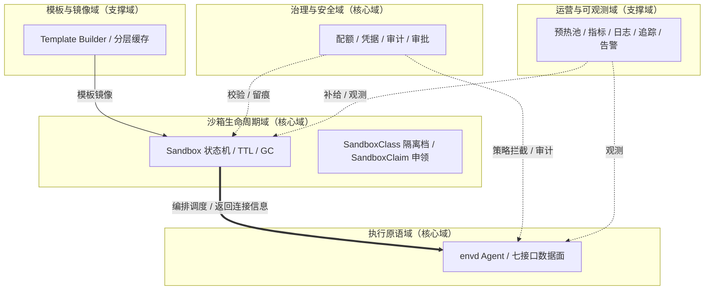

### 2.2 领域关系映射

#### 2.2.1 限界上下文清单

| 限界上下文 | 对应业务域 | 域类型 | 覆盖的核心业务实体 | 上下文边界（属于本域 vs 不属于） |
| --- | --- | --- | --- | --- |
| SandboxLifecycle-BC | 沙箱生命周期域 | 核心域 | `Sandbox` / `SandboxClass` / `SandboxClaim` / `SandboxWarmPool` / `SandboxPhase` | 属于：实例状态机、隔离档、申领、预热池；不属于：文件读写、命令执行 |
| Execution-BC | 执行原语域 | 核心域 | `FileSystem` / `Subprocess` / `Pty` / `CodeContext` / `NetworkPolicy` | 属于：七接口数据面语义；不属于：Pod 调度、TTL |
| TemplateImage-BC | 模板与镜像域 | 支撑域 | `SandboxTemplate` / `OciImage` / `TemplateTag` | 属于：模板定义、镜像分层；不属于：实例运行态 |
| Governance-BC | 治理与安全域 | 核心域 | `OwnerQuota` / `AuditEvent` / `ApprovalRequest` / `CredentialPolicy` | 属于：配额计账、审计留痕、审批、凭据剥离；不属于：实例编排 |
| Observability-BC | 运营与可观测域 | 支撑域 | `Metric` / `LogRecord` / `TraceSpan` / `AlertRule` | 属于：指标/日志/追踪/告警；不属于：业务执行语义 |

**域类型说明**：核心域（自研投入最多，护城河）；支撑域（可自研可外采）；通用域（优先复用）。

#### 2.2.2 上下文映射（Context Mapping）

| 关系编号 | 上游上下文 | 下游上下文 | 关系模式 | 同步方式 | 选择理由 |
| --- | --- | --- | --- | --- | --- |
| C-01 | SandboxLifecycle-BC | Execution-BC | Customer/Supplier | API 同步（创建 / 销毁）+ 状态回调（Ready 事件） | 生命周期编排驱动执行环境的创建/销毁，执行方需求（流式/取消/连接信息）反向影响生命周期接口迭代 |
| C-02 | 外部 OCI 镜像仓库 | TemplateImage-BC | ACL 防腐层 | API + 适配器 | 外部镜像模型（OCI Manifest/层）不污染本域，经 `OciImageRef` 防腐层转换 |
| C-03 | SandboxLifecycle-BC | Governance-BC | Shared Kernel | 共享 DTO / 枚举（SandboxPhase/ownerId/tenantId） | 生命周期状态与治理校验必须强一致，共享稳定公共概念 |
| C-04 | e2b 七接口事实标准 | SandboxLifecycle-BC / Execution-BC | Conformist | 直接遵循对方模型 | 无议价能力的强势事实标准，本系统顺从其接口命名空间 |
| C-05 | Governance-BC | 审计系统 / 可观测栈 | Published Language | 消息事件 / 标准 Schema | 审计事件以标准 Schema 对外发布，审计系统、安全 SOC、可观测多个下游共同消费 |

**关系模式说明**：Customer/Supplier（下游影响上游节奏）；Conformist（顺从强势上游）；ACL（外部模型不污染本域）；Shared Kernel（共享稳定公共概念，慎用）；Published Language（多下游消费标准事件）；Open Host Service（上游 RPC 标准接口，本系统未采用）。

#### 2.2.3 跨域协作原则

| 原则编号 | 原则 |
| --- | --- |
| P-01 | 核心域 → 支撑域：禁止反向依赖（生命周期域不依赖可观测域内部模型） |
| P-02 | 核心域之间：禁止直接耦合，通过 API / 事件解耦（生命周期域与执行域经 gRPC 直连，治理域经事件/枚举共享） |
| P-03 | 对接外部不可控系统：必须建 ACL 防腐层（OCI 镜像仓库、e2b 事实标准） |

### 2.3 详细业务架构

> **图示源文件说明**：§2.3.1 / §2.3.2 表中「源文件位置」列的 `docs/uml/*.puml` 为 PlantUML 可选产出、**不入库**；本文档以内嵌 Mermaid 图为准（核心流程覆盖率与异常分支均以内嵌图为准）。如需 PlantUML 源文件，由 diagrams-generator 按内嵌图导出，不作为交付依赖。

#### 2.3.1 用例图

| 编号 | 用例图标题 | 涉及业务域 | 源文件位置 |
| --- | --- | --- | --- |
| UC-01 | Agent Runtime 使用沙箱执行代码 | 执行原语域 | `docs/uml/uc-01-agent-exec.puml` |
| UC-02 | Platform Engineer 声明式管理沙箱 | 沙箱生命周期域 | `docs/uml/uc-02-platform-lifecycle.puml` |
| UC-03 | Security 审计与审批 | 治理与安全域 | `docs/uml/uc-03-governance.puml` |

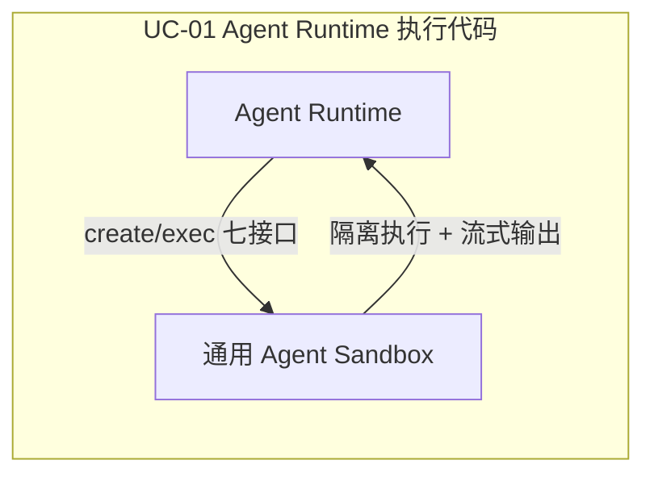

#### 2.3.2 业务流程图（角色泳道图，覆盖核心业务 ≥ 80%）

| 流程编号 | 流程名 | 起点 | 终点 | 涉及业务域 | 源文件位置 |
| --- | --- | --- | --- | --- | --- |
| BF-01 | 沙箱创建主链路 | Agent 选模板 | 返回 sandboxId+连接信息 | 生命周期域/执行域/模板域 | `docs/uml/bf-01-create.puml` |
| BF-02 | 命令执行流式输出 | SDK 发起 commands.run | 流式返回 stdout/stderr | 执行原语域 | `docs/uml/bf-02-exec.puml` |
| BF-03 | TTL 到期回收 | TTL 定时器触发 | 沙箱 Draining→Deleted | 生命周期域 | `docs/uml/bf-03-ttl-gc.puml` |

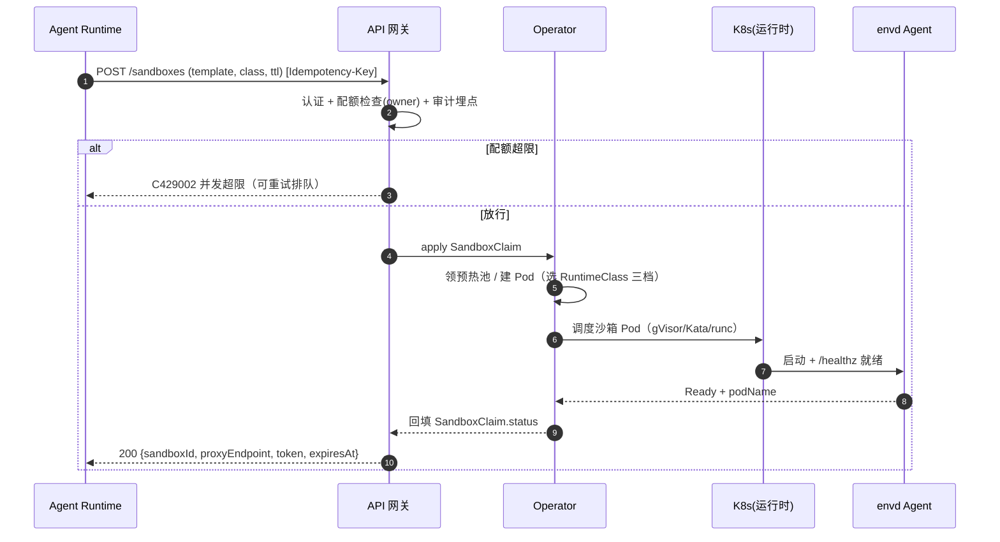

### 2.4 业务范围与边界

#### 2.4.1 功能模块清单

| 编号 | 一级功能名 | 子功能描述 | 对应业务域 | 实现状态 |
| --- | --- | --- | --- | --- |
| F1 | 沙箱生命周期 | — | 沙箱生命周期域 | — |
| F1.1 | — | 声明式创建/状态机（Pending→Provisioning→Ready→Draining→Deleted） | 沙箱生命周期域 | 完整实现 |
| F1.2 | — | 就绪探活（Pod Ready + agent /healthz 双探活） | 沙箱生命周期域 | 完整实现 |
| F1.3 | — | TTL 到期回收 + 孤儿 GC | 沙箱生命周期域 | 完整实现 |
| F2 | 隔离与硬化 | — | 治理与安全域 | — |
| F2.1 | — | 三档隔离（runc 可信/gVisor 不可信默认/Kata 强隔离） | 治理与安全域 | 完整实现 |
| F2.2 | — | 容器硬化（runAsNonRoot/readOnlyRootfs/drop ALL/seccomp） | 治理与安全域 | 完整实现 |
| F3 | 七接口执行原语 | — | 执行原语域 | — |
| F3.1 | — | lifecycle/files/commands/process/pty 核心接口 + 流式输出 | 执行原语域 | 完整实现 |
| F3.2 | — | network/code-interpreter 接口 | 执行原语域 | 完整实现 |
| F4 | 治理 | — | 治理与安全域 | — |
| F4.1 | — | 资源配额 + 出站白名单 + 入站隔离 | 治理与安全域 | 完整实现 |
| F4.2 | — | 凭据剥离 + 显式转发可审计 | 治理与安全域 | 完整实现 |
| F4.3 | — | 审计日志 + 人在环审批 | 治理与安全域 | `[简化]` MVP 仅审计事件落库，审批流完整版启用；审批拦截点见 §3.2.M1.6（沙箱级为主拦截点） |
| F5 | 运营 | — | 运营与可观测域 | — |
| F5.1 | — | 预热池补给/裁剪 | 运营与可观测域 | `[MOCK]` MVP 按需建（领池短路），完整版启用 SandboxWarmPool |
| F5.2 | — | 指标/日志/追踪/告警 | 运营与可观测域 | 完整实现（可观测 P1 延后，但骨架 MVP 建全） |

**In-Scope（本期范围内）**：

| 编号 | 本期必做的事项 |
| --- | --- |
| F1 | 声明式沙箱生命周期管理（CRD + 状态机 + TTL/GC） |
| F2 | 三档隔离 + 容器硬化（gVisor 默认，Kata 可选） |
| F3 | 七接口执行原语 + 流式输出 + 取消传播 |
| F4 | 治理（配额/网络白名单/凭据剥离/审计事件） |
| F5 | 预热池骨架 + 可观测骨架 |
| N1 | 非功能：支撑 1000 个并发沙箱实例 |
| N2 | 非功能：多租户隔离（租户级 namespace + 配额 + RBAC） |

**Out-of-Scope（本期不做）**：

| 编号 | 不做的事项 | 不做的原因 | 未来归属 |
| --- | --- | --- | --- |
| O1 | GPU 沙箱（VFIO/GPU 节点池） | 依赖 GPU 硬件，MVP/完整版不具备 | 增强版 |
| O2 | Firecracker 极简 serverless 档 | 与三档分层可后续扩展 | 增强版 |
| O3 | 机密计算（Kata CoCo SEV-SNP/TDX） | 依赖特殊硬件与合规场景 | 增强版 |
| O4 | 托管 SaaS / 计费 / 多租户账单 | 自建内部执行底座，计费由上层承担 | 永不做 |
| O5 | 会话 fork/resume + 暂停恢复（US-31/32） | 依赖 Snapshot 与 microVM 内存快照 | 增强版 |

### 2.5 质量与柔性可用

#### 2.5.1 服务质量目标

| 优先级 | 质量目标 | 业务驱动 | 受影响的关键章节 |
| --- | --- | --- | --- |
| Q1 | 安全隔离（不可信代码 100% 落入隔离档） | 合规底线（痛点 P1） | §3.2.M2 / §7 |
| Q2 | 低延迟就绪（P95 ≤ 500ms 预热 / ≤ 3s 冷） | 用户体验阈值（痛点 P2） | §3.2.M2 / §3.2.M4 |
| Q3 | 高可用（控制面 99.9%） | 对外 SLA 承诺 | §5.2 / §5.3 |
| Q4 | 可扩展（1000 并发，隔离层内存 ≤ 15GB） | 成本可控（痛点 P3） | §5.5 / §4.4 |
| Q5 | 合规（审计 append-only 不可篡改） | 法规要求 | §7 / §4.2 |

**可验证质量场景**：

| 场景编号 | 关联目标 | 触发源 | 触发条件 | 期望响应 | 度量指标 |
| --- | --- | --- | --- | --- | --- |
| QS-01 | Q1 | 不可信代码执行 | 用户上传代码创建沙箱 | 100% 落入 gVisor/Kata 档 | 隔离覆盖率 = 100% |
| QS-02 | Q2 | 用户创建沙箱 | 1000 并发创建请求 | 预热命中就绪 | P95 ≤ 500ms |
| QS-03 | Q3 | 单 AZ 故障 | 任一 AZ 节点全部宕机 | 自动切换备用 AZ | RTO ≤ 5min；错误率峰值 ≤ 1% |
| QS-04 | Q4 | 业务增长 | 1000 并发沙箱同时活跃 | 隔离层内存不失控 | ≤ 15GB（gVisor 档） |

#### 2.5.2 业务柔性可用策略

**业务功能优先级分层**：

| 层级 | 关联功能（F-xx） | 含义 | 故障态处置 |
| --- | --- | --- | --- |
| L0 核心业务 | F1 / F3 | 沙箱创建与执行（生命线） | 不降级，优先保障 |
| L1 重要业务 | F2 / F4 | 隔离硬化与治理 | 限流 + 排队 |
| L2 辅助业务 | F5.2 | 可观测 | 返回兜底/降采样 |
| L3 附加业务 | F5.1 | 预热池（增强） | 关闭 + 降级为按需建 |

**业务降级清单**：

| 编号 | 关联功能（F-xx） | 触发条件 | 降级动作 | 用户感知 | 决策类型 |
| --- | --- | --- | --- | --- | --- |
| BD-01 | F5.1 | 预热池耗尽 / 节点不足 | 领池短路，转为按需建（冷启动 ≤ 3s） | 沙箱创建变慢（冷启动） | 自动 |
| BD-02 | F5.2 | 指标量超阈值 / 存储压力 | 指标降采样 50% / 日志冷存降级 | 面板刷新变慢 | 自动 |
| BD-03 | F4.3 | 审计存储不可用 | 审计事件写 envd 持久化 outbox（本地卷）+ audit-collector 侧 spill 落盘，durable ACK 确认后删除；collector 故障时沙箱销毁前 flush 未完成 → 阻止销毁并告警 AL-11（合规模式） | 执行不阻塞（审计最终一致，durable ACK 保证不丢） | 自动 |

---

## 3. 应用架构

### 3.1 应用架构概览

#### 3.1.1 系统上下文

| 节点类型 | 节点名 | 与本系统的关系 | 关系语义 |
| --- | --- | --- | --- |
| 角色 | Agent Runtime（agent 开发者） | 使用 | SDK/CLI 调用七接口创建/执行沙箱 |
| 角色 | Platform Engineer | 使用 | kubectl/管理端 apply CRD 声明式管理 |
| 角色 | Security / Compliance | 使用 | 审计查询 / 审批 / 隔离档配置 |
| 角色 | OPS / SRE | 使用 | 监控面板 / 告警 / 容量规划 |
| 上游平台 | E-01 容器镜像仓库 | 推送 → 本系统 | 模板镜像 / agent 镜像拉取 |
| 外部系统 | E-02 对象存储 | 双向调用 | 快照/Volume 持久化、审计冷存 |
| 外部系统 | E-03 审计系统 | 本系统 → 推送 | 生命周期+执行审计事件（append-only） |
| 下游平台 | E-04 可观测平台 | 本系统 → 推送 | 指标/日志/追踪 |
| 复用底座 | E-05 Kubernetes 集群 | 复用 | CRD/RuntimeClass/NetworkPolicy/CSI/RBAC |

#### 3.1.2 系统模块图

| 层次 | 内容 | 数据来源 |
| --- | --- | --- |
| 接入层 | SDK / CLI（七接口客户端）、kubectl / 管理端（CRD 声明式）、监控 / 审计面板 | §2.3 用例图角色 |
| 应用层 | M1 Sandbox API 网关、M2 Sandbox Controller、M3 envd Agent、M4 预热池管理器、M5 Template Builder、M6 Snapshot/Volume 服务、M7 audit-collector | §2.1 / §3.2 |
| 中间件层 | PostgreSQL / MySQL（C-01）、Redis（C-02）、对象存储（C-03）、Prometheus（C-04）、Loki（C-05）、Tempo（C-06）、etcd（K8s 内嵌） | §3.1.3 云组件清单 |
| 集成对接层 | 镜像仓库（E-01）、对象存储（E-02）、审计系统（E-03）、可观测平台（E-04）、K8s（E-05） | §3.1.3 外部依赖清单 |

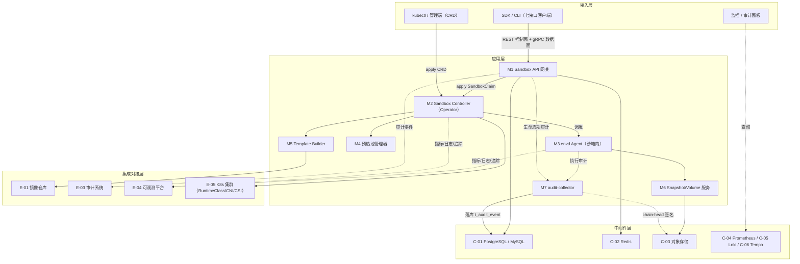

#### 3.1.3 集成架构

##### 外部依赖清单

| ID | 外部系统 | 归属团队 / 供应商 | 类别 | 使用方式 | 集成方式 | 协议 / 版本 | 功能定位（≤ 30 字） | 联系人 |
| --- | --- | --- | --- | --- | --- | --- | --- | --- |
| E-01 | 容器镜像仓库（Harbor） | 平台基础设施团队 | 第三方业务平台 | 消费 | containerd 拉取 | OCI v1.1 | 模板/agent 镜像分层缓存拉取 | `@平台基建` |
| E-02 | 对象存储（MinIO/S3 兼容） | 平台基础设施团队 | 第三方业务平台 | 双向 | SDK + S3 API | S3 v4 | 快照/Volume/审计冷存 | `@平台基建` |
| E-03 | 审计系统 | 安全合规团队 | 监控审计 | 生产 | 审计日志推送 | append-only 事件流 | 生命周期+执行审计留痕 | `@安全合规` |
| E-04 | 可观测平台 | OPS 团队 | 监控审计 | 生产 | OTLP / 指标抓取 / 日志采集 | OTLP v1.x | 指标/日志/追踪汇聚 | `@OPS` |
| E-05 | Kubernetes 集群 | 自建 | 第三方业务平台 | 双向 | K8s 原生 API | K8s 1.29 | CRD/RuntimeClass/CNI/CSI/RBAC 底座 | `@平台基建` |

##### 云组件 / 基础设施清单

| ID | 组件类别 | 选型 | 部署形态 | 规格量级 | 容量预估 | 提供方 / SLA | 用途 |
| --- | --- | --- | --- | --- | --- | --- | --- |
| C-01 | 关系型数据库 | PostgreSQL 16 / MySQL 8.0 | 主从（1 主 2 从） | 4C16G × 3 | 审计 100 万条/日 / 100 QPS | 自建；99.95% | 审计事件/配额计账/审批 |
| C-02 | 缓存 | Redis 7.2 | 哨兵（1 主 2 从 3 哨兵） | 4C8G | 10 万 Key / 5k QPS | 自建 | 配额计数/限流/幂等/分布式锁 |
| C-03 | 对象存储 | MinIO（S3 兼容） | 多 AZ（4 节点） | — | 快照/审计冷存，容量随增 | 自建 | 快照/Volume/审计冷存 |
| C-04 | 指标监控 | Prometheus 2.52 | 单集群 | 4C16G | 50 万 series | 自建 | 指标采集/告警 |
| C-05 | 日志 | Loki 3.0 | 单集群（多租户） | 4C16G | 500GB/日 | 自建 | 日志汇聚/检索 |
| C-06 | 链路追踪 | Tempo 2.5 | 单集群 | 4C8G | 1% 采样 + 错误 100% | 自建 | 分布式追踪 |
| C-07 | 容器编排 | Kubernetes 1.29 | 多 AZ | 自建（节点按需） | 1000 并发沙箱 Pod | 自建 | 服务部署/调度 |
| C-08 | 密钥管理 | HashiCorp Vault 1.16 | 主备 | 2C4G | 证书/密钥托管 | 自建 | mTLS 证书/密钥托管 |

##### 组件依赖关系

| 业务模块（§3.2） | 依赖的外部系统（E-xx） | 依赖的云组件（C-xx） | 故障传导风险 |
| --- | --- | --- | --- |
| M1 Sandbox API 网关 | E-03, E-04 | C-01, C-02 | C-02（Redis）不可用 → readyz 仍返 200，配额检查走 DB 权威条件更新（fail-closed 不靠滞后缓存）；C-01（DB）不可用 → 配额/幂等 fail-closed 返回系统错误，审计事件缓存异步补投 |
| M2 Sandbox Controller | E-05 | C-01 | E-05（K8s）不可用 → 沙箱创建/回收不可用（核心链路 L0）；C-01（DB）不可用 → 配额 DECR 降级为异步重试（对账 Job 兜底校正 DB current_count） |
| M3 envd Agent | E-04 | — | E-04 不可用 → 数据面指标/日志缺失（执行本身不受影响） |
| M4 预热池管理器 | E-05 | C-02 | E-05 不可用 → 领池失败，降级按需建 |
| M5 Template Builder | E-01 | C-03 | E-01 不可用 → 新模板构建失败（存量模板不受影响） |
| M6 Snapshot/Volume 服务 | E-02 | C-03 | E-02 不可用 → 快照/Volume 保存失败（执行不受影响） |
| M7 audit-collector | E-04 | C-01 | C-01（DB）不可用 → 审计事件 durable 缓冲 + 指数退避重投（不影响执行）；审计哈希链写入暂停 |

#### 3.1.4 工程结构

```
agent-sandbox-platform/
├── backend/                          # 后端工程根目录（Go monorepo）
│   ├── common/                       # 公共模块：DTO / Enum / Exception / Constants / errors
│   │   ├── dto/                      #   共享 DTO（SandboxConnectionInfo 等）
│   │   ├── enums/                    #   共享枚举（SandboxPhase / EgressPolicy / RuntimeClass）
│   │   ├── errs/                     #   全局错误码（6 位）
│   │   └── telemetry/                #   traceId/tenantId 透传
│   ├── apiserver/                    # M1 Sandbox API 网关（REST/OpenAPI）
│   │   ├── handler/                  #   七接口控制面 handler
│   │   ├── auth/                     #   认证 + 配额 + 审计埋点
│   │   └── client/                   #   K8s client / PostgreSQL / MySQL / Redis 客户端
│   ├── operator/                     # M2 Sandbox Controller（Operator）
│   │   ├── controllers/              #   Sandbox/SandboxClass/SandboxClaim reconcile
│   │   ├── api/v1alpha1/             #   CRD 类型定义（sandbox.platform.io）
│   │   └── runtime/                  #   三档隔离调度（RuntimeClass seam）
│   ├── envd/                         # M3 envd Agent（沙箱内数据面，独立二进制）
│   │   ├── proto/                    #   七接口 gRPC protobuf 定义
│   │   ├── fs/                       #   文件读写 + 原子写 + version guard
│   │   ├── subprocess/               #   进程树/PTY/流式输出
│   │   └── codeinterp/               #   多语言 REPL
│   ├── warmpool/                     # M4 预热池管理器（P1 完整版）
│   ├── template-builder/             # M5 Template Builder
│   ├── snapshot/                     # M6 Snapshot/Volume 服务
│   └── pkg/                          # 内部公共包（acl/oci 防腐层、runtime seam）
└── frontend/                         # 前端工程根目录
    ├── console/                      # 管理控制台（Platform Engineer/OPS/Security）
    │   ├── src/
    │   │   ├── api/                  #   接口封装（对齐 §3.2 接口清单）
    │   │   ├── stores/               #   全局状态
    │   │   ├── pages/                #   沙箱列表/详情/监控/审计/SandboxClass 配置
    │   │   ├── components/           #   跨页面通用组件
    │   │   ├── types/                #   TS 类型定义
    │   │   └── routes.tsx            #   路由配置
    │   └── package.json
    └── sdk/                          # SDK 客户端（Python + Go，对齐 e2b 形态）
        ├── python/                   #   Python SDK（sandbox-sdk）
        └── go/                       #   Go client
```

#### 3.1.5 技术选型（版本约束）

| 技术分类 | 选型 | 版本 | 备注 / 选型理由 |
| --- | --- | --- | --- |
| 后端语言（控制面） | Go | 1.22 | K8s 生态原生、单二进制、低内存；对比 Java（重）/Python（性能） |
| Operator 框架 | controller-runtime | v0.18.2 | K8s SIG 标准 reconcile 框架，对标 agent-sandbox 同栈；对比自研 controller 循环 |
| 后端框架（API 网关） | Gin | v1.10.0 | 轻量 HTTP 中间件齐全、性能高；对比 Echo（生态略弱）/自研 net/http |
| 数据面 RPC | gRPC + protobuf | grpc v1.64.0 / proto3 | 双向流 stdio/pty 必需（真流式）；对比 WebSocket 轮询（非真流，e2b 模式） |
| 沙箱内 agent | Go | 1.22 | 单二进制进沙箱、低内存开销；对比 Python agent（依赖重） |
| 对象模型 | Kubernetes | 1.29 | 稳定 API + RuntimeClass + Pod Overhead 支持三档隔离 |
| 容器运行时 | containerd | 1.7.x | gVisor/Kata 经 containerd shim 接入，无需换 CRI |
| 隔离运行时（默认） | gVisor（runsc） | release-20240805.0（minimum） | 用户态内核 systrap 无需 KVM，~15MB/实例；对比 Kata（需 KVM 重）；gVisor 采用 release-YYYYMMDD.N 命名（无 semver major/minor 概念），版本策略：锁定具体 release tag，安全补丁跟随上游 release 公告升到更新的 release-YYYYMMDD.N，升级前过 CI 兼容性回归 |
| 隔离运行时（强隔离） | Kata Containers | 3.6.0（Dragonball） | Rust 重写 microVM，近 100% 兼容；对比 Firecracker（功能少）；启动时延 ~150ms 为硬件强相关实测（需 KVM），实测环境：Intel Xeon 可扩展（KVM/AVX2 使能）+ NVMe SSD + 8C32G 节点、warm boot 中位数；无 KVM 环境自动回退 gVisor；SLA 承诺以目标环境实测为准 |
| 隔离运行时（可信） | runc | 1.1.x | 可信代码高频低延迟 |
| CNI | Calico | v3.28 | NetworkPolicy 成熟通用；对比 Cilium（eBPF 更强但重） |
| 关系型存储 | PostgreSQL / MySQL | 16 | 审计检索 + 事务强一致；对比纯 etcd（见 §4 说明，已按中间确认裁决：同时支持 PG/MySQL，部署二选一） |
| 缓存 | Redis | 7.2 | 配额计数/限流/幂等/分布式锁 |
| 对象存储 | MinIO（S3 兼容） | RELEASE.2024 | 自建通用不绑云；生产可平滑替换 S3/COS/OSS |
| 指标监控 | Prometheus | 2.52 | K8s 事实标准 |
| 日志 | Loki | 3.0 | 与 Prometheus 标签模型一致，低运维 |
| 链路追踪 | Tempo + OpenTelemetry Collector | 2.5 / 0.102 | OTLP 原生，W3C TraceContext |
| mTLS | cert-manager | 1.14 | K8s 证书自动签发/轮转 |
| 密钥管理 | HashiCorp Vault | 1.16 | mTLS 证书 + per-sandbox secret 托管 |
| 镜像仓库 | Harbor | v2.11 | 自建镜像签名 + 漏洞扫描 |
| SDK（客户端） | Python | 3.10+ | 对齐 e2b SDK 事实标准形态 |

---

### 3.2 模块详细设计

#### 3.2.1 模块公共约束（Common）

| 约束项 | 取值 |
| --- | --- |
| 接口路径风格 | RESTful（控制面）+ gRPC（数据面），二选一并锁定 |
| 协议 | HTTP/gRPC 同步 + 审计事件异步 |
| 数据格式 | JSON（REST）/ Protobuf（gRPC） |
| 字符编码 | UTF-8 |

**通用基础结构**（Go，包路径 `agent-sandbox-platform/backend/common/`）：

| 基类 / 结构 | 用途 | 包路径 |
| --- | --- | --- |
| `Result[T]` | 统一返回结构（含 code/msg/data/traceId） | `common/dto` |
| `PageRequest` / `PageResponse[T]` | 分页请求/响应 | `common/dto` |
| `SandboxPhase` | 沙箱状态枚举（Pending/Provisioning/Ready/Draining/Deleted/Failed） | `common/enums` |
| `RuntimeClass` | 隔离档枚举（runc/gVisor/Kata） | `common/enums` |
| `ErrorCode` | 6 位全局错误码 | `common/errs` |

#### 3.2.2 模块清单与编号规则

| 编号 | 模块名 | 业务域（§2.1） | 模块负责人 | 关联子领域 |
| --- | --- | --- | --- | --- |
| M1 | Sandbox API 网关 | 沙箱生命周期域（接入）/ 治理域 | `@平台基建` | 认证/配额/七接口控制面 |
| M2 | Sandbox Controller（Operator） | 沙箱生命周期域 | `@平台基建` | CRD reconcile/状态机/TTL/GC/调度 |
| M3 | envd Agent（沙箱内） | 执行原语域 | `@Agent平台` | 七接口数据面/文件/进程/PTY |
| M4 | 预热池管理器 | 运营与可观测域 | `@平台基建` | 池补给/裁剪/领用 |
| M5 | Template Builder | 模板与镜像域 | `@Agent平台` | 模板构建/分层缓存 |
| M6 | Snapshot/Volume 服务 | 执行原语域（状态保存） | `@平台基建` | 快照/持久卷/暂停恢复 |
| M7 | audit-collector（受信审计收集器） | 治理与安全域 | `@安全合规` | 执行审计接收 / workload identity 鉴权 / durable ACK / 哈希链写入 |

#### 3.2.3 单模块设计模板（五段式）

> 说明：每个模块在 §3.2.M{N} 下按五段式展开：`.1 模块概述` / `.2 接口清单` / `.3 关键结构定义（DTO）` / `.4 模块逻辑时序图` / `.5 关键流程逻辑`。跨模块共享约束见 §3.2.1，各模块下只体现不重复声明。

---

#### 3.2.M1 Sandbox API 网关

##### §3.2.M1.1 模块概述

`Sandbox API 网关` 模块是控制面唯一入口，覆盖「沙箱创建/查询/销毁」「七接口控制面路由」「认证+配额+审计埋点」场景，业务逻辑在 `Agent Runtime`、`Platform Engineer` 之间流动，涉及 `K8s 集群（E-05）`、`审计系统（E-03）`、`PostgreSQL / MySQL（C-01）`、`Redis（C-02）` 的数据流动。网关不代理数据面流量（控制面/数据面分离），SDK 经网关获取连接信息后经 envd-proxy 接入 envd Agent（统一 PROXY，见 §6.3.1）。

##### §3.2.M1.2 接口清单

| 子领域 | 方法 | 路径 | 用途（≤ 20 字） | 请求 DTO | 响应 VO | 幂等 |
| --- | --- | --- | --- | --- | --- | --- |
| lifecycle | POST | `/api/v1/sandboxes` | 创建沙箱 | `SandboxCreateRequest` | `SandboxVO` | 是（X-Idempotency-Key） |
| lifecycle | GET | `/api/v1/sandboxes` | 列表沙箱（按 phase/owner） | — | `SandboxListVO` | 天然 |
| lifecycle | GET | `/api/v1/sandboxes/{id}` | 查询沙箱详情 | — | `SandboxDetailVO` | 天然 |
| lifecycle | DELETE | `/api/v1/sandboxes/{id}` | 销毁沙箱（kill） | — | `Result` | 天然 |
| lifecycle | POST | `/api/v1/sandboxes/{id}/timeout` | 续期/设置 TTL | `SandboxTimeoutRequest` | `SandboxVO` | 是（id+version） |
| lifecycle | POST | `/api/v1/sandboxes/{id}/pause` | 挂起（完整版） | — | `SandboxVO` | 是（id+version） |
| lifecycle | POST | `/api/v1/sandboxes/{id}/resume` | 恢复（完整版） | — | `SandboxVO` | 是（id+version） |
| files | POST | `/api/v1/sandboxes/{id}/files/upload-url` | 大文件上传直传签名 | `UploadUrlRequest` | `UploadUrlVO` | 天然 |
| files | POST | `/api/v1/sandboxes/{id}/files/download-url` | 大文件下载直传签名 | `DownloadUrlRequest` | `DownloadUrlVO` | 天然 |
| 治理 | GET | `/api/v1/classes` | 隔离档列表 | — | `SandboxClassListVO` | 天然 |
| 治理 | POST | `/api/v1/classes` | 创建隔离档（PE） | `SandboxClassCreateRequest` | `SandboxClassVO` | 是（biz_id） |
| 治理 | POST | `/api/v1/approvals/{id}/decision` | 审批决策（完整版） | `ApprovalDecisionRequest` | `Result` | 是（id+version） |

##### §3.2.M1.3 关键结构定义（DTO）

```go
// SandboxCreateRequest 创建沙箱请求
type SandboxCreateRequest struct {
    // ===== 必填字段 =====
    TemplateRef string            `json:"templateRef"`   // 沙箱模板引用（SandboxTemplate.name）
    ClassRef    string            `json:"classRef"`      // 隔离档引用（SandboxClass.name）
    // ===== 可选字段 =====
    OwnerID     string            `json:"ownerId"`       // 属主（配额计账维度）；仅授权委托角色可覆盖，否则从认证身份派生并忽略请求值
    Resources   ResourceSpec      `json:"resources"`     // CPU/内存覆盖（默认取 class/template）
    Workspace   WorkspaceSpec     `json:"workspace"`     // 工作区卷（storageClass+size）
    Network     NetworkSpec       `json:"network"`       // egress(Restricted/Full)+allowedEgress
    TTLSeconds  int64             `json:"ttlSeconds"`    // 生命周期时长，默认 1800
    // ===== 扩展字段 =====
    Env         map[string]string `json:"env"`           // 显式转发环境变量（凭据经审计）
}

// SandboxDetailVO 沙箱详情
type SandboxDetailVO struct {
    SandboxID    string          `json:"sandboxId"`    // 唯一标识
    Phase        string          `json:"phase"`        // 枚举：Pending/Provisioning/Ready/Draining/Deleted/Failed
    ClassRef     string          `json:"classRef"`     // 隔离档
    TemplateRef  string          `json:"templateRef"`  // 模板
    OwnerID      string          `json:"ownerId"`      // 属主
    Connection   ConnectionInfo  `json:"connection"`   // 代理入口 + sandboxId（无凭证，可安全展示）
    Credential   CredentialEnvelope `json:"credential"` // 一次性凭证（约 120s 有 scope 的签名 JWT，scope=commands/process/pty/files，不含 SetEgress；不落展示）
    ExpiresAt    string          `json:"expiresAt"`    // TTL 到期时间
}
```

| DTO / VO 名 | 字段名 | 类型 | 必填 | 业务含义 | 约束 / 默认值 |
| --- | --- | --- | --- | --- | --- |
| `SandboxCreateRequest` | `templateRef` | String | 是 | 模板引用 | 必须存在 |
| `SandboxCreateRequest` | `classRef` | String | 是 | 隔离档引用 | 必须存在，枚举见 SandboxClass |
| `SandboxCreateRequest` | `ownerId` | String | 否 | 属主 | 默认从认证身份派生；仅委托角色可覆盖，否则忽略请求值防配额绕过 |
| `SandboxCreateRequest` | `ttlSeconds` | int64 | 否 | 生命周期 | 默认 1800 |
| `SandboxDetailVO` | `phase` | String | 是 | 状态 | 枚举：Pending/Provisioning/Ready/Draining/Deleted/Failed |

##### §3.2.M1.4 模块逻辑时序图

| 编号 | 标题 | 场景类别 | 是否包含异常分支 |
| --- | --- | --- | --- |
| SQ-01 | Sandbox API 网关 - 沙箱创建 | 核心实体创建 | 是 |
| SQ-02 | Sandbox API 网关 - 配额超限排队 | 异常/降级 | 是 |

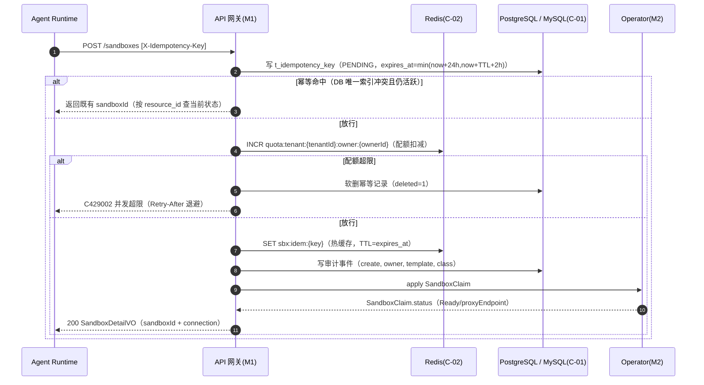

##### §3.2.M1.5 关键流程逻辑

```
触发：POST /api/v1/sandboxes（create）

Step 1: 认证 + 幂等预检（同步）
  ├── 校验：认证身份 → 映射 ownerId + tenantId（ownerId 从认证身份派生；DTO 的 ownerId 仅「委托权限」角色可覆盖，否则忽略请求值防配额绕过与审计污染）
  ├── 校验：classRef/templateRef 存在（查 K8s CRD）
  └── 幂等预检：查 DB `t_idempotency_key`（deleted=0 AND expires_at 晚于 now）→ 命中且资源存活返回既有响应；命中但资源已失效视为 miss

Step 2: 幂等落位 + 配额扣减（同步，正确顺序防双扣）
  ├── ① 同步写 `t_idempotency_key`（PENDING，唯一索引冲突走 upsert；仍活跃未过期 → 返 C409001 处理中 / 返回既有响应；超时 50ms 走 Redis 热缓存兜底软幂等，见 §3.5.4）
  ├── ② 同一事务扣配额：INSERT `t_quota_allocation`（allocation_id=预生成、sandbox_id、status=RESERVED）+ `UPDATE t_owner_quota SET current_count=current_count+1 WHERE tenant_id=? AND owner_id=? AND current_count 低于 concurrent_limit`（影响行数=0 → 回滚返 C429002）；成功后写 Redis 热缓存 quota:tenant:{tenantId}:owner:{ownerId}。**审批场景**：requireApproval 时本步延后到 ALLOWED 后执行（批准前不占配额，见 §3.2.M1.6）
  ├── ③ 写 Redis `sbx:idem:{key}`（热缓存，TTL = expires_at）
  └── 状态变更：SandboxClaim.phase = Pending
  （顺序含义：先落幂等位再扣配额，崩溃时重试会命中幂等位，不会重复扣减双扣配额）

Step 3: 审计埋点（异步，统一经 M7）
  └── 发送 create 事件到 audit-collector（M7）→ M7 落 t_audit_event（M1 不直写）；异步补投可观测平台

Step 4: 委托 Operator 编排（含超时处理 + 幂等终态回填）
  ├── apply SandboxClaim（Claim 名 = 由 (tenantId, idempotencyKey) 确定性生成，如 `sha256(tenantId+idem_key)` 截断；K8s create-only/UID 语义天然防重复，消除 lease fencing 的 TOCTOU 竞态）→ Operator reconcile → 回填连接信息
  ├── 网关等待 SandboxClaim.status Ready 最多 5s（冷启动 SLA 3s + 2s buffer）
  ├── 超时未 Ready → 返回 202 Accepted + sandboxId，客户端轮询 GET /sandboxes/{id} 获取最终状态（避免 Operator 重启窗口内所有创建请求同时失败引发重试雪崩）
  ├── Operator 重启窗口：网关等待期间 Operator 被重启 → 不报 5xx，仍返回 202 + sandboxId，由客户端轮询兜底
  └── 终态回填：apply 成功 → 回填 t_idempotency_key（resource_id=sandboxId、status=SUCCEEDED）；失败 → status=FAILED（可重试）；PENDING 崩溃残留由清理 Job 按 lease 超时接管（见 §4.2.4.5）

Step 5: 配额对账（崩溃恢复，周期 Job + Operator reconcile 双通道）
  ├── 问题：Step 2 ① 幂等位已写但 ② INCR 后、④ apply 前 API 进程崩溃 → Redis 计数可能 +1（泄漏）；1000 并发高负载滚动发布时必然触发
  ├── 对账 Job（每 60s）：记 t0 = 对账开始时刻；按 (tenantId, ownerId) 统计 K8s 中 phase ∈ {Provisioning, Ready} 且 creationTimestamp ≤ t0 的沙箱 Pod 数（label `tenantId` + `ownerId`）= actualCount，与 Redis `quota:tenant:{tenantId}:owner:{ownerId}` 比对（Draining 已按 §3.2.M2.5 提前释放配额、不计入，避免抵消提前 DECR）；校正结果同时写回 DB current_count（权威账本）
  ├── 增量校正（非 SET 覆盖）：delta = actualCount - currentCount，用 INCRBY/DECRBY 增量校正；「creationTimestamp ≤ t0」快照语义排除 t0 之后「已 INCR 但 Pod 未建」的合法 +1，避免抹掉在途创建
  ├── 互斥兜底：对账 Job 与创建流程共享 `sbx:lock:quota:{tenantId}:{ownerId}` 分布式锁（§4.4.3，TTL 5s），对账持锁窗口 ≤ 5s（与 TTL 一致，TTL 作崩溃兜底自动释放），避免与 INCR 交错
  ├── 偏差告警：|delta| ≥ 阈值（默认 2）告警 AL-10（P1），delta 微小（低于 2）静默校正；偏差在下次对账自动收敛
  └── 启动兜底：API 网关 / Operator 重启后触发一次全量对账，避免窗口期累积漂移
```

**token 续期闭环（/timeout 原子签发新 token）**：沙箱 `/timeout` 续期时，网关在延长 TTL 的同时**原子签发新 per-sandbox token**（新 TTL = 新沙箱 TTL），响应返回新 token；旧 token 设短暂重叠窗口（默认 60s，覆盖在飞请求）后撤销失效。SDK 续期成功后立即切换到新 token，避免「沙箱仍 Ready 但 SDK 全 UNAUTHENTICATED」。旧 token 失效规则：重叠窗口后 envd 鉴权拦截器拒绝旧 token（envd 维护短时双 token 白名单，仅新 + 上一个旧 token 有效）。

##### §3.2.M1.6 人在环审批拦截点（控制面/数据面分离下的治理断点闭环）

**问题**：F4.3 声明 pre-execute 审批，但数据面路径是 SDK → envd Agent 直连（不经网关、不经 Operator），审批拦截点必须显式定义，否则形成治理断点。

**拦截点设计（两级，缺省 fail-closed）**：

| 拦截层级 | 拦截位置 | 触发时机 | 是否 MVP 启用 |
| --- | --- | --- | --- |
| 沙箱级（主拦截点） | 控制面网关 M1（POST /sandboxes） | 创建沙箱时，若 classRef/templateRef 标记 `requireApproval` | 是（审批流完整版；MVP 审计落库时即预留标记） |
| 执行级（可选增强） | envd Agent 沙箱内（执行前回调） | 单次 commands.run / process.start 前，若命令标记需审批 | 否（完整版可选启用） |

**沙箱级拦截流程（预生成 allocation_id，同事务绑定幂等与审批，批准前不占配额）**：`requireApproval=true` 时，网关**预生成 allocation_id**，在同一事务内：① 写 `t_idempotency_key`（PENDING，关联 allocation_id）；② 写 `t_approval_request`（PENDING，`sandbox_id` 可空、关联 `idempotency_id` + `allocation_id`）；③ **不扣配额、不建 SandboxClaim**。ALLOWED 后：网关按 allocation_id 扣配额（INSERT `t_quota_allocation` + UPDATE `current_count`，见 §3.2.M1.5 Step 2）+ 建 SandboxClaim + 回填 `sandbox_id`。DENIED/EXPIRED 返回 `A050001`（fail-closed，超时未决由 Job 置 EXPIRED 视为拒绝）。审批决策走 `/api/v1/approvals/{id}/decision`（§3.2.M1.2）。

**DB 不可用时的 fail-closed 边界**：审批创建（写 `t_approval_request`）失败或 DB（C-01）不可达时，一律 fail-closed——返回 `B999001`（系统错误），**不跳过审批直接建沙箱**（与「回调通道不可达 fail-closed」策略一致）。不提供 fail-open（跳过审批）路径，避免治理旁路；DB 恢复后由调用方重试。

**执行级拦截（完整版可选）**：envd Agent 启动时向 API 网关注册并持有一条 mTLS 回调通道；对标记 `requireApproval` 的操作，执行前同步回调网关 `/api/v1/approvals/check`，未 ALLOWED 则拒绝执行并返回 `A050001`。回调通道不可达 / 审批服务不可用时 fail-closed（拒绝执行），保证安全不因数据面直连而旁路。

**边界声明**：MVP 默认「审批仅在创建沙箱时拦截」，不在单次执行时拦截（F4.3 标注 `[简化]`）；执行级审批作为完整版可选能力，需配合 envd 审批门控开关，不在 MVP 数据面引入额外回调延迟。

---

#### 3.2.M2 Sandbox Controller（Operator）

##### §3.2.M2.1 模块概述

`Sandbox Controller` 是控制面核心 Operator，覆盖「Sandbox/SandboxClass/SandboxClaim/WarmPool CRD 声明式生命周期」「三档隔离调度」「TTL/GC/孤儿回收」场景，业务逻辑在 `Platform Engineer`（apply CRD）、`OPS`（GC）之间流动，涉及 `K8s 集群（E-05）` 的 CRD/RuntimeClass/NetworkPolicy/CSI/RBAC 数据流动。核心原则：控制面与数据面分离，Operator 不代理数据流量。

**并发配置（性能硬约束）**：controller-runtime `MaxConcurrentReconciles` 默认 1，200 QPS 下必然积压（单次 reconcile 从 Pending 到 Ready 约 100-200ms，单 worker 每秒仅处理 5-10 次）。要求：SandboxClaim Controller `MaxConcurrentReconciles ≥ 20`（按单次 reconcile P95 ≤100ms 计算）；Sandbox Reconciler ≥ 10；WarmPool Reconciler ≥ 5。并发安全由 Redis 原子计数 + DB 唯一索引 + reconcile 幂等语义（§3.2.M2.5）保证。

##### §3.2.M2.2 接口清单（CRD 声明式，非 HTTP）

| 子领域 | 资源（CRD） | 操作 | 用途（≤ 20 字） | 对应对象 | 幂等 |
| --- | --- | --- | --- | --- | --- |
| 实例 | `Sandbox` | reconcile | 单例 Pod 全生命周期 | O-01 | 是（声明式） |
| 实例 | `SandboxClaim` | reconcile | 消费者申领 → 领池/建 Pod | O-04 | 是（声明式） |
| 隔离档 | `SandboxClass` | reconcile | 三档隔离策略模板 | O-02 | 是（声明式） |
| 预热池 | `SandboxWarmPool` | reconcile | 池补给/裁剪（P1） | O-05 | 是（声明式） |

##### §3.2.M2.3 关键结构定义（CRD spec/status 字段）

| CRD 名 | 字段名 | 类型 | 必填 | 业务含义 | 约束 / 默认值 |
| --- | --- | --- | --- | --- | --- |
| `Sandbox.spec` | `classRef` | String | 是 | 隔离档 | 引用 SandboxClass |
| `Sandbox.spec` | `templateRef` | String | 是 | 模板 | 引用 SandboxTemplate |
| `Sandbox.spec` | `ownerId` | String | 是 | 属主 | 配额计账维度 |
| `Sandbox.spec` | `ttlSeconds` | int64 | 是 | 生命周期 | 默认 1800 |
| `Sandbox.spec` | `network.egress` | String | 是 | 出站策略 | 枚举：Restricted/Full |
| `Sandbox.status` | `phase` | String | 是 | 状态 | 枚举：Pending/Provisioning/Ready/Draining/Deleted/Failed |
| `Sandbox.status` | `podName`/`podIP`/`grpcPort` | String | 否 | 内部路由信息（envd-proxy 转发用，不下发 SDK） | Ready 后回填 |
| `Sandbox.status` | `expiresAt` | String | 是 | TTL 到期 | now + ttlSeconds |
| `SandboxClaim.spec` | `templateRef`/`desiredState`/`ttlSeconds`/`lifecycle` | String/int | 是 | 申领意图 | 引用 SandboxTemplate；lifecycle 语义见下 |
| `SandboxClaim.spec.lifecycle` | `shutdownPolicy`/`ttlSecondsAfterFinished` | String/int | 否 | 沙箱终结策略 | `shutdownPolicy` ∈ Retain/Delete/DeleteForeground（默认 Delete）；`ttlSecondsAfterFinished` 默认 0（对齐附录 A AG-02/AG-05） |
| `SandboxClaim.status` | `phase` | String | 是 | 申领状态 | 枚举：Pending/Provisioning/Fulfilled/Finished/Released/Failed/Deleted |
| `SandboxClaim.status` | `sandboxRef` | String | 否 | 关联 Sandbox 名 | Ready 后回填（§3.2.M2.5 双向引用） |
| `SandboxClaim.status` | `proxyEndpoint` | String | 否 | 连接信息（代理入口 + sandboxId，返回 SDK） | 网关回填（§3.2.M1.5 Step 4） |

##### §3.2.M2.4 模块逻辑时序图

| 编号 | 标题 | 场景类别 | 是否包含异常分支 |
| --- | --- | --- | --- |
| SQ-01 | Sandbox Controller - 创建/领池/建 Pod | 核心实体创建 | 是 |
| SQ-02 | Sandbox Controller - TTL 到期回收 | 异常/回收 | 是 |

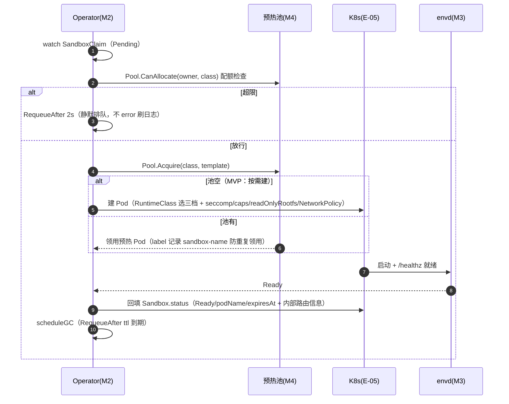

##### §3.2.M2.5 关键流程逻辑（状态机）

**Sandbox 状态机**（实例侧，phase 落 CRD `Sandbox.status`）：

| 起始状态 | 触发事件 | 终止状态 | 触发条件 / 校验 | 副作用 |
| --- | --- | --- | --- | --- |
| Pending | provision | Provisioning | 配额检查通过 + 领池/建 Pod | 回填 podName，RequeueAfter 500ms |
| Provisioning | ready | Ready | Pod Ready + agent /healthz | 回填内部路由信息（podName/podIP/grpcPort 供 proxy 转发），expiresAt=now+ttl |
| Provisioning | fail | Failed | agent health 连续失败 N 次 / 启动超时 | 通知 claim（可重试） |
| Ready | ttl-expire | Draining | TTL 到期 | drain（关闭执行入口 → SIGTERM→grace→SIGKILL）+ 释放配额（执行入口关闭 + 审计 flush 成功后，按 allocation_id 幂等 CAS：t_quota_allocation RESERVED→RELEASED + 聚合 DECR current_count 同事务 + Redis 缓存 DECR） |
| Draining | drained | Deleted | Pod 删除完成 + finalizer 清理 | 物理资源回收（逻辑配额已在 Draining 时释放） |
| Ready | kill | Draining | 用户 DELETE / 孤儿 GC（owner 消失） | drain 流程 + 释放配额（allocation 幂等 CAS + DB DECR + Redis DECR） |
| Failed | retry | Provisioning | 用户/Operator 显式重试（claim 仍可重试） | 重建 Pod，重置 health 计数 |
| Failed | cleanup | Deleted | 超过最大重试次数 / Claim 已删除 | 释放资源，终态 |

**配额释放时机（执行入口关闭 + 审计 flush 成功后释放，防 audit-pending Pod 无限堆积）**：逻辑配额在「执行入口关闭（envd 拒绝新命令）+ 审计 outbox flush 成功」后 DECR（DB 权威 + Redis 缓存），而非 Ready→Draining 转换瞬间——合规模式下 audit flush 未完成会阻止销毁，若在转换瞬间即释放，collector 长时间故障时用户可持续创建新沙箱、旧 Draining Pod 无限堆积占物理资源。物理资源由 K8s 调度器管理，Draining Pod 在 `terminationGracePeriodSeconds`（默认 30s）内仍占节点资源，由 Pod Overhead 与节点容量约束兜底。**audit-pending Pod 熔断**：等待 flush 的 Draining Pod 数量设独立上限（默认 = owner 并发上限的 10%），超限触发熔断拒绝新创建（C429002），避免 collector 故障时 Draining Pod 无限堆积。

**SandboxClaim 状态机**（申领侧，phase 落 CRD `SandboxClaim.status`，与 §3.2.M2.5 绑定语义一致）：

| 起始状态 | 触发事件 | 终止状态 | 触发条件 / 校验 | 副作用 |
| --- | --- | --- | --- | --- |
| Pending | provision | Provisioning | Operator 领池/建 Pod | 回填 sandboxRef（若已建） |
| Provisioning | fulfilled | Fulfilled | Sandbox Ready | 回填 sandboxRef + 连接信息 |
| Provisioning | fail | Failed | 建 Pod 失败（Sandbox Failed） | 通知调用方可重试 |
| Fulfilled | finish | Finished | Sandbox 正常终结（TTL/kill drain 完成） | Claim 可安全清理（对齐 AG-05 finished 清理） |
| Fulfilled | release | Released | Sandbox 被独立删除（反向删除） | Claim 释放并删除 |
| Fulfilled | delete | Deleted | Claim 被删除（经 finalizer 保护窗口） | 保护窗口后级联 drain Sandbox |
| Failed | retry | Provisioning | 用户重试（同 claim） | 重新编排建 Pod |
| Failed | cleanup | Deleted | 超过最大重试 / Claim 删除 | 终态清理 |

**leader 切换 reconcile 幂等语义**：reconcile `Provisioning` 状态的 SandboxClaim / Sandbox 时，先查 K8s Pod（按 `podName` / label `sandbox-name`）是否已存在——已存在则跳过建 Pod、直接进入探活等待（幂等，不重复 create）；不存在才执行建 Pod。create Pod 返回 AlreadyExists 时按「已存在」处理、继续等待探活，不重复走补给逻辑。reconcile 以资源 UID + resourceVersion 判重，leader 切换重放不产生重复副作用。

**孤儿 GC**：SandboxClaim 删除但 Pod 残留 → reconciler 按 label `sandbox.platform.io/sandbox-name` 兜底删除（幂等）。

**SandboxClaim ↔ Sandbox 生命周期绑定**（双向引用 + 级联语义 + 误删孤儿保护，明确 Claim 三态终止语义）：

| 维度 | 取值 |
| --- | --- |
| 双向引用 | Sandbox 通过 `OwnerReference` 指向 SandboxClaim；`SandboxClaim.status.sandboxRef` 指向 Sandbox |
| Claim 生命周期 | `Pending → Provisioning → Fulfilled → Released/Deleted` |
| Claim 终止语义（三态） | `Fulfilled`（Sandbox 已 Ready，Claim 保留作申领凭证，可继续追踪）；`Finished`（Sandbox 生命周期正常终结，Claim 可安全清理）；`Deleted`（Claim 被删除，含人误删）。`Fulfilled ≠ Finished`：Fulfilled 表示「沙箱运行中」，Finished 才是「沙箱已终结、可清理」（对齐附录 A AG-05「finished claim 自动清理」语义，澄清二者非同一状态） |
| Claim 保留语义 | Sandbox Ready 后 Claim 进入 `Fulfilled` 并**保留**（作为申领凭证可追溯），**不立即删除**；Sandbox 正常终结（TTL / kill 完成 drain）后 Operator 将 Claim 置 `Finished` 并清理 |
| 正向删除 | SandboxClaim 删除（含人误删）→ finalizer 拦截，**不直接级联删除 Sandbox**，先走保护窗口（见下） |
| 反向删除 | Sandbox 被独立删除（用户 kill / TTL / 孤儿 GC）→ Operator 将关联 Claim 置 `Released` 并删除（finalizer 保证）；若 Claim 仍 `Pending`（Pod 尚未建成即失败）→ 回填 `Failed`，可重试 |
| 孤儿 GC（反向补齐） | SandboxClaim 残留但 Sandbox 已 Deleted → reconciler 检测 `sandboxRef` 指向的 Sandbox 不存在且 Claim 非终态时，将 Claim 置 `Released` 并清理 |

**误删孤儿保护（finalizer 阻止删除直到清理完成）**：Sandbox 挂 `sandbox.platform.io/finalizer`，防止 Claim 被删除（kubectl delete / 人误操作）时 K8s GC 按 OwnerReference 立即级联删除 Sandbox 而不走 drain。

| 环节 | 取值 |
| --- | --- |
| 触发条件 | Operator reconcile 检测 Sandbox 的 OwnerReference 指向的 Claim 已带 `deletionTimestamp`（Claim 被删）→ 进入孤儿保护流程 |
| finalizer 阻止删除 | Claim 带 deletionTimestamp 后，Sandbox 的 finalizer 阻止其被立即级联删除；K8s 对象设 deletionTimestamp 后**无法取消删除**（只能移除 finalizer 让其真正删除），故不做「取消删除 / 恢复」分支 |
| 清理流程 | Operator 在 `orphanGracePeriod`（默认 30s）内完成正常 drain（SIGTERM→grace→SIGKILL）→ 释放配额（DB 原子 DECR current_count + Redis 缓存 DECR）→ 移除 finalizer 让 Sandbox / Claim 真正删除 |
| 幂等性 | orphan GC 由 reconciler 按 Sandbox UID 判重幂等执行，重复触发无副作用 |

---

#### 3.2.M3 envd Agent（沙箱内数据面）

##### §3.2.M3.1 模块概述

`envd Agent` 是沙箱内数据面 gRPC server，覆盖「七接口执行原语」「流式输出」「进程树终止」「PTY」场景，业务逻辑在 `Agent Runtime`（经 SDK 直连）、`Sandbox Controller`（启动/探活）之间流动，涉及 `隔离运行时（gVisor/Kata/runc）`、`可观测平台（E-04）` 的数据流动。控制面与数据面分离：runtime 经 envd-proxy 连 envd，Operator 不代理。**数据面强制鉴权**：envd 内置 gRPC 鉴权拦截器，七接口调用（除 Health）须携带每沙箱下发的短期身份凭证（per-sandbox token，由网关在连接信息中下发，TTL=沙箱 TTL）；无凭证 / 凭证不匹配直接返回 UNAUTHENTICATED。保证「能访问 Pod CIDR ≠ 能执行沙箱方法」，数据面鉴权不依赖 API 网关代理。**审计上报用独立 workload identity + 不可信边界隔离**：envd 运行在沙箱内**独立容器**（独立 UID / 独立挂载 / 独立 PID namespace，与用户代码容器分离）；Pod 级 `automountServiceAccountToken: false`，仅向 envd 容器投射**限定 audience 的短期凭证**（Projected ServiceAccount Token 或独立 mTLS 证书，audience 限定为 audit-collector），用户进程无法读取该凭证。envd 上报执行审计到 audit-collector 用该 workload identity 认证，**不下发 SDK**、与 per-sandbox token（供 SDK 调 envd）严格区分，防止不可信代码窃取身份伪造审计事件。

##### §3.2.M3.2 接口清单（gRPC，package sandbox.v1）

| 子领域 | RPC | 用途（≤ 20 字） | 请求/响应 | 流式 | 幂等 |
| --- | --- | --- | --- | --- | --- |
| lifecycle | `Health` | 健康检查 /healthz | `HealthRequest/HealthResponse` | 否 | 天然 |
| files | `ReadText`/`WriteText`/`EditText` | 文件读写/原子编辑 | `FileRequest/FileResponse` | 否 | 是（version guard） |
| files | `ListDir`/`Stat`/`Lstat` | 列目录/元数据 | `StatRequest/StatResponse` | 否 | 天然 |
| files | `WatchDir` | 目录监听 | `WatchRequest` | 是（服务端流） | 天然 |
| commands | `Run` | 跑命令流式输出 | `CommandRequest` | 是（双向流） | 否 |
| process | `Start`/`Connect`/`SendInput`/`Signal` | 进程启动/连接/信号 | `ProcessRequest/ProcessFrame` | 是（双向流） | 否 |
| pty | `Create`/`SendInput`/`Resize`/`Kill` | 交互式终端 | `PtyRequest/PtyFrame` | 是（双向流） | 否 |
| network | `GetHost` | 网络主机查询（出站管控走控制面 SandboxClass，不在数据面） | `NetworkRequest/NetworkResponse` | 否 | 天然 |
| code-interpreter | `RunCode`/`CreateCodeContext` | 有状态 REPL | `CodeRequest/CodeResponse` | 是 | 否 |

##### §3.2.M3.3 关键结构定义（protobuf）

```proto
// 流式进程帧（oneof 双向流）
message ProcessFrame {
  oneof payload {
    Started started = 1;
    Stdout  stdout  = 2;
    Stderr  stderr  = 3;
    Exited  exited  = 4;   // exitCode + signal + durationMs
  }
}

// 文件写（原子写 + version guard）
message WriteTextRequest {
  string path = 1;
  string content = 2;
  int64  expectedVersion = 3;  // 版本守卫，不匹配返 FS_STALE_VERSION
}
```

| proto 消息 | 字段名 | 类型 | 必填 | 业务含义 | 约束 / 默认值 |
| --- | --- | --- | --- | --- | --- |
| `WriteTextRequest` | `path` | string | 是 | 沙箱内绝对路径 | resolve 成稳定身份 |
| `WriteTextRequest` | `expectedVersion` | int64 | 否 | 版本守卫 | 不匹配返 FS_STALE_VERSION |
| `Exited` | `exitCode`/`signal`/`durationMs` | int32/int32/int64 | 是 | 退出码/信号/时长 | done 带全 |

##### §3.2.M3.4 模块逻辑时序图

| 编号 | 标题 | 场景类别 | 是否包含异常分支 |
| --- | --- | --- | --- |
| SQ-01 | envd Agent - 命令执行流式输出 | 核心动作执行 | 是 |
| SQ-02 | envd Agent - 取消传播 | 异常/补偿 | 是 |

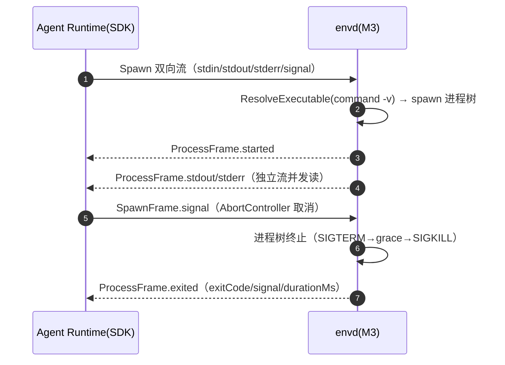

##### §3.2.M3.5 关键流程逻辑

```
触发：commands.run / process.start

Step 1: 进程树终止（关键）
  ├── cgroup/process group 杀整树（tree-scoped 语义）
  └── grace ladder：SIGTERM → graceMs → SIGKILL

Step 2: 多 reader 不互相消费（US-10，P1）
  ├── offset 非消费读，stdout/stderr 落 spill 文件 + ring buffer
  ├── ring buffer 大小：每命令/进程 stdout、stderr 各独立 ring buffer，默认 1 MiB（可配 `ENVD_RING_BUFFER_BYTES`）
  ├── 溢出行为：ring buffer 满后丢弃最旧数据（覆盖写），写入方永不阻塞；溢出量累计 `envd_ring_dropped_bytes_total` 并落结构化日志（长时大输出命令不卡死）
  ├── spill 文件：完整输出落工作区卷 spill 文件（默认上限 512 MiB，可配），ring buffer 仅作近实时热窗口
  ├── 多 reader 按 offset 读；reader 请求的 offset 已落入被丢弃区间 → 返回 RING_OVERFLOW（A030003），提示改用 spill 文件读
  └── 超限：spill 文件超过上限 → 返回 FS_TOO_LARGE（A030002）或按 policy 截断

Step 3: 原子写（US-6）
  └── tempfile + fsync + rename，version guard（mtime/ns 计数）
      └── 失败返 FS_STALE_VERSION（可识别为「版本冲突」而非「命令失败」）

Step 4: 执行审计单向通道（envd → audit-collector，workload identity 认证 + durable 持久化）
  ├── 事件源：EXEC/FS_WRITE/SPAWN 由 envd 产生，经 gRPC/OTLP 单向推送到受信 audit-collector（非直连 DB，M3 依赖表不含 DB/审计连接）
  ├── 认证：envd 用独立 mTLS 客户端证书 / Pod ServiceAccount 身份（沙箱内注入、不下发 SDK），audit-collector 校验 workload identity 后落库（进入哈希链）；per-sandbox token 仅用于 SDK 调 envd，不用于上报审计，防客户端伪造审计事件
  ├── durable ACK：audit-collector 落库成功后返回 durable ACK（含落库 seq），envd 收到 ACK 才从本地 outbox 删除；未 ACK 事件持久化到本地卷 outbox
  ├── 背压：audit-collector 侧环形缓冲 + spill 落盘（容量同 §2.5.2 BD-03），envd 侧持久化 outbox（本地卷）
  ├── 失败策略：collector 不可达 → envd 事件写 outbox + 指数退避重试，最终一致；不阻塞命令执行本身
  └── 销毁前 flush：沙箱 TTL/kill 触发销毁时，Operator 在 drain 前向 envd 发 flush 请求；合规模式 outbox 仍有未 ACK 事件 → 阻止销毁并告警（AL-11）；非合规模式 flush 超时（5s）后放行，未 ACK 事件落审计冷存兜底
```

---

#### 3.2.M4 预热池管理器

##### §3.2.M4.1 模块概述

`预热池管理器` 维护一批未绑定 claim 的 Ready Pod，claim 到来直接领用省拉镜像+起 agent。业务逻辑在 `OPS`（池容量规划）之间流动，涉及 `K8s 集群（E-05）`、`Redis（C-02，分配锁）`。MVP 阶段 `[MOCK]` 按需建（领池短路），完整版启用 SandboxWarmPool CRD。

##### §3.2.M4.2 接口清单（CRD SandboxWarmPool reconcile）

| 子领域 | 操作 | 用途（≤ 20 字） | 对应对象 | 幂等 |
| --- | --- | --- | --- | --- |
| 池 | reconcile（补给/裁剪） | 维持 minSize 空闲 Ready Pod | O-05 | 是（声明式） |
| 池 | Acquire（领用） | claim 领用预热 Pod | O-05 | 是（label 防重复） |

##### §3.2.M4.3 关键结构定义

| CRD 字段 | 字段名 | 类型 | 必填 | 业务含义 | 约束 / 默认值 |
| --- | --- | --- | --- | --- | --- |
| `SandboxWarmPool.spec` | `templateRef` | String | 是 | 池模板 | 引用 SandboxTemplate |
| `SandboxWarmPool.spec` | `classRef` | String | 是 | 池隔离档 | 引用 SandboxClass |
| `SandboxWarmPool.spec` | `minSize`/`maxSize` | int32 | 是 | 空闲 Pod 上下限 | 默认 min 5 / max 50 |
| `SandboxWarmPool.spec` | `updateStrategy` | String | 否 | 更新策略 | 枚举：Recreate/OnReplenish |
| `SandboxWarmPool.spec` | `topologySpread` | Object | 否 | 跨 AZ 均匀分布预热 Pod | 同 Deployment `topologySpreadConstraints`，maxSkew=1，按 `topology.kubernetes.io/zone` 分散 |
| `SandboxWarmPool.status` | `readyReplicas`/`idleReplicas` | int32 | 是 | 就绪/空闲数 | reconcile 回填 |

##### §3.2.M4.4 模块逻辑时序图

| 编号 | 标题 | 场景类别 | 是否包含异常分支 |
| --- | --- | --- | --- |
| SQ-01 | 预热池管理器 - 补给/裁剪 | 核心动作执行 | 是 |
| SQ-02 | 预热池管理器 - 领用竞态规避 | 异常/补偿 | 是 |

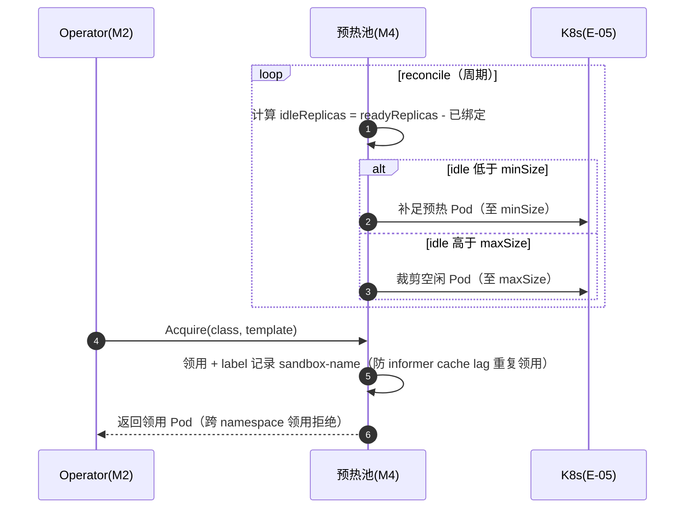

##### §3.2.M4.5 关键流程逻辑

```
触发：SandboxWarmPool reconcile（P1 完整版）

Step 1: 补给/裁剪
  ├── idle 低于 min → 补足至 min
  ├── idle 高于 max → 裁剪至 max
  └── 跨 AZ 分布：补给按 `topologySpread`（maxSkew=1，按 zone）均匀分布预热 Pod，单 AZ 故障时预热命中率不骤降、不退化为全量冷启动

Step 2: 领用竞态规避（agent-sandbox issue 规避项）
  ├── 领用后 label 记录 agents.x-k8s.io/sandbox-name（防 informer cache lag 重复领用）
  ├── 跨 namespace 领用强制拒绝（防串租户）
  └── Pod 已被其他 controller 拥有 → AlreadyExists 安全处理，拒绝领用

Step 3: 更新策略
  ├── Recreate：模板变更全量重建（抖动大，慎用）
  └── OnReplenish：仅新补给应用新模板（推荐）

Step 4: [MOCK] MVP 降级
  └── 领池短路 → 直接按需建 Pod（冷启动 ≤ 3s）
      [完整版替换点] 启用 SandboxWarmPool，预热命中 P95 ≤ 500ms

Step 5: 预热 Pod 干净状态保证（liveness 重启处理）
  ├── 不变量：envd Agent 为纯无状态进程，重启即恢复「干净初始状态」（工作区目录由 template 初始化，无跨重启内存态）
  ├── liveness 重启事件 → 该 Pod 标记为「脏」，从预热池移除并触发重新补给（不领用重启中的 Pod）
  └── 领用前校验：Operator 领用 Pod 时除检查 Ready 外，还校验 envd /healthz 当前通过且 `container restarts = 0`
```

---

#### 3.2.M5 Template Builder

##### §3.2.M5.1 模块概述

`Template Builder` 覆盖「沙箱模板构建」「镜像分层缓存」「模板版本治理（tags）」场景，业务逻辑在 `Platform Engineer` 之间流动，涉及 `镜像仓库（E-01）`、`对象存储（C-03）` 的数据流动。产出 SandboxTemplate CRD，供 SandboxController 调度引用。

##### §3.2.M5.2 接口清单

| 子领域 | 方法 | 路径 | 用途（≤ 20 字） | 请求 DTO | 响应 VO | 幂等 |
| --- | --- | --- | --- | --- | --- | --- |
| 模板 | POST | `/api/v1/templates/build` | 构建模板镜像 | `TemplateBuildRequest` | `TemplateBuildVO` | 是（biz_id） |
| 模板 | GET | `/api/v1/templates` | 模板列表（含 tags） | — | `SandboxTemplateListVO` | 天然 |
| 模板 | GET | `/api/v1/templates/{name}/tags/{tag}` | 查询模板版本 | — | `SandboxTemplateVO` | 天然 |

##### §3.2.M5.3 关键结构定义

| DTO 名 | 字段名 | 类型 | 必填 | 业务含义 | 约束 / 默认值 |
| --- | --- | --- | --- | --- | --- |
| `TemplateBuildRequest` | `name` | String | 是 | 模板名 | 唯一 |
| `TemplateBuildRequest` | `baseImage` | String | 是 | 基础镜像 | 经漏洞扫描 |
| `TemplateBuildRequest` | `tags` | []String | 否 | 版本标签 | 如 data-analysis:v1 |
| `SandboxTemplate.spec` | `agentImage` | String | 是 | envd 镜像 | 沙箱内 agent |
| `SandboxTemplate.spec` | `toolchainImage` | String | 否 | 工具链镜像 | bash/rg/node/git/LSP |

##### §3.2.M5.4 模块逻辑时序图

| 编号 | 标题 | 场景类别 | 是否包含异常分支 |
| --- | --- | --- | --- |
| SQ-01 | Template Builder - 模板构建 | 核心实体创建 | 是 |

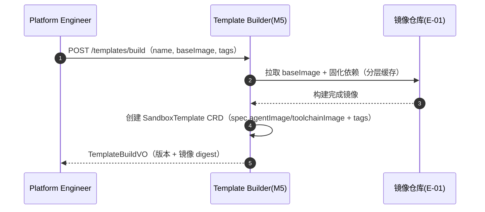

##### §3.2.M5.5 关键流程逻辑

```
触发：POST /api/v1/templates/build

Step 1: 分层缓存
  └── 固化依赖层（Python/Git/Node/浏览器）→ 避免每次启动现装（10-60s → 亚秒）

Step 2: 镜像签名 + 漏洞扫描（安全基线）
  └── 未通过扫描 → 拒绝构建

Step 3: 版本治理（tags）
  └── tags 保证可复现/可回滚，data-analysis:v1 不可变
```

---

#### 3.2.M6 Snapshot/Volume 服务

##### §3.2.M6.1 模块概述

`Snapshot/Volume 服务` 覆盖「状态保存（文件快照/持久卷）」「暂停/恢复」场景（完整版/增强），业务逻辑在 `Agent Runtime` 之间流动，涉及 `对象存储（E-02）`、`CSI（E-05）` 的数据流动。MVP 不启用，完整版启用 Volume 持久卷，增强版启用 microVM 内存快照。

##### §3.2.M6.2 接口清单

| 子领域 | 方法 | 路径 | 用途（≤ 20 字） | 请求 DTO | 响应 VO | 幂等 |
| --- | --- | --- | --- | --- | --- | --- |
| snapshot | POST | `/api/v1/sandboxes/{id}/snapshot` | 保存沙箱快照 | `SnapshotRequest` | `SnapshotVO` | 是（id+version） |
| volume | POST | `/api/v1/sandboxes/{id}/volumes` | 挂载持久卷 | `VolumeRequest` | `VolumeVO` | 是（biz_id） |
| snapshot | POST | `/api/v1/sandboxes/{id}/restore` | 从快照恢复 | `RestoreRequest` | `SandboxVO` | 是（id+version） |

##### §3.2.M6.3 关键结构定义

| DTO 名 | 字段名 | 类型 | 必填 | 业务含义 | 约束 / 默认值 |
| --- | --- | --- | --- | --- | --- |
| `SnapshotRequest` | `type` | String | 是 | 快照粒度 | 枚举：fs（文件）/ microvm（内存+CPU） |
| `VolumeRequest` | `storageClass` | String | 是 | 存储类 | CSI StorageClass |
| `VolumeRequest` | `size` | String | 是 | 卷大小 | 如 5Gi |

##### §3.2.M6.4 模块逻辑时序图

| 编号 | 标题 | 场景类别 | 是否包含异常分支 |
| --- | --- | --- | --- |
| SQ-01 | Snapshot/Volume 服务 - 文件快照 | 核心动作执行 | 是 |

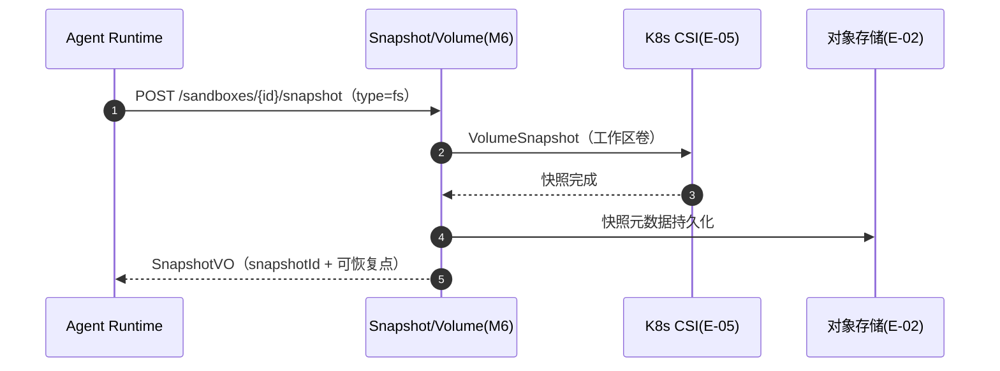

##### §3.2.M6.5 关键流程逻辑

```
触发：POST /sandboxes/{id}/snapshot

Step 1: 两种粒度
  ├── 存储快照：CSI VolumeSnapshot（工作区文件，秒级）
  └── microVM 快照：文件+内存+CPU（~5-28ms 恢复，增强版）

Step 2: 恢复
  └── VolumeSnapshot 恢复 PVC → 重建 Pod 绑定卷（文件现场）

Step 3: [增强版] fork/resume（US-31/32）
  └── 依赖 microVM 内存快照，本阶段 Out-of-Scope
```

---

#### 3.2.M7 audit-collector（受信审计收集器）

##### §3.2.M7.1 模块概述

`audit-collector` 是执行审计的受信收集器，接收 envd（M3）单向推送的 EXEC/FS_WRITE/SPAWN 事件，校验 workload identity（独立 mTLS 证书 / 限定 audience 的 Projected SA Token）后写入 `t_audit_event`（进入哈希链），并返回 durable ACK（含落库 seq）。业务逻辑在 `envd Agent（M3）`、`审计系统（E-03）` 之间流动，涉及 `PostgreSQL / MySQL（C-01）`、`可观测平台（E-04）` 的数据流动。无状态多副本部署，DB 为唯一权威。

##### §3.2.M7.2 接口清单（gRPC，package audit.v1）

| 子领域 | RPC | 用途（≤ 20 字） | 流式 | 幂等 |
| --- | --- | --- | --- | --- |
| audit | `AppendEvent` | 提交执行审计事件 | 否 | 是（event_id 幂等去重） |
| audit | `BatchAppend` | 批量提交（背压场景） | 否 | 是（event_id） |

##### §3.2.M7.3 关键结构定义

| 字段名 | 类型 | 说明 |
| --- | --- | --- |
| `event_id` | String(UUID) | 稳定事件 ID（envd 生成，幂等去重键，落 biz_id） |
| `sandbox_id`/`owner_id`/`tenant_id` | String | 事件归属（**M7 从 bound Pod UID / 权威 DB/CRD 派生，不信任 payload**，防受损模块伪造其他租户事件） |
| `event_type`/`params`/`result` | — | 与 t_audit_event 对齐 |

##### §3.2.M7.4 关键流程逻辑（ACK 幂等 + 去重）

```
Step 1: 鉴权：校验 envd workload identity（独立 mTLS 证书 / Projected SA Token，audience=audit-collector）；校验失败 → 事件进隔离队列（dead-letter）并告警 AL-14（疑似伪造审计），不写入哈希链，安全团队人工复核
Step 2: 幂等去重：event_id 命中（biz_id 唯一索引）→ 直接返回 ACK（不重复写，防 ACK 丢失后重投重复、outbox 无法清除）
Step 3: 落库：单事务写入 t_audit_event（seq + hash_chain，chain-head FOR UPDATE）
Step 4: durable ACK：落库成功后返回 ACK（含 seq）；envd 收到才从 outbox 删
```

---

### 3.3 核心业务对象清单

#### 3.3.1 对象定义

| 编号 | 对象名（代码类名） | 对象类型 | 包路径 | 模块归属 | 被哪些模块复用 | 实例化策略 | 序列化约定 | 持久化策略 |
| --- | --- | --- | --- | --- | --- | --- | --- | --- |
| O-01 | `Sandbox` | 聚合根 | `operator/api/v1alpha1` | M2 | M1/M3/M4/M6 | CRD apply | JSON | 落 etcd（CRD） |
| O-02 | `SandboxClass` | 聚合根 | `operator/api/v1alpha1` | M2 | M1/M2/M4 | CRD apply | JSON | 落 etcd（CRD） |
| O-03 | `SandboxTemplate` | 聚合根 | `operator/api/v1alpha1` | M5 | M1/M2/M4 | CRD apply | JSON | 落 etcd（CRD） |
| O-04 | `SandboxClaim` | 聚合根 | `operator/api/v1alpha1` | M2 | M1/M4 | CRD apply | JSON | 落 etcd（CRD） |
| O-05 | `SandboxWarmPool` | 聚合根 | `operator/api/v1alpha1` | M4 | M2 | CRD apply | JSON | 落 etcd（CRD） |
| O-06 | `SandboxPhase` | 共享枚举 | `common/enums` | common | 全部 | — | String | 落 CRD status VARCHAR |
| O-07 | `AuditEvent` | 实体 | `apiserver/audit` | M1 | M2/M3 | 工厂方法 | JSON | 落表 → `t_audit_event` |
| O-08 | `OwnerQuota` | 聚合根 | `apiserver/quota` | M1 | M2/M4 | 工厂方法 | JSON | 落表 → `t_owner_quota` + Redis 计数 |
| O-09 | `ApprovalRequest` | 聚合根 | `apiserver/approval` | M1 | — | 工厂方法 | JSON | 落表 → `t_approval_request` |
| O-10 | `RuntimeClassRef` | 值对象 | `operator/runtime` | M2 | M2/M4 | new（不可变） | JSON | 内嵌字段 |
| O-11 | `EgressPolicy` | 值对象 | `common/dto` | common | M1/M2/M3 | new（不可变） | JSON | 内嵌字段 |
| O-12 | `OciImageRef` | 防腐层 ACL | `pkg/acl/oci` | M5 | M2/M5 | new + 适配 | — | 不落表，瞬时转换 |
| O-13 | `SandboxConnectionInfo` | 值对象 | `common/dto` | common | M1/M2/M3 | new（不可变） | JSON | 内嵌字段（proxyEndpoint/sandboxId/per-sandbox token） |
| O-14 | `IdempotencyKey` | 实体 | `apiserver/idempotency` | M1 | — | 工厂方法 | JSON | 落表 → `t_idempotency_key` |

#### 3.3.2 命名漂移登记表

| 业务实体（§2） | 代码类名（§3.3.1） | 数据表名（§4.2） | 漂移原因 |
| --- | --- | --- | --- |
| 沙箱实例 | `Sandbox`（CRD 聚合根） | CRD `Sandbox`（etcd，非 `t_` 表） | K8s 声明式主数据，非关系表 |
| 审计事件 | `AuditEvent` | `t_audit_event` | 命名一致（无漂移） |
| Owner 配额 | `OwnerQuota` | `t_owner_quota` | 命名一致（无漂移） |
| 审批请求 | `ApprovalRequest` | `t_approval_request` | 命名一致（无漂移） |
| 幂等键 | `IdempotencyKey` | `t_idempotency_key` | 命名一致（无漂移） |

### 3.4 跨模块公共能力

| 公共能力 | 简述 | 提供方（SDK / 切面 / Bean） | 被哪些模块复用 | 接入方式 |
| --- | --- | --- | --- | --- |
| 认证鉴权 | Token 校验 / 角色 / 权限标签 | `apiserver/auth.JwtAuthMiddleware` | M1（全部接口） | 网关中间件 |
| 配额扣减 | owner 并发配额原子计数 | `apiserver/quota.QuotaManager`（Redis 计数） | M1/M2/M4 | 工厂方法 + Redis INCR |
| 审计埋点 | 生命周期+执行留痕（合规） | `audit-collector`（M7，受信收集器，唯一写入口） | M1/M2/M3（统一经 M7） | 所有审计事件（CREATE/KILL/EXEC/FS_WRITE/SPAWN）统一经 M7 落库；M7 从 bound Pod UID / 权威 DB/CRD 派生归属，不信任 payload |
| traceId/tenantId 透传 | W3C TraceContext + tenant 隔离 | `common/telemetry.TraceInterceptor` | 全部模块 | 拦截器，写入日志/span |
| 幂等去重 | 写入接口幂等键去重（Redis 缓存 + DB 唯一索引兜底） | `common/idempotency.IdempotencyGuard` | M1 | 接口入口，Redis `sbx:idem:{key}` + DB `t_idempotency_key` |
| 三档隔离 seam | provider 可替换（runc/gVisor/Kata） | `operator/runtime.RuntimeClassSeam` | M2/M4 | 配置层 RuntimeClass 引用，一行替换 |

### 3.5 接口契约

#### 3.5.1 全局错误码体系

**错误码格式**：

| 项 | 取值 |
| --- | --- |
| 错误码格式 | 6 位：`A010001` |
| 分段规则 | 1 位类别 + 2 位模块 + 3 位错误序号 |
| 类别取值 | `A` = 业务错误（HTTP 200）/ `B` = 系统错误（HTTP 5xx）/ `C` = 客户端错误（HTTP 4xx） |

**错误响应统一结构**：

```json
{
  "code": "A010001",
  "msg": "沙箱不存在",
  "msgI18n": { "zh-CN": "沙箱不存在", "en-US": "Sandbox not found" },
  "data": null,
  "traceId": "abc123",
  "tenantId": "t-1001",
  "timestamp": "2026-08-18T10:00:00.000Z"
}
```

**错误码注册表**：

| 错误码 | HTTP 状态 | 所属模块 | 含义 | 重试建议 | 用户文案 |
| --- | --- | --- | --- | --- | --- |
| A010001 | 200 | M1 | 沙箱不存在 | 不重试 | 沙箱不存在或已销毁 |
| A010002 | 200 | M1 | 模板/隔离档引用不存在 | 不重试 | 模板或隔离档不存在 |
| A020001 | 200 | M2 | 沙箱状态机非法迁移 | 不重试 | 沙箱当前状态不支持该操作 |
| A030001 | 200 | M3 | 文件版本冲突（FS_STALE_VERSION） | 携带新版本重试 | 文件已被修改，请基于最新版本重试 |
| A030002 | 200 | M3 | 文件过大（FS_TOO_LARGE） | 不重试 | 文件超过大小限制 |
| A030003 | 200 | M3 | 环形缓冲溢出（RING_OVERFLOW） | 不重试 | 输出已被环形缓冲丢弃，请改用 spill 文件读取 |
| A040001 | 200 | M4 | 预热池耗尽 | 退避后重试 | 沙箱资源紧张，正在排队分配 |
| A050001 | 200 | M1 | 审批未通过（fail-closed） | 不重试 | 操作未获审批授权 |
| C409001 | 409 | M1 | 幂等键处理中（首个请求未完成） | 稍后重试（携带同幂等键） | 请求正在处理中，请稍后重试 |
| B999001 | 500 | 全局 | 系统内部错误 | 可重试 | 系统繁忙，请稍后再试 |
| C400001 | 400 | 全局 | 参数校验失败 | 不重试 | 参数错误 |
| C401001 | 401 | 全局 | 未登录 | 不重试 | 请重新登录 |
| C401002 | 401 | 全局 | 凭证验签失败（JWKS 轮换期） | SDK 刷新凭证后重试 | 凭证已失效，请刷新后重试 |
| C403001 | 403 | 全局 | 无权限 | 不重试 | 无权访问 |
| C429001 | 429 | 全局 | 触发限流 | 退避后重试 | 操作太频繁，请稍后再试 |
| C429002 | 429 | M1 | owner 并发配额超限 | 排队后重试 | 并发沙箱数已达上限，请稍后重试 |

#### 3.5.2 幂等性约定

| 接口类型 | 是否要求幂等 | 幂等键来源（建议） |
| --- | --- | --- |
| 写入类（POST 创建沙箱） | 必须幂等（重复创建有副作用：多 Pod） | Header `X-Idempotency-Key`（UUID，调用方生成） |
| 更新类（PUT/PATCH timeout/pause） | 必须幂等 | 资源 ID + 版本号（乐观锁） |
| 删除类（DELETE kill） | 天然幂等 | — |
| 查询类（GET） | 天然幂等 | — |
| 审批决策 / 配额扣减 | 强制幂等 | 业务侧请求号（biz_req_no）+ 唯一索引兜底 |

**幂等设计需考虑的问题**：

| 问题维度 | 设计要点 |
| --- | --- |
| 幂等键生命周期 | min(24h, 沙箱TTL + 2h 缓冲)（Redis `sbx:idem:{uuid}` TTL 与 DB `t_idempotency_key.expires_at` 同步取该值；沙箱默认 TTL 1800s 时幂等键有效期 ≈ 2.5h，避免 TTL 到期后仍误返回旧 sandboxId） |
| 重复请求语义 | 幂等命中返回「当前状态」（按 resource_id 重新查询当前资源），非「历史快照」；沙箱已存在则返回既有 sandboxId 的当前详情 |
| 资源有效期检查 | 命中幂等记录时额外校验 resource_id 对应沙箱是否仍存活（查 `sbx:conn:{sandboxId}` / K8s CRD）；已过期/已删 → 视为 miss（软删旧幂等记录后同 key 重新创建，见 §4.2.4.5 upsert 语义） |
| 执行中态处理 | 第一个未返回时，第二个请求返回「处理中」错误码 |
| 失败请求可重试性 | 失败后允许同一幂等键重试（Redis 记录已清除，DB 记录标 FAILED 可复用） |
| 幂等键 DB 兜底 | `t_idempotency_key` 唯一索引（tenant_id, idem_key）作为幂等兜底，Redis 哨兵切换窗口（≤30s）内键丢失时仍可拦截重复创建 |
| 存储兜底 | `t_owner_quota` 唯一索引（tenant_id, owner_id）作为配额最终防线 |

**幂等键写入顺序（防双扣的关键，必须严格三段）**：网关在写入类接口入口按「① DB 幂等位 → ② DB 原子条件扣配额 → ③ Redis 热缓存」顺序执行——① 同步写 `t_idempotency_key`（`expires_at = min(now+24h, now+沙箱TTL+2h)`；唯一索引冲突时走 upsert：既有行已软删/已过期则重置该行继续创建，仍活跃未过期则返回既有响应或 C409001 处理中）；② DB 原子条件更新扣配额（`UPDATE ... WHERE current_count 低于 concurrent_limit`，影响行数=0 → 超限软删①返 C429002），成功后写 Redis 热缓存 `quota:tenant:{tenantId}:owner:{ownerId}`；③ 写 Redis `sbx:idem:{key}` 热缓存（TTL 同 expires_at）。若 ① 后、② 前崩溃，客户端重试会命中①的幂等位（DB 兜底），不会重复扣减配额。Redis 哨兵切换窗口内键丢失时，DB 唯一索引仍拦截第二次请求，不会创建重复 Pod。

#### 3.5.3 限流约定

| 维度 | 默认值 | 触发动作 | 调整方式 |
| --- | --- | --- | --- |
| 全局 QPS | 5000（网关） | 返回 C429001 | 网关配置 |
| 单租户 QPS | 500 | 返回 C429001 | 网关配置 |
| 单 owner 并发沙箱数 | 50（默认，可配） | 返回 C429002 + 排队 | 业务配置中心 |
| 单 IP QPS | 100 | 返回 C429001 + WAF 标记 | 网关配置 |
| 沙箱创建重保接口 | 单 owner 10 次/秒 | 返回 C429002 排队 | 业务配置中心 |

**降级策略**：

| 策略项 | 内容 |
| --- | --- |
| 前端退避 | 触发限流后，前端按 `Retry-After` Header 退避重试 |
| 后端记录 | 写入类接口同时记录到熔断队列 |
| 红线联动 | 限流红线值与 §5.5 容量水位线「红线 高于95%」一致 |

#### 3.5.4 默认超时与重试基线

| 调用类型 | 默认超时 | 默认重试 | 重试条件 |
| --- | --- | --- | --- |
| 同步 API（内部，网关→Operator） | 3s | 0 次 | — |
| t_idempotency_key 同步写（关键路径） | 50ms | 0 次 | 超时走 Redis 热缓存兜底（软幂等降级，见 §3.2.M1.5 Step 2） |
| 同步 API（外部 E-xx，镜像/对象存储） | 10s | 2 次（指数退避 1s/2s） | 仅网络错误 / 5xx |
| 数据面 gRPC（执行/流式） | 流式无总超时，单帧 30s 心跳 | 0 次 | 取消传播 |
| 异步审计事件写 | 30s | 16 次（指数退避，封顶 1h） | 业务异常进死信 |
| 定时任务（GC/池补给） | 5min | 3 次 | 失败告警 |

#### 3.5.5 路由设计规范

**API 路由规范**：

| 维度 | 取值 |
| --- | --- |
| 风格 | RESTful（资源化 URL） |
| 版本控制 | `/api/v1/...`（路径版本） |
| 命名 | 小写 + 中划线（kebab-case） |
| 资源命名 | 名词复数（`/api/v1/sandboxes`） |
| 子资源 | `/api/v1/sandboxes/{id}/files` |
| 动作类接口 | `/api/v1/sandboxes/{id}/timeout`（POST） |

**前端页面路由清单**：

| 路径 | 页面 / 功能 | 入口角色（§2.3） | 鉴权要求 | 关联模块（§3.2.M{N}） |
| --- | --- | --- | --- | --- |
| `/login` | 登录页 | 全部 | 公开 | — |
| `/sandboxes` | 沙箱列表页 | Platform Engineer / OPS | 已登录 + 角色 `pe`/`ops` | M1 |
| `/sandboxes/:id` | 沙箱详情页 | Platform Engineer | 已登录 + 数据权限校验 | M1 |
| `/monitor` | 监控/预警面板 | OPS | 已登录 + 角色 `ops` | M2/M3 |
| `/audit` | 审计日志页 | Security | 已登录 + 角色 `sec` | M1 |
| `/classes` | SandboxClass 配置页 | Platform Engineer | 已登录 + 角色 `pe` | M2 |

**前端路由约定**：

| 维度 | 取值 |
| --- | --- |
| 路由模式 | History |
| 命名风格 | 小写 + 中划线（kebab-case） |
| 动态参数 | `/sandboxes/:id` |
| 鉴权方式 | 路由元信息 `meta.requireAuth=true` + `meta.roles=[...]`，全局路由守卫拦截 |
| 嵌套路由 | 列表页 → 详情页 → 日志/指标子页 |

---

## 4. 数据库设计

> **数据架构总述**：本系统为 K8s 原生架构，数据分三类承载——
> 1. **声明式主数据（Source of Truth）**：CRD 资源（Sandbox/SandboxClass/SandboxTemplate/SandboxClaim/SandboxWarmPool）存储在 K8s etcd，由 Operator reconcile 驱动生命周期，等价于"主数据库"，其"表结构"= CRD OpenAPI schema（见 §4.2.5）。
> 2. **关系型治理元数据**：审计事件、owner 配额计账、审批请求存储在 PostgreSQL / MySQL（需事务/SQL 检索/唯一约束）。
> 3. **时序/对象数据**：指标（Prometheus）、日志（Loki）、追踪（Tempo）、快照/审计冷存（对象存储）。
>
> **经中间确认裁决（§4 数据存储架构）**：治理域数据（审计/配额/审批）采用「引入关系库」路线，**同时支持 PostgreSQL 16 与 MySQL 8.0，部署时二选一**（存储层做方言抽象）。该决策经阶段内中间确认，用户裁决原文为「支持 postgresql 以及 mysql，实际部署的时候可以选择 postgresql 或者 mysql」，详见附录 B.3。

### 4.1 全局数据约定

| 约定项 | 取值 | 说明 |
| --- | --- | --- |
| 命名规范（表名） | `t_{entity}` 业务主表 | 全项目统一前缀 `t_` |
| 命名规范（字段名） | 小写 + 下划线（snake_case） | 禁止驼峰 |
| 主键类型 | `BIGINT AUTO_INCREMENT` | 全项目统一 |
| 字符集 / 排序 | `utf8mb4 / utf8mb4_unicode_ci` | 支持多语言 |
| 时间字段类型 | `DATETIME(3)` UTC 存储 | 统一精度（毫秒）+ 时区（UTC） |
| 软删除字段 | `deleted TINYINT(1) DEFAULT 0` | 全项目统一 |
| 审计字段 | `created_by / created_time / updated_by / updated_time` | 命名锁定 |
| 隔离字段（多租户） | `tenant_id BIGINT NOT NULL` | 查询语句强制带入 |
| 业务唯一标识 | `biz_id VARCHAR(100)` | 与外部系统对齐 |
| 状态枚举 | `VARCHAR(30)` 字符串 | DDL 注释列出全部取值 |
| CRD 主数据 | etcd（K8s 内嵌） | 声明式资源，非 `t_` 表 |

**PG/MySQL 方言类型映射**（存储层做方言抽象，部署时二选一；上表取值列当前为 MySQL 写法基线，PostgreSQL 16 对应写法如下，§4.2.1.4~§4.2.4.4 DDL 均以 MySQL 8.0 为例，JSON 字段在 PG 方言映射为 JSONB）：

| 语义 | MySQL 8.0 | PostgreSQL 16 |
| --- | --- | --- |
| 自增主键 | `BIGINT AUTO_INCREMENT` | `BIGINT GENERATED ALWAYS AS IDENTITY`（或 `BIGSERIAL`） |
| 字符集 | `utf8mb4 / utf8mb4_unicode_ci` | 默认 UTF-8（无需显式指定） |
| 时间字段 | `DATETIME(3)` | `TIMESTAMP(3)` |
| 软删除标志 | `TINYINT(1)` | `SMALLINT`（或 `BOOLEAN`） |
| JSON 字段 | `JSON` | `JSONB` |
| 列注释 | 内联 `COMMENT '...'` | `COMMENT ON COLUMN ... IS '...'` |
| 更新自动刷新 | `ON UPDATE CURRENT_TIMESTAMP` | 需触发器（PG 无等价内联语法） |
| 索引 | `KEY idx (...)` | `CREATE INDEX idx ON t (...)` |

**PostgreSQL 16 `updated_time` 自动刷新触发器**（PG 无 `ON UPDATE CURRENT_TIMESTAMP` 内联等价，需统一触发器；MySQL 侧继续用内联 `ON UPDATE`，四张表 DDL 均以 MySQL 为基线）：

```sql
-- 通用触发器函数（PG 16）
CREATE OR REPLACE FUNCTION fn_set_updated_time() RETURNS trigger AS $$
BEGIN
  NEW.updated_time = now();
  RETURN NEW;
END;
$$ LANGUAGE plpgsql;

-- 对每张含 updated_time 的表分别建触发器（t_audit_event 为 append-only，豁免）
CREATE TRIGGER trg_owner_quota_upd BEFORE UPDATE ON t_owner_quota
  FOR EACH ROW EXECUTE FUNCTION fn_set_updated_time();
CREATE TRIGGER trg_approval_req_upd BEFORE UPDATE ON t_approval_request
  FOR EACH ROW EXECUTE FUNCTION fn_set_updated_time();
CREATE TRIGGER trg_idempotency_key_upd BEFORE UPDATE ON t_idempotency_key
  FOR EACH ROW EXECUTE FUNCTION fn_set_updated_time();
```

### 4.2 单表设计

> 以下 4 张 PostgreSQL / MySQL 表为治理域关系数据（审计事件 / Owner 配额 / 审批请求 / 幂等键兜底），每张按五段式（库表元信息 → 结构 → 索引 → DDL → 清理机制）展开；CRD 资源模型作为 etcd「逻辑表」在 §4.2.5 给出字段表。表级节号采用 §4.2.1~§4.2.4 逐表区分，表内五段式以 §4.2.N.1~§4.2.N.5 展开，避免节号撞车。

#### 4.2.1 表一：t_audit_event（审计事件，append-only）

##### 4.2.1.1 库表元信息（t_audit_event）

| 字段 | 取值 |
| --- | --- |
| 数据库类型 | PostgreSQL 16 / MySQL 8.0 |
| 库名 | `sandbox_governance` |
| 表名 | `t_audit_event` |
| 业务含义（≤ 50 字） | 沙箱生命周期与执行的审计留痕，append-only 不可篡改 |
| 模块归属（§3.2） | M1（审计埋点）/ M2 / M3 |
| 对应核心对象（§3.3） | O-07 `AuditEvent` |
| 审计字段豁免 | 无 `updated_by` / `updated_time` | 豁免理由：append-only 不可修改，下游禁止补加更新字段，防破坏不可篡改性（与 §4.1 全局审计字段约定冲突处显式豁免） |

##### 4.2.1.2 库表结构定义（t_audit_event）

| 列名 | 数据类型 | 可为空 | 约束 | 默认值 | 备注 |
| --- | --- | --- | --- | --- | --- |
| id | BIGINT | NOT NULL | PRIMARY KEY | AUTO_INCREMENT | 主键 |
| seq | BIGINT | NOT NULL | — | — | 显式链序号（chain-head 分配，同 tenant 分区内单调递增；单调性由 chain-head FOR UPDATE 单事务保证，跨月分区各自独立起链） |
| tenant_id | BIGINT | NOT NULL | — | — | 租户隔离字段，查询必带 |
| biz_id | VARCHAR(100) | NOT NULL | UNIQUE(tenant_id,biz_id) | — | 外部业务唯一标识 |
| owner_id | VARCHAR(64) | NOT NULL | — | — | 属主 |
| sandbox_id | VARCHAR(64) | NULL | — | NULL | 沙箱实例 ID |
| event_type | VARCHAR(30) | NOT NULL | — | — | 事件类型：CREATE/KILL/EXEC/FS_WRITE/SPAWN/APPROVAL |
| params | JSON | NULL | — | NULL | 操作参数（脱敏后），PostgreSQL 方言映射为 JSONB |
| result | VARCHAR(30) | NULL | — | NULL | 结果：SUCCESS/FAILED/DENIED |
| source_ip | VARCHAR(45) | NULL | — | NULL | 来源 IP |
| created_by | VARCHAR(64) | NULL | — | NULL | 创建人 |
| created_time | DATETIME(3) | NOT NULL | — | 应用层赋值 | 创建时间（AuditWriter 应用层赋值，参与哈希，不用 DB 默认 CURRENT_TIMESTAMP） |
| hash_chain | VARCHAR(64) | NOT NULL | — | — | 哈希链（防篡改，实现规格见 §4.2.1.6）；AuditWriter 强制计算，禁止 NULL |

##### 4.2.1.3 索引设计（t_audit_event）

| 索引名 | 索引类型 | 字段（含顺序） | 设计目的 | 关联查询场景 |
| --- | --- | --- | --- | --- |
| `PRIMARY` | 主键 | `id` | 唯一标识 | 按主键查询 |
| `uk_tenant_biz` | 唯一索引 | `tenant_id, biz_id` | 业务唯一性 | 幂等兜底 |
| `idx_tenant_seq` | 普通索引 | `tenant_id, seq` | 哈希链按 seq 升序遍历（非唯一，seq 单调性由 chain-head 保证） | 链式校验按 seq 升序遍历 |
| `idx_tenant_time` | 普通索引 | `tenant_id, created_time` | 按 owner/时间检索 | `GET /api/v1/audit?owner=...&from=...` |
| `idx_tenant_event` | 普通索引 | `tenant_id, event_type` | 按事件类型检索 | 逃逸/异常事件过滤 |

##### 4.2.1.4 DDL（t_audit_event）

```sql
CREATE TABLE `t_audit_event` (
  `id` BIGINT NOT NULL AUTO_INCREMENT COMMENT '主键',
  `seq` BIGINT NOT NULL COMMENT '显式链序号（chain-head 分配，同 tenant 分区单调递增）',
  `tenant_id` BIGINT NOT NULL COMMENT '租户 ID（多租户隔离字段）',
  `biz_id` VARCHAR(100) NOT NULL COMMENT '业务唯一标识',
  `owner_id` VARCHAR(64) NOT NULL COMMENT '属主',
  `sandbox_id` VARCHAR(64) DEFAULT NULL COMMENT '沙箱实例 ID',
  `event_type` VARCHAR(30) NOT NULL COMMENT '事件类型：CREATE/KILL/EXEC/FS_WRITE/SPAWN/APPROVAL',
  `params` JSON DEFAULT NULL COMMENT '操作参数（脱敏后，PostgreSQL 方言映射为 JSONB）',
  `result` VARCHAR(30) DEFAULT NULL COMMENT '结果：SUCCESS/FAILED/DENIED',
  `source_ip` VARCHAR(45) DEFAULT NULL COMMENT '来源 IP',
  `created_by` VARCHAR(64) DEFAULT NULL COMMENT '创建人',
  `created_time` DATETIME(3) NOT NULL COMMENT '创建时间（应用层赋值，参与哈希）',
  `hash_chain` VARCHAR(64) NOT NULL COMMENT '哈希链（防篡改，AuditWriter 强制计算，禁止 NULL）',
  PRIMARY KEY (`id`),
  KEY `idx_tenant_seq` (`tenant_id`, `seq`),
  UNIQUE KEY `uk_tenant_biz` (`tenant_id`, `biz_id`),
  KEY `idx_tenant_time` (`tenant_id`, `created_time`),
  KEY `idx_tenant_event` (`tenant_id`, `event_type`)
) COMMENT='沙箱审计事件（append-only）';
```

##### 4.2.1.5 扩展逻辑（数据清理机制）

| 清理机制 | 适用场景 | 配置 |
| --- | --- | --- |
| 归档 + 物理删除 | 审计事件冷存 | 热数据保留 90 天，超期归档对象存储（E-02），归档后物理删除 |
| 分区策略 | 大表按时间分区 | 按 `created_time` 月分区 |

##### 4.2.1.6 哈希链（hash_chain）实现规格

> 目的：把「审计 append-only」从「数据库只增不改」升级为「可独立验证的防篡改」。设计为**「逐事件 HMAC 链（含 previous_chain 前驱）+ 外部 checkpoint 锚点」**：每事件 `hash_chain` 由写入方（审计埋点 `AuditWriter`）计算（HMAC 输入含上一事件的前驱哈希），校验方（离线 Job）重算比对。

| 规格项 | 取值 |
| --- | --- |
| 哈希算法 | HMAC-SHA256（**每事件 HMAC**，输出 32 字节 hex 64 字符，key = `server_secret`，Vault/HSM 托管**不入库**） |
| 哈希输入字段（规范化） | `seq, tenant_id, biz_id, owner_id, sandbox_id, event_type, params(脱敏后规范 JSON), result, source_ip, created_time`（用 chain-head 分配的显式 `seq` 替代数据库自增 `id`，`created_time` 由应用层赋值，避免「先算 hash 再 INSERT 却依赖自增 id/默认时间」的鸡生蛋问题） |
| 链式规则（逐事件 HMAC 链） | 同 `tenant_id` 分区内按 `seq` 升序链式：`hash_chain[i] = HMAC-SHA256( server_secret, previous_chain ‖ canonicalFields(i) )`（`previous_chain = hash_chain[i-1]`）；分区首行（无前驱）`hash_chain = HMAC-SHA256( server_secret, anchor(partition) ‖ canonicalFields(i) )` |
| 写入串行化（chain-head 单事务） | AuditWriter 写审计事件时，单事务内：① `SELECT ... FOR UPDATE` 锁定 `t_audit_partition_anchor` 的 (tenant_id, partition_key) 行；② 取 last_seq+1 为本次 seq、last_hash 为前驱；③ 计算 hash_chain 并 INSERT 审计行（含 seq/created_time/hash_chain）；④ UPDATE anchor（last_seq=seq、last_hash=hash_chain）后提交。同一事务保证序号单调 + 无并发分叉。**新分区 / 新租户初始化竞态**：anchor 行不存在时 `FOR UPDATE` 无法锁行，改为先 `INSERT ... ON CONFLICT DO NOTHING` 初始化 anchor 行，再重新查询并 `FOR UPDATE` 锁行（或使用 advisory lock），避免两个写入者同时进入初始化 |
| 分区锚点（外部 checkpoint，Notary/HSM 签名 + WORM） | `anchor(partition)` 由独立 **Notary/HSM** 用私钥签名后写入 **WORM 对象存储**（版本锁定，防截尾/防篡改），**不再与事件同库明文可改**；DB 的 `t_audit_partition_anchor` 只存 WORM 引用 + Notary 签名。原 `GENESIS = 0x00×32` 公开常量已废弃 |
| 防伪造边界 | 每事件 HMAC（依赖 server_secret，Vault/HSM 托管）+ chain-head 由 Notary/HSM 签名落 WORM（外部 checkpoint 防截尾）；攻击者即使取得 DB 写权限，缺 server_secret 与 Notary 私钥也无法重算后缀或伪造链头 |
| 规范化方式 | 字段按固定顺序拼接，字符串 UTF-8，缺失字段以空串占位，`params` 先脱敏、key 排序后再序列化 |
| 校验方 | 内部离线校验 Job（K8s CronJob，周期 6h，concurrencyPolicy: Forbid 单实例）从 Vault/HSM 取 server_secret 重算全链 + 用 Notary 公钥校验 chain-head 签名 + 比对 WORM checkpoint；审计导出重算经审计系统「校验接口」完成（不直接下发原始密钥） |
| 校验失败处置 | 命中即触发安全事件告警 `AL-09`（P0，见 §8.4.2），并保留原始行与相邻行留证，人工复核是否越权篡改 |
| 归档一致性 | 归档到对象存储（WORM）时携带 `hash_chain` 全链 + 分区锚点，冷存可经校验接口独立校验 |
| NULL 约束 | `hash_chain` 列 NOT NULL，AuditWriter 写入时强制计算；任何异常写路径不得落 NULL，否则从 NULL 行起链式校验断裂、后续可被插入伪造行而校验 Job 无法检测 |

**主从切换链式断裂恢复 SOP**：审计表采用 semi-sync 复制（§4.3.1）保证主从切换零丢失，正常情况下不产生断裂。若极端场景（半同步降级为异步的窗口）出现 id 缺口：① 校验 Job 检测到 hash_chain 断裂 → AL-09（P0）告警；② 人工从主库 binlog / 归档对象存储回补缺失行（按 id 升序重放并重算 hash_chain）；③ 若缺失行已无法恢复，则从缺口处起新建分区锚点（新 partition_key + 新 anchor），缺口前/后行分属两个独立分区、各自内部链式完整，并在审计报告标注该分区边界；④ 禁止用 NULL 或占位 hash 填补缺口。

**校验 Job 并发与 Vault 可用性**：校验 Job 用 K8s CronJob `concurrencyPolicy: Forbid`（单实例，防多副本/失败重试并发，避免重复校验浪费资源）；从 Vault 拉取 server_secret 时，若 Vault 不可达 → 本轮校验跳过并告警（独立告警项，非 AL-09），避免把「Vault 不可用」误报为「审计链被篡改」。

##### 4.2.1.7 分区锚点元数据表（t_audit_partition_anchor）

> 目的：持久化 `partition_start_timestamp`（HMAC 锚点的必要输入，见 §4.2.1.6），供校验 Job 重算比对。紧凑元数据表（非主数据，不展开五段式）。`anchor_hex` 存的是 HMAC 结果（非密钥），可落库；`server_secret` 仍在 Vault 不入库。

| 列名 | 数据类型 | 可为空 | 约束 | 备注 |
| --- | --- | --- | --- | --- |
| id | BIGINT | NOT NULL | PRIMARY KEY | 主键 |
| tenant_id | BIGINT | NOT NULL | UNIQUE(tenant_id,partition_key) | 租户 |
| partition_key | VARCHAR(32) | NOT NULL | UNIQUE(tenant_id,partition_key) | 分区键（如按月 `2026-08`） |
| partition_start_time | DATETIME(3) | NOT NULL | — | 分区起始时间（HMAC 输入之一） |
| anchor_hex | VARCHAR(64) | NOT NULL | — | `HMAC-SHA256(server_secret, tenant_id ‖ partition_start_time)` 的 hex |
| last_seq | BIGINT | NOT NULL | — | 当前链尾序号（chain-head，写入时 `FOR UPDATE` 锁定） |
| last_hash | VARCHAR(64) | NOT NULL | — | 当前链尾 hash（前驱，写入时读取） |
| created_time | DATETIME(3) | NOT NULL | — | 创建时间 |

```sql
CREATE TABLE `t_audit_partition_anchor` (
  `id` BIGINT NOT NULL AUTO_INCREMENT COMMENT '主键',
  `tenant_id` BIGINT NOT NULL COMMENT '租户',
  `partition_key` VARCHAR(32) NOT NULL COMMENT '分区键（如按月 2026-08）',
  `partition_start_time` DATETIME(3) NOT NULL COMMENT '分区起始时间（HMAC 输入之一）',
  `anchor_hex` VARCHAR(64) NOT NULL COMMENT 'HMAC-SHA256 锚点 hex',
  `last_seq` BIGINT NOT NULL DEFAULT 0 COMMENT '当前链尾序号（chain-head，写入时 FOR UPDATE 锁定）',
  `last_hash` VARCHAR(64) NOT NULL COMMENT '当前链尾 hash（前驱，写入时读取）',
  `created_time` DATETIME(3) NOT NULL DEFAULT CURRENT_TIMESTAMP(3) COMMENT '创建时间',
  PRIMARY KEY (`id`),
  UNIQUE KEY `uk_tenant_partition` (`tenant_id`, `partition_key`)
) COMMENT='审计分区锚点元数据';
```

---

#### 4.2.2 表二：t_owner_quota（Owner 配额）

##### 4.2.2.1 库表元信息（t_owner_quota）

| 字段 | 取值 |
| --- | --- |
| 数据库类型 | PostgreSQL 16 / MySQL 8.0 |
| 库名 | `sandbox_governance` |
| 表名 | `t_owner_quota` |
| 业务含义（≤ 50 字） | owner 并发沙箱数/资源配额计账，事务强一致 |
| 模块归属（§3.2） | M1（配额）/ M2 |
| 对应核心对象（§3.3） | O-08 `OwnerQuota` |

##### 4.2.2.2 库表结构定义（t_owner_quota）

| 列名 | 数据类型 | 可为空 | 约束 | 默认值 | 备注 |
| --- | --- | --- | --- | --- | --- |
| id | BIGINT | NOT NULL | PRIMARY KEY | AUTO_INCREMENT | 主键 |
| tenant_id | BIGINT | NOT NULL | UNIQUE(tenant_id,owner_id) | — | 租户隔离字段 |
| owner_id | VARCHAR(64) | NOT NULL | UNIQUE(tenant_id,owner_id) | — | 属主 |
| concurrent_limit | INT | NOT NULL | — | 50 | 并发沙箱上限 |
| current_count | INT | NOT NULL | CHECK (current_count ≥ 0) | 0 | 当前并发数（事务扣减）；DECR 语句加 WHERE current_count 高于 0 条件防负值 |
| total_cpu_milli | INT | NULL | — | NULL | 累计 CPU 配额（milli） |
| total_memory_mi | INT | NULL | — | NULL | 累计内存配额（Mi） |
| created_by | VARCHAR(64) | NULL | — | NULL | 创建人 |
| created_time | DATETIME(3) | NULL | — | CURRENT_TIMESTAMP | 创建时间 |
| updated_by | VARCHAR(64) | NULL | — | NULL | 更新人 |
| updated_time | DATETIME(3) | NULL | — | CURRENT_TIMESTAMP ON UPDATE | 更新时间 |
| deleted | TINYINT(1) | NOT NULL | — | 0 | 删除标志 |

##### 4.2.2.3 索引设计（t_owner_quota）

| 索引名 | 索引类型 | 字段（含顺序） | 设计目的 | 关联查询场景 |
| --- | --- | --- | --- | --- |
| `PRIMARY` | 主键 | `id` | 唯一标识 | 按主键查询 |
| `uk_tenant_owner` | 唯一索引 | `tenant_id, owner_id` | 业务唯一性（配额最终防线） | 配额查询/扣减 |

##### 4.2.2.4 DDL（t_owner_quota）

```sql
CREATE TABLE `t_owner_quota` (
  `id` BIGINT NOT NULL AUTO_INCREMENT COMMENT '主键',
  `tenant_id` BIGINT NOT NULL COMMENT '租户 ID',
  `owner_id` VARCHAR(64) NOT NULL COMMENT '属主',
  `concurrent_limit` INT NOT NULL DEFAULT 50 COMMENT '并发沙箱上限',
  `current_count` INT NOT NULL DEFAULT 0 COMMENT '当前并发数（事务扣减，DECR 加 WHERE current_count 高于 0 防负值）',
  `total_cpu_milli` INT DEFAULT NULL COMMENT '累计 CPU 配额',
  `total_memory_mi` INT DEFAULT NULL COMMENT '累计内存配额',
  `created_by` VARCHAR(64) DEFAULT NULL COMMENT '创建人',
  `created_time` DATETIME(3) DEFAULT CURRENT_TIMESTAMP(3) COMMENT '创建时间',
  `updated_by` VARCHAR(64) DEFAULT NULL COMMENT '更新人',
  `updated_time` DATETIME(3) DEFAULT CURRENT_TIMESTAMP(3) ON UPDATE CURRENT_TIMESTAMP(3) COMMENT '更新时间',
  `deleted` TINYINT(1) NOT NULL DEFAULT 0 COMMENT '删除标志（0：存在，1：已删除）',
  CONSTRAINT `chk_current_count` CHECK (`current_count` >= 0),
  PRIMARY KEY (`id`),
  UNIQUE KEY `uk_tenant_owner` (`tenant_id`, `owner_id`)
) COMMENT='owner 配额计账';
```

##### 4.2.2.5 扩展逻辑（数据清理机制）

| 清理机制 | 适用场景 | 配置 |
| --- | --- | --- |
| 无 | 长期保留（配额账本需审计追溯） | — |

##### 4.2.2.6 附：t_quota_allocation 配额分配账本（allocation ledger）

> 目的：让配额释放**按 sandbox 幂等**。`t_owner_quota.current_count` 只有聚合计数，无法判断「哪次 reservation 已释放」；Operator 崩溃重放 DECR 时可能扣掉其他沙箱的额度。新增 allocation ledger：每沙箱一行，释放按 `allocation_id` 幂等 CAS（RESERVED→RELEASED 检查影响行数），allocation CAS 与 owner 聚合 `current_count` 增减在同一事务。

| 列名 | 数据类型 | 可为空 | 约束 | 备注 |
| --- | --- | --- | --- | --- |
| allocation_id | VARCHAR(64) | NOT NULL | PRIMARY KEY | 分配 ID（预生成，幂等释放键） |
| tenant_id | BIGINT | NOT NULL | — | 租户 |
| owner_id | VARCHAR(64) | NOT NULL | — | 属主 |
| sandbox_id | VARCHAR(64) | NOT NULL | UNIQUE | 沙箱实例（每沙箱一行） |
| status | VARCHAR(30) | NOT NULL | — | RESERVED/RELEASED |
| created_time | DATETIME(3) | NOT NULL | — | 分配时间 |
| released_time | DATETIME(3) | NULL | — | 释放时间 |

```sql
CREATE TABLE `t_quota_allocation` (
  `allocation_id` VARCHAR(64) NOT NULL COMMENT '分配 ID（预生成，幂等释放键）',
  `tenant_id` BIGINT NOT NULL COMMENT '租户',
  `owner_id` VARCHAR(64) NOT NULL COMMENT '属主',
  `sandbox_id` VARCHAR(64) NOT NULL COMMENT '沙箱实例（每沙箱一行）',
  `status` VARCHAR(30) NOT NULL DEFAULT 'RESERVED' COMMENT 'RESERVED/RELEASED',
  `created_time` DATETIME(3) NOT NULL DEFAULT CURRENT_TIMESTAMP(3) COMMENT '分配时间',
  `released_time` DATETIME(3) DEFAULT NULL COMMENT '释放时间',
  PRIMARY KEY (`allocation_id`),
  UNIQUE KEY `uk_sandbox` (`sandbox_id`),
  KEY `idx_tenant_owner` (`tenant_id`, `owner_id`)
) COMMENT='配额分配账本（释放幂等）';
```

**释放幂等事务（CAS + 聚合增减同事务）**：① `UPDATE t_quota_allocation SET status='RELEASED', released_time=now() WHERE allocation_id=? AND status='RESERVED'`（影响行数=1 才继续）；② 若 ① 影响行数=1 → `UPDATE t_owner_quota SET current_count=current_count-1 WHERE tenant_id=? AND owner_id=? AND current_count 高于 0`；③ 若 ① 影响行数=0（已释放，崩溃重放）→ 跳过 ②，幂等返回。两步同事务提交，杜绝「重复 DECR 扣掉其他沙箱额度」。

---

#### 4.2.3 表三：t_approval_request（审批请求）

##### 4.2.3.1 库表元信息（t_approval_request）

| 字段 | 取值 |
| --- | --- |
| 数据库类型 | PostgreSQL 16 / MySQL 8.0 |
| 库名 | `sandbox_governance` |
| 表名 | `t_approval_request` |
| 业务含义（≤ 50 字） | 人在环 pre-execute 审批请求（ask/allow/deny） |
| 模块归属（§3.2） | M1（审批） |
| 对应核心对象（§3.3） | O-09 `ApprovalRequest` |

##### 4.2.3.2 库表结构定义（t_approval_request）

| 列名 | 数据类型 | 可为空 | 约束 | 默认值 | 备注 |
| --- | --- | --- | --- | --- | --- |
| id | BIGINT | NOT NULL | PRIMARY KEY | AUTO_INCREMENT | 主键 |
| tenant_id | BIGINT | NOT NULL | — | — | 租户隔离字段 |
| biz_id | VARCHAR(100) | NOT NULL | UNIQUE(tenant_id,biz_id) | — | 业务唯一标识 |
| allocation_id | VARCHAR(64) | NOT NULL | — | — | 预生成配额分配 ID（与 t_quota_allocation 关联） |
| idempotency_id | VARCHAR(128) | NOT NULL | — | — | 关联幂等键（防晚审批作用于被重建的新意图） |
| sandbox_id | VARCHAR(64) | NULL | — | NULL | 沙箱实例 ID（ALLOWED 前为空，建 Sandbox 后回填） |
| owner_id | VARCHAR(64) | NOT NULL | — | — | 属主 |
| action | VARCHAR(30) | NOT NULL | — | — | 待审批操作 |
| status | VARCHAR(30) | NOT NULL | — | 'PENDING' | 状态：PENDING/ALLOWED/DENIED/EXPIRED |
| decided_by | VARCHAR(64) | NULL | — | NULL | 决策人 |
| decided_time | DATETIME(3) | NULL | — | NULL | 决策时间 |
| expires_at | DATETIME(3) | NOT NULL | — | — | 审批超时时间（now+审批TTL，默认 24h）；超时未决由 Job 置 EXPIRED（fail-closed） |
| created_by | VARCHAR(64) | NULL | — | NULL | 创建人 |
| created_time | DATETIME(3) | NULL | — | CURRENT_TIMESTAMP | 创建时间 |
| updated_time | DATETIME(3) | NULL | — | CURRENT_TIMESTAMP ON UPDATE | 更新时间 |
| deleted | TINYINT(1) | NOT NULL | — | 0 | 删除标志 |
| version | BIGINT | NOT NULL | — | 1 | 乐观锁版本号；决策与超时统一用同一条 CAS 规则：`UPDATE ... SET status=?, version=version+1 WHERE id=? AND version=? AND status='PENDING'`（检查影响行数），防并发 ALLOWED/DENIED/EXPIRED 互相覆盖 |

##### 4.2.3.3 索引设计（t_approval_request）

| 索引名 | 索引类型 | 字段（含顺序） | 设计目的 | 关联查询场景 |
| --- | --- | --- | --- | --- |
| `PRIMARY` | 主键 | `id` | 唯一标识 | 按主键查询 |
| `uk_tenant_biz` | 唯一索引 | `tenant_id, biz_id` | 业务唯一性 | 幂等兜底 |
| `idx_tenant_status` | 普通索引 | `tenant_id, status` | 待审批列表查询 | `GET /api/v1/approvals?status=PENDING` |

##### 4.2.3.4 DDL（t_approval_request）

```sql
CREATE TABLE `t_approval_request` (
  `id` BIGINT NOT NULL AUTO_INCREMENT COMMENT '主键',
  `tenant_id` BIGINT NOT NULL COMMENT '租户 ID',
  `biz_id` VARCHAR(100) NOT NULL COMMENT '业务唯一标识',
  `allocation_id` VARCHAR(64) NOT NULL COMMENT '预生成配额分配 ID（与 t_quota_allocation 关联）',
  `idempotency_id` VARCHAR(128) NOT NULL COMMENT '关联幂等键（防晚审批作用于被重建的新意图）',
  `sandbox_id` VARCHAR(64) DEFAULT NULL COMMENT '沙箱实例 ID（ALLOWED 前为空，建 Sandbox 后回填）',
  `owner_id` VARCHAR(64) NOT NULL COMMENT '属主',
  `action` VARCHAR(30) NOT NULL COMMENT '待审批操作',
  `status` VARCHAR(30) NOT NULL DEFAULT 'PENDING' COMMENT '状态：PENDING/ALLOWED/DENIED/EXPIRED',
  `decided_by` VARCHAR(64) DEFAULT NULL COMMENT '决策人',
  `decided_time` DATETIME(3) DEFAULT NULL COMMENT '决策时间',
  `expires_at` DATETIME(3) NOT NULL COMMENT '审批超时时间（now+审批TTL，默认 24h），超时未决由 Job 置 EXPIRED（fail-closed）',
  `created_by` VARCHAR(64) DEFAULT NULL COMMENT '创建人',
  `created_time` DATETIME(3) DEFAULT CURRENT_TIMESTAMP(3) COMMENT '创建时间',
  `updated_time` DATETIME(3) DEFAULT CURRENT_TIMESTAMP(3) ON UPDATE CURRENT_TIMESTAMP(3) COMMENT '更新时间',
  `deleted` TINYINT(1) NOT NULL DEFAULT 0 COMMENT '删除标志（0：存在，1：已删除）',
  `version` BIGINT NOT NULL DEFAULT 1 COMMENT '乐观锁版本号（CAS：UPDATE ... SET status=?, version=version+1 WHERE id=? AND version=? AND status=PENDING）',
  PRIMARY KEY (`id`),
  UNIQUE KEY `uk_tenant_biz` (`tenant_id`, `biz_id`),
  KEY `idx_tenant_status` (`tenant_id`, `status`),
  KEY `idx_expires` (`expires_at`)
) COMMENT='人在环审批请求';
```

##### 4.2.3.5 扩展逻辑（数据清理机制）

| 清理机制 | 适用场景 | 配置 |
| --- | --- | --- |
| 超时自动裁决 | PENDING 超时未决 | 审批超时 Job（每 10min）扫描 `status='PENDING' AND expires_at 早于 now` → 原子 `UPDATE ... SET status='EXPIRED', version=version+1 WHERE id=? AND version=? AND status='PENDING'`（与 /decision 同一 CAS 规则，fail-closed 拒绝执行） |
| 归档 | 审批记录需长期保留（合规） | 归档对象存储，保留 ≥ 1 年 |

---

#### 4.2.4 表四：t_idempotency_key（幂等键兜底）

##### 4.2.4.1 库表元信息（t_idempotency_key）

| 字段 | 取值 |
| --- | --- |
| 数据库类型 | PostgreSQL 16 / MySQL 8.0 |
| 库名 | `sandbox_governance` |
| 表名 | `t_idempotency_key` |
| 业务含义（≤ 50 字） | 写入类接口幂等键 DB 兜底，Redis 故障切换窗口内仍可拦截重复创建 |
| 模块归属（§3.2） | M1（网关幂等去重） |
| 对应核心对象（§3.3） | O-14 `IdempotencyKey` |

##### 4.2.4.2 库表结构定义（t_idempotency_key）

| 列名 | 数据类型 | 可为空 | 约束 | 默认值 | 备注 |
| --- | --- | --- | --- | --- | --- |
| id | BIGINT | NOT NULL | PRIMARY KEY | AUTO_INCREMENT | 主键 |
| tenant_id | BIGINT | NOT NULL | UNIQUE(tenant_id,idem_key) | — | 租户隔离字段，查询必带 |
| idem_key | VARCHAR(128) | NOT NULL | UNIQUE(tenant_id,idem_key) | — | 幂等键（Header `X-Idempotency-Key`） |
| request_hash | VARCHAR(64) | NOT NULL | — | — | 规范化请求指纹（template/class/owner/ttl 等规范化后 SHA-256）；同 key 不同参数返回冲突（拒绝换参复用） |
| resource_type | VARCHAR(30) | NOT NULL | — | — | 资源类型：SANDBOX/APPROVAL/QUOTA |
| resource_id | VARCHAR(100) | NULL | — | NULL | 落库后回填的资源 ID（如 sandboxId） |
| resource_expires_at | DATETIME(3) | NULL | — | NULL | 资源有效期（沙箱 expiresAt），命中时校验资源存活；幂等命中返回「当前状态」非历史快照 |
| status | VARCHAR(30) | NOT NULL | — | 'PENDING' | PENDING/SUCCEEDED/FAILED |
| lease_owner | VARCHAR(64) | NULL | — | NULL | 持有幂等键的网关实例 ID（fencing 用） |
| lease_expires_at | DATETIME(3) | NULL | — | NULL | PENDING 租约到期时间，超时由清理 Job 接管置 FAILED |
| lease_version | BIGINT | NOT NULL | — | 0 | 单调递增 fencing 版本号，终态更新与 K8s 副作用均校验当前版本（防旧 lease 持有者与新接管者双写） |
| expires_at | DATETIME(3) | NOT NULL | — | — | 幂等键有效期 = min(now+24h, now+沙箱TTL+2h)，与沙箱 expiresAt 对齐 |
| created_by | VARCHAR(64) | NULL | — | NULL | 创建人 |
| created_time | DATETIME(3) | NULL | — | CURRENT_TIMESTAMP | 创建时间 |
| updated_by | VARCHAR(64) | NULL | — | NULL | 更新人 |
| updated_time | DATETIME(3) | NULL | — | CURRENT_TIMESTAMP ON UPDATE | 更新时间 |
| deleted | TINYINT(1) | NOT NULL | — | 0 | 删除标志 |

##### 4.2.4.3 索引设计（t_idempotency_key）

| 索引名 | 索引类型 | 字段（含顺序） | 设计目的 | 关联查询场景 |
| --- | --- | --- | --- | --- |
| `PRIMARY` | 主键 | `id` | 唯一标识 | 按主键查询 |
| `uk_tenant_idem` | 唯一索引 | `tenant_id, idem_key` | 幂等唯一性（Redis 丢失时的 DB 兜底）+ upsert-on-conflict 触发点 | 写入前查重 / 插入冲突 / 过期重置 |
| `idx_expires` | 普通索引 | `expires_at` | 软删 + 延迟物理删除两阶段扫描 | 清理 Job 按 `expires_at` 分阶段扫描（§4.2.4.5） |

##### 4.2.4.4 DDL（t_idempotency_key）

```sql
CREATE TABLE `t_idempotency_key` (
  `id` BIGINT NOT NULL AUTO_INCREMENT COMMENT '主键',
  `tenant_id` BIGINT NOT NULL COMMENT '租户 ID（多租户隔离字段）',
  `idem_key` VARCHAR(128) NOT NULL COMMENT '幂等键（Header X-Idempotency-Key）',
  `request_hash` VARCHAR(64) NOT NULL COMMENT '规范化请求指纹（template/class/owner/ttl 规范化后 SHA-256），同 key 不同参数返回冲突',
  `resource_type` VARCHAR(30) NOT NULL COMMENT '资源类型：SANDBOX/APPROVAL/QUOTA',
  `resource_id` VARCHAR(100) DEFAULT NULL COMMENT '落库后回填的资源 ID',
  `resource_expires_at` DATETIME(3) DEFAULT NULL COMMENT '资源有效期（沙箱 expiresAt），命中时校验资源存活',
  `status` VARCHAR(30) NOT NULL DEFAULT 'PENDING' COMMENT '状态：PENDING/SUCCEEDED/FAILED',
  `lease_owner` VARCHAR(64) DEFAULT NULL COMMENT '持有幂等键的网关实例 ID（fencing 用）',
  `lease_expires_at` DATETIME(3) DEFAULT NULL COMMENT 'PENDING 租约到期时间',
  `lease_version` BIGINT NOT NULL DEFAULT 0 COMMENT '单调递增 fencing 版本号，终态更新与 K8s 副作用均校验当前版本',
  `expires_at` DATETIME(3) NOT NULL COMMENT '幂等键有效期 = min(now+24h, now+沙箱TTL+2h)',
  `created_by` VARCHAR(64) DEFAULT NULL COMMENT '创建人',
  `created_time` DATETIME(3) DEFAULT CURRENT_TIMESTAMP(3) COMMENT '创建时间',
  `updated_by` VARCHAR(64) DEFAULT NULL COMMENT '更新人',
  `updated_time` DATETIME(3) DEFAULT CURRENT_TIMESTAMP(3) ON UPDATE CURRENT_TIMESTAMP(3) COMMENT '更新时间',
  `deleted` TINYINT(1) NOT NULL DEFAULT 0 COMMENT '删除标志（0：存在，1：已删除）',
  PRIMARY KEY (`id`),
  UNIQUE KEY `uk_tenant_idem` (`tenant_id`, `idem_key`),
  KEY `idx_expires` (`expires_at`)
) COMMENT='写入类接口幂等键 DB 兜底';
```

##### 4.2.4.5 扩展逻辑（数据清理机制）

| 清理机制 | 适用场景 | 配置 |
| --- | --- | --- |
| 软删除（阶段一） | 过期幂等键 | 清理 Job 每 10min `UPDATE SET deleted=1 WHERE expires_at 早于 now()`；网关查询过滤 `deleted=0 AND expires_at 晚于 now()` |
| 永久精简墓碑（阶段二） | 已完成/FAILED 幂等键 | 不物理删除，保留永久精简墓碑（仅 idem_key/request_hash/resource_id/status/created_time）；历史审批/审计/资源关联不串线，新意图强制使用新 key |
| 竞态说明 | DELETE 与 SELECT 并发 | 保留墓碑（不物理删除）后无 DELETE 竞态；网关查询过滤 `deleted=0 AND expires_at 晚于 now()` |
| 请求指纹校验 | 同 key 换参数 | 命中幂等记录时比对 `request_hash`：不一致 → 返回冲突错误（拒绝换 template/class/owner 复用同 key 静默返回旧资源），提示用新 key |
| PENDING 超时接管 | 进程崩溃残留 | 清理 Job 扫描 `status='PENDING' AND lease_expires_at 早于 now` → 原子 `UPDATE SET status=FAILED WHERE id=? AND lease_version=?`（检查影响行数）；新请求接管时递增 lease_version（fencing），旧 lease 持有者随后的终态更新 / K8s apply 因 version 不匹配被拒绝，避免双重副作用 |
| 墓碑自动归档 | 表大小超预算 | 监控 `t_idempotency_key` 表大小，超 85% 容量预算时触发：将已完成（SUCCEEDED/FAILED）且超保留期的墓碑行（deleted=1）归档至对象存储后物理清理，防墓碑永久增长（200 QPS 场景 3 年累积约 28GB） |

---

#### 4.2.5 CRD 资源模型字段表（etcd 逻辑表）

| CRD（逻辑表） | 关键字段（spec/status） | 类型 | 业务含义 | 隔离字段 |
| --- | --- | --- | --- | --- |
| `SandboxClass` | runtimeClassName / hypervisor / podOverhead / security / defaultResources / warmPool | String | 三档隔离策略模板 | namespace 级 |
| `SandboxTemplate` | agentImage / toolchainImage / security / defaultResources / initWorkspace / tags | String | 环境模板 | namespace 级 |
| `Sandbox` | classRef / templateRef / ownerId / ttlSeconds / network / resources / workspace | String/int | 沙箱实例 | tenant namespace |
| `SandboxClaim` | spec：templateRef / desiredState / ttlSeconds / lifecycle；status：phase / sandboxRef / proxyEndpoint | String/int | 消费者申领（spec）+ 回填连接信息（status）；lifecycle=shutdownPolicy/ttlSecondsAfterFinished，见 §3.2.M2.3 | tenant namespace |
| `SandboxWarmPool` | templateRef / classRef / minSize / maxSize / updateStrategy | String/int | 预热池 | tenant namespace |

### 4.3 数据部署与备份

#### 4.3.1 存储清单

| 存储类型 | 用途 | 部署模式 | HA 方案 | 备份策略 | 日志 / 审计去向 |
| --- | --- | --- | --- | --- | --- |
| etcd（K8s） | CRD 主数据（生命周期） | 3 副本跨 AZ | raft 自动故障切换 | 全量快照每 6h + WAL | Loki |
| PostgreSQL 16 / MySQL 8.0 | 审计事件/配额/审批 | 主从（1 主 2 从） | 主备同步 + 故障自动切换；审计表（t_audit_event/t_audit_partition_anchor）强制 semi-sync 复制（至少一从确认）保证零丢失 | 全量每日 + 增量 binlog 实时 | Loki + 审计对象存储 |
| Redis 7.2 | 配额计数/限流/幂等/锁 | 哨兵（1 主 2 从） | 故障自动切换 | 无需持久备份（可重建） | — |
| 对象存储（MinIO） | 快照/审计冷存 | 多 AZ（4 节点） | 内置冗余 | 跨区域复制 | 审计冷存 |

#### 4.3.2 备份与恢复

| 维度 | 取值 |
| --- | --- |
| 备份方式 | 全量 + 增量；冷备 + 热备 |
| 备份位置 | 与生产环境物理 / 可用区隔离的对象存储 |
| 保留策略 | 全量保留 30 天；增量保留 7 天；审计冷存保留 ≥ 1 年 |
| RPO（数据丢失容忍） | ≤ 5 分钟（etcd WAL + PostgreSQL / MySQL binlog 实时同步） |
| RTO（恢复时间目标） | ≤ 30 分钟（控制面重建 + 主从切换） |
| 恢复演练 | 频率：季度；负责人 `@平台基建` |

### 4.4 缓存与 Key 规范

#### 4.4.1 Key 命名规范

| 规则项 | 取值 |
| --- | --- |
| 统一前缀 | 每个业务域统一前缀：`sbx:` / `quota:` / `auth:` |
| 多级分隔符 | 冒号 `:` 分层，禁止下划线/点号 |
| 变量占位 | `{}` 表示变量，如 `quota:tenant:{tenantId}:owner:{ownerId}` |
| 环境隔离 | 禁止 Key 前缀做环境隔离（不同 Redis 实例/DB） |

#### 4.4.2 缓存策略与一致性

| 维度 | 说明 |
| --- | --- |
| 读写策略 | DB 为配额权威账本：原子条件更新 `UPDATE t_owner_quota SET current_count=current_count+1 WHERE tenant_id=? AND owner_id=? AND current_count 低于 concurrent_limit`（检查影响行数）；Redis 仅作热缓存加速读取 |
| 一致性级别 | 配额强一致（DB 原子条件更新为权威，防超限）；Redis 计数为加速缓存（最终一致，对账补偿，周期 60s 见 §3.2.M1.5 Step 5） |
| 更新顺序 | 先 DB 原子条件更新（权威扣减）→ 成功后写 Redis 热缓存；DB 唯一索引 (tenant_id, owner_id) 保证每 owner 一行 |
| 失效防护 | 穿透（不存在 owner 空值缓存）；击穿（热点配额互斥锁）；雪崩（TTL 加随机抖动） |
| 降级策略 | Redis 不可用 → 直接走 DB 原子条件更新（权威校验，不依赖滞后缓存）；DB 不可用 → fail-closed 返回系统错误（不放行突破配额） |

#### 4.4.3 Key 清单

| Key 模式 | 类型 | TTL | 用途 | 写入位置 | 删除时机 |
| --- | --- | --- | --- | --- | --- |
| `quota:tenant:{tenantId}:owner:{ownerId}` | String (counter) | 长期 | 租户+owner 并发计数（多租户隔离，同 ownerId 不同租户互不共享） | `QuotaManager.incr` | 沙箱销毁 DECR |
| `sbx:idem:{uuid}` | String | min(24h,TTL+2h) | 幂等去重 | 网关接口入口 | TTL 自动（与 DB `expires_at` 对齐） |
| `sbx:rl:{dim}:{id}` | String (counter) | 1min | 限流计数 | 拦截器 | TTL 自动 |
| `sbx:lock:pool:{classRef}` | String | 10s | 预热池领用锁 | `WarmPool.acquire` | 持有方 DEL |
| `sbx:lock:quota:{tenantId}:{ownerId}` | String | 5s | 配额对账互斥锁 | 对账 Job（§3.2.M1.5 Step 5） | 持有方 DEL |
| `sbx:conn:{sandboxId}` | String | ttlSeconds | 连接信息缓存 | 网关返回时写 | TTL 自动 / 销毁主动 |

**Pub/Sub 频道**（非 Key，随 Key 规范一并登记）：`sbx:evt:conn-invalidate` —— 沙箱连接信息失效广播，Operator 发布，envd-proxy 各副本订阅（§6.3.1）。

### 4.5 数据迁移与兼容性

> **本节整节略过（未启用）**：本系统为全新系统，无存量数据源、无旧系统并行期、无回滚需求。理由已在 §0 修订记录中注明。

---

## 5. 部署架构

> **本章定位**：只承载对开发产生约束的部署结论。具体节点规格、CICD 流水线、回滚 SOP 等施工细节见《系统部署文档》（platform-architect 产出）。

### 5.1 环境与集群划分

| 环境名称 | 环境定位 | 集群隔离 | 集群规格 |
| --- | --- | --- | --- |
| dev | 开发自测 | 与其他系统共用 | 最小规格（runc+gVisor 两档） |
| int | 联调 | 共用 | 中等规格 |
| uat | 预发 / 验收 | 独立 | 接近生产 |
| prod | 生产 | 独立 | 生产规格（三档隔离 + 1000 并发） |

**配置策略**：

| 配置层级 | 存放位置 | 适用内容 | 变更生效 | 对开发的约束 |
| --- | --- | --- | --- | --- |
| L1 代码内 | 代码仓库 | 默认值、枚举、常量 | 重新部署 | 禁止写入环境差异、密码、地址 |
| L2 配置中心 | K8s ConfigMap + 热重载 | 限流阈值、配额上限、降级开关 | 热更新（监听回调） | 变更必须幂等 |
| L3 环境变量 / ConfigMap | K8s ConfigMap | DB 地址、对象存储端点、外部域名 | 重启 Pod | 启动失败 fail-fast |
| L4 Secret | Vault / Secret Manager | 密码、证书私钥、per-sandbox secret | 动态拉取 | 禁止落日志/入代码 |

**紧急降级操作手册（oncall 手动覆盖路径）**：每个 BD-xx 降级策略对应一个 `kubectl patch configmap` 命令（或运维 API），可在不重启、不依赖自动检测逻辑的情况下即时生效：

| 降级项 | 手动触发命令（示例） | 效果 |
| --- | --- | --- |
| BD-01（预热池→冷启动） | `kubectl -n sandbox patch configmap sandbox-config --type merge -p '{"data":{"warmpool.enabled":"false"}}'` | 强制领池短路，转按需建 |
| BD-03（审计本地缓冲） | `kubectl -n sandbox patch configmap sandbox-config --type merge -p '{"data":{"audit.buffer.mode":"spill-to-disk"}}'` | 强制审计事件 spill 落盘异步补投 |
| 全局降级总开关 | `kubectl -n sandbox patch configmap sandbox-config --type merge -p '{"data":{"degradation.force":"true"}}'` | 一键触发全部 BD-xx 降级 |

> oncall 在故障现场可即时切换（ConfigMap 热重载监听回调生效），无需走发布流程；恢复正常后改回原值。

### 5.2 运行时高可用与弹性

#### 5.2.1 负载均衡

| 维度 | 取值 |
| --- | --- |
| 类型 | 7 层（L7，网关/Ingress） |
| 健康检查路径 | `/healthz`（Liveness）/ `/readyz`（Readiness） |
| 健康检查频率 | 10s |
| 失败阈值 | 连续 3 次失败标记不健康 |
| 恢复阈值 | 连续 2 次成功标记健康 |
| 会话保持 | 否（控制面无状态；数据面 gRPC 经 envd-proxy 转发，不经过控制面 LB） |

#### 5.2.2 弹性伸缩

| 维度 | 取值 |
| --- | --- |
| 触发指标 | CPU / 并发沙箱数 / 预热池 idle 水位 |
| 扩容阈值 | CPU 高于 70% 持续 5min 或 预热池 idle 低于 min |
| 缩容阈值 | CPU 低于 30% 持续 10min 或 预热池 idle 高于 max |
| 副本区间 | 控制面 min 2 / max 20；沙箱节点按 1000 并发扩容 |
| 冷却时间 | 扩容 60s / 缩容 5min |

#### 5.2.3 容灾级别

| 维度 | 取值 |
| --- | --- |
| 容灾级别 | MVP：单集群多 AZ；完整版：主备双集群（灾备） |
| 故障切换 RTO | ≤ 30 分钟（与 §5.3 SLA 自洽） |
| 跨集群数据同步策略 | etcd 快照 + PostgreSQL / MySQL 复制：审计表（t_audit_event/t_audit_partition_anchor）用 semi-sync 零丢失；其余治理表异步复制延迟 低于 1min |

#### 5.2.4 可用性来源拆分

| 可用性来源 | 范围 | 责任方 |
| --- | --- | --- |
| 基础设施兜底 | K8s 集群 / etcd / PostgreSQL / MySQL / Redis / 对象存储（自建 HA） | 平台基建团队 |
| 本系统自身保障 | 控制面无状态多副本 / Operator 多副本 leader 选举 / 熔断降级 | 研发团队 |
| 数据面沙箱 | 沙箱 Pod 可丢弃重建（无状态执行，有状态 workspace 走 PVC） | 研发团队 |

**对开发的约束**：

| 契约项 | 本系统取值 | 开发实现要求 |
| --- | --- | --- |
| 无状态化 | 控制面（网关/Operator）无状态；沙箱 Pod 有状态（workspace PVC） | 无状态 Pod 禁本地落文件；沙箱显式标注有状态 |
| 跨 AZ 反亲和 | 控制面（API 网关 / Operator）强制跨 AZ 分散 | podAntiAffinity requiredDuringSchedulingIgnoredDuringExecution 按 `topology.kubernetes.io/zone` 分散（或 topologySpreadConstraints maxSkew=1），防单 AZ 故障时控制面全副本同区宕机 |
| 优雅停机 | SIGTERM → 停接入 → 处理在飞请求 → 退出，上限 30s | 实现 preStop Hook + shutdown |
| Liveness | `/healthz`，仅判进程存活 | 失败重启 Pod |
| Readiness | `/readyz`，仅判 hard 依赖（K8s apiserver 可达 + DB 连通）就绪；Redis 为 soft 依赖 | 失败摘流不杀进程；Redis 不可用不影响 readyz（仍返 200），请求层触发降级模式（BD-03/降级计数检查） |
| 幂等性范围 | 全部写接口幂等（§3.5.2） | 幂等键来源/存储/有效期在模块设计说明 |
| 超时与重试基线 | 默认值见 §3.5.4 | 跨服务调用显式设置超时 |

### 5.3 服务级别（SLA）

| SLA 指标项 | 指标定义 | 目标值 | 度量方式 |
| --- | --- | --- | --- |
| 系统开放时间 | 对外提供服务窗口 | 7×24 | 业务侧约定 |
| 系统可用性 | 月度可用时长 / 月度总时长 | ≥ 99.9% | 监控统计 |
| 沙箱就绪时延 | 创建到 Ready 的端到端时间 | P95 ≤ 500ms（预热）/ P95 ≤ 3s（冷） | APM 采样 |
| 故障恢复目标（RTO、RPO） | 故障到恢复 / 数据丢失容忍 | RTO ≤ 30min；RPO ≤ 5min | 演练验证 |
| 计划内停机窗口 | 升级/维护窗口 | 每月 ≤ 1 次，每次 ≤ 30min，提前 7 天公告 | 公告 |
| 不可用界定 | 错误率 高于 1% 持续 5min | — | 告警规则 |

**P95 ≤500ms 预热创建时延分解**（验收基准，各环节 P95 预算之和 ≤500ms，亦为性能测试验收依据）：

| 环节 | 时延预算（P95） | 说明 |
| --- | --- | --- |
| 网关鉴权 + 幂等预检（Redis 命中） | ≤ 20ms | Redis 热缓存命中 |
| 幂等落位（DB 写 t_idempotency_key） | ≤ 50ms | 关键路径同步写，超时走软兜底（见 PERF-6） |
| 配额 INCR（Redis 原子） | ≤ 5ms | — |
| apply SandboxClaim（etcd write） | ≤ 30ms | — |
| Operator reconcile 领预热池 | ≤ 100ms | 领池命中，不做建 Pod |
| 连接信息回填 + 网关返回 | ≤ 50ms | — |
| 网络/调度抖动余量 | ≤ 245ms | 预留缓冲 |
| 合计 | ≤ 500ms | 对齐 §5.3 SLA |

### 5.4 部署拓扑图

#### 5.4.1 物理拓扑图

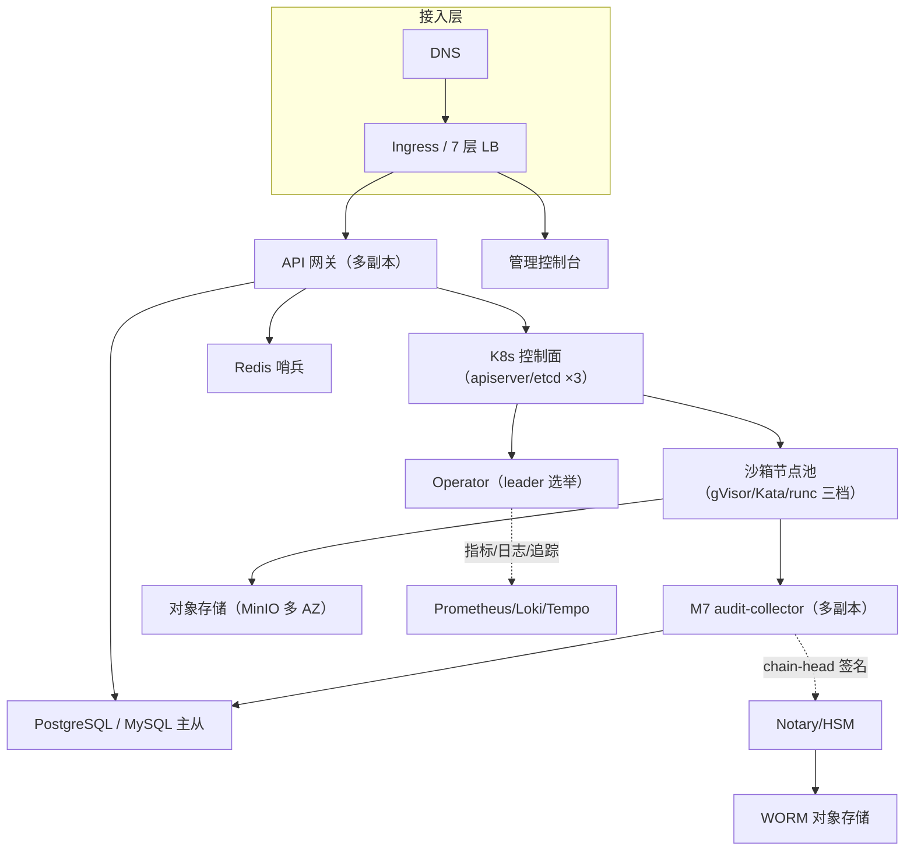

#### 5.4.2 拓扑要素清单

| 要素 | 取值 |
| --- | --- |
| 跨 Region 部署 | 否（单 Region） |
| 跨 AZ 部署 | 是；AZ 数量 3 |
| 流量入口路径 | DNS → 7 层 LB → Ingress/网关 → 控制面 |
| 内部调用路径 | K8s Service 发现 + gRPC（数据面经 envd-proxy 转发） |
| 数据库访问路径 | 连接池 + 主从切换（PostgreSQL / MySQL） |

#### 5.4.3 故障域划分

| 故障域 | 影响范围 | 容错机制 | 预期 RTO |
| --- | --- | --- | --- |
| 单 Pod | 单实例（控制面/沙箱） | K8s 自动重建 | 低于 30s（瞬时无影响） |
| 单 Node | 该 Node 上全部沙箱 Pod | K8s 调度到其他 Node | 低于 1min |
| 单 AZ | 该 AZ 全部资源 | 跨 AZ 部署，自动切换 | ≤ 5min |
| 单 Region | 全部主资源 | 灾备集群切换（完整版） | ≤ 30min |

### 5.5 容量规划

#### 5.5.1 业务量预估

| 业务指标 | 当前值 | MVP 阶段值 | 生产阶段值 | 备注 |
| --- | --- | --- | --- | --- |
| 峰值并发沙箱实例 | — | 1000 | 1000 | 用户原始诉求（N1） |
| 峰值创建 QPS | — | 50 | 200 | 推算（1000 并发 × 分配率） |
| 审计事件量 / 天 | — | 50 万条 | 100 万条 | 推算 |
| 隔离层内存总量 | — | ≤ 15GB | ≤ 15GB（gVisor 档） | 高层 V4 |

#### 5.5.2 资源容量推算

| 资源 | 推算公式 | 当前配置 | 生产阶段配置 |
| --- | --- | --- | --- |
| 控制面实例数 | 峰值 QPS / 单实例 QPS × 冗余 1.5 | 2 | 4 |
| 沙箱节点数 | 1000 并发 × 单沙箱资源 / 单节点容量 × 冗余 | 按需 | 1000 并发支撑（gVisor 档内存 15GB） |
| PostgreSQL / MySQL | 审计 100 万条/日 × 保留 90 天 | 4C16G + 500GB | 8C32G + 2TB |
| Redis | 单 Key × 10 万 × 1.3 | 4C8G | 8C16G |
| 对象存储 | 日增 × 保留天数 × 副本 | 按需 | 快照 + 审计冷存 |
| audit-collector（M7） | 200 QPS 审计事件 × 单事件写 1 次 | 2 副本 | 4 副本（跨 AZ）；每副本 spill 卷 ≥ 100GB（RTO 30min × 峰值审计 QPS 积压） |
| Notary/HSM | chain-head 签名（低频） | 主备 | 独立 HSM（或 KMS 托管密钥） |
| etcd（K8s） | 峰值 write QPS ≈ 800-1000（每沙箱创建约 4-5 次 write × 200 QPS） | 3 副本 | 3 副本 NVMe SSD + 8C16G；合并 status patch 降写入 |

> **etcd 写入压力说明**：3 副本 etcd 写入 QPS 建议不超过 1000（超出开始尾部时延抖动）。峰值 write QPS ≈ 800-1000 已贴近上限，需：① 合并多次 status 更新为一次 patch（每次创建从 4-5 次 write 压到 3 次左右）；② etcd 节点用 NVMe SSD + 8C16G；③ 监控 etcd `etcd_server_apply_duration_seconds` P99 与 write QPS，超 800 触发告警。

> **etcd 存储上限与 watch 积压**：etcd 默认存储上限 8GB，CRD 主数据经 GC 回收不无限累积，但 200 QPS 高频创建/销毁下 watch 事件（CRD add/update/delete）在 compaction 周期（默认 5min）内会积压 revision。需监控 etcd `etcd_mvcc_db_total_size_in_bytes` 与 revision 增长速率，超 70% 触发告警；compaction 周期按需调短（如 1min），避免极端高频场景 revision 膨胀。

> **gVisor CPU overhead 说明**：gVisor systrap 模式通过 userspace kernel 拦截 syscall，对 syscall 密集型负载有约 10-40% CPU 额外开销（文件 I/O 密集型更高）。容量推算单沙箱 CPU 需预留 30% overhead（无实测数据时的保守值）；SandboxClass 的 `podOverhead` 字段应包含 gVisor shim 进程本身的资源消耗，避免节点 CPU throttling / OOM。节点容量按「单沙箱声明 CPU × 1.3」折算。

> **t_owner_quota 配额账本写入预算**：200 QPS 创建峰值对应约 400 写操作/s（每沙箱 `current_count±1` 条件更新 + 新 owner 首建 INSERT），叠加 Draining/GC 的 DECR。DB 写入预算按 400 写/s 评估：连接池 ≥ 40（每连接 10 TPS），配额事务单次 ≤ 20ms（P95）。监控指标：`t_owner_quota` 写 QPS、配额事务 P99 时延、连接池耗尽次数，超阈值告警（AL-12，见 §8.4.2）。

#### 5.5.3 扩容触发与路径

| 资源 | 扩容触发指标 | 扩容方式 | 扩容耗时 |
| --- | --- | --- | --- |
| 控制面 Pod | CPU 高于 70% 持续 5min | HPA 自动扩 | 低于 1min |
| 沙箱节点 | 预热池 idle 低于 min / 节点容量 高于 80% | Cluster Autoscaler | 低于 5min |
| PostgreSQL / MySQL | CPU 高于 80% / IOPS 高于 80% | 升配/读写分离 | 低于 30min |
| Redis | 内存 高于 70% | 升配/集群扩节点 | 低于 30min |
| 对象存储 | 容量 高于 80% | 自动扩展 | 低于 10min |

#### 5.5.4 容量水位线

| 水位 | 阈值 | 动作 | 对开发的约束 |
| --- | --- | --- | --- |
| 健康水位 | 低于 60% | 无动作 | — |
| 预警水位 | 60-80% | 告警，启动扩容评审 | — |
| 危险水位 | 高于 80% | 自动扩容 | — |
| 红线 | 高于 95% | 触发限流/降级（与 §3.5.3 联动） | 限流红线值一致；降级开关预埋 |

---

## 6. 网络架构

### 6.1 网络环境规划

| 网络环境 | 用途 | 说明 / 访问策略 |
| --- | --- | --- |
| DMZ | 公网入口缓冲区（7 层 LB/Ingress） | 仅允许公网入站；不能直连 INT/PROD |
| INT | 内部互联（控制面 + 中间件） | 仅允许从 DMZ 入站；出站受 NAT 控制 |
| PROD | 生产（沙箱节点池 + 数据） | 严格入站/出站 ACL；最小化暴露 |
| DEV | 开发 | 与 PROD 完全隔离 |

### 6.2 流量入口与南北向流量

#### 6.2.1 入口流量链路

| 组件 | 作用 | 部署位置 |
| --- | --- | --- |
| DNS | 域名解析 | 公网 |
| 7 层 LB / Ingress | TLS 终结 / 流量分发 | DMZ |
| API 网关 | 路由 / 鉴权 / 限流 / 配额 | 应用子网入口 |
| 业务服务（Operator/envd） | 业务逻辑 / 数据面 | 应用子网 |

**入口决策（对开发的约束）**：

| 决策项 | 取值 | 对开发的约束 |
| --- | --- | --- |
| TLS 终结点 | 7 层 LB / Ingress | 数据面 gRPC 强制 per-sandbox 短期凭证鉴权（MVP 起生效）；mTLS 双向证书（完整版增强） |
| 限流位置 | API 网关统一拦截 + 业务自实现（双层） | 与 §3.5.3 限流红线一致 |
| 鉴权位置 | 控制面 API 网关统一鉴权 + 数据面 envd gRPC 拦截器（per-sandbox 凭证）双层 | 与 §7.2.1 认证一致；数据面不依赖网关代理 |
| 真实客户端 IP 获取 | X-Forwarded-For | 业务获取客户端 IP 用本字段 |

#### 6.2.2 出口流量

| 决策项 | 取值 | 对开发的约束 |
| --- | --- | --- |
| 出口方式 | NAT 网关 + 出站代理（沙箱 egress 白名单） | 沙箱出站默认拒绝，白名单放行 |
| 是否需要固定出口 IP | 否（自建通用） | 私有化场景明示 |
| 出口白名单 | 沙箱仅放行镜像源/依赖源（pypi/registry）+ audit-collector 端点 | 新增 E-xx 先登记；audit-collector 为执行审计必放开项（§3.2.M3.5 Step 4） |
| 跨地域/跨云出口 | 无（单 Region） | — |

### 6.3 内部互联（东西向流量）

| 决策项 | 取值 | 对开发的约束 |
| --- | --- | --- |
| 服务发现 | K8s Service（控制面）+ envd-proxy 转发（数据面） | 禁止硬编码 IP；数据面统一经 envd-proxy 接入（§6.3.1） |
| 服务间通信协议 | 控制面 HTTP/gRPC；数据面 gRPC 双向流；审计异步 | 与 §3.5.4 超时重试基线对齐 |
| 内部 mTLS | 完整版启用（控制面↔envd 双向证书） | 证书轮换由部署文档管理 |
| 跨 VPC 互联 | 不涉及（单集群） | — |
| 跨服务调用幂等性 | 遵循 §3.5.2 幂等键传递 | Header 透传幂等键 + traceId |

#### 6.3.1 数据面直连的网络可达性前提与替代路径

**接入模型（统一 envd-proxy）**：`SandboxConnectionInfo` 返回「代理入口 + sandboxId」（不返回 podIP），SDK 一律经 envd-proxy 接入 envd，不依赖调用方网络 L3 可达 Pod CIDR。该设计规避了集群外调用方「Pod IP 不可路由」的问题，并与 NetworkPolicy deny-all 基线自洽（见 §7.2.5）。

**可达性分层判定**：

| 调用方位置 | Pod IP 可达性 | 数据面接入方式 |
| --- | --- | --- |
| 集群内 / 同 VPC / 跨 VPC / 集群外 | 统一不依赖 Pod IP 可达 | 统一走 envd-proxy（PROXY 为唯一默认模式） |

**统一接入路径（envd-proxy）**：所有调用方（含集群内）统一经「数据面代理 envd-proxy」接入，建立 `sandboxId → podIP:grpcPort` 映射并透传 gRPC 流。SDK 连接「代理入口 + sandboxId」，代理按连接信息转发（保留 gRPC 双向流语义）。**不再提供 DIRECT 直连模式**（与 NetworkPolicy deny-all 基线自洽，见 §7.2.5）。

| 替代方案 | 机制 | 取舍 |
| --- | --- | --- |
| envd-proxy 透传（推荐） | 集群边界无状态代理，按 sandboxId 路由到 podIP:grpcPort | 保留流式语义；需代理高可用 + 连接信息路由表（Redis/CRD） |
| Ingress TCP passthrough | Ingress / 云 LB 对 gRPC TCP 端口透传 | 需每沙箱预分配端口/域名映射，1000 并发扩展性差，仅作临时兜底 |
| NodePort | 节点端口映射到沙箱 | 端口消耗大、需 NAT 穿透 Pod CIDR，不推荐生产 |
| 云 LB 直通 Pod | 特定 CNI（部分云 VPC CNI）支持 LB 直连 Pod | 依赖云能力，自建集群不适用 |

**envd-proxy 高可用与路由一致性**：

| 维度 | 取值 |
| --- | --- |
| 部署形态 | 无状态多副本（Deployment 水平扩展 + 7 层 LB 分发），每副本本地 LRU 缓存路由表（从 Redis `sbx:conn:{sandboxId}` 加载，缓存 TTL 30s，miss 回源 Redis/CRD） |
| 路由 miss 降级 | 本地缓存 + Redis 均 miss（podIP 已变 / sandbox 已删）→ 返回 `PROXY_ROUTE_NOT_FOUND`（映射 A010001 沙箱不存在），SDK 收到后按「资源失效」重新 create |
| Pod 删除主动清理 | 沙箱销毁（kill/TTL/GC）时 Operator 主动 `DEL sbx:conn:{sandboxId}`，并通过失效广播通知各 proxy 副本清本地 LRU，不依赖 TTL 兜底 |
| 失效广播协议 | Redis Pub/Sub 频道 `sbx:evt:conn-invalidate`，消息体 `{"sandboxId":"..."}`；proxy 订阅该频道，收到后清除本地 LRU 该 entry；订阅断线重连后全量回源（清空本地 LRU）保证最终一致 |
| 健康联动 | proxy 转发遇连接拒绝 / RST / 超时 → 立即 fail 并返回错误（不重试失联 Pod），本地缓存标记该 sandboxId 失效并回源重查；下一请求仍 miss 走「路由 miss 降级」 |

**对开发的约束**：① 连接信息只下发「代理入口 + sandboxId」（`ConnectionInfo.accessMode` 固定 PROXY，不下发 podIP）；② SDK 一律经 envd-proxy 接入；③ 代理路由表以 `sbx:conn:{sandboxId}`（§4.4.3）为准，沙箱销毁即失效（Operator 主动 DEL + 各副本本地 LRU 失效，非仅靠 TTL）。

**数据面连接中断处理协议（envd-proxy）**：

| 场景 | SDK 处理契约 |
| --- | --- |
| gRPC 流异常断开（连接 reset / timeout，非 PROXY_ROUTE_NOT_FOUND） | 先经 envd-proxy 按同一 proxyEndpoint 重连（短暂闪断），重试 N 次（默认 3 次，指数退避 100ms/200ms/400ms） |
| 重连超过 N 次仍失败 | 标记沙箱可能已失效（节点宕机/沙箱被回收），向调用方抛「沙箱连接中断」错误，建议重新 create sandbox |
| PROXY 模式收到 PROXY_ROUTE_NOT_FOUND | 直接判定资源失效，SDK 重新 create（不走重连） |
| 重连成功后 | 文件读写以 offset/version guard 续传；命令/PTY 流不可续传则报错提示重跑（不静默丢输出） |

---

## 7. 安全设计

> **本章定位**：承载「机制选择 + 关键参数基线」；完整威胁模型（STRIDE）、OWASP 防御对照、IAM 策略片段等更深细节由 `security-architect` 的《系统安全设计》承接。

### 7.1 架构安全全景

| 能力域 | 选用产品 / 机制 | 作用范围 | 是否启用 |
| --- | --- | --- | --- |
| 隔离运行时 | gVisor（默认）/ Kata（强隔离）/ runc（可信） | 沙箱数据面 | 是 |
| 容器安全 | Admission Webhook（禁 hostPath/privileged + seccomp 注入） | 全部沙箱 Pod | 是 |
| 逃逸检测 | Falco（规则：容器逃逸/异常 syscall） | 沙箱节点 | 是（完整版增强） |
| 镜像安全 | Harbor 镜像签名 + 漏洞扫描 | 模板镜像 | 是 |
| 密钥管理（KMS） | HashiCorp Vault | mTLS 证书 / per-sandbox secret | 是 |
| 数据安全审计 | PostgreSQL / MySQL 审计表 + 哈希链防篡改 | 审计事件 | 是 |
| 抗 DDoS | 7 层 LB 限流（自建，非云厂商） | 公网入口 | 否（不适用：自建通用，由 LB 限流替代） |
| WAF | 自建（可选 Ingress 规则） | Web 应用层 | 否（不适用：控制面 API 为主，由网关限流+鉴权替代） |
| 安全运营中心（SOC） | 由安全合规团队统一保障 | 安全事件监控 | 由安全团队统一保障 |

**Admission Webhook HA 与 failurePolicy**：Admission Webhook（runtimeClassName 越权校验 + 禁 hostPath/privileged + seccomp 注入）使用 `failurePolicy: Fail`（安全优先，fail-closed）+ 最少 2 副本部署 + `/readyz` 就绪探针，避免 Webhook 单点崩溃导致安全审查被旁路（`failurePolicy: Ignore` 会 fail-open 跳过校验）。

### 7.2 业务安全架构

#### 7.2.1 用户认证

| 维度 | 取值 |
| --- | --- |
| 账号体系 | 基于 SSO / IDP（对接企业身份源），不自建密码库 |
| 登录方式 | SSO / OAuth2 / Token |
| 多因素认证（MFA） | 管理端启用 |
| Token 有效期 | 访问 Token 2h；刷新 Token 7d |
| 会话管理 | JWT + 网关校验；注销即失效 |
| JWKS 轮换处理 | 网关定期拉取 IDP JWKS；轮换期间旧 kid 验签失败 → 返回 C401002（引导 SDK 刷新凭证）；网关保留新旧 kid 重叠窗口（默认 60s）避免轮换瞬间大面积 401 |

#### 7.2.2 数据安全

| 维度 | 取值 |
| --- | --- |
| 数据分级 | L1~L4（L4 最高：密钥/审计原文） |
| 传输加密 | TLS 强制；内部 mTLS（完整版） |
| 存储加密 | 对象存储 SSE；敏感字段 AES-256 |
| 敏感字段清单 | 环境变量凭据（KEY/PASSWORD/SECRET/TOKEN）剥离，显式转发可审计 |
| 数据导出与共享 | 审计导出需审批 + 脱敏 |

**敏感字段处理策略表**：

| 字段 | 分级 | 存储策略 | 展示策略（脱敏） | 导出策略 |
| --- | --- | --- | --- | --- |
| 环境变量凭据 | L4 | 剥离，不进沙箱环境 | 不展示 | 禁止导出 |
| 审计参数 | L3 | 脱敏后落库 | 敏感部分 `***` 屏蔽 | 需审批 |
| 证书私钥 | L4 | Vault 托管 | 不展示 | 禁止导出 |
| 沙箱连接信息 | L2 | 明文（内网，仅代理入口 + sandboxId，无凭证） | 完整展示 | 不限制 |
| 数据面一次性凭证（CredentialEnvelope JWT） | L4 | 一次性 120s 有 scope JWT，不落库不展示 | 不展示（仅创建响应返回） | 禁止导出 |

#### 7.2.3 密钥与凭证

| 维度 | 取值 |
| --- | --- |
| 存储方式 | HashiCorp Vault（KMS） |
| 下发方式 | 临时凭证优先；per-sandbox secret 注入（非环境级） |
| 轮换策略 | 证书 90 天轮换；轮换不停机（cert-manager） |
| 红线 | 禁止入库/入代码/入配置明文；禁止跨环境共用 |

#### 7.2.4 审计日志

| 维度 | 取值 |
| --- | --- |
| 启用的日志类型 | 业务操作 / 数据库 / 沙箱执行 |
| 审计内容 | 谁、何时、对什么资源、做了什么、结果如何、来源 IP |
| 不可篡改保障 | 独立表 + 哈希链 + 定期归档对象存储（WORM） |
| 保留期 | ≥ 1 年（与 §8.2 一致） |

#### 7.2.5 访问控制

| 维度 | 取值 |
| --- | --- |
| 权限模型 | RBAC（K8s namespace 级 + 网关角色标签） |
| 多租户隔离 | 逻辑隔离（租户级 namespace + tenant_id 字段 + NetworkPolicy） |
| 越权防护 | 列表/详情接口校验数据归属（tenant_id + owner_id） |
| 接口级权限 | 与 §3.5 调用契约对齐（每接口角色标签） |

**Operator RBAC 最小权限清单（ClusterRole，因多租户跨 namespace 操作）**：Operator 需跨 namespace create/delete Pod、watch SandboxClaim/Sandbox，故用 ClusterRole（非 namespace-scoped Role），避免 RBAC 缺失导致跨 namespace 沙箱创建静默失败（reconcile 403 被框架 requeue 引发日志风暴）：

| 资源 | 操作 | 说明 |
| --- | --- | --- |
| `pods` | get/list/watch/create/update/patch/delete | 跨租户 namespace 建/删沙箱 Pod |
| `sandboxes` / `sandboxclaims` / `sandboxclasses` / `sandboxwarmpools`（apiGroup `sandbox.platform.io`） | get/list/watch/create/update/patch/delete | CRD reconcile（Claim 创建 Sandbox、终态清理删除 Sandbox/Claim） |
| `sandboxes/status`、`sandboxclaims/status` | get/update/patch | 回填连接信息 |
| `events` | create/patch | leader election 与 reconcile 事件（AG-13） |
| `leases` | create/get/update | leader election |

**NetworkPolicy 基线（deny-all 先于 Pod 创建）**：沙箱 namespace 在第一个沙箱 Pod 创建前必须已存在 namespace 级 deny-all NetworkPolicy（默认拒绝入站/出站），入站仅放行 envd-proxy + Router（无 DIRECT 直连模式，见 §6.3.1）。由 namespace 创建时一并 apply，而非每个 Pod 独立 apply——避免「先建 Pod、后 apply NetworkPolicy」的短暂窗口（几百毫秒）内 Pod 处于无策略全放行状态，被恶意沙箱建立越权 TCP 连接。

---

## 8. 可观测设计

### 8.1 Metrics

#### 8.1.1 指标分层

| 指标层 | 示例 | 工具 |
| --- | --- | --- |
| 业务指标 | 沙箱数按 phase/class/tenant/owner、创建时延、隔离覆盖率、池命中率 | Prometheus 自定义埋点 |
| 应用指标 | RED：Rate / Errors / Duration（网关/Operator/envd gRPC） | Prometheus |
| 中间件指标 | PostgreSQL / MySQL QPS/慢查询、Redis 命中率、etcd 时延 | Prometheus exporter |
| 资源指标 | USE：CPU / 内存 / 磁盘 / 网络（节点/沙箱） | node-exporter + cAdvisor |

#### 8.1.2 关键指标 Dashboard 清单（6 个 ≥ 5）

| Dashboard 名 | 受众 | 核心指标 | 刷新频率 |
| --- | --- | --- | --- |
| 沙箱业务大盘 | 产品 / 业务 | 沙箱数按 phase/class/owner、隔离覆盖率、创建时延 P95 | 1min |
| 控制面健康大盘 | 研发 / SRE | 网关 RED、Operator reconcile 时延/队列长度 | 30s |
| 数据面执行大盘 | 研发 | envd gRPC 错误率、流式时延、文件/命令吞吐 | 30s |
| 隔离运行时大盘 | SRE | gVisor/Kata 启动时延、syscall 失败率、hypervisor 开销 | 30s |
| 容量与预热池大盘 | SRE | 节点水位、池命中率、隔离层内存总量 | 1min |
| 业务预警大盘 | On-call | 当前活跃告警 | 实时 |

### 8.2 Logs

#### 8.2.1 日志分级与去向

| 日志类型 | 级别 | 保存时间 | 日志去向 |
| --- | --- | --- | --- |
| 应用日志（业务） | INFO+ | 30 天热 + 180 天冷 | Loki（结构化 JSON） |
| 应用日志（异常） | ERROR+ | 90 天热 + 1 年冷 | Loki + 实时告警 |
| 沙箱 stdout/stderr | INFO+ | 30 天 | Loki（按 sandboxId 索引） |
| 审计日志 | INFO+ | ≥ 1 年（合规） | PostgreSQL / MySQL + 对象存储冷存（防篡改） |
| 慢查询日志 | — | 30 天 | Loki |

#### 8.2.2 结构化日志规范

```json
{
  "timestamp": "2026-08-18T10:00:00.000Z",
  "level": "INFO",
  "service": "sandbox-apiserver",
  "instance": "apiserver-7b9c-2xk",
  "traceId": "0af7651916cd43dd8448eb211c80319c",
  "spanId": "b7ad6b7169203331",
  "tenantId": "t-1001",
  "userId": "u-2001",
  "module": "M1",
  "event": "sandbox.create",
  "sandboxId": "sbx-abc123",
  "msg": "sandbox created",
  "extra": {}
}
```

**硬性要求**：所有日志必含 `traceId` + `tenantId`；禁止打印敏感字段明文（凭据/证书）；ERROR 级别必含完整堆栈 + 业务上下文（sandboxId/ownerId）。

### 8.3 Traces

| 项 | 取值 |
| --- | --- |
| 协议标准 | OpenTelemetry / W3C TraceContext |
| 采样策略 | 默认 1% 采样；错误请求 100% 采样；慢请求（高于 500ms，对齐 P95 SLA）100% 采样；另加 P95 专项时延采样 |
| 透传方式 | HTTP Header `traceparent`；gRPC metadata 透传 |
| 关键 Span 命名 | `apiserver.create` / `operator.reconcile` / `envd.spawn` / `db.insert` |
| 跨外部系统 | 调用 E-xx 时透传 traceId，记录 peer.service |

**P95 专项采样说明**：慢请求 100% 采样阈值从 1s 下调到 500ms（与 P95 SLA 对齐），确保 P95~P99 区间（500ms~1s）的请求也能 100% 采样，避免 200 QPS 下 P95 漂移漏检；另设 `sandbox_create_duration_seconds` 直方图 + P95 分位告警（AL-04 已在 §8.4 覆盖），及时发现 P95 漂移。

### 8.4 告警体系

#### 8.4.1 告警分级

| 级别 | 适用场景 | 响应时间 | 通知方式 |
| --- | --- | --- | --- |
| P0 紧急 | 控制面不可用 / 逃逸检测事件 / 大面积创建失败 | ≤ 5 min | 电话 + 短信 + IM |
| P1 高 | 创建失败率飙升 / P99 时延超阈值 / 隔离层内存超红线 | ≤ 15 min | 短信 + IM |
| P2 中 | 预热池命中率低 / 单节点故障 | ≤ 1 h | IM |
| P3 低 | 容量趋势预警 | 工作时间 | IM / 邮件 |

#### 8.4.2 告警规则编排

| 编号 | 级别 | 触发条件 | 维度 | Owner | Runbook |
| --- | --- | --- | --- | --- | --- |
| AL-01 | P0 | 逃逸检测事件（Falco 规则命中） | 安全 | `@安全合规` | `wiki/runbook/AL-01` |
| AL-02 | P0 | 控制面 5xx 错误率 高于 1% 持续 5min | 接口可用性 | `@研发` | `wiki/runbook/AL-02` |
| AL-03 | P0 | 沙箱创建失败率 高于 5% 持续 5min | 生命周期 | `@研发` | `wiki/runbook/AL-03` |
| AL-04 | P1 | 创建时延 P99 高于 3s 持续 5min | 接口延迟 | `@研发` | `wiki/runbook/AL-04` |
| AL-05 | P1 | 隔离层内存 高于 15GB 持续 10min | 资源水位 | `@运维` | `wiki/runbook/AL-05` |
| AL-06 | P2 | 预热池命中率 低于 60% 持续 10min | 池效率 | `@运维` | `wiki/runbook/AL-06` |
| AL-07 | P2 | 单节点 NotReady | 节点健康 | `@运维` | `wiki/runbook/AL-07` |
| AL-08 | P3 | 沙箱节点容量 高于 80% 持续 30min | 容量趋势 | `@运维` | `wiki/runbook/AL-08` |
| AL-09 | P0 | 审计哈希链校验失败（§4.2.1.6 重算比对不一致） | 合规/安全 | `@安全合规` | `wiki/runbook/AL-09` |
| AL-10 | P1 | 配额对账偏差（Redis 计数与 K8s 实际 Pod 数不一致，§3.2.M1.5 Step 5） | 配额一致性 | `@研发` | `wiki/runbook/AL-10` |
| AL-11 | P1 | 审计 flush 失败（沙箱销毁前 outbox 仍有未 ACK 事件，§3.2.M3.5 Step 4） | 合规/审计 | `@安全合规` | `wiki/runbook/AL-11` |
| AL-12 | P1 | 配额账本写入压力（t_owner_quota 写 QPS 超预算 / 配额事务 P99 超阈值 / 连接池耗尽，§5.5.2） | 容量/性能 | `@研发` | `wiki/runbook/AL-12` |
| AL-13 | P2 | t_idempotency_key 表大小超 85% 容量预算（触发墓碑自动归档，§4.2.4.5） | 容量 | `@运维` | `wiki/runbook/AL-13` |
| AL-14 | P0 | 审计 workload identity 校验失败（疑似伪造审计事件，§3.2.M7.4） | 安全 | `@安全合规` | `wiki/runbook/AL-14` |

---

## 附录 A：agent-sandbox 已知 issue 规避清单

> 依据用户中间确认裁决「参照开源 agent-sandbox 相关 issue 避免出现类似问题」，梳理 kubernetes-sigs/agent-sandbox（截至 v0.4.3 / 2026-08 仓库状态）已知设计坑，作为自研实现的设计检查清单。

| 编号 | 已知 issue / 设计坑 | 影响 | 本系统规避项 | 落点章节 |
| --- | --- | --- | --- | --- |
| AG-01 | WarmPool 重复领用（informer cache lag 导致同一预热 Pod 被多 Claim 领用） | 一 Pod 多 owner，串数据/越权 | 领用后以 label `sandbox.platform.io/sandbox-name` 记录已领用 Sandbox 名，Acquire 前校验 | §3.2.M4.4/.5 |
| AG-02 | WarmPool 删除策略 bug（shutdownPolicy=Retain 时池 Pod 未正确删除） | 资源泄漏 | 明确 Retain/Delete/DeleteForeground 三态，领用/归还/裁剪各路径闭环 | §3.2.M4.5 |
| AG-03 | 跨 namespace 领用（越权/串租户） | 多租户隔离破坏 | 领用强制同 namespace，跨 namespace 领用拒绝 | §3.2.M4.5 |
| AG-04 | Pod 创建 AlreadyExists 时误领用他人 Pod | 领用被其他 controller 拥有的 Pod | OwnerReference 校验，拒绝领用非本 controller 拥有的 Pod | §3.2.M2.5 |
| AG-05 | TTL/GC 边界（finished 沙箱残留泄漏） | 资源泄漏 | Finished 条件 + ttlSecondsAfterFinished + shutdownPolicy 三态，finished claim 自动清理 | §3.2.M2.5 |
| AG-06 | 依赖资源缺失时 error 刷爆日志 | 日志风暴 / reconcile 抖动 | 依赖缺失（template 不存在）静默 requeue，依赖创建后自动恢复 | §3.2.M2.5 |
| AG-07 | 同名重建资源复用 stale 时间戳 | GC/时延指标失真 | 观测时间按 name+UID 联合键，防同名重建复用旧时间戳 | §8.1 |
| AG-08 | 预热池更新策略抖动（Recreate 全量重建） | 线上池抖动/瞬时无可用 | 默认 OnReplenish（仅新补给应用新模板），Recreate 显式声明慎用 | §3.2.M4.5 |
| AG-09 | 单例语义破坏（replicas 高于 1） | 稳定身份/单容器语义破坏 | Sandbox.replicas 仅允许 0/1，webhook 校验 | §3.2.M2.3 |
| AG-10 | CRD API 版本不稳定（v1alpha1→v1beta1 演进） | 上游 breaking change 返工 | 自研 apiGroup `sandbox.platform.io`，预留 conversion，不依赖上游 `agents.x-k8s.io` | §3.1.5 / §3.2.M2.3 |
| AG-11 | 预热池闲置资源浪费 | 成本失控 | min/max 动态调整 + 闲置超时裁剪 + 命中率监控（AL-06） | §3.2.M4.5 / §8.4 |
| AG-12 | 隔离策略选型错误（runtimeClassName 越权） | 安全漏洞/性能问题 | SandboxClass 显式声明 + admission webhook 校验 runtimeClassName ∈ 允许集合 | §7.1 / §3.2.M2.3 |
| AG-13 | Operator leader election RBAC 缺 events 权限 | 多副本选举失败 | RBAC 清单补全 events 权限（leader election） | §7.2.5 |
| AG-14 | 网络策略默认放行（未默认拒绝） | 出站越权 | SandboxTemplate 共享 NetworkPolicy 默认严格拒绝（仅 Router 入站 + 白名单出站） | §7.1 / §6.2.2 |

---

## 附录 B：中间确认自检报告

> 按中间确认协议 §2.4，在 §2/§3/§4/§5 关键章节产出后显式自检：先按 §2.1 判定，再按 §2.3 反向验证 3 问。

### B.1 §2 完成业务架构 / DDD 限界上下文 / 上下文映射后自检

**§2.1 判定**：未命中方案分歧型。
- 业务域 5 个（生命周期/执行/模板/治理/运营）直接继承高层 §6.2 模块全景，无新增业务域。
- 上下文映射 5 种关系模式（Customer/Supplier、ACL、Shared Kernel、Conformist、Published Language）为领域建模的标准手法，内部建模，非对外承诺。

**反向验证 3 问（对「5 业务域拆分 + 5 上下文映射」）**：
- Q1：返工范围 = §2.1/§2.2 章节 + §3.2 模块归属列；切换成本 低于 1 人周。**可控**。
- Q2：用户/客户/监管感知点 = 无（领域边界是内部建模，不改变七接口/隔离档/产品形态）。**感知不到**（判断依据：均为 DDD 内部组织，对外接口与高层 §6.2 一致）。
- Q3：用户原始诉求「设计通用 K8s agent sandbox + 1000 并发」未显式提及领域拆分方式；本决策不改变对外能力。**一致**。

**结论**：未命中，不发起中间确认。

### B.2 §3 完成应用架构 / 模块设计 / 接口契约后自检

**§2.1 判定**：未命中方案分歧型。
- 接口契约风格（控制面 REST + 数据面 gRPC 双向流）已由高层 D1 §5.3 冻结。
- 六模块（M1~M6）与高层 §6.2 模块全景一一对应，无新增模块。
- 技术选型（Go + controller-runtime + gVisor/Kata/runc）均继承高层 + research 冻结结论。

**反向验证 3 问（对「六模块拆分 + 技术选型」）**：
- Q1：返工范围 = §3.2 模块五段式 + §3.1.5 技术选型表；切换成本 低于 2 人周。**可控**。
- Q2：用户/客户/监管感知点 = 无（模块内部组织，对外七接口不变）。**感知不到**。
- Q3：用户诉求未显式提及模块拆分与技术栈；本决策不偏离「通用 K8s + 1000 并发」。**一致**。

**结论**：未命中，不发起中间确认。

### B.3 §4 完成数据库设计与数据迁移路径后自检（命中 → 已发起中间确认）

**§2.1 判定**：**命中方案分歧型**——「治理域数据存储：引入 PostgreSQL / MySQL vs 纯 K8s 原生无独立关系库」同时满足三条：
1. ≥2 种合理方案：方案 A（纯 K8s 原生：审计→对象存储+Loki、配额→Redis、审批→CRD）vs 方案 B（混合：CRD 主数据 + PostgreSQL / MySQL 治理元数据）；
2. 影响下游成员产出：platform-architect（是否部署 PostgreSQL / MySQL 组件）、security-architect（审计不可篡改机制选型）；
3. 用户原始诉求未明确选择（诉求仅说「设计通用 K8s agent sandbox」，未指定存储介质），且高层文档未对该具体决策点做选择。

**反向验证 3 问**：
- Q1：若 3 个月后推翻（方案 B↔方案 A 互切），返工成本可控吗？——返工范围 = §4.1/§4.2 全部表设计 + §3.1.3 C-01 组件 + §3.2.M1 审计/配额实现；切换成本 ≥ 1 人月（命中 §2.2(1) 不可逆代价）。**不可控**。
- Q2：用户/客户/监管能感知到吗？——审计检索能力、配额强一致程度、审批持久化方式属可感知（完整版治理功能），且审计不可篡改机制属「监管/合规」感知边界。**可感知**。
- Q3：与用户原始诉求一致吗？——用户诉求未显式提及存储介质，但该决策改变「审计/治理」的实现路径与运维面。**未显式提及，但影响治理能力实现路径**。

**判定结论**：Q1「不可控」命中 §2.2(1)、Q2「可感知」命中 §2.2(2) → **必须发起 `[中间确认]`**。已按协议 §3 向主理人发起，阻塞 §4 治理数据存储相关条目，其余章节并行推进。本文档按推荐项「方案 B：引入 PostgreSQL / MySQL」先行书写。

**中间确认最终裁决（已落地）**：用户裁决原文为「支持 postgresql 以及 mysql，实际部署的时候可以选择 postgresql 或者 mysql」。据此：① 采纳「引入关系库」路线；② 关系库同时支持 PostgreSQL 16 与 MySQL 8.0，部署时二选一（存储层做方言抽象）；③ 已修订 §3.1.3 C-01、§4 数据架构总述、§4.1 全局数据约定（新增 PG/MySQL 方言类型映射）、§4.2 元信息与 DDL 方言说明；④ 下游 platform-architect 在部署设计中需体现「关系库 PG/MySQL 二选一」。该决策标注为「经中间确认」。

### B.4 §5 完成部署架构概览与高可用设计后自检（最后一次完整复核）

**§2.1 判定**：未命中方案分歧型。
- 部署形态（自建 K8s）已由高层 D5 锁定；MVP 单集群已由高层 §4.3 锁定。
- 容灾级别（MVP 单集群多 AZ；完整版主备双集群）为满足已冻结 SLA（99.9%）的专业默认选择。

**反向验证 3 问（对「容灾级别：单集群多 AZ + 主备」）**：
- Q1：返工范围 = §5.2.3/§5.4 容灾条目；切换成本 低于 1 人周。**可控**。
- Q2：用户/客户/监管感知点 = SLA 99.9% 已由高层冻结，本决策仅决定「如何达成」，非新增对外承诺；感知点 = 故障恢复时间（RTO ≤ 30min 已冻结）。**SLA 已冻结，本决策不新增感知承诺**。
- Q3：用户诉求「支撑 1000 并发」→ MVP 单集群多 AZ + 节点池扩容可支撑；未偏离。**一致**。

**结论**：未命中，不发起中间确认（唯一命中节点为 B.3 数据存储架构，已发起）。

---

> **附录 B 结论**：四个自检节点中，B.3（治理域数据存储：引入 PostgreSQL / MySQL vs 纯 K8s 原生）命中协议 §2.1 + §2.2(1)(2)，已发起 `[中间确认]` 并经用户裁决（支持 PostgreSQL 与 MySQL，部署时二选一）；其余三个节点未命中，反向验证 3 问答案与证据已如实记录。

---

## 附录 C：G4 评审反馈修订记录

> 依据主理人转交的人工审核反馈（13 项），逐条定点修订。已冻结决策（隔离三档、控制面自研 CRD+Operator、治理存储 PG/MySQL 双选）未改动。

| 反馈编号 | 修订位置（章节） | 修订内容摘要 |
| --- | --- | --- |
| 1（JSONB 方言混用） | §4.2.1.2 结构表、§4.2.1.4 DDL、§4.1 方言映射 | `t_audit_event.params` 由 `JSONB` 改为 MySQL 基线 `JSON`，并标注「PostgreSQL 方言映射为 JSONB」；§4.1 方言映射表已有 JSON→JSONB 行，补充说明 |
| 2（表节号重复） | §4.2 全节 | 三张治理表五段式节号撞车 → 重构为「表级 §4.2.1~§4.2.4 + 表内 §4.2.N.1~§4.2.N.5」，新增第四张表后 CRD 字段表改为 §4.2.5 |
| 3（append-only 豁免） | §4.2.1.1 库表元信息 | 新增「审计字段豁免」行，显式声明无 `updated_by/updated_time` 的豁免理由：append-only 不可修改，防破坏不可篡改性 |
| 4（配额计数崩溃恢复） | §3.2.M1.5 Step 5、§4.4.2 | 新增「配额对账」机制：周期 Job（60s）按 K8s 实际 Provisioning/Ready Pod 数校正 Redis 计数，偏差告警 AL-10；网关/Operator 重启触发全量对账 |
| 5（直连 Pod IP 网络前提） | §6.3.1（新增） | 显式文档化数据面直连的 L3 可达前提 + 可达性分层判定 + 集群外调用方替代路径（envd-proxy 透传推荐 / Ingress TCP passthrough / NodePort / 云 LB 直通），连接信息下发 DIRECT/PROXY 双形态 |
| 6（hash_chain 实现规格） | §4.2.1.6（新增） | 定义 SHA-256 算法、哈希输入字段、同 tenant 分区链式规则、规范化方式、离线校验 Job（6h）、校验失败告警 AL-09、归档一致性 |
| 7（人在环审批拦截点） | §3.2.M1.6（新增）、§2.4 F4.3 | 明确两级拦截：沙箱级（主拦截点，网关在 ALLOWED 前不建 Pod）+ 执行级（可选，envd 沙箱内 mTLS 回调审批，fail-closed）；MVP 默认仅沙箱级 |
| 8（envd ring buffer 溢出） | §3.2.M3.5 Step 2、§3.5.1 错误码 | 定义 ring buffer 默认 1 MiB、spill 文件默认 512 MiB、满后丢弃最旧数据不阻塞写入、溢出计数指标、offset 落入丢弃区间返回 RING_OVERFLOW（A030003） |
| 9（Redis 幂等键 DB 兜底） | §3.5.2、§4.2.4（新增表）、§3.3.1/§3.3.2/§3.4 | 新增 `t_idempotency_key` 表（唯一索引 tenant_id+idem_key），写入顺序「先 DB 后 Redis」，Redis 哨兵切换窗口内仍拦截重复创建；新增 O-14 对象 |
| 10（SandboxClaim 生命周期绑定） | §3.2.M2.5 | 明确双向引用（OwnerReference + sandboxRef）、Claim 保留语义（Ready 后 Fulfilled 不删）、正向/反向删除级联、孤儿 GC 反向补齐 |
| 11（上下文映射表列数） | §2.2.2 | 修复分隔行少一列问题（5 列 → 6 列），与表头、数据行对齐 |
| 12（gVisor 版本） | §3.1.5 | `release-20240805.0` 标注为 minimum，补充版本策略：锁定 minor、安全补丁跟随上游 |
| 13（Kata 启动时延硬件标注） | §3.1.5 | `~150ms` 标注硬件强相关（需 KVM），补充实测环境（Intel Xeon + NVMe + 8C32G），无 KVM 自动回退 gVisor，SLA 以目标环境实测为准 |

**第二轮复审（N1~N8）追加修订**：

| 反馈编号 | 修订位置（章节） | 修订内容摘要 |
| --- | --- | --- |
| N1（Claim 双向绑定竞态） | §3.2.M2.5 | 补充 Claim 三态终止语义（Fulfilled≠Finished）、误删孤儿保护：finalizer + `orphanGracePeriod`（默认 30s）保护窗口 + 窗口期满正常 drain + 幂等 GC |
| N2（配额对账幂等漏洞） | §3.2.M1.5 Step 5、§4.4.3 | SET 覆盖改为「增量校正」：记 t0 + `creationTimestamp ≤ t0` 快照语义排除在途创建，INCRBY/DECRBY 增量校正 + `sbx:lock:quota:{ownerId}` 分布式锁互斥 + 偏差阈值告警 |
| N3（GENESIS 常量防伪造） | §4.2.1.6 | 公开 `GENESIS=0x00×32` 废弃，改为 `anchor = HMAC-SHA256(server_secret, tenant_id ‖ partition_start_timestamp)`，server_secret 由 Vault 托管不入库；显式声明「分区间无密码学连续性，分区内防篡改 + 不可伪造锚点」 |
| N4（envd-proxy 单点/路由一致性） | §6.3.1 | 补充 proxy 无状态多副本 + 本地 LRU 路由缓存（TTL 30s）、路由 miss 降级（PROXY_ROUTE_NOT_FOUND → SDK 重建）、Pod 删除主动 DEL + 失效广播、转发失败快速 fail 不重试失联 Pod |
| N5（幂等键 TTL 与业务 TTL 对齐） | §3.5.2、§4.2.4.2、§4.4.3 | 幂等键 TTL 改为 min(24h, 沙箱TTL+2h)；response_digest 记录资源有效期；命中时校验 resource_id 存活，过期视为 miss 重新创建 |
| N6（清理 Job 与查询竞态） | §4.2.4.5、§4.2.4.3、§3.5.2 | 物理删除改为「软删除（deleted=1）+ 延迟物理删除（expires_at 早于 now-1h）」；网关查询过滤 `deleted=0 AND expires_at 晚于 now()`；唯一索引冲突 upsert 语义支持同 key 过期重插 |
| N7（§2.2.2 同步方式列） | §2.2.2 | 复核并显式填入 C-01「同步方式」单元格为「API 同步（创建 / 销毁）+ 状态回调（Ready 事件）」，与表头 6 列对齐 |
| N8（CRD 字段表缺 status） | §4.2.5、§3.2.M2.3 | 补充 SandboxClaim.status（phase/sandboxRef/podIP/grpcPort）与 SandboxClaim.spec 字段行，标注「网关回填连接信息」来源 |

**第三轮复审（H1~H5 / M1~M7 / L1~L5）追加修订**：

| 反馈编号 | 修订位置（章节） | 修订内容摘要 |
| --- | --- | --- |
| H1（配额 Key 命名二义） | §3.2.M1.4、§3.2.M1.5、§3.2.M2.5 | 统一为规范写法 `quota:owner:{ownerId}`（INCR/对账/DECR 全链路一致），废弃 `owner:quota:{ownerId}` |
| H2（幂等写入顺序 Bug） | §3.2.M1.5、§3.5.2、§3.2.M1.4 SQ-01 | 正确顺序改为「① 写 t_idempotency_key(PENDING) → ② INCR → ③ 写 sbx:idem」，避免 INCR 后崩溃重试双扣配额 |
| H3（对账遗漏 Draining） | §3.2.M1.5 Step 5 | actualCount 统计 phase 改为 {Provisioning, Ready, Draining}（Draining 仍占配额），防对账误 DECRBY |
| H4（hash_chain 允许 NULL） | §4.2.1.2、§4.2.1.4、§4.2.1.6 | hash_chain 改为 NOT NULL，AuditWriter 强制计算，杜绝 NULL 行导致链式校验断裂后被插入伪造行 |
| H5（response_digest 物理矛盾） | §4.2.4.2、§4.2.4.4、§3.5.2 | 废弃 VARCHAR(64) 的 response_digest，改为 `resource_expires_at DATETIME(3)` 存资源有效期；声明幂等命中返回「当前状态」非「历史快照」 |
| M1（Fulfilled→Finished/Released 缺失） | §3.2.M2.5 | 拆分为 Sandbox 状态机 + SandboxClaim 状态机两张表，补齐 Fulfilled→Finished、Fulfilled→Released 等申领侧迁移 |
| M2（失效广播无协议） | §6.3.1、§4.4.3 | 定义 Redis Pub/Sub 频道 `sbx:evt:conn-invalidate` + 消息体，proxy 订阅清本地 LRU，断线重连全量回源 |
| M3（partition_start_timestamp 无持久化） | §4.2.1.7（新增） | 新增元数据表 `t_audit_partition_anchor`，持久化 partition_key/partition_start_time/anchor_hex |
| M4（current_count 无非负约束） | §4.2.2.2、§4.2.2.4、§3.2.M2.5 | 加 CHECK (current_count ≥ 0)，DECR 语句加 WHERE current_count 高于 0 条件 |
| M5（锁 TTL 与持锁目标矛盾） | §3.2.M1.5、§4.4.3 | 统一为 5s：锁 TTL 5s，对账持锁窗口 ≤ 5s（TTL 作崩溃兜底） |
| M6（处理中无错误码） | §3.5.1、§3.2.M1.5 | 新增 `C409001`（409 幂等键处理中）错误码 |
| M7（SQ-01 缺幂等步骤） | §3.2.M1.4 SQ-01 | 序列图补齐 t_idempotency_key 写入、幂等命中分支、INCR、sbx:idem 写入全流程 |
| L1（PG updated_time 触发器缺失） | §4.1 | 新增 PG 触发器函数 + 三张表触发器定义（t_audit_event append-only 豁免） |
| L2（lifecycle 字段语义） | §3.2.M2.3、§4.2.5 | 定义 SandboxClaim.spec.lifecycle = shutdownPolicy/ttlSecondsAfterFinished |
| L3（Failed 无转出路径） | §3.2.M2.5 | 补齐 Failed→Provisioning（重试）、Failed→Deleted（终态清理）两行 |
| L4（审批无过期机制） | §4.2.3.2、§4.2.3.4、§4.2.3.5、§3.2.M1.6 | t_approval_request 加 expires_at，超时 Job 置 EXPIRED（fail-closed） |
| L5（gVisor「锁定 minor」无意义） | §3.1.5 | 改为「锁定具体 release tag，跟随上游 release-YYYYMMDD.N 升级，升级前过 CI 回归」 |

**第四轮复审（HA-1~8 / PERF-1~7）追加修订**：

| 反馈编号 | 修订位置（章节） | 修订内容摘要 |
| --- | --- | --- |
| HA-1（readyz 与 Redis 降级矛盾） | §5.2.4、§3.1.3 | Redis 降为 soft 依赖：/readyz 仅判 K8s apiserver + DB；Redis 不可用仍返 200，请求层触发降级 |
| HA-2（跨 AZ 反亲和缺失） | §5.2.4 | 控制面强制 podAntiAffinity required（按 zone）或 topologySpreadConstraints maxSkew=1 |
| HA-3（预热池 AZ 分布） | §3.2.M4.3、§3.2.M4.5 | SandboxWarmPool.spec 增 topologySpread（maxSkew=1 按 zone），单 AZ 故障不退化全量冷启动 |
| HA-4（审计链 vs 异步复制） | §4.3.1、§5.2.3、§4.2.1.6 | 审计表强制 semi-sync 零丢失；补主从切换链断裂恢复 SOP（回补 binlog / 新建分区锚点） |
| HA-5（DIRECT 连接中断） | §6.3.1 | 补数据面连接中断处理协议：gRPC 断开先重连 N 次→标记失效→建议重建；PROXY 收 miss 直接重建 |
| HA-6（leader 切换 reconcile 幂等） | §3.2.M2.5 | 明确 Provisioning reconcile 先查 Pod 是否存在、AlreadyExists 幂等续探活 |
| HA-7（审批 DB 不可用边界） | §3.2.M1.6 | DB 不可用写审批失败一律 fail-closed 返 B999001，不 fail-open 跳过审批 |
| HA-8（降级手动覆盖） | §5.1 | 补紧急降级操作手册：BD-xx 对应 kubectl patch configmap 命令 + 全局降级总开关 |
| PERF-1（reconcile 并发） | §3.2.M2.1 | 明确 MaxConcurrentReconciles：Claim ≥20、Sandbox ≥10、WarmPool ≥5 |
| PERF-2（etcd 写入压力） | §5.5.2 | 补 etcd write QPS 估算（800-1000）+ 合并 status patch + NVMe 8C16G + 告警 |
| PERF-3（gVisor CPU overhead） | §5.5.2 | 补 gVisor 10-40% CPU overhead，容量预留 30%，podOverhead 含 shim 开销 |
| PERF-4（审计缓冲容量） | §2.5.2 BD-03 | 审计本地缓冲容量 = max(10000, DB RTO×峰值审计 QPS)，超容背压/spill 落盘 |
| PERF-5（P95 时延分解） | §5.3 | 补 P95≤500ms 预热时延分解表（8 环节预算），作性能测试验收基准 |
| PERF-6（幂等写超时 SLA） | §3.5.4、§3.2.M1.5 | t_idempotency_key 同步写超时 50ms，超时走 Redis 热缓存兜底软幂等 |
| PERF-7（慢请求采样阈值） | §8.3 | 慢请求 100% 采样阈值从 1s 降到 500ms（对齐 P95 SLA）+ P95 专项采样 |

**第五轮复审（R1~R9）追加修订**：

| 反馈编号 | 修订位置（章节） | 修订内容摘要 |
| --- | --- | --- |
| R1（graceful shutdown 与 in-flight） | §3.2.M1.5 Step 4 | 网关等待 SandboxClaim.status Ready 最多 5s，超时返 202 Accepted + sandboxId，客户端轮询；Operator 重启窗口不报 5xx |
| R2（配额 Key 跨租户隔离） | §3.2.M1.4/.5、§4.4.1/.3、§3.2.M2.5、§3.5.2、§8.1 | 配额 Key 全链路改 `quota:tenant:{tenantId}:owner:{ownerId}`，对账 Job label 加 tenantId，同 ownerId 不同租户互不共享 |
| R3（Operator RBAC 完整性） | §7.2.5 | 补 Operator ClusterRole 最小权限清单（pods CRUD + CRD + status + events + leases） |
| R4（预热 Pod 健康检查漏洞） | §3.2.M4.5 | envd Agent 纯无状态不变量 + liveness 重启标记脏并重新补给 + 领用前校验 container restarts=0 |
| R5（Draining 配额释放顺序） | §3.2.M2.5 | 逻辑配额提前到 Ready→Draining 时 DECR，物理资源由 K8s 调度兜底，避免幽灵配额占用 |
| R6（校验 Job 并发安全） | §4.2.1.6 | CronJob concurrencyPolicy: Forbid 单实例 + Vault 不可达跳过并独立告警（非 AL-09） |
| R7（NetworkPolicy 互斥完整性） | §7.2.5 | deny-all NetworkPolicy 由 namespace 创建时一并 apply，先于首个 Pod 创建，避免无策略窗口 |
| R8（Webhook 自身 HA） | §7.1 | Admission Webhook failurePolicy: Fail + 最少 2 副本 + /readyz 探针 |
| R9（etcd size limit） | §5.5.2 | 补 etcd 存储上限 8GB + watch 积压监控 + compaction 调短建议 |

**第六轮复审（P0 / P1×5 / P2×2）追加修订**：

| 反馈编号 | 修订位置（章节） | 修订内容摘要 |
| --- | --- | --- |
| P0（数据面直连缺强制鉴权） | §3.2.M3.1、§6.2.1、§7.2.5 | envd 内置 gRPC 鉴权拦截器 + 每沙箱短期凭证；鉴权双层（网关+envd）；NetworkPolicy 入站仅放行 proxy/Router、DIRECT 不放宽 |
| P1（对账计入 Draining 自洽冲突） | §3.2.M1.5 Step 5 | 对账 phase 改回 {Provisioning, Ready}（Draining 已提前释放、不计入），与 R5 提前 DECR 对齐 |
| P1（幂等无终态/接管） | §3.2.M1.5 Step 4、§4.2.4.2/.4/.5 | 补 resource_id/SUCCEEDED/FAILED 终态回填 + lease_owner/lease_expires_at 字段 + PENDING 超时 fencing 接管 |
| P1（哈希链 DDL 无法生成） | §4.2.1.2/.3/.4/.6/.7 | 加 seq 显式序号列（chain-head 分配）+ created_time 应用层赋值 + 单事务 FOR UPDATE 串行化 + anchor 表加 last_seq/last_hash |
| P1（执行审计无数据通路） | §3.4、§3.2.M3.5 | envd → audit-collector 单向通道（per-sandbox 凭证认证 + 背压 + 失败策略），envd 不直连 DB |
| P1（RBAC 缺 CRD create/delete） | §7.2.5 | ClusterRole 对 CRD 补 create/delete（Claim 建 Sandbox、终态清理删 Sandbox/Claim） |
| P2（ownerId 信任边界） | §3.2.M1.3、§3.2.M1.5 Step 1 | ownerId 从认证身份派生，仅委托角色可覆盖，否则忽略请求值防配额绕过 |
| P2（UML 源文件悬空） | §2.3 | 标注 puml 源文件不入库、内嵌 Mermaid 图为准，消除悬空引用 |

**第七轮复审（P0 / P1×7）追加修订**：

| 反馈编号 | 修订位置（章节） | 修订内容摘要 |
| --- | --- | --- |
| P0（审计凭证信任边界） | §3.2.M3.1、§3.2.M3.5 Step 4 | envd 上报审计改用独立 mTLS 证书 / Pod SA（沙箱内注入、不下发 SDK），与 per-sandbox token 严格区分，防客户端伪造审计事件 |
| P1（DIRECT 被 NetworkPolicy 阻断） | §6.3.1、§7.2.5 | 删除 DIRECT 模式，统一走 envd-proxy（accessMode 固定 PROXY，不下发 podIP），NetworkPolicy 入站仅放行 proxy/Router 自洽 |
| P1（幂等 fencing 缺 version） | §4.2.4.2/.4/.5 | t_idempotency_key 加 lease_version 单调递增列，终态更新与 K8s 副作用校验 version，防旧 lease 持有者双写 |
| P1（配额强一致未满足） | §4.4.2、§3.1.3、§3.2.M1.5、§3.5.2 | 配额改 DB 原子条件更新（current_count 低于 concurrent_limit 检查影响行数）为权威，Redis 仅热缓存；Redis/DB 故障 fail-closed 不放行突破 |
| P1（Claim 状态机/CRD 枚举不一致） | §3.2.M2.3、§3.2.M2.5 | SandboxClaim.status.phase 枚举补 Deleted；删「窗口内取消删除」不可实现分支，改 finalizer 阻止删除直到清理完成 |
| P1（审批乐观锁缺 version） | §4.2.3.2/.4、§3.2.M1.2 | t_approval_request 加 version 列，/decision 条件更新 WHERE id=? AND version=? 检查影响行数 |
| P1（执行审计 Pod 回收丢失） | §3.2.M3.5 Step 4、§6.2.2、§8.4 | 补 durable ACK + 持久化 outbox + 销毁前 flush 协议（合规模式未 ACK 阻止销毁告警 AL-11）；egress 白名单加 audit-collector |

**第八轮复审（P0 / P1×6 / P2 + 过时契约清理）追加修订**：

| 反馈编号 | 修订位置（章节） | 修订内容摘要 |
| --- | --- | --- |
| P0（审计 workload identity 位于不可信边界内） | §3.2.M3.1 | envd 独立容器/UID/挂载/PID 边界 + Pod 级 automountServiceAccountToken:false + 仅向 envd 投射限定 audience 短期凭证，用户进程不可读 |
| P1（DB 权威配额只扣不还） | §3.2.M2.5、§3.2.M1.5、§3.1.3 | Draining/孤儿清理/对账均同步 DECR DB current_count（权威双向增减），M2 依赖补 C-01 |
| P1（lease_version 不能 fence K8s TOCTOU） | §3.2.M1.5 Step 4 | Claim 名由 (tenantId, idempotencyKey) 确定性生成 + create-only/UID 语义，消除 TOCTOU |
| P1（合规审计 Pod 无限堆积） | §3.2.M2.5 | 配额改为执行入口关闭 + flush 成功后释放；audit-pending Pod 独立容量上限（owner 并发 10%）+ 熔断 |
| P1（审批过期未纳入乐观锁） | §4.2.3.2/.4/.5 | /decision 与超时 Job 统一 CAS：WHERE id=? AND version=? AND status='PENDING'，version=version+1 |
| P1（audit-collector 非正式组件） | §3.2.2、§3.1.3、§3.2.M7 | 定义 M7 audit-collector 五段式 + 依赖清单 + event_id 幂等去重 + durable ACK 语义 |
| P1（token 续期闭环） | §3.2.M1.5 | /timeout 原子签发新 token + 短暂双 token 重叠窗口（60s）+ 旧 token 失效规则 |
| P2（anchor 新分区并发竞态） | §4.2.1.6 | 新分区 anchor 初始化改 INSERT ... ON CONFLICT DO NOTHING 再 FOR UPDATE 锁行（或 advisory lock） |
| 过时契约清理 | §1.3、§2.3、§3.2.M1.3/M2.3/M2.4、§3.3、§4.2.5、§6.3.1 | 全文清除 podIP/grpcPort/证书/DIRECT 直连残留，ConnectionInfo/时序图/CRD 字段表/重连协议统一为「仅返回 proxy endpoint + sandboxId + token」 |

**第九轮复审（P1×3 / P2×2）追加修订**：

| 反馈编号 | 修订位置（章节） | 修订内容摘要 |
| --- | --- | --- |
| P1-1（审计链术语矛盾） | §4.2.1.6 | 统一表述为「逐事件 HMAC 链（含 previous_chain 前驱）+ 外部 checkpoint 锚点」，目的/链式规则/分区锚点三处术语对齐 |
| P1-2（配额账本写入性能） | §5.5.2、§8.4.2 | 补 t_owner_quota 写入 QPS 预算（200 QPS×2≈400 写/s，连接池≥40、事务 P95≤20ms）+ 监控指标 + AL-12 告警 |
| P1-3（幂等墓碑永久增长） | §4.2.4.5、§8.4.2 | 补墓碑自动归档触发条件（表大小超 85% 容量预算 → 已完成且超保留期墓碑行归档对象存储后清理）+ AL-13 告警 |
| P2-1（workload identity 校验失败） | §3.2.M7.4、§8.4.2 | 校验失败事件进隔离队列（dead-letter）+ AL-14（疑似伪造审计）告警，不写哈希链 |
| P2-2（JWKS 轮换验签失败） | §3.5.1、§7.2.1 | 轮换期旧 kid 验签失败返回 C401002 引导 SDK 刷新凭证；网关保留新旧 kid 重叠窗口 60s |

**第十轮复审（P0×3 / P1×4）追加修订**：

| 反馈编号 | 修订位置（章节） | 修订内容摘要 |
| --- | --- | --- |
| P0-1（配额释放无法幂等） | §4.2.2.6（新增）、§3.2.M1.5、§3.2.M2.5 | 新增 t_quota_allocation allocation ledger（每沙箱一行），释放按 allocation_id 幂等 CAS（RESERVED→RELEASED）+ 聚合 current_count 增减同事务，杜绝重复 DECR 扣其他沙箱额度 |
| P0-2（审计仍公开 SHA-256 链） | §4.2.1.6 | 每事件改 HMAC-SHA256（key=server_secret，Vault/HSM 托管）；chain-head 由独立 Notary/HSM 签名写入 WORM（外部 checkpoint 防截尾），anchor 不再与事件同库明文可改 |
| P0-3（审批数据模型无法执行） | §3.2.M1.6、§4.2.3.2/.4 | 预生成 allocation_id，同事务绑定幂等+审批；approval.sandbox_id 改可空（ALLOWED 前无 Sandbox）；批准前不扣配额；加 idempotency_id 关联防旧意图脱钩 |
| P1-4（幂等键换参/重置/物理删除） | §4.2.4.2/.5 | 加 request_hash 字段（同 key 不同参数返回冲突）；过期/FAILED 保留永久精简墓碑（不重置不物理删除），新意图强制新 key |
| P1-5（审计写入信任边界未收口 M7） | §3.4、§3.2.M1.5、§3.2.M7.3 | M1 不再直写 t_audit_event，所有审计生产者统一经 M7；M7 从 bound Pod UID / 权威 DB/CRD 派生归属，不信任 payload |
| P1-6（token 凭据未隔离） | §3.2.M1.3、§7.2.2、§3.2.M3.2 | 拆分 ConnectionInfo（无凭证）与一次性 CredentialEnvelope（约 120s 有 scope JWT，不含 SetEgress）；移除数据面 SetEgress |
| P1-7（M7 未入部署拓扑/容量） | §3.1.2、§5.4、§5.5.2、§2.5.2 | M7 collector/spill/Notary/WORM 纳入系统图、物理拓扑、容量表；BD-03 对齐 durable ACK（outbox + 销毁前 flush） |

**附加清理**：§3.1.5「待中间确认」→「已按中间确认裁决」（PG/MySQL 二选一，与附录 B.3 一致）；§4 数据架构总述、§4.2 附引用同步更新为 §4.2.5。
