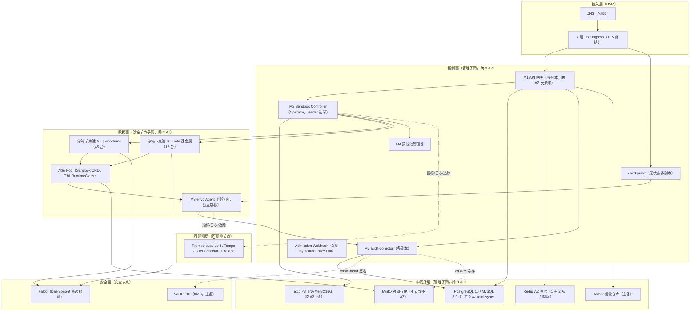

# AICoding 架构设计 · 部署设计

> 本文档为《AICoding 架构设计》核心产物之一，定位为**系统部署设计**。
> 上游输入：《系统设计》（G4 冻结）中的部署架构（§5）、网络架构（§6）、安全设计（§7）、可观测设计（§8）；
> 下游输出：环境与资源清单、部署拓扑、流水线、监控告警、应急回滚、容量成本等可落地的运维交付物。
> 产出者：`platform-architect`（部署架构师 - 毕落地）。

---

## 0. 元信息

| 文档版本 | 发布日期 | 修订人 | 修订说明 |
| --- | --- | --- | --- |
| v0.1 | 2026-08-19 | platform-architect（毕落地） | 骨架稿：§1 引言、§2 环境与资源清单、§3.1 物理拓扑、§3.2 流量与网络链路（三表），完成后回传 [交接·部署→安全] 等待安全侧信任域/NetworkPolicy 要求 |
| v1.0 | 2026-08-19 | platform-architect（毕落地） | 完整稿：回填安全侧要求（KMS/日志保留期/安全资源/流量管控），补齐 §3.3~§8 全章节，通过硬指标自检 |

> **部署形态与云厂商声明**：本系统为**通用设计、不绑定云厂商、自建 Kubernetes 集群**（`need_cloud_baseline_check=false`，无需 CloudQ 云资源核对）。全文所有资源均为**自建**，无云厂商资源 ID；CIDR/节点规格按「等价 VPC / 等价裸金属」规划，落地时可映射到任意 IaaS（物理机 / 虚拟机 / 主流云 ECS）。

---

## 1. 引言

### 1.1 适用范围与部署形态

| 维度 | 取值 |
| --- | --- |
| 部署形态 | 私有化自建（通用，不绑定云厂商）；控制面与数据面（沙箱）分离 |
| 跨 Region | 否（单 Region） |
| 跨 AZ | 是；AZ 数量 3（AZ-1 / AZ-2 / AZ-3） |
| 容灾级别 | MVP：单集群多 AZ；完整版：主备双集群（灾备 Region） |
| 隔离运行时 | 三档分层 runc（可信）/ gVisor（默认）/ Kata（强隔离），containerd CRI |
| 控制面 | 自研 CRD + Operator（M1~M7 七模块），接口对齐 e2b 七接口事实标准 |
| 治理存储 | PostgreSQL 16 / MySQL 8.0 二选一（方言抽象）+ Redis 7.2 + MinIO 对象存储 |
| 数据面接入 | 统一走 envd-proxy（无 DIRECT 直连）；预热池 SandboxWarmPool 跨 AZ 拓扑分布 |

> 本文档继承《系统设计》已冻结的模块拆分（M1~M7）、运行形态、外部依赖（E-01~E-05）、中间件清单（C-01~C-08）、SLA、可观测要求，不新增运行单元，不修改业务与系统边界。

### 1.2 名词与缩写

| 缩写 / 名词 | 英文 | 含义 |
| --- | --- | --- |
| Sandbox | — | 一个隔离执行环境（独立 fs/进程/网络/状态） |
| SandboxClass | — | 三档隔离策略模板（runc/gVisor/Kata） |
| SandboxClaim | — | 消费者对沙箱实例的声明式申请 |
| SandboxWarmPool | — | 预热的 Ready 沙箱池，亚秒分配 |
| envd | envd Agent | 沙箱内数据面 gRPC server（七接口执行原语） |
| envd-proxy | — | 数据面统一接入代理，`sandboxId → podIP:grpcPort` 路由透传 |
| CRD | CustomResourceDefinition | K8s 声明式主数据载体 |
| Operator | — | 自研控制器（M2 Sandbox Controller） |
| CRI | Container Runtime Interface | 容器运行时接口（containerd） |
| CSI | Container Storage Interface | 存储卷接口 |
| CNI | Container Network Interface | 网络插件接口（Calico） |
| HPA / CA | HorizontalPodAutoscaler / Cluster Autoscaler | 水平扩容 / 节点自动扩容 |
| WORM | Write Once Read Many | 一次性写入只读存储（审计冷存） |
| IDP / SSO | Identity Provider / Single Sign-On | 企业身份源 / 单点登录 |

---

## 2. 环境与资源清单

### 2.1 环境矩阵

| 环境 | 用途 | 集群隔离 | 数据 | 网络访问 | 隔离运行时 | 集群规格 |
| --- | --- | --- | --- | --- | --- | --- |
| dev | 开发自测 | 与其他系统共用（namespace 级隔离） | 模拟数据 | 内网 | runc + gVisor 两档 | 最小规格（3 节点，沙箱节点 2 台） |
| int | 联调 | 共用（namespace 级隔离） | 模拟数据 | 内网 | runc + gVisor 两档 | 中等规格（沙箱节点 4 台） |
| uat | 预发 / 验收 | 独立集群 | 仿生产（脱敏） | 内网 + 白名单 | 三档（runc/gVisor/Kata） | 接近生产（沙箱节点 8 台） |
| prod | 生产 | 独立集群 | 真实数据 | 公网 / 内网 | 三档（runc/gVisor/Kata） | 生产规格（1000 并发，沙箱节点 58 台） |

**隔离策略说明**：
- dev / int：与其他系统共用集群，仅以 namespace + RBAC + ResourceQuota 做逻辑隔离，共用控制面。
- uat / prod：独立集群（独立 etcd / 独立控制面 / 独立节点池），物理与逻辑双重隔离；prod 生产数据独立、跨 3 AZ。

### 2.2 资源清单

> 说明：本系统自建 K8s，不绑定云厂商。下表「产品」列填写自建组件名，「资源 ID」列为自建命名（落地映射到目标 IaaS 时替换为实际资源 ID）。所有规格为**生产环境（prod）**口径；dev/int/uat 按 §2.1 环境矩阵缩配，见 §8.1 容量推算。

#### 2.2.1 计算资源

| 资源编号 | 类型 | 产品 | 资源 ID | 名称 | 规格 | 数量 | 环境 | 复用 / 新建 | HA 方案 | 用途 |
| --- | --- | --- | --- | --- | --- | --- | --- | --- | --- | --- |
| R-C-001 | 节点（etcd 专用） | 自建 K8s 1.29 etcd | etcd-prod-{01..03} | etcd 节点 | 8C16G + NVMe SSD 500GB | 3 | prod | 新建 | raft 3 副本跨 AZ（每 AZ 1 副本） | K8s 控制面 etcd（CRD 主数据） |
| R-C-002 | 节点（控制面工作节点） | 自建 K8s 1.29 | ctrl-prod-{01..03} | 控制面工作节点 | 8C32G + NVMe SSD 200GB | 3 | prod | 新建 | 跨 AZ 反亲和（topologySpread maxSkew=1） | M1 网关 / M2 Operator / M4 预热池 / M7 audit-collector / envd-proxy |
| R-C-003 | 节点（沙箱节点池 A） | 自建 K8s 1.29 + gVisor + runc | sbx-gvisor-{01..45} | gVisor/runc 沙箱节点 | 32C128G + NVMe SSD 500GB | 45 | prod | 新建 | 跨 AZ 分布 + 节点自动补齐（CA） | 默认 gVisor 档 + 可信 runc 档沙箱 Pod（约 850 并发） |
| R-C-004 | 节点（沙箱节点池 B，Kata 专用） | 自建 K8s 1.29 + Kata 3.6（Dragonball） | sbx-kata-{01..13} | Kata 裸金属节点 | 32C128G 裸金属（KVM 使能）+ NVMe SSD 500GB | 13 | prod | 新建 | 污点 sandbox=vm + 跨 AZ 分布 | Kata 强隔离档沙箱 Pod（约 150 并发，需 KVM） |
| R-C-005 | 节点（可观测专用） | 自建 K8s 1.29 | obs-prod-{01..03} | 可观测节点 | 8C32G + NVMe SSD 1TB | 3 | prod | 新建 | Prometheus 多副本 + 跨 AZ | Prometheus / Loki / Tempo / OTel Collector / Grafana |
| R-C-006 | 节点（安全专用） | 自建 K8s 1.29 | sec-prod-{01..02} | 安全节点 | 4C16G + NVMe SSD 200GB | 2 | prod | 新建 | 主备 | Vault / Harbor / cert-manager / Falco |

> **Kata 裸金属说明**：Kata 3.x（Dragonball）需 KVM；目标 IaaS 无嵌套虚拟化时，Kata 节点池必须为裸金属或支持直通 KVM 的虚机，否则 Kata 档自动回退 gVisor（继承系统设计 §3.1.5 约束）。gVisor（systrap）无需 KVM。

#### 2.2.2 存储资源

| 资源编号 | 类型 | 产品 | 资源 ID | 名称 | 规格 | 容量 | 环境 | 复用 / 新建 | HA 方案 | 备份策略 |
| --- | --- | --- | --- | --- | --- | --- | --- | --- | --- | --- |
| R-S-001 | 块存储（etcd 数据盘） | NVMe SSD | etcd-disk-{01..03} | etcd 数据盘 | NVMe SSD（IOPS ≥ 50k） | 500GB × 3 | prod | 新建 | raft 冗余 | etcd 全量快照每 6h + WAL |
| R-S-002 | 块存储（治理库数据盘） | NVMe SSD | db-disk-{01..03} | PostgreSQL / MySQL 数据盘 | NVMe SSD | 2TB × 3（主从各 1） | prod | 新建 | 主从（1 主 2 从）semi-sync | 全量每日 + 增量 binlog 实时 |
| R-S-003 | 对象存储 | MinIO（S3 兼容） | minio-{01..04} | 对象存储节点盘 | 4 节点 × 16TB | 64TB（EC 冗余后可用约 32TB） | prod | 新建 | 多 AZ 4 节点 + 内置 EC 冗余 | 跨区域复制（完整版） |
| R-S-004 | 块存储（沙箱工作区 PVC） | CSI 卷（emptyDir/PVC） | workspace-pvc-* | 沙箱工作区卷 | fast-ssd StorageClass | 5Gi/沙箱（可配） | prod | 新建 | 随 Pod 生命周期 | 快照（VolumeSnapshot，完整版） |
| R-S-005 | 块存储（审计 spill 卷） | NVMe SSD | audit-spill-{01..04} | audit-collector spill 卷 | NVMe SSD | ≥ 100GB × 4 | prod | 新建 | 随副本 | 审计冷存 WORM（对象存储） |
| R-S-006 | 块存储（可观测日志盘） | NVMe SSD | obs-log-disk-{01..03} | Loki 日志盘 | NVMe SSD | 1TB × 3 | prod | 新建 | Loki 多副本 | 日志热 30~90 天 + 冷 180 天~1 年 |

#### 2.2.3 网络资源

| 资源编号 | 类型 | 产品 | 资源 ID | 名称 | 规格 | 环境 | 复用 / 新建 | 用途 |
| --- | --- | --- | --- | --- | --- | --- | --- | --- |
| R-N-001 | VPC（等价） | 自建 VPC 规划 | vpc-prod | 生产 VPC | 10.100.0.0/16 | prod | 新建 | 生产集群总网段 |
| R-N-002 | 子网（DMZ） | 自建子网 | subnet-dmz | DMZ 子网 | 10.100.0.0/24 | prod | 新建 | 7 层 LB / Ingress（TLS 终结） |
| R-N-003 | 子网（管理/中间件） | 自建子网 | subnet-mgmt-{az1..az3} | 管理子网（3 AZ） | 10.100.16.0/20、10.100.32.0/20、10.100.48.0/20 | prod | 新建 | 控制面 + 中间件 + 可观测 + 安全 |
| R-N-004 | 子网（沙箱节点） | 自建子网 | subnet-sbx-{az1..az3} | 沙箱节点子网（3 AZ） | 10.100.64.0/20、10.100.80.0/20、10.100.96.0/20 | prod | 新建 | 沙箱节点池（gVisor/Kata/runc） |
| R-N-005 | Pod CIDR | Calico v3.28 | pod-cidr | Pod 网段 | 10.200.0.0/14 | prod | 新建 | 沙箱 Pod IP（独立 Pod 网络身份） |
| R-N-006 | Service CIDR | K8s Service | svc-cidr | Service 网段 | 10.196.0.0/16 | prod | 新建 | K8s Service / ClusterIP |
| R-N-007 | 出站通道 | NAT 网关 + 出站代理 | egress-nat | 沙箱出站 NAT | 出站代理（egress 白名单） | prod | 新建 | 沙箱出站默认拒绝、白名单放行（pypi/registry/audit-collector） |

#### 2.2.4 中间件与平台服务

| 资源编号 | 类型 | 产品 | 资源 ID | 名称 | 规格 | 环境 | 复用 / 新建 | HA 方案 | 用途 |
| --- | --- | --- | --- | --- | --- | --- | --- | --- | --- |
| R-M-001 | 关系型数据库 | PostgreSQL 16 / MySQL 8.0（二选一） | db-{01..03} | 治理库主从 | 8C32G + 2TB × 3 | prod | 新建 | 主从（1 主 2 从）+ 审计表 semi-sync | 审计事件 / 配额计账 / 审批 / 幂等（库 sandbox_governance） |
| R-M-002 | 缓存 | Redis 7.2 | redis-{01..03} | Redis 哨兵 | 8C16G × 3（1 主 2 从）+ 3 哨兵 | prod | 新建 | 哨兵自动切换（≤30s） | 配额计数 / 限流 / 幂等 / 分布式锁 |
| R-M-003 | 对象存储 | MinIO（S3 兼容） | minio-{01..04} | MinIO 集群 | 4 节点 | prod | 新建 | 多 AZ + EC 冗余 | 快照 / Volume / 审计冷存 |
| R-M-004 | 容器编排 | Kubernetes 1.29 | k8s-prod | K8s 集群 | 多 AZ（见 §2.2.1） | prod | 新建 | 控制面 3 副本 + etcd 3 副本 | 服务部署 / 调度 / CRD / RuntimeClass |
| R-M-005 | 容器运行时 | containerd 1.7.x + gVisor/Kata/runc | containerd | 容器运行时 | 随节点 | prod | 新建 | 随节点 | CRI（RuntimeClass 三档切换） |
| R-M-006 | 网络插件 | Calico v3.28 | calico | CNI | 随节点 | prod | 新建 | 随节点 | NetworkPolicy（deny-all 基线） |
| R-M-007 | 镜像仓库 | Harbor v2.11 | harbor | 镜像仓库 | 4C16G × 2 | prod | 新建 | 主备 | 模板/agent 镜像 + 签名 + 漏洞扫描 |

> **KMS 与中间件的密钥托管关系**：中间件（PostgreSQL/MySQL/Redis/MinIO）的连接凭证、mTLS 证书私钥、哈希链 `server_secret` 统一由 HashiCorp Vault（KMS，见 §2.2.6 R-Sec-001）托管与动态拉取，禁止以明文写入 ConfigMap/环境变量（L4 配置层）。密钥分级（L1~L4）、访问控制、轮转周期由 security-architect 定义（其正式稿 §6），本侧按此配置 Vault 部署要点：证书轮换 90 天（cert-manager 不停机）、per-sandbox secret 随沙箱 TTL 短时下发、数据面一次性凭证（CredentialEnvelope JWT）120s 有效。

#### 2.2.5 可观测资源

| 资源编号 | 类型 | 产品 | 资源 ID | 名称 | 规格 | 环境 | 复用 / 新建 | 承载可观测维度 |
| --- | --- | --- | --- | --- | --- | --- | --- | --- |
| R-O-001 | 指标监控 | Prometheus 2.52 | prometheus-{01..02} | Prometheus | 4C16G × 2（多副本） | prod | 新建 | Metrics（50 万 series） |
| R-O-002 | 日志 | Loki 3.0 | loki-{01..03} | Loki 集群 | 4C16G × 3 | prod | 新建 | Logs（500GB/日，多租户索引） |
| R-O-003 | 链路追踪 | Tempo 2.5 | tempo-{01..02} | Tempo | 4C8G × 2 | prod | 新建 | Traces（1% 采样 + 错误/慢请求 100%） |
| R-O-004 | 采集器 | OpenTelemetry Collector 0.102 | otel-collector-{01..03} | OTel Collector | 2C4G × 3 | prod | 新建 | OTLP 汇聚（Metrics/Logs/Traces） |
| R-O-005 | 可视化 | Grafana | grafana-{01..02} | Grafana | 2C4G × 2 | prod | 新建 | Dashboard / 告警展示 |
| R-O-006 | 告警引擎 | Alertmanager | alertmanager-{01..02} | Alertmanager | 1C2G × 2 | prod | 新建 | 告警路由（P0~P3） |

> **日志分级与保留期（按 security-architect 权威定义消费）**：
> - 应用日志（业务 INFO+）：Loki 热存 30 天 + 冷存 180 天；异常日志（ERROR+）热存 90 天 + 冷存 1 年。
> - 沙箱 stdout/stderr：Loki 30 天（按 sandboxId 索引）。
> - **审计日志（权威项）**：热 90 天（PostgreSQL/MySQL `t_audit_event`，append-only 哈希链）+ **冷存 ≥ 1 年（MinIO WORM 不可篡改）**。审计字段清单由 security 定义：`seq / tenant_id / biz_id / owner_id / sandbox_id / event_type / params / result / source_ip / created_by / created_time / hash_chain`（与《系统设计》§4.2.1 `t_audit_event` 表结构一致，本侧日志管道按此字段采集与落库）。

#### 2.2.6 安全资源

| 资源编号 | 类型 | 产品 | 资源 ID | 名称 | 规格 | 环境 | 复用 / 新建 | HA 方案 | 用途 |
| --- | --- | --- | --- | --- | --- | --- | --- | --- | --- |
| R-Sec-001 | 密钥管理（KMS） | HashiCorp Vault 1.16 | vault-{01..02} | Vault 主备 | 2C4G × 2 | prod | 新建 | 主备 + 自动解封（unseal） | mTLS 证书 / per-sandbox secret / 哈希链 server_secret |
| R-Sec-002 | 证书签发 | cert-manager 1.14 | cert-manager | cert-manager | 随控制面 | prod | 新建 | 多副本 | mTLS 证书自动签发/轮转（90 天） |
| R-Sec-003 | 镜像安全 | Harbor（漏洞扫描 + cosign） | harbor-scan | Harbor 扫描 | 随 R-M-007 | prod | 新建 | 主备 | 镜像签名 + 漏洞扫描（Trivy） |
| R-Sec-004 | 逃逸检测 | Falco | falco | Falco | DaemonSet（每沙箱节点 1） | prod | 新建 | 随节点 | 容器逃逸 / 异常 syscall 检测（AL-01） |
| R-Sec-005 | 准入控制 | Admission Webhook（自研） | sandbox-webhook | 准入 Webhook | 2 副本 | prod | 新建 | failurePolicy: Fail + /readyz | 禁 hostPath/privileged + seccomp 注入 + runtimeClassName 校验 |
| R-Sec-006 | 网络策略 | Calico NetworkPolicy | netpol-* | NetworkPolicy 规则集 | 随 Calico | prod | 新建 | 随节点 | 默认拒绝 + 显式放通（deny-all 基线，见 §3.2.4） |
| R-Sec-007 | 节点安全组（等价） | 自建节点安全组 / 主机防火墙 | sg-node-* | 节点安全组规则 | 随节点 | prod | 新建 | 随节点 | 默认拒绝 + 显式放通；禁 0.0.0.0/0 开放 22/3306/5432/6379 |

> **KMS/Vault 配置要点（按 security 权威项消费）**：Vault 1.16 主备部署 + 自动解封（unseal，建议 Auto-unseal 对接外部 KMS 或 HSM）。密钥分级遵循《系统设计》§7.2.2 数据分级 L1~L4（L4 最高：密钥/审计原文/证书私钥/一次性凭证），分级与访问控制策略细节以 security-architect 正式稿 §6 为准。轮转：mTLS 证书 90 天（cert-manager 不停机轮转）、per-sandbox secret 随沙箱 TTL 短时下发、数据面一次性凭证（CredentialEnvelope JWT）120s 有效；哈希链 `server_secret` 由 Vault 托管不入库（防伪造锚点，见《系统设计》§4.2.1.6）。

### 2.3 复用资源清单

| 复用资源 ID | 原业务方 | 余量评估 | 隔离方式 |
| --- | --- | --- | --- |
| 无 | 无 | 无 | 无 |

> **说明**：本系统为**全新系统、自建 K8s 集群**（`need_cloud_baseline_check=false`），无存量云资源、无可复用资源；全部资源为新建。dev/int 环境虽与其他系统共用集群，但仅共享集群底座，本系统自身资源（namespace/节点池/中间件实例）均为新建，未复用他人业务资源，故 §2.3 无复用条目。此结论无需 CloudQ 核对（通用设计不绑定云厂商）。

---

## 3. 部署拓扑与高可用设计

### 3.1 物理拓扑

#### 3.1.1 物理拓扑图



#### 3.1.2 拓扑要素清单

| 要素 | 取值 |
| --- | --- |
| 跨 Region 部署 | 否（单 Region）；完整版主备双集群（灾备 Region，见 §3.3.5） |
| 跨 AZ 部署 | 是；AZ 数量 3（AZ-1 / AZ-2 / AZ-3） |
| 流量入口路径 | DNS → 7 层 LB/Ingress（DMZ，TLS 终结）→ API 网关（控制面）/ envd-proxy（数据面） |
| 内部调用路径 | K8s Service 发现（控制面 HTTP/gRPC）+ envd-proxy 转发（数据面 gRPC 双向流） |
| 数据库访问路径 | 连接池 + 主从切换（PostgreSQL 16 / MySQL 8.0 二选一，审计表 semi-sync） |
| 命名空间划分 | `sandbox-system`（控制面 M1/M2/M4/M7/envd-proxy/webhook）、`sandbox-tenant-{tenantId}`（每租户沙箱 Pod）、`monitoring`（可观测）、`security`（Vault/Harbor/Falco）、`infra`（中间件） |

### 3.2 流量与网络链路（连通视图）

#### 3.2.1 流量入口链路

| 组件 (R-xx) | 协议 - 端口 | TLS 终结 | 作用 |
| --- | --- | --- | --- |
| DNS | UDP/TCP 53 | — | 域名解析（公网） |
| 7 层 LB / Ingress（R-N-002） | HTTPS 443 / gRPC 443 | 是（LB 侧） | 公网入口 TLS 终结 + 流量分发 |
| M1 API 网关（R-C-002） | HTTP/HTTPS 80/443（REST/OpenAPI） | 是（经 LB） | 七接口控制面 + 认证 + 配额 + 审计埋点 |
| envd-proxy（R-C-002） | gRPC 443（双向流） | 是（经 LB） | 数据面统一接入代理（无 DIRECT 直连） |
| M2 Operator / CRD（R-C-002） | HTTPS 6443（K8s apiserver） | 是 | 声明式 apply SandboxClaim（集群内） |
| 管理控制台 | HTTPS 443 | 是 | Platform Engineer / OPS / Security 管理端 |

#### 3.2.2 内部互联链路

| 项 | 说明 |
| --- | --- |
| 服务发现 | K8s Service（控制面 ClusterIP）+ envd-proxy 路由表（Redis `sbx:conn:{sandboxId}` + 本地 LRU） |
| 服务间协议 | 控制面 HTTP/gRPC；数据面 gRPC 双向流（stdio/pty）；审计异步（gRPC/OTLP） |
| mTLS | 完整版启用（控制面↔envd 双向证书，cert-manager 签发）；MVP 数据面用 per-sandbox 短期凭证鉴权（JWT，scope 限定） |
| 数据库连接 | M1/M2/M7 → 连接池 → PostgreSQL/MySQL 主从（审计表 semi-sync 零丢失） |
| 缓存连接 | M1/M2/M4/envd-proxy → Redis 哨兵 VIP（自动切换 ≤30s） |
| 审计链路 | envd（M3）→ audit-collector（M7）→ t_audit_event（哈希链）+ 对象存储 WORM 冷存 |
| 数据面链路 | SDK → envd-proxy → podIP:grpcPort（envd Agent，per-sandbox token 鉴权） |

#### 3.2.3 跨网络互联

| 互联类型 | 通道 | 带宽 | 加密 | 用途 |
| --- | --- | --- | --- | --- |
| 跨 AZ（集群内） | 等价云内网（3 AZ 互连） | 10Gbps（等价） | 内网 TLS / mTLS | 控制面跨 AZ 反亲和、etcd raft、DB 主从同步 |
| 跨 VPC | 不涉及（单集群单 VPC） | — | — | — |
| 跨账号 | 不涉及（单租户自建） | — | — | — |
| 跨 Region（灾备） | 专线 / 公网加密（完整版主备双集群） | 按需 | TLS | 灾备 Region 数据同步（etcd 快照 + DB 复制 + MinIO 跨区复制） |

> **交接说明（已闭环）**：§3.1 物理拓扑 + §3.2 流量三表骨架已于 [交接·部署→安全] 回传，security-architect 信任域/网络分区/流量管控要求已回传，本侧已按权威方分配表落实于 §3.2.4 流量管控与 §7 上线自检，并回填 §2.2.4/§2.2.5/§2.2.6 安全项。

#### 3.2.4 流量管控（信任域 + NetworkPolicy + 节点安全组）

**信任域四层映射**（security-architect 权威定义，本侧按此落实网络分区）：

| 信任域 | 分区 | 承载（映射本侧资源） | 入站 | 出站 |
| --- | --- | --- | --- | --- |
| T0 不可信 | 公网 | SDK / 外部用户 | 仅 LB/Ingress 443 | — |
| T1 半可信 | DMZ | 7 层 LB / Ingress（R-N-002） | 仅公网 443 | 仅到网关/proxy 端口 |
| T2 可信 | 业务区(INT)+数据区(PROD) | 控制面 M1~M7 + 数据中间件（DB/Redis/MinIO） | 仅从 DMZ；数据区仅业务区应用层 | NAT 控制最小化 |
| T3 不可信 | 沙箱数据面 | 沙箱 Pod + envd Agent | 仅 envd-proxy/Router（deny-all 基线） | 默认拒绝，白名单 pypi/registry/audit-collector |
| T4 隔离 | DevOps/DEV | CI/CD / 运维 / 开发 | 与生产完全隔离 | 与 PROD 隔离 |

**NetworkPolicy 规则集（R-Sec-006，Calico 默认拒绝 + 显式放通）**：

| 规则 | 作用域 | 入站 | 出站 |
| --- | --- | --- | --- |
| NP-01 | `sandbox-tenant-{tenantId}`（沙箱 namespace） | deny-all 基线，仅放行 envd-proxy / Router（无 DIRECT） | 默认拒绝，白名单 pypi.org:443 / registry-1.docker.io:443 / audit-collector 端点 |
| NP-02 | `sandbox-system`（控制面） | 仅 DMZ（经 LB/Ingress）；内部 Service 互访显式放通 | 到中间件（DB/Redis/MinIO）+ K8s apiserver |
| NP-03 | `infra`（中间件） | 仅控制面应用层（M1/M2/M7） | 出站最小化（NAT 控制） |
| NP-04 | `monitoring` / `security` | 仅 OPS/安全运维通道 | 最小化 |

> **硬约束落实**：① VPC/子网 CIDR 不重叠，容器 CIDR（10.200.0.0/14）与节点 CIDR（10.100.0.0/16）不冲突；② DMZ 不直连 INT/PROD，数据区禁公网暴露；③ 沙箱 namespace deny-all NetworkPolicy 由 namespace 创建时一并 apply，先于首个 Pod 创建（避免无策略窗口，见《系统设计》§7.2.5）；④ 生产出公网仅经 NAT 网关 + 出站代理（R-N-007）。

**节点安全组规则集（R-Sec-007，默认拒绝 + 显式放通）**：

| 规则 | 源/目标 | 端口 | 说明 |
| --- | --- | --- | --- |
| SG-01 | 堡垒机 → 各节点 | 22（SSH 密钥登录，禁 root 远程登录） | 运维通道，禁 0.0.0.0/0 开放 22 |
| SG-02 | 控制面 → 中间件 | 5432（PG）/ 3306（MySQL）/ 6379（Redis）/ 9000（MinIO） | 禁 0.0.0.0/0 开放 3306/5432/6379 |
| SG-03 | 沙箱节点 → audit-collector | gRPC 端口 | 审计上报通道 |
| SG-04 | 节点 → K8s apiserver | 6443 | 控制面通信 |

### 3.3 高可用与故障容错

#### 3.3.1 故障域划分

| 故障域 | 影响范围 | 容错机制 | 预期 RTO |
| --- | --- | --- | --- |
| 单 Pod | 单实例（控制面/沙箱） | K8s 自动重建（Liveness 失败重启） | 低于 30s（瞬时无影响） |
| 单 Node | 该 Node 上全部 Pod | K8s 调度到其他 Node（沙箱 Pod 可丢弃重建） | 低于 1min |
| 单 AZ | 该 AZ 全部资源 | 跨 AZ 部署（控制面反亲和 + 预热池 topologySpread maxSkew=1）自动切换 | ≤ 5min |
| 单 Region | 全部主资源 | 灾备集群切换（完整版主备双集群） | ≤ 30min |

> **可用性来源拆分**（继承《系统设计》§5.2.4）：
> - 基础设施兜底（自建 HA）：K8s 集群 / etcd raft / PostgreSQL/MySQL 主从 / Redis 哨兵 / MinIO EC 冗余 —— 平台基建团队负责；
> - 本系统自身保障：控制面无状态多副本 / Operator 多副本 leader 选举 / 熔断降级 —— 研发团队负责；
> - 数据面沙箱：沙箱 Pod 可丢弃重建（无状态执行，有状态 workspace 走 PVC）—— 研发团队负责。

#### 3.3.2 负载均衡

| 维度 | 取值 |
| --- | --- |
| 类型 | 7 层（L7，LB/Ingress），数据面 gRPC 经 envd-proxy（无状态多副本 + LB 分发） |
| 4 层 | 控制面无需独立 4 层 LB（K8s Service/Ingress 承载）；完整版灾备 Region 用专线 4 层互通 |
| 健康检查路径 | `/healthz`（Liveness）/ `/readyz`（Readiness）；envd-proxy 转发病例检查 agent `/healthz` |
| 会话保持 | 否（控制面无状态；数据面 gRPC 双向流经 envd-proxy 透传，不依赖 LB 会话保持） |

#### 3.3.3 健康检查配置

| 探针 | 路径 | 频率 | 失败阈值 | 恢复阈值 | 判定内容 |
| --- | --- | --- | --- | --- | --- |
| Liveness | `/healthz` | 10s | 连续 3 次失败 | 连续 2 次成功 | 仅判进程存活，失败重启 Pod |
| Readiness | `/readyz` | 10s | 连续 3 次失败 | 连续 2 次成功 | 仅判 hard 依赖（K8s apiserver 可达 + DB 连通）；Redis 为 soft 依赖（不可用仍返 200，请求层降级） |
| envd Agent | gRPC `Health`（沙箱内 `/healthz`） | Operator 探活 | 连续 N 次失败 → Failed | — | 沙箱 Ready 需 Pod Ready + agent health 双探活 |

#### 3.3.4 弹性伸缩配置

| 对象 | 触发指标 | 扩容阈值 | 缩容阈值 | 伸缩区间 | 冷却时间 |
| --- | --- | --- | --- | --- | --- |
| 控制面 Pod（M1/M7/envd-proxy） | CPU | CPU 高于 70% 持续 5min | CPU 低于 30% 持续 10min | min 2 / max 20（HPA） | 扩容 60s / 缩容 5min |
| Operator（M2） | reconcile 队列长度 | 队列长度高于阈值 | — | 固定 leader + 多 worker（MaxConcurrentReconciles） | — |
| 沙箱节点（CA） | 预热池 idle 低于 min / 节点容量高于 80% | 节点容量高于 80% | 节点容量低于 50% | 按 1000 并发（§8.1） | 扩容低于 5min |
| 预热池（M4） | idle 水位 | idle 低于 minSize 补足 | idle 高于 maxSize 裁剪 | min 5 / max 50（默认，可配） | — |

#### 3.3.5 容灾切换配置

| 维度 | 取值 |
| --- | --- |
| 容灾级别 | MVP：单集群多 AZ；完整版：主备双集群（灾备 Region） |
| 故障切换 RTO | ≤ 30 分钟（与 §5.3 SLA 自洽） |
| 跨集群数据同步 | etcd 快照（每 6h + WAL）+ PostgreSQL/MySQL 复制（审计表 semi-sync 零丢失，其余治理表异步延迟低于 1min）+ MinIO 跨区域复制 |
| 切换方式 | 手动切换（完整版）+ 演练验证（季度，`@平台基建`） |

---

## 4. 部署流程

### 4.1 代码仓库与分支

| 项 | 规范 / 值 | 说明 |
| --- | --- | --- |
| 代码仓库地址 | 内部 Git（Go monorepo `agent-sandbox-platform/` + frontend） | 平台基建统一托管 |
| 分支管理 | trunk-based + release 分支；`main`（主干）/ `release/x.y`（发布线）/ `hotfix/*` | 主干随时可发布，release 分支冻结 |
| 合并规范 | PR + 至少 1 名 Owner approve + CI 全绿；禁止直接 push main | 保护分支 + code owner |
| 标签规范 | `v{major}.{minor}.{patch}`（如 v0.1.0）；镜像 tag 附 `-{commit-sha-short}` | 与 §4.3 镜像命名对齐 |

### 4.2 流水线（CI / CD）

| 阶段 | 触发条件 | 关键动作 | 失败处理 |
| --- | --- | --- | --- |
| 1. 构建 | 自动（push / PR） | 拉代码 → 编译（Go 1.22）→ 单元测试 → 构建产物 | 阻断后续阶段 |
| 2. 代码扫描 | 构建后 | 静态扫描（SonarQube / golangci-lint）→ 代码规范 → 复杂度 | 不达标阻断 |
| 3. 安全扫描 | 构建后 | SCA（依赖漏洞）+ SAST（代码漏洞）+ 镜像漏洞扫描（Trivy） | 高危阻断 |
| 4. 集成测试 | 合并到集成分支 | 集成测试 / 接口测试 / 契约测试（对齐 e2b 七接口） | 阻断后续阶段 |
| 5. 制品打包构建 | 构建/测试通过 | 构建镜像（M1~M7 组件）+ 签名（cosign）→ 推送 Harbor 并打 Tag | 失败重试 |
| 6. 部署集成环境 | Package 完成 | 自动部署到 dev / int 环境 | 失败回滚到上一版本 |
| 7. 部署测试环境 | 手动触发 | 部署到 uat 预发；冒烟测试 | 失败回滚到上一版本 |
| 8. 部署生产环境 | 人工审批 | 按发布策略滚动上线（§4.5），生产灰度 | 按回滚策略实施回滚（§6） |

### 4.3 构建产物与制品管理

| 配置项 | 配置值 / 规则 | 说明 |
| --- | --- | --- |
| 产物类型 | 容器镜像（M1/M2/M4/M5/M6/M7/envd-proxy）+ Go 二进制（envd Agent 单二进制）+ 前端静态包（console）+ SDK（Python/Go） | — |
| 镜像仓库 | Harbor v2.11（R-M-007）+ 命名空间 `agent-sandbox/` | 自建 |
| 镜像命名 | `agent-sandbox/{service}:{git-tag}-{commit-sha-short}` | 如 `agent-sandbox/apiserver:v0.1.0-a1b2c3d` |
| 制品保留期 | 镜像 90 天（prod）/ 30 天（非 prod）；SDK 包永久保留 | — |
| 制品溯源 | manifest + Label 含 `git-commit` / `build-time` / `pipeline-id` | 便于反查源码 |
| 签名与校验 | cosign 签名（完整版强制）+ Harbor 漏洞扫描（高危 0 阻断） | 部署时 verify 签名 |

### 4.4 配置管理

> 配置中心选型：K8s ConfigMap + Secret（引用 Vault）；环境隔离：每环境独立 ConfigMap/Secret；版本管理：GitOps（ArgoCD/Flux 可选用）追踪；动态配置下发：ConfigMap 热重载（监听回调）。

| 层级 | 存放位置 | 适用内容 | 变更生效 | 约束 |
| --- | --- | --- | --- | --- |
| L1 代码内 | 代码仓库 | 默认值、枚举、常量 | 重新部署 | 禁止写入环境差异、密码、地址 |
| L2 配置中心 | K8s ConfigMap + 热重载 | 限流阈值、配额上限、降级开关（BD-01/03） | 热更新（监听回调） | 变更必须幂等 |
| L3 环境变量 / ConfigMap | K8s ConfigMap | DB 地址、对象存储端点、外部域名 | 重启 Pod | 启动失败 fail-fast |
| L4 Secret | Vault（KMS）动态拉取 | 密码、证书私钥、per-sandbox secret、哈希链 server_secret | 动态拉取 | 禁止落日志/入代码/入 ConfigMap 明文 |

> **紧急降级操作手册**（oncall 手动覆盖，继承《系统设计》§5.1）：每个 BD-xx 对应 `kubectl -n sandbox-system patch configmap sandbox-config --type merge -p '{"data":{"xxx":"yyy"}}'` 命令；全局降级总开关 `degradation.force=true`。oncall 现场即时生效，无需走发布流程，恢复后改回原值。

### 4.5 发布策略

#### 4.5.1 发布方式

> 控制面（M1/M2/M4/M7/envd-proxy）统一采用**滚动发布**；沙箱数据面（envd Agent 镜像）采用**预热池 OnReplenish 渐进替换**（不重启在跑沙箱）；模板镜像经 SandboxTemplate 版本治理（tags 不可变）。

| 模块 | 发布方式 | 说明 |
| --- | --- | --- |
| M1 API 网关 | 滚动发布（maxSurge=1, maxUnavailable=0） | 无状态，零停机，跨 AZ 反亲和保证 SLA |
| M2 Operator | 滚动发布 + leader 选举 | 多副本 leader election，切换时 reconcile 幂等（§3.2.M2.5） |
| M4 预热池管理器 | 滚动发布 | 无状态 |
| M7 audit-collector | 滚动发布（maxUnavailable=0） | 审计无状态多副本，DB 为唯一权威 |
| envd-proxy | 滚动发布 | 无状态，本地 LRU 失效重连后全量回源 |
| M3 envd Agent（沙箱内） | 预热池 OnReplenish 渐进替换 | 仅新补给应用新镜像，在跑沙箱不重启 |
| M5 Template Builder / M6 Snapshot | 滚动发布 | 支撑域 |

#### 4.5.2 发布标准流程

- **首次发布**（含资源初始化）：创建 namespace（含 deny-all NetworkPolicy 先于首个 Pod）→ 部署中间件（PG/MySQL 主从、Redis 哨兵、MinIO）→ 初始化 Vault 与密钥 → 安装 CRD + Operator → 部署网关/envd-proxy/audit-collector → 创建 SandboxClass/SandboxTemplate → 冒烟验证。
- **常规迭代发布**：int → uat → prod 逐环境滚动，每环境门禁通过后放行下一环境。
- **资源变更流程**：CRD schema 变更走 v1alpha1 演进 + conversion（AG-10）；中间件升配走 §8.1.3 扩容路径；不可回滚 DDL 前置变更（§6.1.3）。

#### 4.5.3 灰度路径与观测窗口

| 批次 | 范围 | 观测时长 | 放量条件 |
| --- | --- | --- | --- |
| 第 1 批 | int 全量 | 2h | 冒烟 + 集成测试通过 |
| 第 2 批 | uat 全量 | 1d | 回归通过 + 无 P0/P1 告警 |
| 第 3 批 | prod 1 副本（金丝雀） | 30min | RED 指标正常 + 错误率不高于 1% |
| 第 4 批 | prod 全量（滚动） | 持续观测 24h | 金丝雀观测窗口内无告警 |

#### 4.5.4 发布门禁

| 门禁项 | 拦截条件 | 检查时机 |
| --- | --- | --- |
| 单元测试通过率 | 100% | Build 阶段 |
| 单元测试覆盖率（增量） | ≥ 70% | 代码扫描阶段 |
| 集成测试通过率 | 100% | 集成测试阶段 |
| 静态扫描严重问题数 | 0（高危）；中危需评审 | 代码扫描阶段 |
| 安全扫描高危漏洞 | 0 | 安全扫描阶段 |
| 镜像漏洞 | 高危 0 | 制品扫描 |
| 接口契约校验 | 兼容（不破坏 e2b 七接口在网调用方） | 集成测试阶段 |
| 性能基线 | P99 不退化（创建 P95 ≤ 500ms 预热 / ≤ 3s 冷） | 性能测试 |
| 人工审批 | 至少 1 名 Owner | 生产发布前 |

---

## 5. 监控告警接入

### 5.1 监控架构与数据流

```text
Pod / 沙箱 / 中间件 ──┬─► Metrics ──► Prometheus (R-O-001) ──► Grafana (R-O-005)
                      ├─► Logs    ──► Loki (R-O-002) / 审计 t_audit_event + WORM (R-O-003 对象存储)
                      └─► Traces  ──► OTel Collector (R-O-004) ──► Tempo (R-O-003)
                                              ▼
                                       Alertmanager (R-O-006)
                                              ▼
                                  电话 / 短信 / IM（§5.4 告警通道）
```

> 指标采集：node-exporter + cAdvisor（节点/沙箱）+ 自定义埋点（M1/M2/M3/M4/M7 Prometheus exporter）+ 中间件 exporter（PG/MySQL/Redis/etcd）。日志采集：DaemonSet（Promtail/Fluent Bit）采 Pod stdout + 平台组件日志。追踪：OpenTelemetry 埋点（W3C TraceContext），OTLP → Tempo。

### 5.2 关键 Dashboard 清单

| 大盘 | 用户 | 指标 |
| --- | --- | --- |
| 沙箱业务大盘 | 产品 / 业务 | 沙箱数按 phase/class/owner、隔离覆盖率、创建时延 P95 |
| 控制面健康大盘 | 研发 / SRE | 网关 RED、Operator reconcile 时延/队列长度、envd-proxy 路由命中率 |
| 数据面执行大盘 | 研发 | envd gRPC 错误率、流式时延、文件/命令吞吐 |
| 隔离运行时大盘 | SRE | gVisor/Kata 启动时延、syscall 失败率、hypervisor 开销 |
| 容量与预热池大盘 | SRE | 节点水位、池命中率、隔离层内存总量（≤15GB） |
| 业务预警大盘 | On-call | 当前活跃告警（P0~P3） |

### 5.3 告警规则清单

| 编号 | 级别 | 触发条件 | 关联资源 (R-xx) | Owner | Runbook |
| --- | --- | --- | --- | --- | --- |
| AL-01 | P0 | 逃逸检测事件（Falco 规则命中） | R-Sec-004 | `@安全合规` | RB-01 |
| AL-02 | P0 | 控制面 5xx 错误率高于 1% 持续 5min | R-C-002 | `@研发` | RB-02 |
| AL-03 | P0 | 沙箱创建失败率高于 5% 持续 5min | R-C-003/004 | `@研发` | RB-02 |
| AL-04 | P1 | 创建时延 P99 高于 3s 持续 5min | R-C-002 | `@研发` | RB-03 |
| AL-05 | P1 | 隔离层内存高于 15GB 持续 10min | R-C-003 | `@运维` | RB-03 |
| AL-06 | P2 | 预热池命中率低于 60% 持续 10min | R-M-004（WarmPool） | `@运维` | RB-03 |
| AL-07 | P2 | 单节点 NotReady | R-C-001~004 | `@运维` | RB-04 |
| AL-08 | P3 | 沙箱节点容量高于 80% 持续 30min | R-C-003/004 | `@运维` | RB-04 |
| AL-09 | P0 | 审计哈希链校验失败（重算比对不一致） | R-M-001 | `@安全合规` | RB-01 |
| AL-10 | P1 | 配额对账偏差（Redis 计数与 K8s 实际 Pod 数不一致） | R-M-002 | `@研发` | RB-03 |
| AL-11 | P1 | 审计 flush 失败（沙箱销毁前 outbox 仍有未 ACK 事件） | R-M-001 / R-S-005 | `@安全合规` | RB-01 |
| AL-12 | P1 | 配额账本写入压力（t_owner_quota 写 QPS 超预算 / 事务 P99 超阈值 / 连接池耗尽） | R-M-001 | `@研发` | RB-03 |
| AL-13 | P2 | t_idempotency_key 表大小超 85% 容量预算（触发墓碑自动归档） | R-M-001 | `@运维` | RB-04 |
| AL-14 | P0 | 审计 workload identity 校验失败（疑似伪造审计事件） | R-M-001 / R-Sec-001 | `@安全合规` | RB-01 |

### 5.4 告警通道

| 级别 | 响应时间 | 通知方式 | 上升机制 |
| --- | --- | --- | --- |
| P0 | ≤ 5 min | 电话 + 短信 + IM | 15min 未响应升级至 Manager |
| P1 | ≤ 15 min | 短信 + IM | 30min 未响应升级至 Manager |
| P2 | ≤ 1 h | IM | 工作时间未响应升级 |
| P3 | 工作时间 | IM / 邮件 | — |

---

## 6. 应急与回滚

### 6.1 回滚机制

#### 6.1.1 回滚触发条件

- 生产错误率高于 1% 持续 5min（P0，AL-02）；
- 创建时延 P99 高于 3s 或 P90 耗时明显退化（AL-04）；
- 沙箱创建失败率高于 5%（AL-03）；
- 发布灰度窗口内触发任一 P0/P1 告警。

#### 6.1.2 回滚决策人

- On-call 主值班可独立决定 P0 回滚（无需审批，先止血）；
- P1/P2 由 Owner 决定（`@研发` / `@运维`）；
- 数据面沙箱无"回滚"概念（临时实例，重建即恢复），仅控制面回滚。

#### 6.1.3 回滚执行 SOP

| 对象 | 回滚方式 | 预计耗时 | 有损风险 / 数据丢失 |
| --- | --- | --- | --- |
| 应用版本（控制面） | 流水线"一键回滚" → 上一镜像 Tag（Harbor 保留 90 天） | ≤ 5 min | 无（无状态） |
| 配置（ConfigMap/Secret） | 配置中心保留 N 个历史版本（GitOps 回滚） | 低于 1 min | 无 |
| 数据库资源（DDL） | DDL 变更必须可回滚；不可回滚 DDL（如 DROP COLUMN）禁止与代码同发布，须前置变更 | 低于 30 min | 有（前置变更后无） |
| CRD schema | v1alpha1 conversion 兼容，回滚旧版本 Operator | ≤ 5 min | 无（conversion 保护） |

### 6.2 故障应急 Runbook

#### 6.2.1 Runbook 索引

| Runbook 编号 | 关联告警 | 故障场景 | Owner |
| --- | --- | --- | --- |
| RB-01 | AL-01 / AL-09 / AL-11 / AL-14 | 安全事件（逃逸检测 / 哈希链失败 / 审计 flush 失败 / 身份伪造） | `@安全合规` |
| RB-02 | AL-02 / AL-03 | 控制面不可用 / 沙箱创建大面积失败 | `@研发` |
| RB-03 | AL-04 / AL-05 / AL-06 / AL-10 / AL-12 | 性能 / 资源 / 配额异常 | `@研发` |
| RB-04 | AL-07 / AL-08 / AL-13 | 节点 / 容量故障 | `@运维` |

#### 6.2.2 Runbook 编写规范

每条 Runbook 按以下结构编写：**症状**（可观测特征）→ **诊断**（按顺序，明确工具与查询路径）→ **缓解**（分场景，衔接回滚 §6.1 / 降级 / 限流 / 切换）→ **升级**（缓解未生效的升级条件、路径与对外通告）。

#### 6.2.3 RB-01：安全事件处置

- **症状**：Falco 命中逃逸规则（AL-01）、审计哈希链重算不一致（AL-09）、沙箱销毁前审计 flush 阻塞（AL-11）、audit-collector 报告 workload identity 校验失败（AL-14）。
- **诊断（按顺序执行）**：
  1. 登录 Grafana 安全大盘，确认告警来源与沙箱 sandboxId / ownerId；
  2. 查询 Loki 该 sandboxId 的 stdout/stderr 与 envd 日志，定位可疑命令 / syscall；
  3. 查询 audit-collector 落库 t_audit_event（按 biz_id/event_id）确认审计事件是否入库、哈希链是否断裂；
  4. 对 AL-14：核对疑似伪造事件的 workload identity 证书来源，比对 bound Pod UID 与权威 DB/CRD。
- **缓解**：
  - 场景 A（逃逸/伪造）→ 立即 kill 涉事沙箱（`kubectl delete sandboxclaim` / 网关 DELETE）+ 隔离涉事租户 namespace（deny-all 收紧）；
  - 场景 B（哈希链断裂）→ 暂停审计冷存写入，按 §4.2.1.6 链断裂恢复 SOP（回补 binlog / 新建分区锚点）；
  - 场景 C（flush 阻塞）→ 触发 BD-03 审计 spill 落盘降级，核查 collector 与 DB 连通性，恢复后补投。
- **升级**：缓解 15min 未生效 → 升级至 `@安全合规` Owner 与安全 SOC；若判定为真实逃逸，启动合规事件上报与外部通告机制。

#### 6.2.4 RB-02：控制面不可用 / 创建失败

- **症状**：控制面 5xx 错误率高于 1%（AL-02）、沙箱创建失败率高于 5%（AL-03）。
- **诊断（按顺序执行）**：
  1. 查控制面健康大盘，定位失败模块（网关 / Operator / envd-proxy / DB / Redis）；
  2. 查 `/readyz` 状态：Redis soft 依赖不可用仍返 200，DB 不可用则摘流；
  3. 查 Operator reconcile 队列长度与 leader 状态（`kubectl get leases`）；
  4. 查 etcd write QPS 与 `etcd_server_apply_duration_seconds` P99（是否贴近 1000 上限）。
- **缓解**：
  - 场景 A（DB 不可用）→ 配额/幂等 fail-closed 返回系统错误，待 DB 恢复重试；
  - 场景 B（Redis 不可用）→ 触发降级（配额走 DB 原子条件更新，审计 spill 落盘）；
  - 场景 C（Operator 队列积压）→ 临时提升 MaxConcurrentReconciles，或水平扩控制面节点。
- **升级**：缓解 15min 未生效 → 升级至 `@研发` Owner，评估回滚上一版本（§6.1）。

#### 6.2.5 RB-03：性能 / 资源 / 配额异常

- **症状**：创建时延 P99 高于 3s（AL-04）、隔离层内存高于 15GB（AL-05）、预热池命中率低于 60%（AL-06）、配额对账偏差（AL-10）、配额账本写入压力（AL-12）。
- **诊断（按顺序执行）**：
  1. 查 Tempo 追踪（`operator.reconcile` / `apiserver.create` span），定位 P95 时延瓶颈（领池 vs 建 Pod vs 拉镜像 vs agent health）；
  2. 查容量与预热池大盘，确认预热池 idle 水位与节点容量；
  3. 查 t_owner_quota 写 QPS / 配额事务 P99 / 连接池耗尽次数；
  4. 查配额对账 Job 日志，比对 Redis 计数与 K8s 实际 Pod 数。
- **缓解**：
  - 场景 A（预热池耗尽）→ 触发 BD-01 领池短路转按需建（冷启动 ≤ 3s），或调高 minSize；
  - 场景 B（资源超限）→ 触发扩容（§8.1.3）或红线限流（§5.5.4）；
  - 场景 C（配额偏差）→ 对账 Job 增量校正（INCRBY/DECRBY），偏差收敛。
- **升级**：缓解 30min 未生效 → 升级至 `@研发` / `@运维` Owner。

#### 6.2.6 RB-04：节点 / 容量故障

- **症状**：单节点 NotReady（AL-07）、沙箱节点容量高于 80%（AL-08）、t_idempotency_key 表超 85%（AL-13）。
- **诊断（按顺序执行）**：
  1. 查节点健康（`kubectl get nodes` / node-exporter USE 指标），定位 NotReady 原因（kubelet / 网络 / 磁盘）；
  2. 查容量大盘，确认节点水位与沙箱分布；
  3. 查 t_idempotency_key 表大小与墓碑归档进度。
- **缓解**：
  - 场景 A（单节点故障）→ K8s 自动调度沙箱 Pod 到其他节点（沙箱可丢弃重建），驱逐 NotReady 节点；
  - 场景 B（容量告警）→ 触发 Cluster Autoscaler 扩容 / 手工加节点；
  - 场景 C（幂等表膨胀）→ 触发墓碑自动归档（软删 + 延迟物理删除）。
- **升级**：缓解 1h 未生效 → 升级至 `@运维` Owner，评估灾备切换（完整版）。

---

## 7. 安全合规（部署视角）

### 7.1 上线前安全自检

| 编号 | 检查项 | 检查内容 / 标准 | 责任人 | 检查时机 | 是否通过 |
| --- | --- | --- | --- | --- | --- |
| 7.1.1 | 《安全架构设计》清单自检 | 对照 security-architect 正式稿逐项核验 | `@安全合规` | 上线前 | 待检 |
| 7.1.2 | 合规系统经合规负责人/委员会评审 | 审计保留期（热 90 天 / 冷存 ≥1 年）、WORM 不可篡改 | `@安全合规` | 上线前 | 待检 |
| 7.1.3 | 公网暴露面评估 | 仅 LB/Ingress 443 暴露；数据区禁公网；80 强制跳 443 | `@运维` | 上线前 | 待检 |
| 7.1.4 | 安全组开放性检查 | 节点安全组默认拒绝；禁 0.0.0.0/0 开放 22/3306/5432/6379 | `@运维` | 上线前 | 待检 |
| 7.1.5 | 安全组件接入 | Admission Webhook（failurePolicy Fail）、Falco、Harbor 扫描、cert-manager | `@安全合规` | 上线前 | 待检 |
| 7.1.6 | KMS/凭证管理（明文票据） | Vault 托管密钥，禁明文入 ConfigMap/代码/日志 | `@安全合规` | 上线前 | 待检 |
| 7.1.7 | 代码漏洞扫描 | SAST/SCA 高危 0 | `@研发` | 发布前 | 待检 |
| 7.1.8 | 镜像漏洞扫描 | Harbor/Trivy 高危 0 + cosign 签名 | `@研发` | 发布前 | 待检 |
| 7.1.9 | 系统上线前扫描 | 全量漏洞 + 基线扫描（CIS K8s 基线） | `@安全合规` | 上线前 | 待检 |

> **WAF 说明**：security-architect 权威项「WAF→Ingress 访问控制 + 输入校验」（自建等价映射，不引入独立 WAF 厂商，与《系统设计》§7.1「WAF 否（不适用）」一致）。公网暴露面策略：仅暴露 443，由 LB 限流 + Ingress 访问控制 + 网关三维限流（全局/租户/IP）替代 WAF。

### 7.2 凭证与密钥清单

| 凭证编号 | 类型 | 存储方式 | 所有人 | 用途 |
| --- | --- | --- | --- | --- |
| K-01 | mTLS 证书私钥（控制面↔envd） | Vault（R-Sec-001） | `@安全合规` | 数据面双向证书（完整版） |
| K-02 | per-sandbox secret | Vault 动态下发（TTL=沙箱 TTL） | `@安全合规` | 沙箱级凭据注入（非环境级） |
| K-03 | 数据面一次性凭证（CredentialEnvelope JWT） | 网关签发（120s，不落库） | `@研发` | SDK 调 envd 鉴权（scope 限定） |
| K-04 | 哈希链 server_secret | Vault（不入库） | `@安全合规` | t_audit_event 哈希链锚点 HMAC |
| K-05 | 中间件连接凭证（PG/MySQL/Redis/MinIO） | Vault 动态拉取 | `@安全合规` | 控制面连中间件 |
| K-06 | IDP/SSO 密钥 | Vault | `@安全合规` | JWT 验签（JWKS 轮换） |

### 7.3 访问审计接入

| 审计源 | 去向 | 保留期 | 是否启用 |
| --- | --- | --- | --- |
| 生命周期审计（CREATE/KILL） | M7 → t_audit_event（哈希链）+ WORM 冷存 | 热 90 天 / 冷存 ≥1 年 | 是 |
| 执行审计（EXEC/FS_WRITE/SPAWN） | envd → M7 → t_audit_event + WORM | 热 90 天 / 冷存 ≥1 年 | 是 |
| K8s audit log | Loki | 30 天 | 是 |
| 运维通道（堡垒机 SSH） | 运维日志系统 | 180 天 | 是 |
| 数据库审计（PG/MySQL 慢查询/DDL） | Loki + 对象存储 | 30 天 | 是 |

---

## 8. 容量与成本

### 8.1 容量规划

#### 8.1.1 业务量预估

| 业务指标 | 当前值 | MVP 阶段值 | 生产阶段值 | 备注 |
| --- | --- | --- | --- | --- |
| 峰值并发沙箱实例 | — | 1000 | 1000 | 用户原始诉求（N1） |
| 峰值创建 QPS | — | 50 | 200 | 推算（1000 并发 × 分配率） |
| 审计事件量 / 天 | — | 50 万条 | 100 万条 | 推算 |
| 隔离层内存总量 | — | ≤ 15GB | ≤ 15GB（gVisor 档） | 高层 V4 |
| 注册用户 / DAU | — | — | 内部平台（不做对外计费） | Out-of-Scope O4 |

#### 8.1.2 资源容量推算

| 资源 | 推算公式 | 当前配置（MVP） | 生产阶段配置 |
| --- | --- | --- | --- |
| 控制面实例数 | 峰值 QPS / 单实例 QPS × 冗余 1.5 | 2 | 4（M1/M7/envd-proxy 各 ≥2，跨 AZ） |
| 沙箱节点数 | 1000 并发 × 单沙箱资源 / 单节点容量 × 冗余 | 按需 | 58 台（gVisor/runc 45 + Kata 裸金属 13） |
| PostgreSQL/MySQL | 审计 100 万条/日 × 保留 90 天热 + 冷存 WORM | 4C16G + 500GB | 8C32G + 2TB × 3（主从） |
| Redis | 单 Key × 10 万 × 1.3 | 4C8G | 8C16G × 3（哨兵） |
| 对象存储（MinIO） | 快照 + 审计冷存（≥1 年） | 按需 | 4 节点 × 16TB（EC 后约 32TB） |
| audit-collector（M7） | 200 QPS 审计事件 × 单事件写 1 次 | 2 副本 | 4 副本（跨 AZ）；每副本 spill 卷 ≥100GB |
| etcd（K8s） | 峰值 write QPS ≈ 800-1000（每沙箱 4-5 次 write × 200 QPS） | 3 副本 | 3 副本 NVMe SSD + 8C16G |

> **单沙箱资源与节点承载口径**：gVisor 默认档 cpu 1 + memory 2Gi（SandboxClass.defaultResources），gVisor systrap 预留 30% CPU overhead；Kata 强隔离档 cpu 2 + memory 4Gi（Pod Overhead 计入）。单节点 32C128G 承载：gVisor 节点约 20 沙箱（CPU 32/(1×1.3) 受限）、Kata 节点约 15 沙箱（CPU 32/2 受限）。节点池 A（45 台）承载约 800 gVisor + 50 runc = 850 并发；节点池 B（13 台）承载约 150 Kata 并发。etcd 写入压力、gVisor CPU overhead、配额账本写入预算详见《系统设计》§5.5.2。

#### 8.1.3 扩容触发与路径

| 资源 | 扩容触发指标 | 扩容方式 | 扩容耗时 |
| --- | --- | --- | --- |
| 控制面 Pod | CPU 高于 70% 持续 5min | HPA 自动扩（min 2 / max 20） | 低于 1min |
| 沙箱节点 | 预热池 idle 低于 min / 节点容量高于 80% | Cluster Autoscaler / 手工加节点 | 低于 5min |
| PostgreSQL/MySQL | CPU 高于 80% / IOPS 高于 80% | 升配 / 读写分离 | 低于 30min |
| Redis | 内存高于 70% | 升配 / 集群扩节点 | 低于 30min |
| 对象存储 | 容量高于 80% | 自动扩展（加节点） | 低于 10min |
| etcd | write QPS 超 800 | 合并 status patch（降写入）/ 升配 NVMe | 低于 30min |

#### 8.1.4 容量水位线

**水位分层定义（标准）**

| 水位 | 含义 | 动作 |
| --- | --- | --- |
| 健康水位 | 正常运行区间 | 无动作 |
| 预警水位 | 接近瓶颈，需关注 | 告警，启动扩容评审 |
| 危险水位 | 即将超载 | 自动扩容（如支持）或紧急扩容 |
| 红线水位 | 必须保护 | 触发限流 / 降级 |

**各资源水位阈值**

| 资源 | 监控指标 | 健康 | 预警 | 危险 | 红线 |
| --- | --- | --- | --- | --- | --- |
| 控制面 CPU | CPU 使用率 | 低于 60% | 60~80% | 高于 80% | 高于 95% |
| 沙箱节点 | 节点容量 | 低于 60% | 60~80% | 高于 80% | 高于 95% |
| PostgreSQL/MySQL | 磁盘/IOPS | 低于 60% | 60~80% | 高于 80% | 高于 95% |
| Redis | 内存 | 低于 60% | 60~80% | 高于 80% | 高于 95% |
| 对象存储 | 容量 | 低于 60% | 60~80% | 高于 80% | 高于 95% |
| etcd | write QPS / 存储 | 低于 60% | 60~80%（write QPS 800） | 高于 80% | 高于 95% |
| 隔离层内存 | gVisor 内存总量 | 低于 60% | 60~80% | 高于 80% | 高于 15GB（红线） |

> 红线动作与《系统设计》§3.5.3 限流联动（限流红线值一致），降级开关预埋（§4.4 紧急降级手册）。

### 8.2 成本计算

> 基于 §2.2 资源清单推算。因自建通用不绑定云厂商，以下为**等效参考价**（按主流云厂商类似规格按量价估算），自建裸金属实际成本约为此的 40%~60%；不含人力、运维与机房电力成本。

| 分项 | 资源明细 | 月度成本（元） | 年度成本（元） |
| --- | --- | --- | --- |
| 计算资源 | 沙箱节点 32C128G ×58 + etcd 8C16G ×3 + 控制面 8C32G ×3 + 可观测 8C32G ×3 + 安全 4C16G ×2 | 177,200 | 2,126,400 |
| 存储资源 | etcd NVMe 500GB×3 + DB 2TB×3 + MinIO 64TB + spill 100GB×4 + 日志 1TB×3 | 21,600 | 259,200 |
| 网络资源 | 公网带宽/流量 + NAT/出站代理 | 6,000 | 72,000 |
| 中间件 License | 开源自建（PG/MySQL/Redis/MinIO/K8s/Calico） | 0 | 0 |
| 安全资源 License | 开源自建（Vault/Harbor/Falco/cert-manager） | 0 | 0 |
| 可观测 License | 开源自建（Prometheus/Loki/Tempo/Grafana） | 0 | 0 |
| **合计** | — | **204,800** | **2,457,600** |

> **降配提示（超预算 ≥20% 场景）**：若预算受限，降配顺序为：① 缩减沙箱节点池冗余（58 → 46 台，取消 1.2 冗余，月度省约 ¥33,600）；② 预热池按需建（MVP 关闭 WarmPool，节省空闲池资源）；③ Kata 节点池按实际强隔离需求按需扩充而非预置。任一步降配均需评估对 1000 并发承载与 SLA（99.9%）的影响，属跨界感知决策，须走中间确认。

---

## 附录：中间确认自检报告

> 按中间确认协议 §2.4，在 §2/§3/§4/§6/§8 关键章节产出后显式自检：先按 §2.1 判定，再按 §2.3 反向验证 3 问。以下为五个自检节点的结论与证据。

### 自检节点 1（§2 环境矩阵与资源清单完成后）

**§2.1 判定**：未命中方案分歧型。环境矩阵 4 环境（dev/int/uat/prod）、资源清单六类均为部署模板硬指标与《系统设计》§5.1 冻结结论的直接落实，无新增方案分歧。

**反向验证 3 问（对「资源规格与节点池划分」）**：
- Q1：返工范围 = §2.2 资源清单表 + §8.1 容量推算；切换成本 低于 1 人周（改表格数字即可）。**可控**。
- Q2：用户/客户/监管感知点 = 无（节点规格/CIDR 为内部工程决策，不改变七接口/隔离档/SLA 承诺）。**感知不到**（判断依据：对外 SLA 99.9%、1000 并发均由上游冻结，本决策仅决定"如何达成"）。
- Q3：用户原始诉求「通用 K8s agent sandbox + 1000 并发」未显式提及节点规格；本决策不偏离。**一致**。

**结论**：未命中，不发起中间确认。

### 自检节点 2（§3 物理拓扑与高可用设计完成后）

**§2.1 判定**：未命中方案分歧型。单 Region 3 AZ + 单集群多 AZ（MVP）/主备双集群（完整版）均为《系统设计》§5.2.3/§5.4 冻结结论的直接落地。

**反向验证 3 问（对「单 Region 3 AZ 拓扑 + 容灾级别」）**：
- Q1：返工范围 = §3.1/§3.3 拓扑与容灾条目；切换成本 低于 1 人周。**可控**。
- Q2：用户/客户/监管感知点 = SLA 99.9% 与 RTO ≤30min 已冻结，本决策仅决定达成路径，非新增对外承诺；感知点 = 故障恢复时间（已冻结）。**SLA 已冻结，不新增感知承诺**。
- Q3：用户诉求「支撑 1000 并发」→ 单集群多 AZ + 节点池扩容可支撑，未偏离。**一致**。

**结论**：未命中，不发起中间确认。

### 自检节点 3（§4 CI/CD 与发布策略完成后）

**§2.1 判定**：未命中方案分歧型。发布策略（滚动/蓝绿/金丝雀）虽有多种方案，但本系统控制面为无状态多副本 + 跨 AZ 反亲和，滚动发布（maxUnavailable=0）是保证已冻结 SLA 99.9% 的专业默认唯一解，不构成"无法单方裁决"的分歧。

**反向验证 3 问（对「控制面滚动发布 vs 蓝绿/金丝雀」）**：
- Q1：返工范围 = §4.5 发布策略章节 + CI/CD 配置；切换成本 低于 1 人周（改 Deployment strategy + 发布流程文档）。**可控**。
- Q2：用户/客户/监管感知点 = 无（滚动 maxUnavailable=0 保证 SLA 不破，用户不直接感知发布方式）；蓝绿需 2x 资源、金丝雀需精细流量路由，均为内部实现选择。**感知不到**（判断依据：对外承诺 SLA 99.9% 不变，滚动发布即可达成）。
- Q3：用户诉求「支撑 1000 并发 + 99.9% SLA」未显式指定发布方式；滚动发布与诉求一致。**一致**。

**结论**：未命中，不发起中间确认。

### 自检节点 4（§6 应急回滚机制完成后）

**§2.1 判定**：未命中方案分歧型。回滚 SOP 与不可回滚 DDL 前置变更均为《系统设计》§4.2.4 与部署模板的既有约定，无新增分歧。

**反向验证 3 问（对「回滚机制与不可回滚 DDL 前置变更」）**：
- Q1：返工范围 = §6 应急与回滚章节；切换成本 低于 1 人周。**可控**。
- Q2：用户/客户/监管感知点 = 无（回滚为内部运维机制，不影响对外能力）。**感知不到**。
- Q3：用户诉求未显式提及回滚机制；本决策不偏离。**一致**。

**结论**：未命中，不发起中间确认。

### 自检节点 5（§8 容量与成本测算完成后，最后一次完整复核）

**§2.1 判定**：未命中方案分歧型。成本为内部成本测算（无对外报价承诺），容量推算继承《系统设计》§5.5 冻结口径。

**反向验证 3 问（对「成本测算与容量规划」）**：
- Q1：返工范围 = §8 容量成本章节 + §2.2 资源清单；切换成本 低于 1 人周。**可控**。
- Q2：用户/客户/监管感知点 = 无（成本为内部测算，非对外报价；容量规划服务于已冻结的 1000 并发承诺）。**感知不到**。
- Q3：用户诉求「支撑 1000 并发」→ 容量规划按 1000 并发推算（58 台沙箱节点），一致。**一致**。

**结论**：未命中，不发起中间确认（全阶段唯一潜在触发点为成本降配 ≥20% 场景，已在 §8.2 标注须走中间确认，当前无既有预算基准、不触发）。

---

> **附录结论**：五个自检节点均未命中协议 §2.1/§2.2，反向验证 3 问答案与证据已如实记录；无需发起中间确认。安全相关重叠项已通过 [交接·部署→安全] 闭环，按 security-architect 权威定义消费落实。

