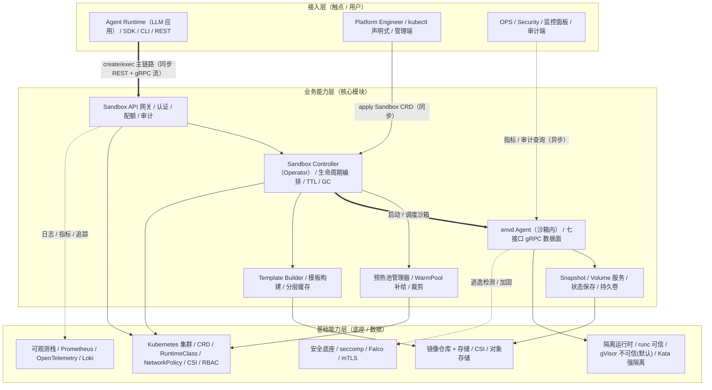
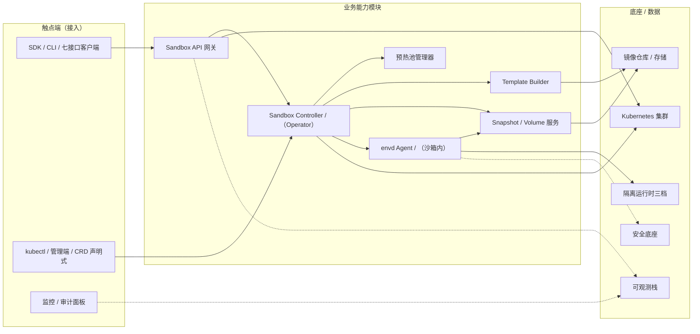

# AICoding 架构设计 · 高层架构设计

> 本文档为《AICoding 架构设计》核心产物之一，对应**高层架构设计模板**。
> 上游输入：业务原始诉求 + 行业调研结论（research_report.md）+ 资料摘要（material_digest.md）；
> 下游输出：驱动《系统设计》《部署设计》《安全设计》《UserStory》四份文档的撰写。

---

## 0. 元信息：修订记录

```yaml
标题: 通用 Agent Sandbox（Kubernetes）- 高层架构设计 v1.0
版本: v1.0
状态: Draft   # Draft | Reviewing | Approved | Deprecated
创建日期: 2026-08-18
最后更新: 2026-08-18
作者: business-architect（许边界）
评审人:
  - team-lead（主理人）

关联文档:
  上游输入:
    - 业务原始诉求: "基于 agent-runtime-sandbox-design.md 调研业内实现，设计通用 K8s Agent Sandbox，支撑 1000 并发请求"
    - 资料摘要: .workbuddy/output/material_digest.md（G1 已冻结）
    - 行业调研报告: .workbuddy/output/research_report.md（G2 已冻结）
  下游产出:
    - 系统设计: AICoding架构设计-2-系统设计.md
    - 部署设计: AICoding架构设计-3-部署设计.md
    - 安全设计: AICoding架构设计-4-安全设计.md
    - UserStory: AICoding架构设计-5-UserStory.md
```

| 版本 | 日期 | 作者 | 变更内容 | 评审状态 |
| --- | --- | --- | --- | --- |
| v1.0 | 2026-08-18 | business-architect（许边界） | 初稿：冻结系统边界、MVP 范围、三层业务架构与功能清单 | Draft |

> **版本管理纪律**：破坏性变更（章节结构调整 / 关键决策反转）升 MAJOR；新增章节、扩充内容升 MINOR。

> **事实 / 假设 / 建议 标记约定**：全文以 `【事实】`（来自 G1 冻结资料或 G2 冻结调研）、`【假设】`（基于事实的合理推断，未获外部数据佐证）、`【建议】`（待下游压测/校验校准的目标值）三种标签区分；`【经中间确认】` 表示经阶段内中间确认由用户裁决的决策。

---

## 1. 需求概要

### 1.1 需求概要说明

本系统（通用 Agent Sandbox）用于解决「AI Agent 缺乏通用、隔离、有状态、可弹性扩缩且不绑定云厂商的执行底座」这一核心问题，服务于 Agent Runtime（agent 开发者）、Platform Engineer、Security/Compliance 与 OPS 四类角色，覆盖「不可信代码执行、有状态多步任务、声明式沙箱生命周期」三大场景。本期由「基于 agent-runtime-sandbox-design.md 预研并完成业内实现调研（e2b / Modal / Daytona / Google Agent Sandbox / 国内云安全容器）」驱动立项，目标支撑 1000 个并发沙箱实例。

### 1.2 关键决策摘要

| 编号 | 决策类别 | 决策内容 | 关联章节 |
| --- | --- | --- | --- |
| D1 | 范围决策 | 本期建设通用 Agent Sandbox 平台（七接口 + 三档隔离 + 声明式生命周期 + 安全基线 + 可观测）；GPU 沙箱 / Firecracker / 机密计算等增强项明确 Out-of-Scope | §6.1 需求边界 |
| D2 | 技术选型决策 | 底层隔离三档分层（runc 可信级 / gVisor 不可信级 / Kata 强隔离级），默认档 = gVisor(systrap)，敏感/多租户/合规场景经 SandboxClass 显式升级 Kata(Dragonball)【经中间确认·方案 A】 | §3.2 / §4.2 |
| D3 | 技术选型决策 | 对外接口对齐 e2b 七接口事实标准；控制面采用 K8s 原生 CRD + Operator【经中间确认·自研对标 agent-sandbox 资源模型，底层复用开源 gVisor/Kata/runc 运行时，并以 agent-sandbox 已知 issue 为避坑清单】 | §4.2 / §5.1 / §5.2 |
| D4 | MVP/完整版边界 | MVP = 全部 P0（23 条需求），预热池 / mTLS / 可观测 / 审计 / 审批等 P1 能力延后至完整版 | §4.3 |
| D5 | 部署形态 | 自建 K8s 通用设计，不绑定任何云厂商（need_cloud_baseline_check = false） | §4.2 / §5.2 |

**硬指标**：5 条决策，每条均可映射到正文具体章节。

### 1.3 价值主张

| 价值维度 | 量化目标 | 度量指标 | 当前值 | 目标值 | 截止时间 |
| --- | --- | --- | --- | --- | --- |
| 效率（业务） | 沙箱就绪时延降低 | 就绪时延 P95（预热命中 / 冷启动） | 现装依赖 10-60s【事实】 | ≤ 500ms / ≤ 3s | MVP 上线 |
| 安全合规（业务） | 不可信代码 100% 落入隔离档 | 隔离覆盖率（gVisor/Kata 承接不可信负载占比） | 0%（无通用底座）【事实】 | 100% | MVP 上线 |
| 成本（技术/成本） | 1000 并发隔离层内存可控 | 隔离层内存总量（默认 gVisor 档） | 无 | ≤ 15GB（15MB/实例）【建议】 | 完整版压测 |
| 可替换性（技术） | 隔离后端 / 执行世界可替换 | provider seam 覆盖率（隔离后端切换零业务代码改动） | 0% | 100% | MVP 上线 |

**硬指标**：业务价值 2 条 + 技术/成本价值 2 条，全部可量化，无模糊词。

---

## 2. 需求分析 & 痛点解构

### 2.1 核心角色关注点

| 角色 | 业务身份 | 主要操作 | Top1 关心点 | 来源 |
| --- | --- | --- | --- | --- |
| 甲方决策者 | 平台负责人 / 技术总监 | 决策自建 vs 采购、审批容量与成本预算 | 1000 并发能力 + 不绑定云厂商 + 隔离层成本可控 | 用户原始诉求 |
| 最终用户 A | Agent Runtime（agent 开发者） | 经 SDK/CLI 调用七接口创建沙箱、执行代码、读写文件 | 隔离可靠 + 快速就绪 + 有状态连续 + 流式输出 | material D4 §角色 RT |
| 最终用户 B | Platform Engineer（平台工程师） | 部署/扩容/换隔离后端/配安全策略/发布模板 | 声明式生命周期 + 控制面数据面分离 + 后端可替换不宕机 | material D4 §角色 PE |
| 受影响方：安全合规 | Security / Compliance | 审计、审批、隔离强度声明 | 隔离强度可声明 + 密钥不泄漏 + 全程可审计 | material D4 §角色 SEC |
| 受影响方：运维 | OPS / SRE | 监控、告警、容量规划、GC | 可观测 + 预热池/GC 自愈 + 容量可压测 | material D4 §角色 OPS |

**硬指标**：5 类角色，甲方决策者 / 最终用户 / 受影响方各至少一行，每行含 Top1 关心点。

### 2.2 核心痛点

| 编号 | 痛点描述 | 现象 / 数据 | 影响角色 | 影响程度 | 优先级 |
| --- | --- | --- | --- | --- | --- |
| P1 | 不可信代码执行缺乏通用隔离底座，agent 运行第三方/生成代码存在逃逸与数据泄漏风险 | runc 容器共享宿主内核，隔离强度弱于 gVisor(Sentry) 弱于 Kata(microVM)【事实，D2 §1.2】；行业头部（e2b Firecracker / Google gVisor+Kata / Modal gVisor）均采用硬件级或用户态内核隔离承接不可信代码【事实，research §2.3】 | Security / Compliance | 高（合规底线） | P1 |
| P2 | agent 多步任务冷启动慢、依赖每次现装，执行环境无状态导致效率与体验差 | 不预热现装依赖需 10-60s【事实，D1 §2.2】；行业基准 e2b ~150ms / Modal 毫秒级 / Daytona 低于 90ms【事实，research §2.3】 | Agent Runtime（最终用户） | 中 | P2 |
| P3 | 1000 并发下若强隔离默认，隔离层内存/成本失控 | Kata 默认 40~100GB vs gVisor 15GB（每实例 40MB+overhead vs 15MB）【事实，research §3.2/R-02】 | 甲方决策者 / Platform Engineer | 中（成本风险） | P2 |

**优先级标准**：P1 = 直接影响核心流程或合规底线，不解决无法上线；P2 = 影响体验或运营效率，MVP 后迭代。

**硬指标**：P1 痛点 1 条（P1 号），有数据佐证，且在 §2.3 有对应目标（V1）。

### 2.3 期待目标

| 编号 | 目标描述 | 对齐痛点 | 度量指标 | 当前值 | 目标值 | 截止时间 |
| --- | --- | --- | --- | --- | --- | --- |
| V1 | 不可信代码执行 100% 落入 gVisor/Kata 隔离档（runc 仅限内部可信代码） | P1 | 隔离覆盖率 | 0% | 100% | MVP 上线 |
| V2 | 沙箱就绪时延 P95 ≤ 500ms（预热命中）/ 冷启动 P95 ≤ 3s | P2 | 就绪时延 P95 | 10-60s | ≤ 500ms / ≤ 3s | MVP 上线 |
| V3 | 同沙箱内跨调用上下文（文件/依赖/环境变量）保留率 100% | P2 | 有状态连续性 | 无（每次现装） | 100% | MVP 上线 |
| V4 | 1000 并发隔离层内存开销 ≤ 15GB（gVisor 默认档） | P3 | 隔离层内存总量 | 无 | ≤ 15GB | 完整版压测 |

**硬指标**：每条目标有数字 + 对齐至少 1 条痛点；P1 痛点对应 V1。

### 2.4 基线复用

> 本节先盘点可直接复用/对齐的现有能力，再判定是否需要新建（对应 §2.5 功能缺口）。

| 复用类别 | 现有能力 | 复用方式 | 来源系统 | 备注 |
| --- | --- | --- | --- | --- |
| 核心底座 | Kubernetes 集群（自建） | 直接复用 | 自建 K8s | CRD / RuntimeClass / NetworkPolicy / CSI / RBAC 等原生机制全部复用 |
| 隔离运行时 | gVisor(systrap) / Kata 3.x(Dragonball) / runc | 复用开源运行时（不采购） | 开源社区 | 经 containerd config.toml + RuntimeClass 接入，无需换 CRI【事实，research §4.3】 |
| 接口形态 | e2b 七接口命名空间 + Template + Snapshot/Volume | 对齐接口标准（非代码复用） | e2b（行业事实标准） | 保证生态兼容，命名空间对齐 lifecycle/files/commands/process/pty/network/code-interpreter |
| 控制面参考实现 | kubernetes-sigs/agent-sandbox 的 CRD 资源模型 | 设计参照 + 避坑清单（非代码底座）【经中间确认】 | kubernetes-sigs | 资源模型对标 Sandbox/SandboxTemplate/SandboxClaim/SandboxWarmPool；下游 system-architect 需梳理其已知 issue 作为规避项 |
| 沙箱内 agent 协议 | dsh 的 fs/subprocess/terminal 协议设计 | 参考设计、自研 envd | D3/D5 上游资料 | 复用其 gRPC 双向流 + 原子写 + 进程树终止协议思路 |
| 可观测 | Prometheus / OpenTelemetry / Loki | 复用标准栈 | 自建可观测平台 | 需新增沙箱级业务指标 |

**硬指标**：已先盘点再决定新建；凡列入 §2.5 功能缺口的能力，均在本节确认基线无法直接覆盖（需自研）。

### 2.5 功能缺口

> 按沙箱生命周期阶段分组（创建 → 执行 → 治理 → 运营）。

| 阶段 | 功能缺口 | 必要性 | 优先级 | 对齐目标 |
| --- | --- | --- | --- | --- |
| 创建阶段 | 声明式 Sandbox CRD 生命周期 + 三档隔离调度（US-1/3/24/25/26） | 必须 | MVP | V1 / V2 |
| 执行阶段 | 七接口执行原语 + 流式输出 + 取消传播（US-5~15） | 必须 | MVP | V2 / V3 |
| 治理阶段 | 出站白名单 / 配额 / TTL / 凭据剥离 / 审计（US-15~23） | 必须 | MVP（核心）+ 完整版（审计/审批） | V1 / V4 |
| 运营阶段 | 预热池 / GC / mTLS / 可观测（US-26/27/29/30） | 重要 | 完整版（预热池 P1） | V2 |
| 增强阶段 | 会话 fork/恢复 + 暂停/恢复（US-31/32） | 可选 | 增强（P2） | V3 |

**硬指标**：每条缺口对齐 §2.3 至少一条目标；MVP 缺口在 §6.3 功能清单中有对应 MVP 标记。

---

## 3. 行业调研

> 本节整合自 research_report.md（G2 已冻结）。调研事实与打分以该报告为准；本节末尾的边界裁决由业务架构师在 §4 冻结。

### 3.1 行业标杆系统分析

| 标杆系统 | 厂商 / 来源 | 场景覆盖 | 技术亮点 | 商业模式 | 适用度 |
| --- | --- | --- | --- | --- | --- |
| e2b | FoundryLabs（开源社区） | AI agent 代码执行、code-interpreter、Computer Use | Firecracker microVM ~150ms、七接口事实标准、pause/resume + snapshot | 开源 Apache 2.0 + 托管订阅 | 高（接口蓝本） |
| Modal Sandboxes | Modal（托管 SaaS） | 不可信代码执行、GPU agent、大规模并发 | gVisor 隔离、内存快照、1000 sandbox/s、50k+ 并发 session | 订阅 + 按秒计费 | 中（并发调度思想） |
| Google Agent Sandbox on K8s | kubernetes-sigs（K8s SIG Apps） | AI agent 运行时、代码执行、浏览器自动化 | Sandbox CRD + WarmPool、gVisor+Kata 双后端、K8s 原生 | 开源 Apache 2.0 | 高（最直接参照） |
| Daytona | Daytona（开源社区） | AI agent 沙箱、GPU 开发环境、Computer Use | 容器 低于 90ms、GPU VFIO、VM（Linux/Windows）沙箱 | 开源 AGPL-3.0 + 用量计费 | 中（快启动/GPU） |
| 国内云安全容器（阿里云 ACK v2 为主） | 阿里云 / 腾讯云 / 华为云 | 多租户强隔离、金融政务合规、安全容器 | Kata（Dragonball）~150ms、virtio-fs、runC 90% 性能 | 云厂商付费（节点池） | 中（强隔离底座） |

**不借鉴（否决）**：Cloudflare Sandbox / Vercel Sandbox —— 均为托管 Serverless 形态、无自托管 / BYOC 能力，与「自建 K8s 通用设计」诉求冲突，仅作生态对照【事实，research §3.2】。

**硬指标**：5 家标杆，含头部 SaaS（e2b / Modal / 阿里云）+ 开源/自研代表（e2b / agent-sandbox / Daytona）。

### 3.2 方案对标及优先级打分

**对比矩阵**（每行权重之和 = 1.00，评分标尺 1~5）：

| 评估维度 | 权重 | e2b | Modal | Google Agent Sandbox | Daytona | 国内云安全容器 |
| --- | --- | --- | --- | --- | --- | --- |
| 场景契合度 | 0.30 | 4 | 3 | 5 | 3 | 3 |
| 技术成熟度 | 0.20 | 5 | 5 | 3 | 4 | 5 |
| 集成难度（反向） | 0.15 | 3 | 2 | 4 | 4 | 3 |
| 成本（反向） | 0.15 | 4 | 3 | 4 | 3 | 3 |
| 合规可控性 | 0.20 | 4 | 2 | 5 | 3 | 3 |
| **加权总分** | **1.00** | **4.05** | **3.05** | **4.30** | **3.35** | **3.40** |

**结论摘要**：
- **优先借鉴：Google Agent Sandbox on K8s（4.30）+ e2b（4.05）** —— Google 是「基于 K8s 做 agent 沙箱」的官方参考实现（CRD + WarmPool + 双后端，与本项目诉求同构）；e2b 定义接口事实标准（七接口 + Template + Snapshot/Volume），是本产品对外接口蓝本。
- **部分借鉴：国内云安全容器（3.40）** —— 借鉴 Kata(Dragonball) 强隔离 + virtio-fs + Pod overhead 配额 + 节点池/污点调度；不借鉴其绑定单一云厂商、无产品层。
- **部分借鉴：Daytona（3.35）** —— 借鉴 低于 90ms 冷启动优化、预热池、GPU VFIO；不借鉴其容器级默认隔离（对不可信代码强度不足）与 AGPL。
- **部分借鉴：Modal（3.05）** —— 借鉴大规模并发调度（去中心化关键路径）、gVisor 默认 + capability-based isolation、egress 默认拒绝；不借鉴其托管锁定。
- **不借鉴（否决）：Cloudflare / Vercel** —— 托管锁定、无自托管。

**隔离默认档裁定【经中间确认·方案 A】**：底层隔离采用**三档分层**（runc 可信级 / gVisor 不可信级 / Kata 强隔离级），**默认档 = gVisor(systrap)**，敏感/多租户/合规场景经 `SandboxClass` 显式升级 Kata(Dragonball)。依据：Modal（gVisor 默认 + capability-based isolation）与国内云（Kata 强隔离）共同印证分层路线；1000 并发下 gVisor 隔离层内存约 15GB（对比 Kata 40~100GB）显著占优；Kata 作为强隔离档保留以覆盖敏感/合规场景。

### 3.3 完整报告参考

- 完整报告链接：`.workbuddy/output/research_report.md`（G2 已冻结）
- 调研工具：`tech-research-advisor`（见附录 B）
- 调研日期：2026-08-18
- 调研归档：`.workbuddy/output/research_report.md`

---

## 4. 方案决策

### 4.1 价值定位澄清

**定位三段式**：

```
对外价值（客户侧）: 为 AI Agent 提供通用、隔离、有状态、可弹性扩缩的执行环境（七接口 + SDK），
                   使 agent 能安全运行不可信代码，缩短接入周期，降低沙箱自建成本。
对内价值（运营侧）: 平台团队以声明式 CRD 统一管理沙箱生命周期，控制面/数据面分离保障可用性，
                   三档隔离按敏感度选档，审计留痕满足合规，容量/成本可压测可规划。
差异化价值        : 相比托管 SaaS（e2b/Modal）——自建可控 + 不绑定云厂商 + K8s 原生；
                   相比开源 agent-sandbox（早期）——冻结稳定的七接口形态 + 1000 并发容量设计 + 三档隔离默认 gVisor。
```

**与产品矩阵的关系**：本系统在「AI 平台」中承担「隔离执行层」核心职责，向上为 Agent Runtime 提供执行原语，向下以 K8s + 开源运行时为底座，与「镜像仓库、可观测、审计」等上下游模块形成完整业务闭环（见 §5.2、§5.3）。

### 4.2 系统定位澄清

| 维度 | 内容 |
| --- | --- |
| 系统名称 | 通用 Agent Sandbox（Kubernetes） |
| 系统类型 | 新建 |
| 部署形态 | 自建 K8s 集群（私有化/自建，不绑定任何云厂商）【经上游锁定，need_cloud_baseline_check=false】 |
| 多租户 | 是（隔离粒度 = 租户级 namespace + per-owner 配额 + RBAC） |
| 服务对象 | Agent Runtime / Platform Engineer / Security/Compliance / OPS（对齐 §2.1） |
| 上游依赖 | Agent Runtime（LLM 应用）、容器镜像仓库、CSI 存储（详见 §5.2） |
| 下游消费者 | 沙箱内执行环境（七接口数据面）、审计系统、可观测平台（详见 §5.2） |
| 边界（不做） | 不做 GPU 沙箱、不做 Firecracker 极简 serverless 档、不做机密计算（CoCo）、不做托管计费/账单 |

> **控制面落地方式【经中间确认】**：声明式控制面（CRD + Operator）**自研**，资源模型对标 kubernetes-sigs/agent-sandbox，对外接口对齐 e2b 七接口事实标准，底层复用开源 gVisor/Kata/runc 运行时；agent-sandbox 定位为「设计参照 + 避坑清单」，非代码底座（详见 §2.4、§5.2）。

### 4.3 MVP 与完整版决策

| 阶段 | 时间窗 | 范围（功能编号） | 架构差异点 | 退出标准 | 不做（延后） |
| --- | --- | --- | --- | --- | --- |
| MVP | W1 ~ W2 | 全部 P0（23 条：US-1/2/3/5/6/7/8/9/11/12/13/14/15/16/17/18/19/20/24/25/26/28/33） | 单 K8s 集群；runc + gVisor 两档先行（Kata 强隔离档若节点无 KVM 则延后启用）；预热池暂不启用（按需建）；mTLS 用 port-forward 过渡 | 跑通「声明式创建 → 写文件 → 跑命令流式输出 → 读产物 → 销毁」核心链路 + 1000 并发沙箱实例容量压测 | P1 全部（预热池/mTLS/可观测/审计/审批/多租户配额增强） |
| 完整版 | W3 ~ W4 | + P1（9 条：US-4/10/21/22/23/27/29/30/34） | 启用 Kata 强隔离档 + 预热池 + mTLS + 可观测 + 审计增强 + 多租户配额增强 | 1000 并发下隔离层内存 ≤ 15GB + 99.9% 控制面可用性 + P95 就绪 ≤ 500ms | P2（fork/resume/pause）+ GPU + Firecracker + 机密计算 |
| 增强版 | W5+ | + P2（US-31/32）+ GPU/Firecracker/机密计算 | microVM 内存快照、GPU 节点池 VFIO、CoCo | 按业务触发 | — |

**演进纪律（重要）**：
- ✅ MVP 的架构骨架是完整版的**子集**：CRD / Operator / 七接口 / 三档隔离框架在 MVP 一次建全，仅「档位启用」与「工程能力」按阶段开放，MVP 上线后不推倒重来。
- ✅ MVP 中可过渡的能力（port-forward 替代 mTLS、按需建替代预热池）在完整版替换，替换点已在本表明确。
- ❌ 禁止：MVP 为赶工引入完整版无法继承的临时架构（如临时单库/临时接口形态）。

---

## 5. 业务架构设计

### 5.1 业务架构图

> 三层业务架构：接入层（触点/用户）→ 业务能力层（核心模块）→ 基础能力层（底座/数据）。实线 = 同步调用、虚线 = 异步事件、粗线 = 主链路。



### 5.2 系统依赖架构

> 每条依赖明确「接入方式 + 同步/异步 + 关键约束」；控制面与数据面分离：Operator 不代理数据流量。

| 依赖类型 | 系统 / 模块 | 提供方 | 依赖能力 | 接入方式 | 同步/异步 | 关键约束 |
| --- | --- | --- | --- | --- | --- | --- |
| 上游 | Agent Runtime（LLM 应用） | Agent 平台团队 | 沙箱创建/查询/销毁 + 七接口执行 | REST/OpenAPI（控制面）+ gRPC 双向流（数据面） | 同步（创建/查询）+ 异步流（stdio/pty） | 超时/配额校验；大文件经 uploadUrl/downloadUrl 直传不经 SDK 中转 |
| 上游 | 容器镜像仓库 | 平台基础设施团队 | 模板镜像 / agent 镜像拉取 | containerd 拉取 | 同步（拉取） | 镜像签名 + 漏洞扫描；分层缓存 |
| 复用底座 | Kubernetes 集群 | 自建 | CRD / RuntimeClass / NetworkPolicy / CSI / RBAC / Pod Overhead | K8s 原生 API | 同步 | Operator 不代理数据面；Kata Pod Overhead（50-100MiB + 0.1 core）计入配额 |
| 复用底座 | 隔离运行时（runc/gVisor/Kata） | 开源社区 | 三档隔离 | containerd runtime + RuntimeClass | 同步（Pod 启动） | gVisor(systrap) 无需 KVM、任意节点；Kata(Dragonball) 必须 KVM + 嵌套虚拟化、裸金属最佳 |
| 复用底座 | CSI / 对象存储 | 平台基础设施团队 | 工作区卷 / 持久卷 / 快照 | CSI PVC + VolumeSnapshot + 对象存储直传 | 同步 + 异步（直传） | 只读 rootfs + 可写 workspace；强隔离档 virtio-fs 挂载 |
| 复用底座 | 可观测栈（Prometheus/OTel/Loki） | OPS 团队 | 指标 / 日志 / 追踪 | OTLP / 指标抓取 / 日志采集 | 异步 | traceId 贯穿控制面与数据面 |
| 设计参照 | kubernetes-sigs/agent-sandbox | kubernetes-sigs | CRD 资源模型（Sandbox/SandboxTemplate/SandboxClaim/SandboxWarmPool）+ 已知 issue 避坑清单 | 自研对标（不直接依赖仓库）【经中间确认】 | — | 作为设计参照与避坑清单（非代码底座）；下游 system-architect 需梳理其已知 issue 规避项 |
| 下游 | 审计系统 | 安全合规团队 | 生命周期 + 执行审计事件 | 审计日志推送（append-only） | 异步 | 按 owner/时间检索；不可篡改 |

**硬指标**：每条依赖含接入方式 + 同步/异步 + 关键约束；P1 痛点（P1 隔离）对应的核心能力已在本表找到依赖来源（复用开源 gVisor/Kata 运行时 + 自建 K8s）。

### 5.3 业务闭环

**业务主链路**（端到端）：

```
Agent 选模板 → SDK create() → 控制面认证+配额检查 → 调度（预热池领用 / 新建）→
隔离层启动沙箱（RuntimeClass 选档）→ envd 就绪 + health check → 返回 sandboxId →
files 写输入 → commands/process 执行（流式 stdout/stderr）→ files 读产物 →
snapshot/volume 保存 → kill 销毁 / pause 挂起 / 归还预热池
```

**关键反馈回路**：

| 回路 | 触发点 | 反馈对象 | 反馈机制 | 价值 |
| --- | --- | --- | --- | --- |
| 运营监控回路 | 池耗尽 / Pending 堆积 / Failed 飙升 / 逃逸检测事件 | OPS / SRE | 实时告警（Prometheus） | 快速扩容/调池/响应 |
| 安全合规回路 | 逃逸检测事件 / 审计异常 | Security/Compliance | 实时告警 + 审计查询 | 加固策略、隔离档升级 |
| 容量成本回路 | 隔离层内存 / 并发量 / 成本指标 | 甲方决策者 / Platform Engineer | T+1 容量报告 + 压测 | 调隔离档 / 超卖（suspend/resume）/ 预算规划 |
| 兼容性反馈回路 | gVisor syscall 兼容缺口导致任务失败 | Agent Runtime / 平台团队 | 兼容性回归测试 + 失败归因 | 触发 SandboxClass 升级 Kata |

**运营主线**：
- 每日：OPS 看「预热池命中率 / 沙箱数按 phase/class / 创建时延 P95 / 失败率」，异常即扩容或调池。
- 每周：Platform Engineer 看「隔离档分布 / 节点容量 / 成本」，评估是否启用 Kata 强隔离档或超卖。
- 每月：甲方决策者看「1000 并发容量达成度 / 隔离层成本 / 逃逸事件数」，决策增强版（GPU/机密计算）投入。

---

## 6. 产品需求及原型

### 6.1 需求边界

**In-Scope**（本期必做，14 条）：

```
F1. 声明式生命周期管理：Sandbox CRD 创建、就绪探活、TTL 回收、孤儿 GC、状态机（Pending→Provisioning→Ready→Draining→Deleted）
F2. 隔离与硬化：三档隔离（runc 可信 / gVisor 不可信默认 / Kata 强隔离）+ 文件效应策略 + 容器硬化 + 危险 syscall 阻断
F3. 七接口执行原语：lifecycle/files/commands/process/pty/network/code-interpreter，含流式输出、取消传播、多 reader
F4. 网络治理：出站默认拒绝 + 白名单 + 入站隔离（NetworkPolicy）
F5. 资源与配额：CPU/内存硬上限、TTL、单次调用超时、多租户并发上限
F6. 凭据安全：敏感环境变量剥离 + 显式转发可审计
F7. 人在环审批：pre-execute ask / allow / deny（无审批降级 fail-closed）
F8. 审计日志：append-only、按 owner/时间检索
F9. 控制面/数据面分离：runtime 直连 envd agent，Operator 不代理数据流量
F10. provider 可替换 + 热重载：统一 seam 三角色，一行替换隔离后端/执行世界
F11. 预热池：min/max Ready Pod 补给与裁剪，亚秒分配
F12. 通信安全与可观测：mTLS 双向证书 + Prometheus/OTel/Loki 指标/日志/追踪/告警
N1. 非功能：支撑 1000 个并发沙箱实例（同一时刻最多 1000 个活跃隔离执行环境）
N2. 非功能：多租户隔离（租户级 namespace + 配额 + RBAC）
```

**Out-of-Scope**（本期不做，5 条，均列原因）：

| 编号 | 不做的事 | 原因 | 后续计划 |
| --- | --- | --- | --- |
| O1 | GPU 沙箱（VFIO / GPU 节点池） | 依赖 GPU 硬件与 VFIO 直通，MVP/完整版不具备条件 | 增强版 |
| O2 | Firecracker 极简 serverless 档 | 与三档分层路线可后续扩展，非本期必选 | 增强版 |
| O3 | 机密计算（Kata CoCo SEV-SNP/TDX） | 依赖特殊硬件与合规场景，本期不做 | 增强版/待业务确认 |
| O4 | 托管 SaaS / 计费 / 多租户账单 | 本平台为自建内部执行底座，计费由上层 Agent 平台承担 | 不做（其他系统承担） |
| O5 | 会话 fork/恢复 + 暂停/恢复（US-31/32，P2） | 依赖 Snapshot 与 microVM 内存快照，属增强项 | 增强版 |

**硬指标**：In-Scope 14 条 ≤ 15；Out-of-Scope 5 条 ≥ 3。

### 6.2 产品模块全景图

**模块卡片**（标准名 / 归属层 / 责任团队）：

| 模块名称 | 一级归属 | 责任团队 | 上游 | 下游 | MVP 是否包含 |
| --- | --- | --- | --- | --- | --- |
| SDK / CLI（七接口客户端） | 接入层 | Agent 平台团队 | Agent Runtime | Sandbox API 网关 | 是 |
| kubectl / 管理端（CRD 声明式） | 接入层 | 平台基础设施团队 | Platform Engineer | Sandbox Controller | 是 |
| 监控 / 审计面板 | 接入层 | OPS / 安全团队 | 可观测栈 / 审计系统 | — | 是（MVP 最小版） |
| Sandbox API 网关 | 业务能力层 | 平台基础设施团队 | SDK/CLI | Sandbox Controller | 是 |
| Sandbox Controller（Operator） | 业务能力层 | 平台基础设施团队 | Sandbox API 网关 | 预热池管理器 / envd Agent / Template Builder | 是 |
| 预热池管理器 | 业务能力层 | 平台基础设施团队 | Sandbox Controller | Kubernetes | 否（完整版） |
| envd Agent（沙箱内） | 业务能力层 | Agent 平台团队 | Sandbox Controller | 隔离运行时 / Snapshot-Volume | 是 |
| Template Builder | 业务能力层 | Agent 平台团队 | 镜像仓库 | Sandbox Controller | 是 |
| Snapshot / Volume 服务 | 业务能力层 | 平台基础设施团队 | envd Agent | CSI/对象存储 | 否（完整版/增强） |
| Kubernetes 集群 | 基础能力层 | 平台基础设施团队 | — | 各业务模块 | 是 |
| 隔离运行时（runc/gVisor/Kata） | 基础能力层 | 平台基础设施团队 | Kubernetes | envd Agent | 是 |
| 镜像仓库 + 存储 | 基础能力层 | 平台基础设施团队 | — | Template Builder / Snapshot-Volume | 是 |
| 可观测栈（Prometheus/OTel/Loki） | 基础能力层 | OPS 团队 | 各业务模块 | 监控面板 | 否（完整版） |
| 安全底座（seccomp/Falco/mTLS） | 基础能力层 | 安全合规团队 | — | 各业务模块 | 是（seccomp 基线） |



### 6.3 功能清单

| 编号 | 一级模块 | 二级功能 | 功能描述 | 优先级 | MVP 范围 | 完整版范围 | 对齐目标 |
| --- | --- | --- | --- | --- | --- | --- | --- |
| F1 | 生命周期 | 声明式生命周期 | Sandbox CRD 创建/探活/TTL/GC/状态机 | P0 | ✅ | ✅ | V2 |
| F2 | 隔离 | 三档隔离 + 硬化 | runc/gVisor(默认)/Kata + 文件效应 + 容器硬化 + syscall 阻断 | P0 | ✅ | ✅ | V1 |
| F3 | 执行 | 七接口 + 流式 + 取消 | lifecycle/files/commands/process/pty/network/code-interpreter | P0 | ✅ | ✅ | V2 / V3 |
| F4 | 网络 | 出站白名单 + 入站隔离 | 默认拒绝 + 白名单 + NetworkPolicy | P0 | ✅ | ✅ | V1 |
| F5 | 治理 | 资源与配额 | CPU/内存硬上限 + TTL + 单次超时 + 多租户上限 | P0 | ✅ | ✅ | V4 |
| F6 | 治理 | 凭据安全 | 敏感环境变量剥离 + 显式转发可审计 | P0 | ✅ | ✅ | V1 |
| F7 | 治理 | 人在环审批 | pre-execute ask/allow/deny（fail-closed） | P1 | ❌ | ✅ | V1 |
| F8 | 治理 | 审计日志 | append-only + 按 owner/时间检索 | P1 | ❌ | ✅ | V1 |
| F9 | 架构 | 控制面/数据面分离 | runtime 直连 envd，Operator 不代理数据 | P0 | ✅ | ✅ | V2 |
| F10 | 架构 | provider 可替换 + 热重载 | 统一 seam 三角色，一行替换后端 | P0 | ✅ | ✅ | V2 |
| F11 | 运营 | 预热池 | min/max Ready Pod 补给与裁剪 | P1 | ❌ | ✅ | V2 |
| F12 | 运营 | mTLS + 可观测 | 双向证书 + 指标/日志/追踪/告警 | P1 | ❌ | ✅ | V4 |

**硬指标**：每个 P0 功能均在 MVP 范围为 ✅；每个功能可反向映射到 §2.5 功能缺口 + §2.3 期待目标。

### 6.4 产品原型 - Agent 开发者端（SDK / CLI）

> 核心触点端 1：面向 Agent Runtime 的开发体验（对齐 e2b SDK 事实标准形态）。

**核心页面 / 界面清单**：

| 页面 / 界面 | 用途 | 关键交互 | MVP |
| --- | --- | --- | --- |
| SDK 上下文管理器（Sandbox.create） | 创建/复用沙箱，自动销毁 | `with Sandbox.create(template, timeout)` 上下文管理、TTL 续期 | ✅ |
| 文件操作接口（files） | 读/写/列/编辑沙箱文件 | 批量读写、原子写 + version guard、uploadUrl 直传 | ✅ |
| 命令执行接口（commands/process） | 跑命令流式输出 | `on_stdout`/`on_stderr` 流式回调、spawn 立即返回 handle、取消传播 | ✅ |
| 终端接口（pty） | 交互式终端 | 字节流双向、resize | ✅ |
| 代码解释器接口（code-interpreter） | 多语言有状态 REPL | 跨调用共享变量 | ✅ |
| CLI | 声明式操作沙箱 | `sandbox create/list/kill/logs` | ✅ |

**关键交互约束**：
- 就绪返回：`sandboxId` + 连接信息（podName/grpcPort）在 P95 ≤ 500ms（预热）/ ≤ 3s（冷）内返回（对齐 V2）。
- 流式输出：stdout/stderr 独立流可并发读，取消后未启动调用合成错误、已启动正常结算（对齐 F3）。
- 错误语义：策略拦截可识别为「策略拦截」而非「命令失败」（对齐 F2 文件效应策略）。

**原型链接**：对齐 e2b SDK 形态（`https://e2b.dev` 为事实标准参照），具体 SDK 接口契约由 `system-architect` 在系统设计阶段冻结。

### 6.5 产品原型 - 平台运营 / 审计端（管理控制台）

> 核心触点端 2：面向 Platform Engineer / OPS / Security 的运营与审计体验。

**核心页面清单**：

| 页面 | 用途 | 关键交互 | MVP |
| --- | --- | --- | --- |
| 沙箱列表页 | 全量沙箱查询（按 phase/class/owner） | 筛选 / 排序 / 批量 kill | ✅ |
| 沙箱详情页 | 单沙箱全貌（状态/资源/网络/日志） | 日志回放 / 指标 / 连接信息 | ✅ |
| 监控 / 预警面板 | 池命中率 / 创建时延 / 失败率 / 逃逸事件 | 实时刷新 / 一键扩容 / 告警 | ❌（完整版） |
| 审计日志页 | 生命周期 + 执行审计检索 | 按 owner/时间筛选、导出 | ❌（完整版） |
| SandboxClass 配置页 | 隔离档策略模板管理 | 三档隔离默认/资源/安全策略配置 | ✅ |

**关键交互约束**：
- 监控面板：告警触发（池耗尽 / Pending 堆积 / Failed 飙升 / 逃逸检测）到呈现 P99 ≤ 1s。
- 审计日志：append-only、不可篡改，按 owner/时间检索（对齐 F8）。

**原型链接**：由 `product-story-designer` 在 UserStory 阶段细化页面线框。

---

## 附录 A：生成流程方法论

> 本附录描述高层架构设计的生成方法论（Step0 → Step5），作为正文章节产出依据。

| 步骤 | 名称 | 核心产出 | 落入正文章节 |
| --- | --- | --- | --- |
| Step0 | 业务基础知识库构建 | 关联文档结构化知识库 | 为全文提供输入 |
| Step1 | 行业调研分析 | 行业标杆 / 方案对比 / MVP 决策 | §3 行业调研 |
| Step2 | 需求分析 / 痛点解构 | 需求画像卡 | §2 需求分析 & 痛点解构 |
| Step3 | 能力盘点，系统定位 | 价值定位 + 系统定位 | §4 方案决策 / §5.2 系统依赖架构 |
| Step4 | 生成系统高层架构设计 | 本文档主文档 | §1 ~ §5 |
| Step5 | 产品需求及原型 | 需求边界 + 全景图 + 原型 | §6 产品需求及原型 |


## 附录 B：配套工具清单

- 知识库 Skill：`docx` / `pdf` / `pptx` / `xlsx`（解析存量资料）
- 行业调研：`tech-research-advisor`
- 图表生成：`diagrams-generator`（本文 §5.1 / §6.2 采用 Mermaid 内嵌，由业务架构师直接产出，未委托独立图表角色）

## 附录 C：中间确认自检报告

> 按中间确认协议 §2.4，在 §2 / §4 / §5 / §6 关键章节后插入自检：先按 §2.1 判定，再按 §2.3 反向验证 3 问。

### C.1 §2 完成系统定位与价值定位后自检

**§2.1 判定**：未命中方案分歧型。
- 部署形态：自建 K8s 已由主理人注入锁定（need_cloud_baseline_check=false），无二义性。
- 隔离默认档：已经中间确认裁决（方案 A），属已冻结，不得重复发起。
- 多租户：唯一合理方案（「通用」+ 1000 并发 + 上游 D2 §3.1/D3 §10/D4 US-22 一致假设多租户；单租户将偏离「通用」诉求）。

**反向验证 3 问（对「多租户 = 是」决策）**：
- Q1：若 3 个月后推翻（多租户改单租户），返工成本可控吗？——返工范围 = namespace 隔离 / RBAC / ResourceQuota / per-owner 配额的裁剪；切换成本约 2~4 周。**可控**。
- Q2：用户/客户/监管能感知到吗？——可感知点在安全属性（租户数据隔离粒度）；但这是上游资料（D2/D3/D4）一致的设计前提，非本阶段新增的可选分歧，不改变沙箱产品形态与七接口。**感知点在安全属性，但属继承的上游设计前提**。
- Q3：与用户原始诉求显式能力一致吗？——用户诉求「通用 K8s agent sandbox」未显式提「多租户」，但「通用」与「1000 并发」隐含多租户承载，不偏离；「单租户」反而偏离「通用」。**一致**。

**结论**：未命中 §2.1，Q1 可控、Q2 非新增分歧、Q3 一致，不发起中间确认。

### C.2 §4 完成 MVP/完整版与部署形态决策后自检

**§2.1 判定**：未命中方案分歧型（MVP = 全部 P0、P1 延至完整版，均已由上游 D4 用户故事基线锁定优先级；部署形态已锁定）。

**反向验证 3 问（对「MVP 范围裁剪」决策）**：
- Q1：若 3 个月后推翻，返工成本可控吗？——返工范围 = §4.3 范围表 + §6.3 功能清单 MVP 列；切换成本 低于 1 人周。**可控**。
- Q2：用户/客户/监管能感知到吗？——MVP 与完整版的功能差异（预热池/mTLS/审计是否首批提供）属用户可感知（如冷启动时延、审计可见性），但 P0/P1/P2 优先级已由上游 34 条用户故事（D4）显式定义，本决策仅按优先级切分阶段，非新增取舍。**P0/P1 分界已由上游定义，本决策未偏离**。
- Q3：与用户原始诉求一致吗？——用户诉求「支撑 1000 并发」，MVP 退出标准显式纳入「1000 并发实例容量压测」；未偏离。**一致**。

**结论**：未命中，不发起中间确认。

### C.3 §5 完成三层架构图与业务闭环后自检（命中 → 已发起中间确认）

**§2.1 判定**：**命中方案分歧型**——「声明式控制面底座：复用 agent-sandbox vs 自研对标」同时满足三条：
1. ≥2 种合理方案：复用（K8s SIG 背书/省开发/早期 API 风险）vs 自研对标（可控/稳定/工作量大）；
2. 影响下游成员产出：system-architect 的系统设计起点（上游二次开发 vs 从零设计）、product-story-designer 的接口契约；
3. 用户原始诉求未明确选择（诉求仅说「设计通用应用」，未指定复用或自研），且 research §5.3 D-02 明确该边界「由 business-architect 在高层架构阶段冻结」。

**反向验证 3 问**：
- Q1：若 3 个月后推翻（复用↔自研互切），返工成本可控吗？——若复用后上游 breaking change，切换底座返工 = CRD/Operator/预热池重构，切换成本 ≥ 1 人月（命中 §2.2(1) 不可逆代价）。**不可控**。
- Q2：用户/客户/监管能感知到吗？——复用上游早期项目若 API 变动，会波及对外接口稳定性，属「对外承诺/接口契约」感知边界。**可感知**。
- Q3：与用户原始诉求一致吗？——用户诉求未显式提及此点，但该决策改变「对外接口稳定性与可控性」的实现路径。**未显式提及，但影响接口稳定性承诺**。

**判定结论**：Q1「不可控」命中 §2.2(1)、Q2「可感知」命中 §2.2(2) → **必须发起 `[中间确认]`**。已按协议 §3 向主理人发起（论题「复用 vs 自研」），阻塞 §2.4/§4.2/§5.2 底座相关条目，其余章节并行推进。**本阶段我已按推荐项「自研对标」先行书写，收到用户裁决后仅定点修订 §2.4 / §4.2 / §5.2 三处。**

**中间确认最终裁决（2026-08-18 回注）**：
- **论题**：声明式控制面底座「复用 agent-sandbox vs 自研对标」。
- **用户裁决结果**：**自研对标**（方案 B），并补充意见「参照开源 agent-sandbox 相关 issue 避免出现类似问题」。
- **落点**：§1.2 D3、§2.4 控制面参考实现、§4.2 控制面落地方式、§5.2 设计参照行均标注「经中间确认」；agent-sandbox 定位为「设计参照 + 避坑清单（非代码底座）」；下游 system-architect 在系统设计阶段具体梳理 agent-sandbox 已知 issue 的规避项。

### C.4 §6 完成 In-Scope/Out-of-Scope 与功能清单后自检（最后一次完整复核）

**§2.1 判定**：未命中新的方案分歧（In-Scope/Out-of-Scope 边界均对齐 34 条用户故事优先级 + research §4.2 建议，无新增取舍）。

**反向验证 3 问（对「In-Scope/Out-of-Scope 边界」决策）**：
- Q1：若 3 个月后推翻，返工成本可控吗？——返工范围 = §6.1 边界清单 + §6.3 功能清单优先级列；切换成本 低于 1 人周。**可控**。
- Q2：用户/客户/监管能感知到吗？——Out-of-Scope 项（GPU/Firecracker/机密计算/fork/resume）均为增强项，用户原始诉求未要求；不改变本期可交付的核心形态。**基本感知不到**（判断依据：均为 D1/D2 路线图第 4 阶段增强项，research §4.2 亦建议延后）。
- Q3：与用户原始诉求一致吗？——用户诉求「通用 K8s agent sandbox + 1000 并发」，In-Scope 完整覆盖隔离/七接口/生命周期/治理/运营/并发/多租户，未偏离。**一致**。

**结论**：未命中，不发起中间确认。

---

> **附录 C 结论**：四个自检节点中，C.3（控制面底座复用 vs 自研）命中协议 §2.1 + §2.2(1)(2)，已发起 `[中间确认]` 并经用户裁决（自研对标 + 参照 agent-sandbox issue 避坑）；其余三个节点未命中，反向验证 3 问答案与证据已如实记录。
